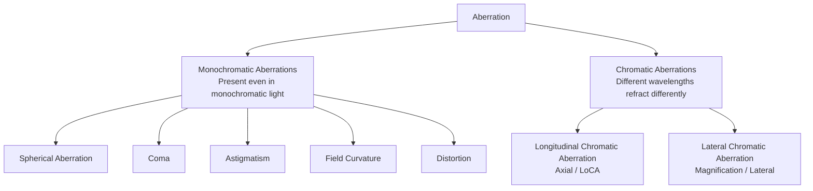

# Chapter 5 The Language of the Lens

> Focal length dictates far more than mere framing. It directly establishes the photographer's spatial coordinates, reshapes the physical and psychological distance to the subject, and ultimately adjudicates the viewer's vantage point within the frame.

---

## Focal Length Is a Viewing Distance

In 1932, Henri Cartier-Bresson, then just twenty-four years old, purchased a Leica camera fitted with a 50mm standard lens in Marseille. Over the course of a career spanning more than half a century, though he occasionally experimented with other focal lengths and formats, the vast majority of his masterworks etched into the history of photography were forged with this classic pairing: the "Leica + 50mm." The optical perspective chosen in one's youth often becomes the lifelong internal benchmark through which an artist surveys the world.

He once likened the Leica camera to "an extension of the eye," and the primary brush mounted upon it remained ever that 50mm lens. Throughout his life, he disdained the mechanical telescoping of zoom lenses, steadfastly maintaining that a photographer should measure space with their feet and reconstruct perspective through physical displacement. In the context of modern photography, there is no need to dogmatically replicate this distinctly classical conviction: the maturation of zoom optical design and hybrid autofocus technology has endowed zoom lenses with peerless efficiency across complex workflows. Yet, stripping away the evolution of equipment, its core insight remains timeless: a mature creator will ultimately cultivate a singular viewing distance; the focal length one remains wedded to over time is never an arbitrary technical choice, but rather the cognitive origin where one's mind most naturally chooses to pause when interacting with the external world.

Robert Capa harbored a similar devotion to the 50mm. At dawn on June 6, 1944, wading ashore Omaha Beach in Normandy alongside an American infantry assault team, he clutched two Contax II rangefinder cameras fitted with 50mm lenses tightly to his chest. According to the traditional narrative circulated for decades, he exposed more than a hundred precious negatives amidst the hail of gunfire on the beachhead; yet once the rolls reached the London darkroom of *Life* magazine, a young darkroom assistant reportedly overheated the drying cabinet, melting the emulsion and leaving only eleven surviving frames—the historically immortalized *Magnificent Eleven*. It should be added that in recent years, historians have subjected this darkroom accident account to rigorous scrutiny, pointing out that the physical properties of silver halide emulsion make it unlikely to melt from simple heat drying, and that Capa himself quite likely released the shutter only those dozen or so times amidst the brutal conditions of battle. Whatever the historical reality may be, it was precisely this set of surviving fragments—shaky in focus, coarse in grain, and drenched as if by seawater—that defined the classic visual paradigm of twentieth-century war reportage: the extreme authenticity of the front line is never an immaculate, well-ordered composition; panic and tremor are themselves the most honest breath of history's storm.

William Klein, by contrast, pushed the 28mm wide-angle lens to its absolute extreme. He described the 28mm perspective as "moving in so close you can almost smell their breath." In his avant-garde 1956 monograph *Life is Good & Good for You in New York: Trance Witness Revels*, fashionable women on Manhattan sidewalks, men glaring in heated dispute inside subway cars, street kids playing with toy guns, and towering neon signs rushing toward the viewer are all crammed into the frame at point-blank range. In Klein's hands, the 28mm was never a tool for passively taking in more environmental elements, but a stance of resolute confrontation: it forcibly thrusts both the viewer and the lens into the raw, pulsating vortex at the heart of New York's streets.

Daido Moriyama likewise relied heavily on the 28mm perspective over many years. Holding a compact camera as he slipped through the alleys of Tokyo, he would release the shutter decisively in mid-stride without ever raising the camera to eye level to frame the shot. Rainy nights in Shinjuku, dim underpasses, the cluttered signage of Kabukicho, and the coarse fur of stray dogs materialized on his film as a visual jungle of blur, high contrast, and raw grain. This imbalance and coarseness was never a matter of poor technique, but a deeply conscious aesthetic praxis: the physical body collides first with the reality of the streets, and the shutter, breathless, leaves its imprint in the wake.

Saul Leiter moved into an entirely opposite optical dimension. He favored telephoto lenses, peering down from the second-floor window of his 10th Street apartment in Manhattan. While drawing distant scenes closer, the telephoto optical system drastically compresses spatial depth: a strolling woman in a red coat and a speeding yellow cab behind her are collapsed onto a single plane within the frame, reconstructing the urban landscape like a work of collage. Guided by this singular distance of contemplation, Leiter cultivated those few city blocks, persisting well into his twilight years.

The divergent practices of these masters ultimately converge upon a single premise: every accomplished artist possesses an irreplaceable viewing distance. This is both a physical choice of stance and a mental calibration of how one contemplates the world. Refined over years of practice, it ultimately crystallizes into a distinct and powerful lens language.

---

### Camera Position in a Portrait

*Mathew Brady, Abraham Lincoln, February 27, 1860, Cooper Union, New York. Lincoln was scheduled to deliver an address that day, and sat for this portrait at Brady's studio before taking the podium. Wet-plate photography required the subject to remain motionless before the lens, and Brady was exceptionally adept at using posture, lighting, and camera angle to render his sitters dignified and trustworthy. Although Lincoln had gained some renown from his debates with Douglas two years earlier, he was still far from a frontrunner for the presidential nomination—merely an Illinois lawyer viewed with skepticism by the Eastern political establishment. Circulated alongside that landmark speech, this photograph presented him as poised and dependable, looking every bit like a man who could be president. Lincoln is reputed to have said later that Brady and the Cooper Union speech made him president; while lacking airtight primary documentation and largely circulated through Brady's side, the claim at least illustrates that those involved fully grasped the gravity of this image. Here, the lens was not merely a passive tool, but an active participant in the construction of a political persona. [Image Source and Reuse Notes](image-credits.md#brady-lincoln)*

---

## Perspective and Space

When first encountering lens optics, people often reduce the function of focal length to two common aphorisms: telephoto lenses bring the distance closer, while wide-angle lenses fit everything in. While these sayings describe surface appearances, they obscure a far deeper physical truth: **the choice of focal length profoundly reshapes the spatial perspective within the frame.**

The defining characteristic of a wide-angle lens is that, when shooting at close range, it significantly exaggerates foreground forms while pushing the background far into the distance—and the closer the physical stance is to the subject, the more dramatic this spatial stretching becomes. Photographing a person at close quarters with a 24mm lens causes gestures, the bridge of the nose, and nearby objects to appear vastly magnified, while the background recedes sharply and expands; 35mm to 50mm lenses are termed standard focal lengths because, under conventional framing and standard viewing distances, they yield a gentle, restrained perspective; when using telephoto lenses from 85mm to 200mm or beyond, in order to maintain the same subject size within the frame, the photographer must step significantly back, thereby shrinking the relative distance ratio between foreground and background, which imparts a pronounced sense of "spatial compression" to the scene.

To keep the proportion of the subject constant within the frame:
- Shooting with a 24mm requires moving right up close to the subject; the background is pulled drastically apart, leaving the figure seemingly cradled and engulfed by a vast environment;
- Shooting with a 135mm requires stepping back several meters; the background is noticeably magnified and pressed tightly against the subject's back.

The fundamental principle that must be made crystal clear is this: **what truly alters the perspective within an image is the physical distance between the camera position and the subject; focal length is merely the framing tool that compels you to stand at different distances to maintain your composition.**

*Original diagram: The difference between moving closer with a wide-angle lens and stepping back with a telephoto lens stems from camera position; the lens serves to maintain a similar subject size from different distances. [Image Source and Reuse Notes](image-credits.md#perspective-distance)*

---

## From 14mm to 200mm

- **14mm to 20mm (Ultra-Wide Angle)**: Possesses expansive visual tension, yet comes accompanied by severe foreground perspective distortion. It is well-suited to vast landscapes, cramped interior spaces, and specialized portraits demanding striking visual impact. The primary pitfall of the ultra-wide lens is its tendency to sweep in all surrounding clutter, leaving the frame loose and hollow. Mastering the ultra-wide demands active orchestration of the foreground: first, lowering the camera position to get exceptionally close to foreground elements (placing rugged rocks or snow textures within mere tens of centimeters of the bottom of the frame) so that they serve as spatial stepping stones that guide the viewer’s eye; second, relying on diagonal lines—such as horizons, roads, or boardwalks—cutting in from the frame’s corners to forge profound visual depth. Furthermore, one must heed the geometry of perspective: spherical objects placed near the edges of an ultra-wide frame are physically stretched into ellipses, meaning human subjects should be kept as close to the central area as possible.
- **28mm (Classic Documentary Wide Angle)**: Balancing a generous field of view with natural edge control, this focal length forms the soul of street cameras like the Ricoh GR. It excels at articulating a subject’s expression while fully capturing the living space they inhabit, giving the viewer an immersive sense of presence.
- **35mm (Environmental Portraiture and Narrative Benchmark)**: The most balanced, all-around prime focal length. Its field of view is slightly wider than the human eye’s focused gaze, effortlessly establishing the order of the environment while ensuring the subject retains a firm visual gravity. When walking the streets, 35mm neither breaches the subject's psychological boundaries nor strips away the warmth of the space—it is the golden focal length for capturing the interaction between human subjects and their environment.
- **50mm (The Restrained Standard Eye)**: Unassuming and disciplined in perspective, it offers neither exaggerated perspective distortion nor the cover of heavy bokeh. The success or failure of a 50mm image rests entirely on the foundational strength of its composition, the carving of light, and the mastery of capturing the moment. It forces the photographer to abandon gear gimmicks, relying purely on the internal coherence of content and form.
- **85mm to 135mm (Classic Portraiture and Close-Ups)**: Effectively compresses distracting background elements, delivering smooth, rounded out-of-focus transitions and natural facial proportions. In practice, one must guard against the formulaic trap of superficial, overly creamy bokeh ("sugar water" portraits), focusing instead on sculpting with light, seizing micro-expressions, and plumbing deeper nuances of character.
- **200mm and Beyond (Telephoto)**: Specialized for athletic events, wildlife, highland ridges, and the distillation of extreme spatial compression. Telephoto lenses are exquisitely sensitive to shutter speed margins, the rigidity of camera support, and atmospheric turbulence.

When evaluating lenses, two other critical parameters demand careful consideration: **minimum focusing distance** and **maximum magnification ratio**. A 50mm prime typically has a minimum focusing distance of 0.4–0.45 meters, while an 85mm portrait lens generally cannot focus closer than 0.8 meters. If one intends to move in close to capture fine jewelry or latte art, a dedicated macro lens capable of a 1:1 magnification ratio is required.

The mapping between common full-frame focal lengths and their corresponding diagonal angles of view is systematically summarized below:

| Physical Focal Length (Full-Frame Baseline) | Absolute Diagonal Angle of View (approx.) | Core Aesthetic Context and Typical Subjects |
|---|---|---|
| 14 mm | 114° | Vast architectural spaces, interior architecture, celestial domes and starry skies |
| 24 mm | 84° | Grand landscapes, exterior architecture, high-tension environmental narratives |
| 35 mm | 63° | Classic documentary, street photography, environmental portraiture |
| 50 mm | 47° | Standard perspective, understated and serene, disciplined realism |
| 85 mm | 29° | Half-length portraits, medium-shot isolation, subtle subject separation |
| 135 mm | 18° | Portrait close-ups, stage performances, background isolation and spatial cropping |
| 200 mm | 12° | Action sports, wildlife, horizon compression |

The geometric formula for calculating angle of view is as follows:

\[ \theta = 2\arctan\!\left(\frac{d}{2f}\right) \]

Where \(d\) represents the physical diagonal dimension of the sensor (approximately 43.3mm for full frame), and \(f\) is the physical focal length. As the formula demonstrates, the angle of view changes non-linearly with focal length: at the wide-angle end, every 1mm reduction produces a dramatic expansion in angle of view, whereas at the telephoto end, even doubling the focal length yields a comparatively gentle narrowing of the field.

---

## Equivalent Focal Length and Equivalent Aperture

When applying these focal length principles to non-full-frame camera bodies (such as APS-C, Micro Four Thirds, etc.), precise optical equivalence calculations must be made.

When the physical sensor format decreases, what physically occurs is the cropping of a rectangular portion from the center of the full-frame lens’s image circle, thereby narrowing the field of view. The baseline for conversion is the **crop factor**: approximately 1.5× for standard APS-C (1.6× for Canon APS-C), and 2.0× for Micro Four Thirds (M4/3).

| Sensor Format | Crop Factor | Equivalent Field of View for a 50mm Physical Lens |
|---|---|---|
| Full Frame (36×24 mm) | 1.0× | 50 mm standard perspective |
| APS-C (approx. 23.5×15.6 mm) | 1.5× (Canon 1.6×) | 75 mm (Canon 80 mm) medium telephoto portrait |
| M4/3 (17.3×13 mm) | 2.0× | 100 mm telephoto perspective |
| 1-inch sensor | 2.7× | 135 mm telephoto close-up |

One must be clear: the crop factor represents a **geometric cropping of the field of view**, not a genuine elongation of the physical focal length. While smaller sensor formats offer substantial advantages in telephoto size and portability, this does not mean they magically conjure the resolving power and optical information of a full-frame system out of thin air.

Furthermore, the crop factor profoundly alters the aperture's behavior regarding depth of field—a concept known as **equivalent aperture**.

The physical f-number of an aperture strictly determines the illuminance per unit area of the sensor surface: regardless of sensor size, f/2.8 yields identical exposure brightness at the same shutter speed and ISO. However, across two other dimensions—**depth of field range** and **the total photon energy captured by the sensor**—one must multiply by the crop factor as well:

| Format System | Mounted Physical Lens | Equivalent Full-Frame Angle of View | Equivalent Depth of Field & Total Light Gathering |
|---|---|---|---|
| Full Frame | 50 mm f/2.8 | 50 mm | f/2.8 depth of field baseline |
| APS-C (1.5×) | 33 mm f/1.8 | approx. 50 mm | approx. f/2.8 equivalent depth of field |
| M4/3 (2.0×) | 25 mm f/1.4 | 50 mm | f/2.8 equivalent depth of field |

A 25mm f/1.4 lens on Micro Four Thirds provides two stops greater exposure illuminance, yet its out-of-focus blur volume is strictly equivalent to that of a 50mm f/2.8 on full frame. Optics offers no free lunch: the advantages smaller formats gain in telephoto portability are balanced by a physical penalty paid in maximum shallow depth of field and low-light signal-to-noise ratio.

---

## The Psychological Distance of Focal Lengths

Different focal lengths subconsciously reconstruct the viewer's psychological perception:
- **24mm / 28mm**: Thrusts the viewer directly into the epicenter of the scene, stripping away detached bystander distance and generating immersive, interactive tension;
- **35mm**: Like a companion standing alongside, maintaining an intimate eye-level gaze while fully encompassing the surrounding rhythm of life;
- **50mm**: Presents a disciplined, composed, and tranquil gaze, entirely free from subjective imposition;
- **85mm / 135mm**: Establishes a focused, attentive stare, shutting out distracting background noise and bestowing the subject with a quiet sense of ceremony;
- **200mm and Beyond**: Opens up a vast physical and psychological gulf, imbuing the frame with cool, detached scrutiny or even the tension of covert voyeurism.

The choice of focal length is, in essence, the photographer establishing the psychological coordinates through which the viewer observes the world.

---

## Depth of Field and Hyperfocal Distance

The extent of depth of field is governed jointly by three physical variables: **the larger the aperture, the shallower the depth of field; the longer the focal length, the shallower the depth of field; and the closer the shooting distance, the shallower the depth of field.**

Blindly chasing large apertures easily leads into the "shallow depth of field trap": in tight close-ups, the razor-thin depth of field at f/1.4 may span only a few millimeters—rendering eyelashes crisp while the tip of the nose dissolves into blur—causing the surrounding environment to vanish completely into a murky wash of blur, reducing the image to a sterile facial slice.

A serious appraisal of depth of field requires weighing its narrative function:
- **Shallow Depth of Field**: Decisively strips away extraneous background distractions, focusing intensely on the subject's expression and texture;
- **Deep Depth of Field**: Firmly anchors subjects alongside specific architecture, landscapes, and traces of history within the same physical space;
- **Moderate Depth of Field**: Precisely delineates the interactive bond between the subject and key surrounding elements or props.

In optical theory, the fundamental physical metric defining the threshold of sharpness is the **circle of confusion** (CoC). Point light sources outside the focal plane spread into blur circles on the sensor plane; when the diameter of this circle is smaller than the resolving limit of the human eye at a given viewing distance, it is perceived as sharp. The engineering standard for full frame is typically taken as \(c \approx 0.03\,\text{mm}\).

Under standard subject-distance conditions, total depth of field can be approximated as:

\[ \text{DoF} \approx \frac{2 N c\, s^{2}}{f^{2}} \]

where \(N\) is the f-number, \(c\) is the diameter of the circle of confusion, \(s\) is the subject distance, and \(f\) is the physical focal length. Because both distance \(s\) and focal length \(f\) appear as squared terms in the equation, camera displacement and changes in focal length exert a far more dramatic influence on depth of field than mere aperture adjustments.

In landscape and architectural photography, when one seeks comprehensive sharpness from the immediate foreground all the way to the infinite horizon, the principle of **hyperfocal distance** must be employed. By precisely focusing at the hyperfocal point \(H\), the entire expanse from \(H/2\) to infinity falls within the acceptable depth of field:

\[ H \approx \frac{f^2}{N \cdot c} \]

For example, calculated for a full-frame 24mm lens at f/11 with a circle of confusion \(c = 0.03\,\text{mm}\), the hyperfocal distance is approximately 1.75 meters. Placing the focus at 1.75 meters ensures acceptable sharpness from 0.88 meters all the way to mountains on the distant horizon.

One must be clear about the practical trade-off: under a hyperfocal setup, the distant horizon rests right at the threshold of "acceptable sharpness." If the primary visual subject of the composition clearly lies along a remote mountain ridge, one should instead focus directly at infinity.

---

## Perspective Answers Only to Camera Position

It must be emphasized once more: **the sole determining factor of perspective is the physical position in space between the camera and the subject.**

Step in to one meter with a 35mm lens, and the subject towers over the frame while the background falls away into the distance; step back to five meters, and the subject shrinks as the environment flattens out. Beginners often stand too far back, resulting in loose, unfocused compositions with a 35mm lens, and misjudge this as a flaw of the focal length, blindly swapping to an 85mm instead. The true breakthrough lies in stepping forward boldly, forging a tight geometric bond between subject and space.

The so-called "spatial compression" of telephoto lenses is, in truth, merely the consequence of the photographer stepping back to frame the shot. Proving this principle is remarkably straightforward: take a wide-angle shot from a fixed position, then crop it down to match the field of view of a telephoto lens; the relative proportions and spatial perspective between foreground and background elements will be completely identical to the image captured with the telephoto.

The film industry built upon this very principle to establish the classic **dolly zoom** (also known as the vertigo shot): as the camera moves forward or backward along a track while zooming in the opposite direction, the subject remains rock-steady in the frame while the background expands or contracts with breathtaking drama. What underpins this effect is the immutable physical law that perspective is dictated by camera position alone.

---

## Technical Deep Dive: The Extremes of Aperture and Lens Testing

!!! note "Reading Path"

    The primary thread of lens language runs through focal length, camera position, framing, and depth of field. The discussions below on diffraction, bokeh, aberrations, MTF, and focus breathing explain why different lenses yield different optical results; if you are not currently looking to compare lenses or troubleshoot extreme image quality issues, feel free to skip ahead to "Prime or Zoom."

### The Costs at Both Ends of the Aperture

Beyond focal length, lenses themselves have their own distinct temperaments.

To begin with, most lenses are not at their sharpest wide open. An aperture of f/1.4 gives you beautiful background blur, but at the cost of some sharpness and focusing margin for error. Stopping down just one or two stops usually tightens up the image considerably. Thus, if you do not genuinely need razor-thin depth of field, the range from f/2.8 to f/5.6 is often a dependable sweet spot.

However, stopping down further is not always better. While stopping down one or two stops cleans up the image nicely, push it too far and another physical constraint rears its head: diffraction. As light passes through an increasingly narrow aperture, it bends and spreads; a point source of light striking the sensor is no longer recorded as a crisp point, but spreads into a small disc of light known specifically as an Airy disk. Its diameter is approximately:

\[ d \approx 2.44\,\lambda N \]

where \(\lambda\) is the wavelength of light (approximately 0.00055 mm) and \(N\) is the f-number. The more you stop down, the larger \(N\) becomes, and this disc of light grows accordingly: by f/16, the diameter of the Airy disk approaches 0.021 mm, beginning to overwhelm the fine details the sensor could otherwise resolve, dragging down the overall sharpness of the image.

Stopping down a lens by one or two stops reduces aberrations, rendering performance between center and corners far more uniform; stop down further, however, and diffraction gradually erodes high-frequency contrast. There is no universal chart for the optimal aperture: lens design, focal length, focus distance, sensor specifications, output size, and viewing distance will all alter the equation. Apertures like f/16 and f/22 are by no means unusable; they simply trade away a measure of overall fine detail in exchange for greater depth of field or a slower shutter speed.

With denser pixels, the same Airy disk covers a greater number of sensels, making diffraction visible earlier when pixel-peeping at 100%; however, this does not mean a high-resolution sensor will automatically perform worse than a lower-resolution one at the same output size. The so-called "diffraction-limited aperture" is not an abrupt cliff where performance suddenly collapses, but a gradual slope. In practice, decisions should be based on the final output: stop down when extensive depth of field is essential, and consider focus stacking when absolute detail is required.

Laying out these trade-offs across the aperture spectrum clarifies the compromises involved:

| Aperture Range | Depth of Field | Sharpness Profile | Suitable Scenarios |
|---|---|---|---|
| f/1.4 to f/2 | Extremely shallow | May expose corner aberrations, or may be the lens's design highlight | Low light, shallow depth of field |
| f/2.8 to f/8 | Shallow to moderate | Typical lenses are generally more uniform; peak sharpness requires testing | Portraits, everyday shooting, landscapes, general use |
| f/8 to f/11 | Moderate to deep | Depth of field increases; diffraction effects begin to emerge | Landscapes, architecture, extensive depth of field |
| f/16 to f/22 | Very deep | Usually trades overall detail for depth of field or slower shutter speeds | Single-shot scenarios prioritizing depth of field |

The single most important takeaway from this table is that both extremes exact a price: wide open, depth of field is razor-thin and edge resolution softens; stopped down to the minimum, depth of field is plentiful, but fine detail is quietly eaten away by diffraction. The truly dependable sweet spot almost always lies in the middle.

Second, wide-angle lenses frequently exhibit vignetting around the edges, but this is not necessarily a defect. Vignetting naturally guides the viewer's gaze toward the center of the frame, functioning as an intentional compositional device. While it can easily be corrected in post-production, you may just as well choose to retain it.

Furthermore, lenses may exhibit barrel, pincushion, or more complex mustache distortions, though one cannot predict the type or severity simply by labeling a lens as wide-angle, telephoto, or 50mm; modern optical designs often delegate a portion of geometric correction to in-camera lens profiles. When photographing architecture and interiors, you should examine both uncorrected RAW files and your final workflow, allowing extra framing margin on location to accommodate the crop that occurs during distortion correction.

Additionally, purple or green chromatic fringing often crops up in backlit conditions and along high-contrast edges—especially with budget lenses—though fortunately such artifacts are straightforward to eliminate in post-processing. As for the rendering quality of out-of-focus areas, it is known by a dedicated term: bokeh. Different lenses render this quality with distinct characteristics, ranging from smooth transitions to harsh outlining, onion rings, and swirly patterns. Bokeh undeniably influences the aesthetic feel of a portrait, but unless one is shooting commercial portraiture, investing effort in crafting a strong photograph is far more rewarding than obsessing endlessly over bokeh.

---

### How Bokeh Is Formed

The bokeh mentioned briefly above deserves a closer look, for its rendering is not some mystical, inexplicable phenomenon, but rather the product of several very concrete physical factors. Bokeh refers to the visual character and quality of the out-of-focus areas in an image—most noticeably the way point light sources in the background blur and expand into discs of light.

Consider first the shape of these light discs. A lens's aperture is an opening formed by the overlapping of several blades. When shooting wide open, the opening is nearly a perfect circle, and out-of-focus specular highlights appear round; once you stop down, however, the edges of the blades intrude into the optical path, turning the aperture into a polygon and lending hard edges to the blur circles. The fewer the blades, the more pronounced the angles: stopping down a six-bladed aperture leaves clearly defined hexagons; the more blades there are, especially when curved, the closer the opening stays to a circle, preserving smooth, rounded discs of light even when stopped down. This is why manufacturers proudly advertise "nine rounded aperture blades" in spec sheets—aiming precisely for that creamy, circular out-of-focus rendering when stopped down.

Blade count also governs another optical phenomenon: starbursts produced by point light sources. When a bright point source enters the frame, light diffracts across the corners of the aperture blades, stretching out into distinct needles of light radiating in fixed directions. An odd number of blades produces twice as many diffraction spikes as blades—seven blades yield fourteen spikes—whereas an even number causes opposing spikes to overlap pairwise, so that six blades yield only six distinct points. Thus, to achieve clean, crisp starbursts in night scenes, simply stop down the aperture to let the angles of the blades emerge.

Now consider a phenomenon that puzzles many: why are blur circles perfectly round in the dead center of the frame, yet increasingly squeezed into almond- or cat's-eye shapes toward the periphery, like slanting eyes peering in? This is called optical vignetting, commonly referred to as the cat's-eye effect. The physical reason is straightforward: oblique rays of light heading toward the corners of the sensor are partially clipped by both the front and rear rims of the lens barrel. The resulting aperture shape through which light can pass is no longer a complete circle, but a lens-shaped sliver formed by two overlapping arcs. This becomes more pronounced toward the edges, and it is precisely this ring of progressively tilted elliptical highlights that produces the signature "swirly bokeh" of vintage lenses. To mitigate it, stop down one or two stops; as the effective aperture retreats into the central region of the barrel, the cat's-eye highlights will gradually round out again.

---

### Aberration Is Not a Single Word

The roundness of bokeh, in truth, already touches upon a broader subject: optical aberration. An ideal lens ought to reproduce every object point cleanly as a single point on the image plane; yet real-world glass cannot achieve such perfection. As rays of light pass through lens elements, they inevitably stray off course. They stray in a myriad of ways, each bearing its own name and each leaving an unmistakable fingerprint upon the photograph. Distortion, chromatic aberration, and vignetting—mentioned in passing earlier—along with the bokeh we have just discussed, can all be gathered under this expansive net.

By traditional classification, aberrations divide into two primary branches: monochromatic aberrations, which persist even when using light of a single pure wavelength, and chromatic aberrations, which arise because different wavelengths of light refract to varying degrees. Among monochromatic aberrations, the classic baseline comprises the five primary aberrations summarized in the nineteenth century by Ludwig von Seidel.

Spherical aberration occurs when light rays passing through the periphery of a lens element fail to converge at the same focal point as those passing through its center. The trace it leaves behind is a hazy, glowing halo: even when the subject is brought into sharp focus, it appears veiled in a delicate mist. This phenomenon is most severe at wide-open apertures and improves noticeably when stopped down by one or two stops. Intriguingly, whether spherical aberration is over-corrected or under-corrected will respectively alter the softness and harshness of the foreground and background bokeh; the secret behind whether a lens yields pleasing, enduring out-of-focus qualities often lies right here.

Coma shows itself exclusively toward the margins of the frame. A pinpoint of starlight that should remain a crisp dot is smeared in the corners into a comet-like flare with a tail pointing outward or inward relative to the frame. Astrophotographers are most sensitive to it, for points of light across the night sky sprout wings as they reach the four corners; stopping down the aperture suppresses the vast majority of it.

Astigmatism refers to the condition where a point of light cannot be brought into focus simultaneously in both the horizontal and vertical planes, causing it to be stretched alternately into a horizontal stroke or a vertical streak as focus shifts. The diverging pair of curves on a manufacturer's MTF chart measures precisely this difference between the two orientations; the more closely the two curves track each other, the lower the astigmatism.

Field curvature describes how a lens's surface of sharpest focus is actually a curved bowl rather than a flat plane. Thus, when you aim at a flat wall and nail focus at the center, the corners go soft because they fall outside the rim of that bowl. It reveals itself most glaringly when reproducing flat documents or photographing architectural facades.

Distortion leaves sharpness untouched, altering only geometry. Wide-angle lenses commonly exhibit barrel distortion, bowing straight lines outward; telephoto lenses typically show pincushion distortion, pulling straight lines inward; and certain zoom lenses wander into complex mustache distortion, bulging in the middle while pinching toward the edges. Because it is a purely geometric deviation, it is also the easiest aberration to correct via software using lens profiles.

Chromatic aberration, meanwhile, branches in two directions, requiring clear distinction. One branch is longitudinal chromatic aberration (also termed axial chromatic aberration or LoCA): different wavelengths come to focus at different points along the optical axis, causing out-of-focus highlight edges to fringe with magenta and green—one hue in front of the focus plane and another behind it—and even the dead center of the frame cannot escape it. Stopping down the aperture helps mitigate it, yet software can rarely eradicate it entirely. The other branch is lateral chromatic aberration (also termed transverse or chromatic difference of magnification): different wavelengths are magnified at slightly different scales, producing red-cyan fringing that widens toward the corners of the frame while leaving the exact center pristine. Stopping down offers no relief, but because its geometrical distribution is so orderly, software can correct it almost with a single click.

As for vignetting, strictly speaking it is not an optical aberration of focus, but rather a falloff in illumination toward the periphery of the frame. It stems partly from the natural optical law of cosine-fourth illumination falloff and partly from mechanical vignetting, where the physical lens barrel obstructs oblique light rays; typically, stopping down the aperture eases both. As noted earlier, it is not necessarily a defect: darkening the four corners can gently gather the viewer's gaze toward the center of the image.

Beyond aberrations, lenses contend with a second category of image-quality adversaries that emerge specifically in backlit situations: flare and ghosting. Every time light crosses a glass-air interface, a fraction of it reflects backward. A modern lens easily houses a dozen or more elements across dozens of glass-air surfaces; once an intense light source enters the frame or skims its perimeter, stray light bouncing back and forth between these boundaries leaves an indelible mark on the picture. When spread out in a broad wash, it is flare (veiling glare), manifesting as a global drop in contrast, a milky wash of gray, and blacks that are no longer black. When condensed into distinct geometric shapes, it is ghosting, arrayed along the line connecting the light source to the center of the frame as a string of colored, aperture-shaped artifacts. Optical coatings were conceived for precisely this reason: by vapor-depositing thin films only a fraction of a light wavelength thick onto glass surfaces, destructive interference suppresses boundary reflections down to a few tenths of a percent. The proprietary coatings manufacturers champion—Nano AR, T*, SSC—all serve this single purpose. Vintage lenses, with their primitive coatings, wash out into blinding white when hit with strong backlighting; some photographers embrace that hazy glow as an aesthetic flavor, which is entirely valid, so long as one distinguishes between a conscious choice and an involuntary limitation. As for the lens hood, it is neither a decorative trim nor merely a bumper against accidental knocks: its true duty is to block non-imaging stray light that strikes the front element from oblique angles, effectively erecting a protective eave around the front of the barrel. In front light it sits idle, but in side- and backlighting it stands as the guardian of contrast: the sun hanging just a breath outside the frame, or a streetlamp behind your shoulder, may be washing stray light across your front element at that very moment. Making a habit of mounting your lens hood properly pays far higher dividends than struggling to rescue contrast in post-processing; and if you happen to be caught without one, shading the top of the lens with an outstretched hand is a trick seasoned photographers know by heart.

---

### How to Read an MTF Chart

Having identified these various aberrations, you are equipped to read the definitive chart manufacturers use to evaluate a lens: the Modulation Transfer Function (MTF) chart. Older generations of photographers liked to evaluate a lens by asking "how many line pairs it can resolve," but that measure only answered "how fine a detail can be resolved," leaving unanswered "how much contrast remains." MTF unifies the two considerations into a single question: when a pattern of alternating black and white stripes passes through a lens, how much of the original contrast between light and dark is preserved?

It yields a value between 0 and 1. A value of 1 indicates that the contrast between black and white is transmitted with complete fidelity; a value of 0 means the stripes have blurred into a uniform wash of gray, indistinguishable from one another. The finer and denser the stripes—that is, the higher the spatial frequency—the harder it is for the lens to hold onto contrast, and the lower the MTF score drops. On a manufacturer's MTF chart, the horizontal axis typically plots distance from the center of the frame, progressing from the optical axis out to the extreme corners; the vertical axis plots this 0-to-1 value. Each curve corresponds to a specific spatial frequency: low frequencies (such as 10 line pairs per millimeter) generally reflect contrast and perceived micro-contrast, while high frequencies (such as 30 line pairs per millimeter) generally indicate how finely the lens resolves detail.

In interpreting this chart, several key characteristics can be discerned at a glance. The higher the curve sits overall, the more contrast the lens retains at that frequency under the specified test conditions; the more gradually it descends from center to corner, the superior the frame's edge-to-edge uniformity. A divergence between the sagittal (radial) and meridional (tangential) curves may hint at off-axis aberrations such as astigmatism, but one cannot jump from this to conclude that the bokeh will invariably be smooth and circular. Out-of-focus rendering is also governed by spherical aberration correction, optical vignetting, aperture shape, longitudinal chromatic aberration, and subject distance; moreover, published charts may reflect theoretical design simulations rather than measured production copies, and testing frequencies and apertures differ from brand to brand. While MTF is superb for evaluating resolution and contrast trends, it is not an all-encompassing report card capable of laying bare the full artistic character of a lens.

---

### Focus Breathing and the Entrance Pupil

These final two concepts may not weigh on your mind every day in still photography, but the moment you engage in filmmaking or panoramic stitching, they become impossible to ignore.

The first is focus breathing. With any given lens, as you pull focus from far to near, its effective focal length undergoes subtle shifts, causing the angle of view to expand or contract gently as if the frame were taking a breath. In still photography this variation is of little consequence, but in filmmaking, the moment you rack focus, viewers will notice the framing subtly zooming in and out as the focal plane travels, lending an unsettled jitter to the composition. Dedicated cinema lenses invest immense optical engineering into suppressing focus breathing to an absolute minimum, and modern photographic lenses increasingly tout "breathing compensation" among their core features, relying on in-camera computational corrections or optical design to cancel out this magnification shift.

The second is the entrance pupil, also referred to as the no-parallax point. If you look directly into the front of a lens, you will see the virtual image of the physical aperture stop formed by the front optical elements; the precise position of that image is the entrance pupil. Its paramount importance lies in image stitching: when assembling several frames into a seamless panorama, if the camera rotates around any other pivot point, foreground and background elements shift relative to each other as perspective changes, preventing the seams from aligning properly—a discrepancy termed parallax error. But as long as the camera rotates strictly around the entrance pupil, foreground and background cease to slip against one another, allowing the overlapping frames to stitch together without a trace. The fore-and-aft sliding nodal rail on a panoramic gimbal head serves precisely this function: positioning the axis of rotation directly over the entrance pupil. It is worth adding that this point is frequently misnamed the "nodal point." In truth, it is the entrance pupil, not the optical nodal point, that eliminates parallax; the two are simply conflated because their physical positions often lie so close together.

---

## Prime or Zoom

The most practical piece of advice this book has to offer regarding lenses is, in truth, remarkably simple: buy a single prime lens—either a 35mm or a 50mm—and shoot exclusively with it for an entire year.

After sticking with a single prime lens for a sustained period, its perspective gradually transforms into an instinct. When you see a potential frame, there is no need to raise the camera to your eye to test it; you already know in your gut whether this lens can capture it. You will also grow accustomed to substituting your feet and physical body for a zoom mechanism, knowing instinctively when to press forward and when to step back. On the one hand, doing this saves you an immense amount of time, mental focus, and money; on the other hand—and far more importantly—your photographs will begin to possess a stable viewing distance.

If you already own several lenses, challenge yourself starting today to take only a single lens out the door each time you shoot, maintaining this discipline for thirty consecutive days. After thirty days, you will most likely know with crystal clarity what you actually need, and much of the lingering hesitation over whether to acquire yet another lens will simply fall away.

When working with a modest budget, a secondhand camera body paired with a 35mm or 50mm f/1.8 prime is more than enough to sustain your practice for a long time. Once you advance, you might consider a pairing such as a 35mm combined with an 85mm, letting one lens handle environmental context and everyday scenes while the other takes charge of portraiture and spatial compression. If your inclinations lean toward landscape, you can start with a 16–35mm f/4 or 24–70mm f/4, paired with a tripod and filters; if portraiture is your primary focus, you can begin with an 85mm f/1.8 and a 35mm f/1.8, accompanied by a reflector.

Having said so much in praise of prime lenses, fairness demands a balanced word on behalf of zooms, lest a reasoned preference harden into prejudice. In certain circumstances, a zoom lens is undeniably the right tool: weddings, photojournalism, and live event coverage—scenarios where the unfolding scene will not permit you to retreat to the wall to swap lenses. A quick twist of a 24–70mm f/2.8 at waist level shifts instantly from an establishing shot to a tight close-up; a missed moment will never replay itself just so you can "zoom with your feet." When traveling, a single zoom can do the work of three primes, offering tangible savings in both carried weight and the friction of changing lenses. The classic "holy trinity" of constant-aperture zooms became an industry standard precisely because working professionals cannot afford to gamble. Furthermore, the optical quality of modern zooms has advanced far beyond what was available in Cartier-Bresson’s day; at common working apertures, the performance of a mid-range zoom will not necessarily lag behind a prime of comparable price. This book urges you to begin your practice with primes because you are honing your visual judgment, not rushing to meet a commercial deadline. When the day comes that you take on a shoot with no margin for error, pick up a zoom without hesitation. That is not a compromise; that is professionalism.

One final reminder: do not immediately rush toward the heaviest, most expensive flagship lens on the market. Three affordable primes may not appear any more "professional" than a single pricey zoom, but they offer one distinct advantage: they forcefully compel you to practice your footwork, your distance, and your real-time judgment in the field.

---

## A Few Counterintuitive Observations

When it comes to lenses, there remain a few counterintuitive observations that deserve mention in their own right.

First, a telephoto lens is not a tool for being lazy. On the surface, it may seem to simply pull distant subjects closer, but in truth it is far more demanding—and these difficulties can be calculated with mathematical precision. First, consider camera shake: a tremor of the exact same angular magnitude in your hands is magnified over eight times as much in a 200mm frame compared to a 24mm frame. The linear distance swept across the sensor by any angular deflection is directly proportional to focal length—200 divided by 24 gives this exact multiplier—which is precisely why the baseline safe shutter speed must rise in tandem with focal length. Next, consider the atmosphere: when photographing mountains miles away or framing wildlife across sunbaked asphalt, heat shimmer and atmospheric turbulence are magnified right along with the subject. Midday telephoto shots often turn out bafflingly soft; in reality, it is the air itself shimmering rather than your hands shaking, a blur that even the sturdiest tripod cannot cure, leaving you with no choice but to wait for the clear air of early morning or after a rain. Then, consider the background: because the angle of view behind the subject is extremely narrow, whether that slim sliver of background is cluttered or clean depends entirely on taking a few steps to the left or right, making your physical stance far more exacting than with a wide-angle lens. Support systems must be chosen with equal deliberation: a monopod is the long-standing companion of telephoto lenses, far more mobile than a tripod yet considerably steadier than handheld shooting. A photographer who can consistently make compelling images at 200mm almost always has exceptionally solid technical fundamentals. While we are on the topic, image stabilization deserves clarification: modern synchronized body-and-lens stabilization systems routinely claim five to eight stops of compensation, though three to five stops is a safer estimate in the field; they have undeniably lowered the barrier to handheld telephoto shooting. Yet stabilization compensates only for the movement of your hands—it does nothing to freeze moving elements within the frame. This was covered in Chapter 3, and switching lenses does not change the physical rule.

Second, a fast prime with a wide aperture is not automatically the first choice in low light. Many camera systems keep the lens wide open or nearly wide open during autofocus acquisition, thereby delivering more light to the AF sensors; however, mirrorless bodies may alter the working aperture during focusing due to depth-of-field preview, continuous burst shooting, video modes, or specific lens designs, so one cannot make sweeping generalizations. The true trade-off occurs in the resulting image: opening up the aperture allows you to gain a faster shutter speed or lower your ISO, yet it simultaneously narrows the depth of field and amplifies focusing errors. When the subject is stationary, you can rely on image stabilization or physical support to drag the shutter; when the subject is in motion, securing the necessary shutter speed to freeze that action takes precedence. Acceptable ISO thresholds and keeper rates should always be calibrated through real-world testing against your specific camera body, intended output medium, and subject movement.

Third, telephoto portraits are by no means inherently superior to portraits made with shorter focal lengths. An 85mm or 135mm lens produces beautiful bokeh and cleanly isolated backgrounds, leading many photographers to unthinkingly equate this tidiness with artistic merit. Yet when shooting a portrait with a 35mm lens, the frame preserves far more physical space, narrative context, and the tangible traces of everyday life. An 85mm lens peels a person out of their environment; the result is undeniably clean, but it can easily feel cold and detached. If what you truly wish to articulate is the relationship between an individual and their lived world, a 35mm lens is often far more compelling.

!!! example "Case Study: Headshots of Constant Size"

    First, move in close with a wide-angle lens, then step back two to three meters and switch to a telephoto lens, framing the face so that it occupies roughly the same size in both shots. In the first image, the nose is proportionally much closer to the lens, exaggerating the spatial relationship among facial features; in the second, the facial contours appear flatter and more subdued, while the background tightens due to the change in camera position and framing. What truly alters perspective is the **shooting distance**; changing focal lengths merely allows you to reframe the headshot to the same size from that new vantage point.

    The decision-making hierarchy in the field should always be: first choose an acceptable camera position and perspective, then select the focal length to complete your framing. Never work backward and let the lens dictate where you stand.

---

## Exercises

Choose a single prime lens, either a 35mm or a 50mm, and shoot exclusively with it whenever you head out for an entire month. At the end of the month, review all the photographs you made to see how this lens has shaped your intuitive viewing distance.

Ask a friend to stand still in one spot. Using the same lens, take ten photographs, stepping back one meter between each frame from near to far. Back at home, lay them out side by side to observe how the subject's size and its relationship to the background evolve.

From a fixed camera position, photograph a single still life across every full stop from f/1.4 to f/16. Compare the depth of field and sharpness across the sequence to build your own tactile intuition for each aperture value.

Head out for two hours with a 35mm prime lens. The rule: you must step within three meters of your subject before pressing the shutter for every single frame. Shoot one hundred frames, and finally select your top five.

---

Next Chapter: [Chapter 6 Timing](06-timing.md)
