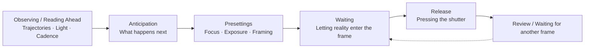
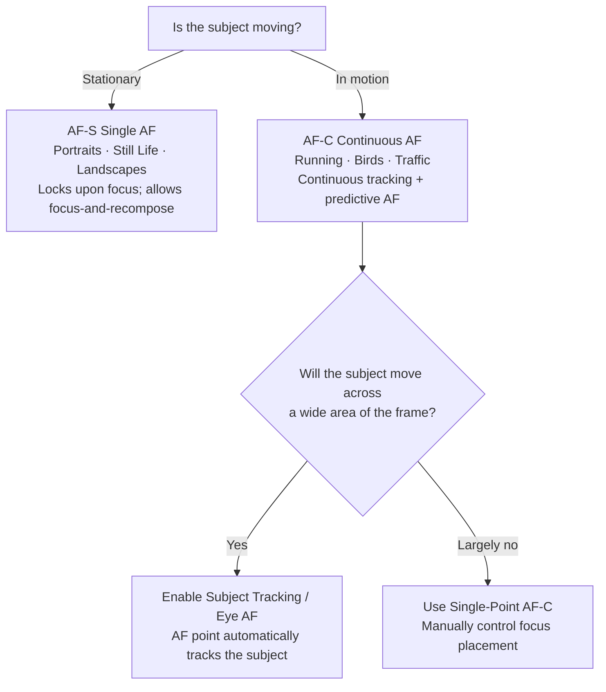

# Chapter 6 Timing

> The decisive moment is not a dogma. First and foremost, it is a relationship between time and action. Whether a photograph succeeds or fails often depends not on that single second itself, but on whether you were already prepared before that second arrived.

---

## How Photography Slices Time

*Eadweard Muybridge, "The Horse in Motion", 1878. The most widely circulated account claims that the railroad tycoon Leland Stanford made a bet over whether a running horse ever has all four hooves completely off the ground at a single moment. In reality, the details of such a wager were never substantiated by contemporary evidence; the more reliable historical record indicates that Stanford, driven by an interest in horse breeding and motion studies, funded and commissioned Muybridge to conduct this experiment beginning in 1872. Along the racetrack in Palo Alto, Muybridge set up a row of sequentially triggered cameras, each shutter released by a tripwire that the horse broke as it galloped past. The resulting sequence provided the answer: in one specific frame, all four hooves were indeed airborne. For the first time, photography transformed a moment invisible to the naked human eye into tangible evidence. It was here that timing, as a photographic problem, began to take on concrete form. [Image Credits & Reuse Instructions](image-credits.md#muybridge-horse)*

---

## After the Decisive Moment

In 1952, Henri Cartier-Bresson published *Images à la Sauvette*, titled in its English edition *The Decisive Moment*. This translation gained widespread currency, yet it carries a subtle element of misdirection. It sounds like a quiet, perhaps even Zen-like state of waiting—as if a photographer need only stand motionless in place, and that perfect instant will sooner or later present itself before the lens, reducing photography to a passive vigil. But Cartier-Bresson’s own practice was precisely the opposite.

Much of the problem lies in translation. In French, "à la sauvette" evokes something closer to snatching on the fly, grabbing hold of an opportunity in haste—an active, almost furtive agility rather than a dignified, seated wait. Cartier-Bresson was never waiting for a perfect moment to materialize out of thin air; instead, within an unfolding situation, he anticipated what would happen in the very next second, prepared his camera in advance, and then, the moment that second truly arrived, captured it with absolute composure.

In his epigraph, he quoted Cardinal de Retz: there is nothing in this world that does not have a decisive moment. Cartier-Bresson’s own definition was more comprehensive, and it deserves to be remembered in its entirety: the simultaneous recognition, in a fraction of a second, of the significance of an event as well as of a precise organization of forms which give that event its proper expression. This sentence sets forth two coordinate conditions, neither of which can be spared. The first half concerns content: you must perceive what is happening before your eyes and what it signifies. The second half concerns geometry: the lines, shapes, and positions of figures in the frame must, at that very instant, interlock into a coherent, self-sustaining composition.

This passage is all too often remembered only halfway. When people speak of "the decisive moment," they usually speak only of the temporal half: lightning reflexes, pressing the shutter at the exact split second. Yet the brilliance of the photograph behind the Gare Saint-Lazare lies half in the fraction of a second when the man is suspended mid-leap, and half in how his airborne posture mirrors the silhouette of the dancer on the poster behind him, while the sheet of water below reflects the entire scene in precise symmetry. If the timing is right but the geometry is off, the photograph still collapses. Thus, anyone training their sense of timing must eventually master the other half as well: while waiting for that crucial second to arrive, first arrange the formal structure of the frame, so that when the moment falls, it lands within a composition that can already stand on its own.

Another crucial emphasis in his words falls upon the phrase "an unfolding situation." Awareness does not suddenly sharpen in a single flash; it is summoned and honed degree by degree through continuous, unbroken watching. Timing tests not merely whether your reflexes are quick enough, but whether you possess the patience to linger before a scene—to keep looking, watching until you can discern the direction in which events are likely to develop. Exceptional timing almost always belongs to those willing to stand their ground just a little longer, rather than to those who merely snap a frame in passing.

---

### The Instant Is Not the Only Answer

Once the concept of *The Decisive Moment* gained currency, it immediately became an inescapable benchmark for generations of photographers that followed. Its explanatory power was so formidable that it was easily mistaken for the sole valid answer in photography, as though every great picture had to be a fraction of a second in which geometric relationships locked precisely into place. Yet barely a decade after Cartier-Bresson, another generation of photographers began to contest this premise—not by publishing polemical essays, but by offering an entirely different answer through their photographs.

Robert Frank was among the very first to break away. A Swiss-born photographer who had emigrated to the United States, Frank received a Guggenheim Fellowship in 1955. Over the course of the following year and a half, he drove across the country in a used car, exposing hundreds of rolls of film—more than twenty thousand negatives—before ruthlessly paring them down to just eighty-three images to assemble *The Americans*. The book was first published in Paris under the title *Les Américains* (1958); when the American edition appeared the following year, it opened with an introductory essay written specifically for it by Jack Kerouac. Throughout the book are pictures with loose compositions, heavy grain, and tilted horizons—scarcely one of them conforming to the precision implied by "the decisive moment." Yet taken together, they revealed a far more complex and melancholic America. What Frank sought was plainly not the neat interlocking of geometry, but an emotional and social truth, pursued unhesitatingly even at the expense of formal neatness.

Garry Winogrand, following closely on his heels, pushed the idea even further. Chapter 1 touched upon the mountain of hundreds of thousands of undeveloped, unseen negatives he left behind, as well as his famous dictum: "I photograph to find out what something will look like photographed." Placed in this context, that attitude strikes at the very premise of "the decisive moment": if even the photographer himself must wait until the film is developed to know whether an image works, then the supposed act of precisely pinning down that single second on location ceases to be the only standard. In 1967, John Szarkowski, curator at the Museum of Modern Art in New York, brought together the work of Winogrand, Lee Friedlander, and Diane Arbus in an exhibition titled *New Documents*, effectively conferring official legitimacy on this looser, more ambiguous, and far more vernacular mode of working.

Through this corrective shift, "the decisive moment" receded from an absolute dogma back to its rightful place: an extraordinarily powerful way of seeing, but by no means the only one. Some photographs indeed depend upon a moment of interlocking precision; yet for others, the power stems precisely from their imperfections—from a slight tilt of the frame, a blur of motion, a lingering ambiguity left unspoken. The sooner you realize that both paths are entirely viable, the less likely you are to let go of compelling, rough-edged frames merely out of a dogmatic pursuit of geometric perfection.

Building upon this foundation, we must break down "the instant" one layer further, for it encompasses two fundamentally different phenomena: the moment of peak action, and the moment of posture and expression—what is often called *gesture* in English. Either can serve as the true hinge upon which a photograph turns, yet each demands a very different kind of judgment.

Peak action refers to the apex of a physical movement: the suspended pause of a high jumper at the peak of their clearance before the body begins to fall back down, the point of contact where a tennis ball compresses against the racket strings, the crest of a breaking wave just as it explodes into foam before shattering downward. Its advantage is its predictability: the trajectory of the movement is governed largely by the laws of physics, and once you become familiar with the rhythm, you can anticipate with considerable precision the exact moment the apex will occur. This is particularly true of parabolic trajectories: as an object reaches the highest point of its arc, its vertical velocity drops momentarily to zero, creating a natural window of near-suspension that offers far more leeway than either the ascent or descent. The hang-time of a basketball player right before a dunk, or the split second a diver completes a spin at the apex of their leap, appears as if frozen in midair precisely for this reason—incidentally buying you an extra few tens of milliseconds to release the shutter. By contrast, a point of contact like a racket striking a ball offers virtually no pause; it is instantaneous and fleeting, demanding a keen anticipation of lead time along with burst shooting to secure the frame. A vast proportion of unforgettable imagery in sports photography captures precisely this kind of peak.

The moment of posture and expression, by contrast, is far more subtle. It might be nothing more than a hand paused halfway in midair, a glance cast just beyond the edge of the frame, or a flicker of a smile rising to the surface before self-consciousness pulls it back. Moments of this kind offer no physical trajectories to calculate; they vanish in a breath and are far harder to anticipate, yet once captured, they often cut closer to a person’s authentic interior life than any display of peak action ever could. Cartier-Bresson’s true genius resided largely here: he rarely photographed the moment of maximum exertion, choosing instead the instant where posture and expression aligned in effortless resonance. Peak action tests your familiarity with physics; *gesture* tests your understanding of human nature.

---

## The Time Scales of Different Genres

Different photographic genres handle time in different ways. Street, portraiture, sports, and landscape photography all depend on timing, yet the time they confront is not of the same kind. Some time must be waited out; some is orchestrated by your own hand; some moves so fast it can only be entrusted to burst mode; and some is simply stretched out, layered upon itself within a single frame. When broken down this way, timing ceases to be a vague slogan and becomes a set of tangible skills, each with its own deliberate practice.

The first is the moment arrived at through waiting. The subject is in flux; anticipating that it will evolve into a particular state, you plant your feet and wait for it to arrive there, step by step. A pedestrian crosses the frame, just about to step into a patch of light filtered through window blinds; a bird traces its flight arc, nearing the upper-right corner of the composition; a child, captivated by something at the roadside, breaks into a spontaneous smile before self-consciousness can pull it back; a wave crashes against the rocks, its spray just erupting, not yet dispersed. What these moments share in common is that they require you to take your stance first, pre-focus, lock in your exposure, and leave yourself with only one task remaining: to wait. The real craftsmanship lies in what is done before that second arrives, not in the second itself.

The man leaping across the puddle behind the Gare Saint-Lazare, captured by Cartier-Bresson through a gap in the wooden fence, was precisely such a moment arrived at through waiting; the details of that vigil were already laid out in Chapter 1. Here, one reminder suffices: when developed, the photograph looks like a stroke of sheer serendipity, but preceding that serendipity were a preset focus and exposure, and a photographer who had long been waiting in place.

The second is the moment you manufacture yourself. In portraiture, it is you who asks the subject to look in a certain direction, to lower their hands, or to repeat a gesture they just made; in still life, it is you who decides where the cup sits, which direction the light enters from, and where the shadows ultimately fall across the tabletop. The most practical middle ground in engineering moments is to construct a scenario first and then capture the authentic reaction: you seat two long-parted friends at the same table, or invite your subject to recount a proudest memory; the situation is staged by you, but the smile and gestures that emerge are genuine. What you capture is still a candid reaction, and much of a portrait photographer's craft lies precisely here. At the other extreme of photographic history, figures like Jeff Wall and Gregory Crewdson push staging to its absolute limit—building sets, setting lights, and directing actors like filmmakers, choreographing the entire scene from start to finish—yet the work remains serious art. Staging and candid capture are therefore merely a distinction of methodology; neither is inherently superior. In the final analysis, what matters has never been whether an image was staged or caught unawares, but whether it holds together—whether the state it depicts rings true.

The third is the moment sustained by burst mode. Some actions are simply too fast and unpredictable. The facial expression during the final ten-meter sprint of an athletic race, the split second a predator strikes its prey, a wedding guest suddenly laughing to tears, a child running toward you through a pool of sunlight—with moments like these, one can hardly expect a single shutter release to land squarely on the finest frame every time. Professional sports and wedding photographers rely heavily on continuous burst shooting for a very practical reason: no one's reflexes can unfailingly nail those decisive tenths of a second time and again. Mind you, the caliber of a photographer's judgment is not measured by how many frames were fired, but by when you initiate the burst and when you let go.

Then there is a fourth kind of timing—not an isolated instant, but the accumulation of a span of time. The surface of the sea smoothed into silken texture by a long exposure; commuters in a subway station dissolving into translucent ghosts; star trails tracing slow arcs around Polaris in the night sky; a highway drawn into twin ribbons of red and white light by passing traffic. Here, what you record is no longer a single instant cleanly sliced out of reality, but how an entire duration of time layers upon itself and settles onto a single image. Unlike the previous kinds of timing that race against the clock, this one demands the patience to simply let time flow across the lens on its own terms.

---

## Waiting Is Active Work

Many people simply cannot bear to wait. Standing before a scene for five seconds with nothing changing, hesitation sets in, and they think to themselves, *forget it*. Yet this is not necessarily a simple matter of impatience; more often than not, the true reason is that they do not yet know what they are actually waiting for. Waiting is agonizing because it lacks a clear objective; once a person has no idea what they are waiting for, even a few seconds feel interminable.

Conversely, when someone can hold their position at a single vantage point for a long time, it may look like extraordinary patience on the surface, but the more crucial factor is that they possess clear judgment. They know exactly what they are waiting for, and they know why and how much better the image will be compared to the present moment once that thing happens. Sustained by this judgment, waiting is no longer an ordeal, but an endeavor anchored in conviction and anticipation.

Before deciding to stop and commit to the wait, you might ask yourself a few questions: Is the subject still in motion or evolving? What might its next state look like? Approximately how long will it take to get there? What is the real probability of it happening? And if it does occur, how much better will the photograph be than what is in front of you now? Only when you have thought through these questions does waiting take on real meaning. In doing so, you can make a clearheaded decision about whether to stay the course, while also setting a sensible time limit for yourself. Waiting is then no longer an aimless waste of time, but a deliberate photographic choice with well-defined boundaries.

The shortest kind of wait usually lasts under half a minute, something encountered most frequently in street photography. The frame is often already eighty or ninety percent formed, waiting only for a passerby to walk through, a car to enter the designated spot, or an expression to surface on someone's face. At moments like this, you can keep the camera raised to your eye or resting against your chest, finger resting on the shutter release, eyes fixed on the scene while anticipating the various ways the situation might unfold, ready to press the shutter the moment it happens.

A wait of medium duration can last anywhere from a minute to half an hour, seen mostly in landscape and urban photography. You might be waiting for the light to creep across the scene, for clouds to part gradually, for the current wave of pedestrians to clear, or for streetlights to illuminate one by one in the gathering twilight. This type of waiting is well suited to setting up a sturdy tripod, locking down both composition and exposure in advance; while waiting, you can periodically inspect the edges of the frame to ensure no unwanted distractions have crept into the shot.

The longest waits extend beyond half an hour, typical of landscape, wildlife, and certain special events. Waiting of this scale demands a deliberate plan; you cannot simply stand around aimlessly hoping for luck. You must be clear about exactly what conditions you are waiting for, and set a firm cutoff time beforehand. If that time arrives and the moment has not materialized, pack up your gear decisively and move on; coming away empty-handed this time is far better than slowly draining your energy and judgment on the spot. Returning another day is almost always more worthwhile than stubbornly lingering.

Besides, even if nothing comes of it in the end, that time is not wasted. By observing a scene attentively for an hour, you gain a level of insight that passersby will never possess: how the light shifts millimeter by millimeter, at roughly what hour the crowds begin to thin, and which changes you anticipated will never actually materialize. All of this crystallizes into experience. The next time you stand before a similar scene, your foresight will be sharper than it was today.

---

## Where Anticipation Comes From

By this point, the word "anticipation" has surfaced several times, and it is time to isolate it and examine it with clarity. Good timing is almost invariably built upon prediction: you are not photographing what has already transpired, but what is about to unfold. And this faculty of prediction, when stripped down, holds no hidden trick; it stems from only two of the most unadorned disciplines: observing long enough, and shooting often enough. In truth, this is the very same seeing discussed in Chapter 1, except that here, it must ground itself in several very concrete subjects.

The first element to read in advance is the trajectory of human movement. When someone approaches a street corner, they rarely turn abruptly out of nowhere; rather, they advance along a path that can broadly be deduced. If you are willing to observe for just a few seconds more, you can discern which paving stone they will step on next, at what point their path will cross that of another pedestrian, and precisely where they will walk straight into that beam of light. With repeated observation, this appraisal of movement lines becomes increasingly swift, fast enough to feel almost instinctive.

The second element to read in advance is the shift of light. As clouds drift toward the sun, you can roughly estimate how long before the shadow on the ground draws back and the light washes over your subject once more. In the evening, the light turns warmer and sinks lower with each passing minute, while streetlights will suddenly illuminate all at once at a certain tipping point. Unlike human beings, light does not abruptly change its mind; its evolution is continuous and directional, making it uniquely suited to anticipation. All you need to do is establish your position one step ahead of it.

The third element to read in advance is the cadence of events. Many settings inherently carry a rhythm of their own: a subway train pulls in roughly every few minutes, a fountain surges at set intervals, a street performer's routine unfolds in distinct movements, and a wedding ceremony advances step by measured step. Once you catch the underlying beat of this rhythm, you can foresee which beat the climax will fall upon, allowing you to position your camera in advance and wait for that precise moment to strike. Take the exchange of rings at a wedding as an example, and walk through the entire sequence from start to finish. On the ceremony program, it is slated right after the vows, so the moment the vows begin you should already be on the move: circle around to the side where both their hands and the bride's face remain in view—typically at a forty-five-degree angle behind the officiant—open your aperture to around f/2.8, set your shutter speed to 1/250 second or faster, switch your autofocus mode to continuous, and lock it onto the bride's face. As the vows conclude and the best man reaches into his pocket for the ring box, you are given your final cue: raise the camera. The true picture unfolds in two layers: the second the ring slides onto the finger marks the peak of physical action, but far more precious is often the half-second immediately following—that fleeting instant when they look up and share a smile. Fire a brief, controlled burst to capture both layers. Not a single step in this sequence relies on chance: the schedule tells you when it will arrive, the rhythm tells you when to raise the camera, and your pre-configured settings ensure you can shoot the moment it reaches your eye.

Bringing these three elements together is, in essence, a form of visualization. The term comes from Ansel Adams's *visualization*, referring to the practice of fully conceiving the tonal values of the finished photograph in the mind's eye before ever pressing the shutter. Applied to timing, the principle remains identical: you first see clearly in your mind the photograph that has not yet occurred—where the subject will fall, how the light will appear, what gesture will take shape—and then allow reality to step gradually into this preconceived frame. When reality finally aligns with the picture in your mind, the only act left for you to perform is pressing the shutter.

This entire sequence can be roughly mapped as a chain:

The chain deliberately loops back to "Waiting" at the end to remind you: taking that first shot is rarely the end of the process. What was discussed earlier—that the second shot is often better than the first, or that one should patiently await the next combination of elements—speaks to the very same truth: allowing this chain to cycle through another turn or two, rather than taking a single frame and walking away.

---

## Candid Capture Is a Reaction Chain

Candid capture is not merely a matter of pressing the shutter quickly. It is, in reality, a continuous reaction chain: first comes seeing, then anticipation; next, the body follows through to bring the camera into position; and only at the very end does the finger press down. The shutter release is merely the final link in this chain; what truly decides whether a photograph succeeds or fails is almost always the steps that precede it.

Catching a developing scene in the corner of your eye is the first step in this chain. Then you turn your head to get a clear look, realize it is worth photographing, and raise the camera: framing, composing, focusing, double-checking the exposure, and only then releasing the shutter. An experienced photographer can compress this entire chain into a vanishingly brief span, executing it almost instantaneously. When novices are slow, it is rarely because their fingers are sluggish; rather, they are not yet thoroughly familiar with their gear, their exposure parameters have not been set in advance, and they tend to wait until seeing the scene unfold before frantically trying to figure out how to shoot it. By the time they sort it out, that fleeting instant has long since slipped away.

The moment you step onto the street, and before ever raising the camera, your settings should already sit within a reasonable baseline range. In daylight, you can shoot in Aperture Priority (A mode) with a minimum shutter speed threshold, or in Manual (M mode) paired with Auto ISO; start with an aperture between f/5.6 and f/8, and hold the shutter speed around 1/250 to 1/500 second for walking pedestrians. On modern camera bodies, you can use AF-C alongside zone or subject tracking; if you place more trust in manual distance, you can also opt straight for zone focusing. Set the maximum ISO ceiling according to the acceptable image quality of your specific sensor, rather than treating ISO 6400 as a universal prescription. The value of these presets lies not in any rigid set of numbers, but in ensuring that when you raise the camera, you do not have to start from scratch—leaving your attention free for subjects, frame boundaries, and the impending next second.

Herein lies the true purpose of presetting. It allows mechanical adjustments to recede as deeply as possible into muscle memory, turning them into near-instinctual actions, thereby returning your full attention to the frame itself rather than having menus and parameters drag you back into the camera's internal machinery at the most critical juncture. The earlier your exposure parameters are sorted out, the less distracted you will be in the field.

Back-button focus can likewise prove invaluable for candid shooting. Under a camera's factory settings, a half-press of the shutter button is tasked with both autofocusing and metering, while a full press executes the exposure. What back-button focusing does is reassign the focusing task entirely to the AF-ON button (or asterisk button) on the rear of the body, leaving the shutter button dedicated solely to capturing the image. This allows you to acquire focus first and then fine-tune your composition at ease, without the nagging worry that another half-press of the shutter will trigger the camera to hunt for focus all over again. If you want to shoot several frames at the same focal plane, there is no need to reacquire focus for each one. With moving subjects, it is even more convenient: holding down AF-ON engages continuous autofocus, while pressing the shutter button fires the shot—the two functions cleanly separated onto their own buttons, operating without interference.

There is also a more traditional method known as zone focusing. It simply turns off autofocus altogether, relying instead on depth of field to keep a continuous zone of distance in front of the lens acceptably sharp. For instance, if you stop a 35mm lens down to f/8 and manually fix your point of focus at around 2.5 meters, everything from roughly 1.7 meters to 5 meters will fall within an acceptable range of sharpness. Bear in mind that the far limit of this sharp zone does not reach infinity: if you want distant elements to be sharp as well, you must push focus further back to the hyperfocal distance, a concept discussed in detail later (for a 35mm lens at f/8, the hyperfocal distance is roughly 5 meters; focused there, everything from 2.5 meters to infinity remains acceptably sharp). Which zone you choose to preset depends on the distance at which you intend to intercept your subjects; the commonly used street distance of two to three meters aligns the zone of sharpness squarely with pedestrians brushing past. In this way, as soon as someone steps into this spatial window, you no longer have to wait for the camera to slowly acquire focus—simply raise your hands and shoot. The tradeoff is that the image will not be razor-sharp in every corner, but what street photography truly seeks in the first place is the decisive instant, not hairline resolving power; the compromise is well worth making.

---

## Focus Modes Must Serve Motion

We have repeatedly noted that “focus should be set in advance,” but focusing itself encompasses several distinct modes; choose the wrong one, and even the swiftest hands will fail to catch a moving subject. Before turning to burst shooting and shutter releases, therefore, it is necessary to examine autofocus thoroughly. In modern cameras, the most fundamental divide in autofocus comes down to two basic modes: Single-Servo AF and Continuous-Servo AF.

The underlying logic of Single-Servo AF (AF-S, termed One-Shot AF by Canon) is to “acquire focus once and lock it.” You press the shutter button halfway, the lens achieves focus, and the point of focus remains locked in place, unchanging until you release the button to start again. It is suited to stationary subjects: a seated person, a landscape, a still life. It also lends itself to a convenient technique known as focus-and-recompose: you aim the center focus point at your subject to achieve focus, lock it, and then reframe the composition by panning the camera; because the focal distance is already fixed, panning will not cause you to lose it.

Continuous-Servo AF (AF-C, termed AI Servo by Canon) operates on an entirely different logic: as long as the button remains depressed, it continuously refocuses without pause, tracking every shift in the subject’s distance. More importantly, it is almost always paired with predictive autofocus (predictive AF) algorithms. Based on the subject’s motion across preceding frames, the system calculates where the subject will be at the exact instant the shutter opens, projecting and driving focus to that position ahead of time. This step is critical because a slight delay always intervenes between the moment you press the shutter and the moment the sensor is actually exposed; during this interval, the subject remains in motion. Without predictive tracking, focus would forever lag half a beat behind. Any subject that runs, rides, flies, or pounces should be entrusted to AF-C.

Layered on top of these two modes, modern cameras have added subject tracking. Earlier forms of tracking allowed a selected autofocus point to follow the subject across the frame: once you locked onto the subject, the point clung to it relentlessly, never letting go even as it moved from one side of the frame to the other. In recent years, camera bodies have advanced further, incorporating deep-learning-based subject recognition that autonomously identifies people, animals, birds, vehicles, and even aircraft, tracking them continuously once acquired. This liberates you from the tedious chore of manually shifting focus points, allowing you to return your full attention to the timing itself.

Among these features, the most indispensable for photographing people is Eye AF (eye-detection autofocus). Once the camera recognizes a human face, it pinpoints the eyes, anchoring focus firmly onto the eyeball; even if the subject turns their head or moves around, focus follows the eyes unfailingly. The greatest hazard in portraiture and snapshot photography is fumbling with focus points at the decisive moment. Eye AF virtually eliminates this step, leaving you free to attend solely to framing and expression while the camera keeps its gaze fixed on focus.

Looking back at the back-button focus discussed earlier, its synergy with these two modes makes handling even more seamless. By configuring the camera body to AF-C and reassigning autofocus activation to the AF-ON button, your thumb effectively becomes a focus-mode toggle: hold down the AF-ON button, and the camera tracks continuously, functioning as AF-C; release your thumb, and the focus instantly halts at its current position, functioning as AF-S. With this single setup, the simple press and release of a thumb allows you to transition effortlessly between tracking and locking focus, without ever needing to dive into menus to switch modes.

Which mode to employ can be determined quite simply by whether the subject is in motion or at rest:

---

### Shutter Lag and Pre-Shooting

Even when the correct focus mode is selected, an unavoidable delay still intervenes between the instant you decide to press the shutter and the moment the sensor actually records the light. This delay is known as shutter lag, and it often baffles beginners: they press the shutter precisely at the peak moment, yet the resulting image always falls just a fraction of a second short.

Shutter lag is actually composed of two distinct stages. The first is the time spent acquiring focus: the camera insists on achieving focus before it will open the shutter. The second is known as release time lag (or release lag), which refers to the purely mechanical or electronic latency between pressing the button all the way down and the shutter actually opening, assuming focus is already acquired. The first stage varies widely; in dim light or low-contrast scenes where the camera hunts back and forth for focus, it can drag on for several hundred milliseconds. The second stage is far more consistent: in modern mid-to-high-end bodies, it is typically kept to tens of milliseconds, and in professional camera bodies, it is shorter still.

Yet preceding both of these machine latencies, an even longer delay weighs upon the equation—one that resides within yourself: human reaction time. From the moment the eye perceives the peak action, through the transmission of neural impulses to the finger, to the physical depression of the shutter release, an individual with normal reflexes requires 150 to 250 milliseconds. Stack these three components together, and the disparity becomes striking: the camera’s release lag is mere tens of milliseconds, while your own response takes around 200 milliseconds. The bottleneck has always been human, never mechanical. This also explains why reaction time cannot be trained to yield a qualitative leap: those 200 milliseconds represent a physiological floor that no amount of practice can significantly reduce. There is only one viable path around it: anticipation. Rather than waiting to act until the peak appears, you anticipate when it will arrive, initiating the downward press of your finger before the moment actually materializes.

Once you grasp this principle, you realize that in snapshot photography, you must deliberately press the shutter a fraction of a moment early. If you wait strictly until you see the peak of the action before releasing the shutter, the peak will have long passed by the time your body and camera traverse this entire chain of latency. The seasoned approach is to factor in the lag, tripping the shutter an instant before the peak arrives so that the opening of the shutter curtains coincides precisely with the apex of the motion. This slight margin of lead time relies entirely on the anticipation discussed above.

The most direct way to reduce latency to a minimum is pre-focusing (pre-focus). Before the subject reaches the designated position, you half-press the shutter or use back-button focus to lock onto the point in advance. In doing so, that lengthy autofocus delay is absorbed ahead of time; when the moment arrives to press down fully, only the fleeting release lag remains. Whenever you know where a subject is about to pass, you can lock your focus in this manner beforehand.

Pushed to its logical extreme, pre-focusing becomes trap focus (also known as a focus trap). You fix your focus on a predetermined spot—a branch where a bird is likely to alight, a handrail a skateboarder is about to grind, or the finish line a runner is about to cross—and wait there, releasing the shutter the instant the subject enters this predefined focal plane. Certain camera bodies can even be configured so that the shutter releases automatically the moment the subject achieves focus at that position. The brilliance of this technique lies in settling the time-consuming tasks of focusing and framing entirely in advance, leaving only a single decision to be made on the spot: when to release the shutter.

Carrying this logic one step further brings us back to the zone focusing and hyperfocal distance mentioned earlier. In essence, both are forms of pre-focusing; what is set in advance is not a single point, but an entire continuum of sharp distance. The formula for hyperfocal distance and the origins of the circle of confusion were derived in Chapter 5, so we may draw directly on the conclusion here: stop a 35mm lens down to f/8 and set the focus at approximately 5 meters, and everything from roughly 2.5 meters to infinity will fall within an acceptably sharp range. In street photography, many practitioners choose to focus somewhat closer than this so that subjects one or two meters away remain sharp, at the cost of drawing the far boundary of sharpness back from infinity. Regardless of the trade-off, the principle remains the same: lock down the focus in advance, and all that remains is to wait for that single press of the shutter.

---

## Single Frame or Continuous Shooting

One must distinguish clearly between when to use single frames and when to switch to continuous burst. Neither is inherently more advanced than the other; rather, each corresponds to a different photographic circumstance.

Street, portraiture, landscapes, architecture—most of the time, these subjects can be photographed comfortably in single frames. Single-frame shooting offers a subtle, easily overlooked benefit: it continually hones your judgment, because with every press of the shutter, you are compelled to make an active, conscious decision rather than postponing the choice until after the fact. At the same time, it saves you an immense amount of time culling images, sparing you the dread of returning home to face a vast pile of near-identical photographs. The older generation of street photographers worked almost exclusively in single frames. While this was undoubtedly because the cameras of their day lacked the burst capabilities we enjoy today, that very limitation in turn forced them to think the image through completely before releasing the shutter. The constraints of that era possessed a tangible weight: thirty-six exposures to a roll, carrying three to five rolls for a day on the street. Every actuation came with a visible, material cost; once shot, one had to wait for development, and if you miscalculated, you were denied even the chance of immediate regret on the spot. It was precisely this exacting frugality that etched the habit of "thinking it through before pressing" into the hands of that generation. Constraint itself became a form of discipline.

When faced with sports, wildlife, children, pets, wedding ceremonies, or figures leaping, running, or abruptly turning their heads, however, you can engage continuous shooting with confidence. In these situations, switch your autofocus accordingly to continuous tracking (AF-C), establish a baseline shutter speed of at least 1/500 second, raise the upper limit on your Auto ISO, and ensure that your memory card's write speed can keep up with this rapid sequence of captures.

The cost of continuous shooting is unambiguous: culling images once you get home becomes a grueling chore. Faced with a row of fifty nearly identical photographs laid out before you, you must quickly compare them one by one to determine precisely which frame captures the posture, the gaze, the gesture, and the frame edges at their absolute best. Beyond that, continuous shooting readily creates an illusion, leading you to believe you have captured a great deal, when in truth valid photographic judgment often took place over the span of just a few brief seconds. The most dependable way to use continuous shooting is to fire off a short, disciplined burst the moment you anticipate the critical action unfolding, rather than holding the shutter pinned down indiscriminately from beginning to end.

---

### Frame Rate, Buffer, and Pre-Capture

As mentioned earlier, the soundest practice when shooting continuously is to release a short, focused burst rather than keeping the shutter depressed without interruption. Behind this advice lie several hard limitations of camera burst systems; understanding them clarifies why continuous, non-stop shooting does not equate to reliably seizing the moment.

The first metric is frame rate—that is, the number of frames captured per second (fps). Speed varies considerably across camera models, shutter mechanisms, RAW bit depths, and autofocus modes: some manage only a few frames per second, while others equipped with electronic shutters can achieve dozens or even over a hundred. High-speed modes, however, often come at the expense of RAW bit depth, continuous autofocus tracking, dynamic range, or buffer depth. While a higher frame rate sounds unequivocally advantageous, its true significance must be seen from another perspective: intervals of time still exist between adjacent recordings, and no burst sequence is a seamless video stream.

| Burst Rate | Interval Between Adjacent Frames |
|---|---|
| 5 fps | 200 ms |
| 10 fps | 100 ms |
| 20 fps | 50 ms |
| 30 fps | 33 ms |

This table illustrates the very same point: even at ten frames per second, a full one hundred milliseconds separates each frame, whereas the apex of many peak actions is shorter still. That decisive instant can easily fall directly into the seam between two frames, causing your entire burst sequence to miss the mark. A higher frame rate narrows this gap and reduces the probability of missing the action, but ultimately it merely compresses the seam—it does not eliminate it. In the end, seizing the moment depends on when you choose to initiate the shutter; you cannot rely on frame rate to rescue poor timing.

The second limitation stems from the buffer (also referred to as cache). Images captured by the camera are first funneled into high-speed internal buffer memory before being written progressively to the memory card. Buffer capacity is finite; once a burst exceeds the number of frames the buffer can hold, shooting speed plummets abruptly to match the card's write speed. This means that if you shoot continuous bursts indiscriminately from the start, the buffer may well become choked with useless preceding frames before the true climax even arrives. The camera will be busy writing to the card, stalling precisely at the moment you most need to shoot. A faster card—such as a UHS-II SD or CFexpress card—can push this wall back somewhat, but cannot remove it entirely.

The third limitation is viewfinder blackout. With a DSLR, the reflex mirror must flip up and down for every shot, and the mechanical shutter must open and close for each exposure; throughout continuous shooting, the viewfinder flickers black with each frame, leaving your tracking of a fast-moving subject repeatedly fractured by this staccato blackout. Mirrorless cameras paired with sufficiently fast electronic shutters can achieve virtually blackout-free viewing—Sony's α9, for instance, became famous for its "blackout-free shooting," enabling you to maintain an uninterrupted visual lock on the subject through the entire burst. This brings us directly to the discussion of electronic shutters that follows.

Blind burst shooting is thus unreliable for two distinct reasons: the gaps between frames offer no guarantee of capturing that one defining moment, while buffer exhaustion and viewfinder blackout can hold you back at the most critical juncture. What truly works remains that foundational rule: fire a short, disciplined burst only when you anticipate the key action is about to take place.

In recent years, however, many camera bodies have offered a third answer: pre-capture (known by various proprietary names, such as Pro Capture). When the shutter is half-pressed, the camera begins buffering a continuous rolling loop of recent frames; when fully depressed, the frames captured just before the press are written to the card alongside subsequent shots. As a result, even if you only release the shutter the moment you see a bird take flight, you can still preserve the full motion before and after takeoff. While this significantly mitigates human reaction latency, it is not without caveats: pre-capture duration, RAW versus JPEG format, frame rates, continuous autofocus tracking, lens compatibility, minimum shutter speeds, and buffer limits vary by camera model and mode. One cannot assume that "all pre-capture is subject only to rolling shutter distortion and battery drain." You should read the manual for your specific camera before using it. More importantly, pre-capture merely shifts the point of anticipation forward—from "when to press the shutter all the way down" to "when to begin half-pressing and where to aim the lens"—it does not decide for you whether the frame works visually.

---

## First Decide How to Render Motion

Continuous shooting resolves the question of *which* frame to capture, but it offers no guarantee that each frame will be sharp. What truly determines whether a motion is frozen or rendered as a blur is the shutter speed itself. The faster the shutter speed, the shorter the distance the subject travels during the brief window of exposure, and the closer the recorded image is to stillness. Once the shutter slows down—even slightly—a fast-moving subject leaves a trail of motion blur in the frame. Making an active judgment about how you wish to freeze or render motion before tripping the shutter is far more proactive than sorting through a long sequence of photos after the fact.

A set of general guidelines can be offered here. Rather than rigid, exact thresholds, these serve as baseline orders of magnitude to help you set your shutter speed within a range safe from unwanted blur before raising the camera.

| Subject | Approximate Shutter Speed to Freeze Motion |
|---|---|
| Static portrait (handheld) | From 1/125 s |
| Walking person | 1/250 s |
| Running, jumping | 1/500 s |
| Cycling, running children | 1/500 - 1/1000 s |
| Moving car | 1/1000 s |
| Birds in flight, sporting events | 1/1000 - 1/2000 s |
| Panning shot (sharp subject, background streaked into lines) | 1/30 - 1/60 s, with lens panning |

It should be clarified that the numbers in this table are merely approximate starting points; the specific setting depends on how fast the subject is moving and in which direction it moves across the frame. At the same speed, a subject moving perpendicular across the frame is much more prone to motion blur than one moving directly toward or away from the camera, because the former traces a longer visual path across the sensor, covering a larger displacement within the same span of time. Therefore, when encountering uncertain scenarios, rather than fretting afterward that an entire sequence lacked that final touch of sharpness, it is far better to set a faster shutter speed on the spot.

The table above addresses the subject's own movement—that is, the blur that occurs when a subject moves too fast and blurs itself during the exposure. Yet image blur has another source entirely unrelated to whether the subject is moving: the subtle, unavoidable camera shake introduced by handholding the camera. These two types of blur are often conflated, but they must be examined and addressed separately.

The empirical lower threshold for handheld sharpness is approximately \( 1/\text{equivalent focal length} \): roughly 1/50 s for a 50mm lens, and 1/200 s for a 200mm lens. The longer the focal length, the more any slight tremor is magnified within the frame, and the more you must rely on raising the shutter speed to suppress it. Lenses or camera bodies equipped with image stabilization allow you to slow the shutter beyond this baseline: manufacturers today routinely claim five to eight stops of coordinated stabilization between body and lens, though for dependable field shooting, estimating three to five stops is a safer assumption.

Note, however, that this rule provides only the "lower threshold against camera shake"—it governs camera movement, not subject motion. To truly freeze subject action, you must return to the table above, determine the shutter speed based on the subject's velocity, and choose the faster of the two values. The reciprocal safety shutter ensures that you do not shake; the motion-stopping shutter ensures that the subject does not blur. Only when the shutter speed clears both hurdles simultaneously does the image achieve dependable, uncompromising sharpness.

Pushing the shutter speed continuously faster aims to pin motion firmly onto a single frame. Yet time in photography does not always need to be frozen; sometimes, quite the contrary, allowing it to flow and stretch across the frame is an expressive language in its own right.

---

## Drawing Time with Slow Shutters

What a slow shutter does is turn time itself into part of the image. The moment the shutter slows down, what the camera records is no longer a single frozen instant, but a stretch of time unfolded and drawn out.

Different shutter speeds stretch time into different forms. Between 1/15 and 1/4 of a second, a walking passerby takes on a faint blur, yet remains fully recognizable. Between 1/2 second and 2 seconds, flowing water and moving figures visibly streak and dissolve into translucence. Between 5 and 30 seconds is long enough to capture light trails from nighttime traffic and the shifting clouds across the sky. And once you extend past a minute, star trails, the glassy stillness of a slow-moving sea, and long-drifting clouds stack layer upon layer into a single frame. The duration you choose ultimately determines the degree to which time is diluted within the picture.

Shooting with slow shutters usually requires a sturdy tripod, paired with a cable release or the self-timer to prevent the camera shake caused by touching the body; during daylight, you will also need a neutral density (ND) filter to cut down excess light. Among common ratings, an ND8 reduces exposure by roughly three stops, an ND64 by roughly six stops, and an ND1000 by roughly ten stops. The conversion follows a single rule: every stop of light cut doubles the exposure time. If the exposure without a filter is 1/125 second, a 10-stop ND will yield approximately 8 seconds; extending that to 30 seconds at the same aperture and ISO requires about twelve stops of light reduction, rather than mounting a 10-stop ND and guessing your way through the rest. You can switch to a 12-stop filter, stack an additional two stops onto the 10-stop, or adjust your aperture and ISO—though stacking filters can introduce color casts, vignetting, and reflections. You can calculate this directly with the [Field Toolkit](tools.md#nd-calculator). Variable ND filters adjust density via two polarizing layers; when pushed close to their maximum density, especially on wide-angle lenses, a dark X-pattern may emerge across the frame. Avoid turning the adjustment ring to its extreme limit, and inspect all four corners as well as any color cast before beginning the actual shoot.

Across the entire spectrum of slow shutter speeds, the narrow range between 1/15 and 1/2 of a second is often the most intriguing. This speed is just slow enough to introduce blur to the subtle movements of the subject, yet not so slow as to erase it entirely—you can still clearly tell what it is. In street photography, shooting handheld at 1/30 or 1/15 second dissolves the legs and hemlines of pedestrians into flowing shadows, while their faces and the background remain anchored in place. The image thus takes on a palpable sense of elapsed time without sliding entirely into abstraction, sustaining a delicate balance between the blurred and the sharp.

Many of Daido Moriyama’s photographs carry precisely this distinctive tremor of handheld slow exposures. In his 1972 photobook *Farewell Photography*, the woman in the bathtub, the telephone poles, and the drunk sprawled on the roadside all look as if they were casually seized in passing by a hurried eye. He was never after stability; on the contrary, he chose to let his body sway along with the entire city, preserving that very vibration as the substance of the photograph itself.

There is also a way to invert the logic of the slow shutter: keep the subject relatively sharp while smearing the background into streaks of motion—the technique known as panning. In practice, this means dropping the shutter speed to around 1/30 second and panning the camera smoothly in sync with the moving subject, releasing the shutter mid-pan and—crucially—continuing to swing the lens smoothly in the same direction after the shutter fires. As long as your panning speed roughly matches the pace of the subject, the subject will emerge relatively sharp while the background is drawn out into horizontal streaks. Bicycles, runners, and subway trains pulling into a station are all ideal subjects for practicing this craft. At first, landing two or three usable frames out of ten is already an accomplishment; the key is keeping your body steady and rotating smoothly from the waist rather than flicking the camera with your wrists alone. The failures also follow recognizable patterns, and diagnosing the cause makes correction straightforward: if the subject itself is blurred, your panning speed likely failed to match its pace or varied erratically—practice until your swing is steady and uniform; if the subject is sharp but the background hasn’t streaked into lines and merely looks softly out of focus, the issue is not your hands, but that the subject’s lateral speed is too slow or it is too far away, resulting in too small an angular velocity in the frame—in that case, either wait for a faster subject or drop the shutter speed another stop. For focusing, continuous autofocus (AF-C) is the most effortless choice, while the old-school method relies on pre-focusing along the line where the subject is expected to pass; both approaches work equally well.

A slow shutter can also be combined with flash within a single frame—a technique particularly effective at night, known as dragging the shutter. The slow shutter gathers the ambient light, allowing the darkness of the night, neon signs, and streetlamps to sink into the exposure; meanwhile, the brief burst of flash freezes the illuminated subject at a single moment during that duration. Flash duration varies with the speedlight and power output—it is typically much shorter at low power and can lengthen substantially at full power—so it cannot simply be generalized as a fixed "fraction of a tens-of-thousandth of a second." Front-curtain sync fires the flash at the very beginning of the exposure, while rear-curtain sync fires just before the exposure ends; for wheels, cyclists, or dancers with a clear direction of motion, rear-curtain sync naturally places the ambient light trails behind the subject, which feels far more intuitive. Yet if the subject is likely to move out of position before the flash fires, or if the camera has noticeable shutter lag, front-curtain sync can actually prove easier to control. It is a visual choice, not an immutable formula.

---

### Electronic Shutters and Rolling Shutter

Whether freezing a speeding subject or dropping the shutter speed to pan along with it, we routinely take one premise for granted that is not entirely true: that as the shutter opens and closes, the entire frame is recorded at the exact same instant. Yet this is not always the case, and it is especially untrue when using an electronic shutter. To clarify this, we must first distinguish between two fundamentally different shutter mechanisms found in cameras.

A mechanical focal-plane shutter controls exposure by traveling front and rear curtains across the sensor. At or below the flash sync speed, there is a window where the sensor is fully uncovered; at speeds faster than the sync speed, the two curtains form a traveling slit that sweeps across the frame, meaning the top and bottom of the image are not exposed at the exact same moment either—it is just that the transit speed is typically very fast. Standard electronic shutters, by contrast, expose and read out the sensor line by line, so that the top and bottom of the frame are separated by the full sensor scan time; if the readout is slow, rapid motion and flickering light sources will readily expose discrepancies. Both mechanisms can involve temporal scanning; the difference lies in speed and engineering, not in a simplistic dichotomy of "mechanical is simultaneous, electronic is progressive."

Whenever this readout duration meets rapid movement, flaws begin to surface—what is commonly known as the rolling shutter effect (or the "jello effect"). Because the top portion of the frame is recorded slightly earlier than the bottom, a car speeding horizontally across the frame is rendered skewed, its round wheels warped into leaning ellipses; straight telephone poles tilt during rapid pans; and high-speed rotating propellers warp into curved hooks. Panning is especially susceptible to this distortion, since you are sweeping the camera horizontally at high speed alongside the subject, and vertical lines are the least forgiving of line-by-line scanning.

The total full-frame scan time varies entirely by camera model, resolution, bit depth, and shooting mode; conventional non-stacked CMOS sensors often operate in the tens of milliseconds, while fast stacked sensors can reduce this to a few milliseconds—though one should not assume these two ranges encompass the exact specifications of every camera body. A global shutter sensor allows every pixel to end exposure and store charge within the exact same time window, even if the resulting data is still read out in batches afterward; the critical distinction is that exposure timing is no longer staggered line by line. The Sony α9 III introduced this architecture to full-frame interchangeable-lens cameras, eliminating classic rolling shutter geometric distortions, though this does not mean all issues regarding flicker, dynamic range compromises, or flash limitations vanish overnight.

Consequently, there is no single switching threshold applicable to all cameras. When using a standard non-stacked sensor in the presence of high-speed lateral motion, aggressive panning, helicopter rotors, or flickering LEDs, a mechanical shutter remains the safer, more dependable choice; with a fast-reading stacked sensor, the electronic shutter may already perform admirably; and a global shutter exposes the entire frame simultaneously, fundamentally eliminating rolling shutter distortion, even as the specific camera body may carry its own image quality and flash constraints. The virtues of an electronic shutter are silent operation, high burst rates, and minimal mechanical vibration; whether it is suited for a particular action depends most reliably on that specific camera's full-frame readout speed and practical test shots on location, rather than simply noting that the menu setting reads "Electronic."

---

## Sometimes the Best Choice Is Not to Shoot

At times, the soundest judgment is simply to stay your hand and not press anything at all. Knowing when to hold back is just as much a part of photographic judgment as knowing when to release the shutter.

The first situation is when the scene falls just a breath short of coming together, yet you cannot afford to wait. Perhaps it only lacks a person stepping into the frame, a beam of light breaking through, or a gesture unfolding—and time simply will not permit you to linger in place. Many photographers succumb to the mindset of "well, since I'm already here and saw it" and take a reluctant shot, yet once brought home, that photograph will almost certainly never be selected. Being able to recognize that a scene is "just that bit short," and choosing decisively to hold off, is in itself a mark of growth.

The second situation is when a scene is superficially attractive. You encounter a view, and a thought instantly crosses your mind: "I feel like I've seen someone shoot this before." At that moment, it is worth pausing to ask yourself: am I truly seeing the scene before my eyes, or am I merely recognizing a tired, fashionable formula that others have already exhausted? If the answer is the latter, then you can comfortably refrain from pressing the shutter. What you are chasing is, after all, someone else's photograph, not your own.

The third situation is when something is merely pretty—and prettiness is rarely enough. A rainbow, a setting sun, a rare spotless street: if the final photograph offers nothing beyond "pretty," it will struggle to endure. Before releasing the shutter, ask yourself: why must I take this photograph? If an answer does not come readily, do not rush to shoot. This discipline is particularly valuable during your first year of learning photography; it will noticeably reduce how often you press the shutter, yet the keeper rate among the photographs that remain will climb steadily.

---

## A Few Counterintuitive Lessons from the Field

Beyond what has been covered above, there are several lessons from the field that you might not readily believe when you first start learning; yet as you shoot more, you will gradually come to appreciate just how genuinely useful they are.

First, compelling frames often appear in the very places you have just walked past. After shooting a scene, remember to turn around and look back once more. At the exact same intersection, this second can look entirely different from the last. Many people press the shutter and immediately march straight ahead; in truth, lingering in place for a few extra seconds is almost always the wiser course, because certain scenes only coalesce into their final form just after you have turned away.

Second, the second shot is often better than the first. When you spot a scene, firing off an initial frame on instinct is completely fine—that is simply the body's natural reflex. But after pressing the shutter, do not immediately pick up your feet and walk away. Instead, adjust your footing slightly, check the edges of the frame, and wait just one second longer. The reason is simple: the first shot is almost always sheer reaction; the second is where deliberate judgment truly steps in.

Third, sometimes waiting patiently for the next moment is far more worthwhile than clinging to the one right in front of you. After capturing a passable image, do not be in a rush to assume the scene is done. Stand in place for another half minute, and a far better combination of elements might just materialize before your eyes. Many photographs that could have been substantially better were missed not because the first glimpse lacked merit, but simply because the photographer walked away too soon.

Fourth, shooting without looking through the viewfinder is equally viable. On the street, certain moments unfold far too fast; by the time you bring the camera up to your eye, the opportunity has often already passed. In such moments, armed with a 35mm prime lens paired with a small aperture, zone focusing, and a higher ISO to keep your shutter speed at 1/500 second or faster, you can shoot entirely blind. Bruce Gilden made extensive use of this approach on the streets of New York: holding a flashgun in one hand, pressing his Leica with a 28mm lens directly against the front of his torso, and the moment a subject appeared—flash and click. This aggressive technique is certainly not suited to everyone, but it proves at least one thing: in certain critical moments, seizing the opportunity takes precedence over framing a neatly squared-off composition.

---

## Exercises

Find a setting where action naturally unfolds—such as a street corner, a subway entrance, or the doorway of a café. Plant yourself there for half an hour without walking away. Take every photograph from this exact camera position. Back home, select only one image, and see whether it occurred after you had already been standing there for some time.

Set up your camera in advance, head out for an hour with a 35mm prime lens, and do not adjust any settings before pressing the shutter. When you return home, examine how many failures were caused by incorrect exposure parameters, and how many were caused by misjudging the moment.

Photograph the same subject twice. The first time, shoot in single-frame mode, pausing for a second or two before each release to make your decision. The second time, switch to continuous burst mode, firing a short burst the moment the pivotal action occurs. Back home, select five photographs from each set: compare which set yielded better results, and which set proved harder to cull.

Head out for an hour, and before pressing the shutter, ask yourself silently: "Why am I taking this photograph?" If you cannot articulate an answer, do not shoot. You will find that the number of shutter actuations drops considerably, but the photographs you keep will be far easier to justify.

---

Next Chapter: [Chapter 7 Portrait](07-portrait.md)
