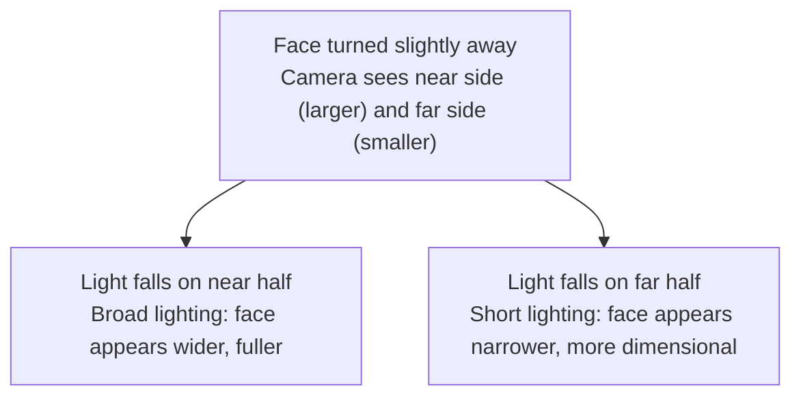

# Chapter 7 Portraiture

> A portrait is never merely about rendering a face sharply. What truly enters the frame is the relationship unfolding between you and the subject.

---

## Portraiture Begins with Relationship

A good portrait rarely emerges the moment the subject has just sat down and arranged their expression. On the contrary, the true photograph usually requires waiting a bit longer. In those first few minutes, people instinctively manage themselves: how their shoulders should fall, whether the corners of the mouth ought to curl up slightly, whether the eyes should stay fixed on the lens, and where to place their hands so they do not look awkward. What the subject summons at this stage is, in truth, an entire set of preconceptions about "how one ought to look when photographed." You can certainly capture sharp, poised, and respectable pictures during this phase, but that is often merely the persona someone consciously offers to the lens when aware of being photographed, not necessarily who they truly are.

What is truly worth waiting for is that fleeting moment when they briefly forget the camera exists. Such moments often arrive very quietly: perhaps they glance down at something in their hands, turn to exchange a word with someone nearby, idly adjust a sleeve, or let their gaze drift away from the lens toward the window, toward the tabletop. Whichever it may be, the common thread is that their attention has, in that instant, departed from the camera. In those one or two seconds, they stop striving to play the role of "the person being photographed"; the tension in their body and expression eases slightly, and their face reveals something much closer to their everyday self.

The most moving quality in portraiture often hides in moments like these. A photographer must, of course, understand lighting, focal lengths, and camera positioning—these are essential fundamentals, none of which can be dispensed with. Yet from another perspective, all technical skills are ultimately mere means to an end, and they must all serve the very same purpose: enabling the subject to exist in the frame as a real human being, rather than a manipulated, staged construct. Technique must yield to that spark of authenticity, never the reverse.

---

### When the Photograph Looks Back at You

*Lewis Hine, "Girl Spinner, Rhodes Manufacturing Co.", 1908. Hine's original records state that this child laborer at a North Carolina textile mill was eleven years old. She has paused beside the spinning machine; factory window light enters from the left of the frame, illuminating her hair, shoulders, and soiled apron. Turned in profile toward the lens, her gaze directed toward the window, she neither smiles nor poses. Hine documented child labor for the National Child Labor Committee over many years; these photographs, together with investigations, advocacy, and legislative efforts, reshaped public discourse. In 1916, the United States passed the Keating-Owen Child Labor Act, which was ruled unconstitutional by the Supreme Court two years later; federal child labor restrictions would not find a firmer foundation until the Fair Labor Standards Act of 1938. [Image Source and Reuse Notes](image-credits.md#hine-spinner)*

---

## Before Technique, Establish Trust

When discussing portraiture, it is best to begin with the relationship between you and the subject. While this relationship might seem unrelated to technical matters, it actually determines a great deal: as the relationship varies, so does the responsibility you bear for the photograph, drawing different boundaries between what you can and cannot control.

When the subject is fully aware that you are photographing them and actively cooperates, the photograph enters the domain of the staged portrait. Weddings, personal portrait sessions, commercial assignments, and family group photos all belong to this category. In this dynamic, you have the greatest degree of control: lighting, pose, expression, setting, and even wardrobe are almost entirely in your hands; at the same time, the subject usually harbors a clear expectation: they want to look appealing. Magazine covers, fashion spreads, and formal portraits all fall within this branch as well. It should be emphasized that staged portraiture is not inherently inferior; it simply represents a different division of labor, transferring greater responsibility from the subject onto the photographer.

If the subject remains in their own environment—the carpenter in the workshop, the doctor in the consultation room, the grandmother in her kitchen, the painter in the studio—the photograph gains an additional layer of relationship beyond pure staging. Here you still retain partial control, but you cannot strip away the surroundings, because the environment is already an integral part of the image, carrying almost as much weight as the person. Arnold Newman's 1946 portrait of Igor Stravinsky is a classic case in point. Widely regarded as the pioneer of "environmental portraiture," Newman advocated photographing individuals within the spaces where they live and work, letting the surrounding objects speak on their behalf. In that photograph, the composer sits in the lower-left corner of the frame, while the right half is dominated by an open grand piano; its propped-up black lid is flattened into a massive, hard-edged geometric shape that nearly upstages the sitter, commanding the frame like an oversized musical note. What that photograph truly cares about is never how flattering the person looks, but rather placing an individual and the world to which they belong inside the very same frame.

Then there is the kind of portrait that occurs when the subject is completely unaware of the camera, or aware but offering no deliberate cooperation. Street photography, candid family moments, and documentary work mostly belong here. In this relationship, you exert the least amount of control, which makes timing and distance paramount. During her decades working as a nanny in Chicago, Vivian Maier captured countless street portraits, many of whose subjects never realized they had stepped into the frame. When Saul Leiter looked out from his second-floor window onto East 10th Street, the pedestrians he photographed were merely passing through his composition by chance. Helen Levitt used a right-angle viewfinder to photograph children in New York's East Harlem, and the youngsters often assumed she was aiming her lens elsewhere. What connects these photographers is that none of them intruded upon their subjects; rather, they withdrew to an unnoticed vantage point, waiting for life itself to walk into the frame.

When first learning to photograph people, most beginners start with posed portraits for practical reasons: they are straightforward to arrange and reliably yield respectable results. Yet the longer you shoot, the more you realize that the moments not entirely within your control are far more challenging—and consequently far more valuable. In those moments, the element of performance is reduced to a minimum, and what ultimately remains in the frame comes far closer to a person's natural, unprompted self.

Placed side by side, these three relationships illuminate an unspoken truth running through this entire chapter: portraiture is never an equal transaction. The camera is in your hands, the authority to edit and select images is in your hands, and who will see the photographs or what captions will accompany them are entirely in your hands; what the other person surrenders is their own face. There is no inherent wrongdoing in this imbalance, but it demands that you consciously shoulder the responsibility that comes with it. A few baseline principles are worth establishing early: before shooting, ask whenever possible, even if it is merely an inquiring glance accompanied by a raised camera; after shooting, showing the images to the subject or sending them a copy is the bare minimum of courtesy; if the photographs are ever intended for commercial use, a signed model release is not bureaucratic red tape, but protection for both parties; and as for retouching, a clear line divides evening out skin tone from transforming someone into an entirely different person—cross that line, and what you deliver is no longer their portrait, but your rewriting of them. Photographic history is replete with controversial examples: when Richard Avedon created *In the American West*, placing miners, drifters, and slaughterhouse workers before a stark white seamless backdrop and rendering every crease and furrow in unflinching detail, critics questioned him for years after publication: when these subjects saw the finished prints, did they ever anticipate they would be presented this way? There is no formulaic answer to this question, but no one who photographs people can evade it: does the person before your lens recognize themselves in the picture; and upon recognizing themselves, are they willing to be portrayed in such a way?

---

## How Light Shapes a Face

Chapter 2 discussed direction, quality—hard versus soft—and contrast. Rather than rehashing a checklist of "good light" and "bad light," here we apply those principles to the human face. Start by observing three things: where the shadow of the nose falls, whether tonal gradation remains on the shadow side, and whether there is an appropriate catchlight in the eyes. Overhead light, underlighting, and direct, hard front light are by no means forbidden; they simply expose eye sockets and skin texture more unsparingly, or evoke a sense of estrangement. If that is precisely what the subject and theme demand, they can be deployed with deliberate intent.

Shift the key light by only a fraction, and the shadows cast by the nose and cheekbones will alter their shape. Photographers before us distilled the progression of moving the key light from dead center around to the profile into several classic lighting patterns; these are not rigid rules to be slavishly copied, but a set of shared coordinates to facilitate communication and reproduction.

| Lighting Pattern | Key Light Position | Characteristics |
|---|---|---|
| Butterfly (Paramount) | Directly in front, slightly above eye level | A small butterfly-shaped shadow beneath the nose; slims and flatters, commonly used in beauty portraits |
| Loop | Frontal, roughly 45° to the side, slightly elevated | A small loop of shadow beside the nose; natural, the most widely used |
| Rembrandt | Front-side roughly 45°, higher angle | A characteristic triangle of light on the shadow-side cheek; reminiscent of classical oil paintings |
| Split | 90° directly from the side | Half the face lit, half in shadow; bold, dramatic, and powerful |

Viewed side by side, these four lighting patterns simply mark four waypoints as the key light travels step by step from directly in front of the subject around to the side. The closer it stays to the front, the flatter the light, the smaller the facial shadows, and the softer and more flattering the subject appears. The further it migrates toward the side, the wider the shadows spread, rendering the facial contours increasingly rugged and forceful. Long before you press the shutter, merely deciding where to place the key light is already deciding whether this face will lean toward gentle sweetness or chiseled strength.

The four patterns above describe the path of the key light from directly in front around to the profile, governing what shape the shadows take on the face. Yet beyond the shape of the shadows lies another question of equal importance—one unrelated to shape and entirely about orientation: when the subject's face turns slightly away, does the light fall on the half of the face closer to the lens, or on the half farther away? Photographers before us coined terms for both scenarios: broad lighting and short lighting.

Broad lighting refers to illuminating the half of the face closer to the camera—that is, the side that occupies a larger visual area in the frame. It broadens the face, making it appear fuller and flatter; it is therefore well-suited for subjects with narrower, leaner faces, or when you wish to convey a sense of sturdiness and affluence. In contrast, short lighting illuminates the half of the face turned away from the camera, leaving the side facing the lens cast in shadow. It visually narrows the face, enhancing dimensional modeling; it is the most effective technique for slimming the face and carries a more understated, brooding emotional tone, making it far more common in portraiture.

| Pattern | Light Falls On | Visual Impression | Best Suited For |
|---|---|---|---|
| Broad lighting | Half of face closer to camera | Face appears broader, fuller, flatter | Leaner faces; conveying sturdiness |
| Short lighting | Half of face farther from camera | Face appears narrower, more sculpted, restrained | Most subjects; slimming the face or deepening mood |

Broad versus short lighting and the four patterns mentioned earlier are two dials that can be combined: the pattern determines the shape of the shadows, while broad or short determines whether the illuminated side is the one facing the camera or turned away. In an actual shoot, you will typically ask your subject to turn their face at an angle first, and then decide which side the light should come from; together, these two choices ultimately define both the perceived structure and the emotional resonance of the face.

Once the position of the key light is set, the next question to answer is just how dark the shadow side should be allowed to fall. This brings us to the lighting ratio. The lighting ratio refers to the measured difference in brightness between the lit side and the shadow side of the face; for every stop of difference between the two sides, the ratio doubles.

| Difference Between Lit and Shadow Sides | Lighting Ratio | Visual Impression |
|---|---|---|
| 0 stops (equal brightness) | 1:1 | Flat light, soft, akin to an ID photo |
| 1 stop | 2:1 | Subtly dimensional, gentle |
| 2 stops | 4:1 | Distinctly dimensional, dramatic |
| 3 stops | 8:1 | High contrast, deep shadows, emotionally charged |

It is essential to clarify that adjusting the lighting ratio is not about altering the overall brightness of the image, but about determining precisely how much darker the shadow side is relative to the lit side. You are never tweaking overall exposure level; you are modulating the tonal spread between light and shadow. Here we adhere to the standard established in Chapter 2, comparing the final brightness directly on both sides of the face (since the lit side naturally receives both key light and fill light simultaneously; older studio manuals used a different convention that compared only the independent output of the key and fill sources, ignoring the fill light spilling onto the lit side). The same fill light will yield numbers differing by half a stop depending on which convention is used; if the numbers do not seem to align, there is no need to panic—it is almost certainly a matter of differing definitions. The lighting ratio can be seen as the master dial determining whether a portrait leans sweet and gentle or bold and severe: the closer the ratio is to equal brightness, the smoother and softer the face appears; as the spread widens, dramatic tension and emotion surge in tandem.

While the lighting ratio regulates the spread between light and shadow, there is another element—far smaller, yet equally capable of transforming a face: the catchlight. The catchlight is that minute specular reflection cast upon the pupil or iris by the key light. In the final image it may be no larger than the tip of a pin, yet without it, the eyes appear dull and lifeless, and the entire face loses its vitality; conversely, as long as that single spark of light remains, the eyes come alive.

The position of the catchlight is a direct reflection of where the key light is placed, which is why photographers routinely reference the face of a clock to pinpoint it: imagine the eye as a clock face, and a catchlight resting at the 10 o'clock or 2 o'clock position—that is, obliquely from above—will usually appear the most natural and spirited. This circles back to our earlier point: when the key light is positioned diagonally in front and slightly above eye level, its reflection in the eye lands precisely at these coordinates. If the catchlight wanders down to the 6 o'clock position directly below, underlighting is almost certainly at work, lending the gaze an eerie, unsettling cast. And if no reflection can be found at all, it usually indicates that the light is placed too far to the side, hoisted too high, or that the subject has tilted their head down so steeply that the light is blocked from entering the eyes altogether.

To restore this vital spark to the eyes, the simplest approach is to have the subject lift their face slightly toward the light source, or place a reflector, a sheet of white paper, or even light-colored clothing just below and in front of them to throw a small highlight into the eyes. This principle reinforces what was discussed in Chapter 2: the larger and softer the light source, the wider and gentler the highlight reflected in the eye; the smaller and harder the source, the more it contracts into a sharp, pinprick glint. The shape of the catchlight quietly betrays whether you used a window, a softbox, or a bare bulb.

---

### Reading a Classical Portrait

*Nadar, Sarah Bernhardt, c. 1864. Nadar was one of the most prominent portrait photographers of the 19th century, with scores of Parisian writers, painters, and actors passing through his studio; he frequently made use of natural light entering through studio skylights. In this photograph, light falls diagonally from above, illuminating the forehead, the bridge of the nose, and one cheek, while the other side sinks naturally into shadow. The neck and cape dissolve into darkness, leaving only the face and a sweep of shoulder and neck sculpted by the light. More than a century later, this portrait lighting—forged through the confluence of direction, lighting ratio, and background control—remains as compelling as ever. [Image credits and reuse notice](image-credits.md#nadar-bernhardt)*

---

### Window Light: Distance and Direction

Window light has been brought up repeatedly throughout this chapter as the simplest and least expensive light source for portraiture. Here, it is worth breaking the process down in detail, walking through the entire sequence from positioning to the finished photograph—taking the principles of window light introduced in Chapter 2 and putting them to work on an actual human face.

The first step is choosing the window, which also means choosing the sky. Prioritize windows that currently receive no direct sunlight and offer relatively stable skylight; the classic advice to use "north-facing windows" is merely a rule of thumb in parts of the Northern Hemisphere, not a universal law. When direct sunlight is too harsh, draw a sheer curtain or use professional diffusion materials that are heat-resistant, flame-retardant, and kept at a safe distance from lighting fixtures. Ordinary paper and household fabrics can catch fire near hot fixtures, so never carelessly clip them directly onto a lamp head.

The second step is setting the distance and angle between the subject and the window. Have the subject stand at an angle to the window with their face turned toward the light, so that one side receives illumination while the other falls into shadow. When a person is close to the window, the window subtends a larger angle from their perspective, rendering the light softer and brighter; at the same time, the relative change in distance from the near side of the face to the far side—and onward to the background—is more pronounced, meaning the falloff in brightness may be steeper. Stepping deeper into the room generally weakens the light and concentrates its direction, though it does not automatically make the light "flatter." What truly determines facial contrast also includes the orientation of the sky outside, wall reflections within the room, and any fill light. Rather than rushing to memorize formulas, have your subject step forward or back by half a meter and observe directly how the nose shadow, the shadowed cheek, and the background shift in unison.

The third step is deciding whether or not to fill the shadow side. Window light is inherently unilateral, often allowing shadows to drop off deeply. If you want a clean, gentle look, set up a reflector on the shadow side—a white reflector board, a large sheet of white paper, or even a pale wall will do—to bounce a touch of window light back in, lifting the shadows and narrowing the lighting ratio. If what you seek instead is the moody tension of half the face receding into shadow, leave it entirely unfilled, or even place a black cloth or dark garment on the shadow side to deepen the dark tones further. Ultimately, this step is where you manually adjust the lighting ratio discussed earlier right there on set.

Only in the fourth step do you come to pressing the shutter. If you want short lighting, position the camera on the shadow side so the more brightly lit far side of the face angles toward the window; position yourself on the lit side, and you get broad lighting. Both approaches are entirely valid; the key is understanding how camera position dictates which side of the face dominates the frame. Have the subject direct their gaze slightly toward the window, check for catchlights in the eyes, and then choose an aperture based on shooting distance, sensor format, and the required zone of sharpness; two subjects, close working distances, or a three-quarter profile often demand a deeper depth of field than a straight-on portrait of a single individual. Nor must focusing mechanically lock onto the "near eye" every single time: judged against the final viewing size, ensure first that the eye carrying the emotional weight and narrative focus is tack-sharp.

Taking one step beyond window light brings you to your very first artificial light. There is no need to leap directly into a fully outfitted studio; the most minimalist artificial lighting kit consists of just three items: an off-camera flash, a shoot-through or reflective umbrella (or a small softbox), and a reflector. The umbrella enlarges the emitting surface area, the light stand establishes direction and distance, and the reflector controls the shadow side as before. When setting exposure, keep in mind that the two sources are "relatively independent" rather than "completely decoupled": within the flash sync speed limit, dragging the shutter primarily increases the contribution of ambient light while having negligible effect on the instantaneous flash pulse; aperture and ISO, by contrast, affect both ambient and flash exposure simultaneously, while flash power, distance, and modifiers independently reshape the light falling on the subject. When starting out, working in manual flash mode by firing test shots at low power and evaluating stop by stop is far more dependable than memorizing an arbitrary 1/8 power setting, because the effective illumination across different fixtures, working distances, and diffusion modifiers varies dramatically.

---

## Depth of Field Must Serve the Relationship

What depth of field determines is the degree of separation between subject and background. An aperture of f/1.4 to f/2 yields an extremely shallow depth of field, ideal for close-up single portraits where you want to dissolve the background into soft blur; however, its margin for error is razor-thin, and the slightest miscalculation will ruin the shot. The range from f/2.8 to f/4 is far more dependable; used for half-length portraits, the background remains softly blurred while the face is much easier to keep entirely sharp. As for f/5.6 to f/8, it is far better suited to environmental portraits, for a straightforward reason: if the surrounding environment is meant to be seen, you cannot afford to compress your depth of field too tightly.

Beginners often fall into the habit of shooting every portrait wide open at f/1.4. Doing so certainly makes it easy to produce a creamy, melted background, but the trade-off is equally obvious: the tip of the nose may soften into blur, only a single eye is often in focus, and the frame is ultimately reduced to nothing but an isolated face stripped of all surrounding context. Rather than memorizing rigid formulas like "pair an 85mm with f/2," it is better to first decide which features on the face must remain sharp, and then verify your focus using depth-of-field preview or test shots; you can also consult the [Depth of Field Calculator](tools.md#dof-calculator) beforehand to gauge the order of magnitude. Focal length, sensor format, shooting distance, output size, and viewing distance will all reshape the depth of field perceived in the final image.

Focal length must likewise be chosen according to the relationship you wish to establish. A 24mm to 28mm lens is suited for environmental portraits with an intense sense of place—the distance is close and the surroundings are richly articulated, provided the face is not placed too close to the glass. A 35mm lens excels at placing a person naturally within their setting, evoking a feeling akin to looking at someone across a dining table. A 50mm lens is ideal for half-length portraits and quiet, conversational frames. Moving further up, 85mm and 135mm lenses function more like a gaze: they compress the background, peeling the subject away from their surroundings and presenting them directly before your eyes. It is worth reiterating that wide-angle lenses should never be placed flush against a subject's face—unless an exaggerated, distorted nose is precisely the effect you are after.

If we convert these focal lengths to full-frame equivalents and synthesize them, we arrive at a set of practical brackets that are easier to remember and apply during live shooting. The equivalent range of 85mm to 135mm is the most widely used in portraiture: its perspective is naturally flattering, neither pushing facial features forward in distortion nor flattening them excessively, while compressing and tightening the background so the subject stands out distinctly from their surroundings. An equivalent 50mm is better suited for portraits that retain a touch of context; its slightly wider field of view preserves more of the physical space the person occupies. As for equivalent 35mm and wider lenses, their strength undeniably lies in incorporating the entire environment, yet the moment you move in close to frame a face, problems inevitably arise: the closer features fall toward the edges of the frame, the more easily noses and foreheads are magnified by perspective and stretched into distortion. If you truly intend to use such wide angles for half-length shots or close-up portraits, this requires vigilant caution.

Regarding focal length, there is an even more fundamental principle that deserves dedicated clarification, because it is so frequently misunderstood. Many believe that a telephoto lens "compresses" the face while a wide-angle lens "enlarges" the nose, as though perspective were conjured out of thin air by the optical elements. In truth, this is not what happens. What actually dictates facial perspective is never the focal length—it is simply how far you stand from the face.

Perspective, in the final analysis, is nothing more than the relative size relationship between near objects and distant objects within the frame. When you press in thirty or forty centimeters from a face, the distance from the nose to the camera is substantially shorter than the distance from the ears to the camera; this steep proportional disparity stretches the spatial relationship, rendering the nose large and protruding, pushing the cheeks outward to the sides, and making the entire face look distorted. When you step back two to three meters away, the distances from the nose and ears to the camera become nearly identical; this ratio evens out, the relative proportions of the facial features return to normal, and the face appears natural and pleasing. Distance alone governs perspective—whether a nose is enlarged or a face is flattened, the root cause lies entirely in where your feet are planted.

What, then, is the role of focal length? Focal length controls the tightness of your framing. Once you have stepped back to establish a pleasing facial perspective, sticking with a wide-angle lens would leave the face tiny in the frame; switching to a longer lens allows you to crop into the desired composition from that exact vantage point. Equivalent 85mm to 135mm lenses are thus frequently chosen for headshots and half-length portraits, but this is a practical convention rather than an immutable law of physics: physical constraints of the room, conversational distance, narrative intent, and environmental context may all make 35mm, 50mm, or longer focal lengths a far superior choice.

The table below outlines the correspondence between focal length, required shooting distance, and the resulting facial perspective when framing a head-and-shoulders portrait where the face occupies roughly the same proportion of the frame.

| Focal Length (Equivalent) | Approximate Distance for Head-and-Shoulders | Perceived Facial Perspective |
|---|---|---|
| 24mm | Approx. 0.7 m | Noticeably enlarged nose, cheeks pushed outward, edge distortion |
| 35mm | Approx. 1 m | Mild perspective exaggeration, strong sense of environment |
| 50mm | Approx. 1.5 m | Close conversational distance, environment retains substantial weight |
| 85mm | Approx. 2.5 m | Pleasing facial proportions, background begins to tighten |
| 135mm | Approx. 4 m | Smooth and flattering perspective, most natural facial geometry, pronounced background compression |

Reading this table in reverse is equally instructive: you can first decide how far away you want to stand and how natural you want that face to appear, and only then reach for the lens that will frame it tightly enough from that exact spot. Framed this way, lens selection quietly transforms from "what focal length should I use?" into "from what distance do I want to look at this person?"

The same holds true for camera height and angle: avoid extremes. An eye-level perspective is the steadiest and most honest; it neither flatters unfairly nor exaggerates. Placing the camera slightly above eye level makes the face appear somewhat smaller and lends the gaze a gentler quality; lowering it slightly lends the subject a greater sense of authority and strength. The underlying mechanics are still rooted in perspective: raise the camera, and the forehead and eyes sit closer to the lens, appearing larger while the chin recedes and narrows, tapering the jawline and accentuating the eyes; lower the camera, and the exact opposite occurs—the jaw and torso gain prominence, giving the figure stature and presence. Taken to excess, however, trouble begins: looking down too steeply results in an oversized head and a shrunken body, while looking up too sharply thrusts the underside of the chin aggressively into the foreground. A practical rule of thumb is worth committing to memory: for headshots, align the lens roughly with the subject's eyes; for half-length portraits, align it with the chest; for full-length figures, align it with the waist. In a full-body portrait, raising the camera too high creates a downward perspective that compresses and shortens the legs—many portraits that make legs appear stubby are simply guilty of an elevated camera position. The subtlety of portrait angles almost always hinges on these slight shifts in height.

---

## Separating the Subject from the Background

Separating the subject from the background is a constant challenge in portrait photography. It is not something a wide aperture alone can resolve. In practice, you have three independent dials at your disposal; working them in concert produces a far cleaner separation than simply opening the lens all the way.

The first dial is aperture—the most direct of the three, and one discussed earlier: the larger the aperture, the shallower the depth of field, and the more thoroughly the background melts away. Yet it is also the easiest to overuse. Opening it up indiscriminately comes at a price: a depth of field so paper-thin that you can scarcely keep both the eyelashes and the tip of the nose in focus.

The second dial is distance—or rather, two separate distances: how close you are to the subject, and how far the subject is from the background. Take an 85mm lens shot at f/2: if the subject stands flat against a wall, the background remains distinct; but have them step forward two or three meters, putting distance between themselves and the wall, and the background dissolves immediately. The principle is identical to that of depth of field: the further the background lies from the plane of focus, the blurrier it appears in the frame. When you struggle to separate subject from background on location, do not rush to widen your aperture; your initial instinct should be to pull the person away from what lies behind them.

The third dial is the tone and color of the background itself. Whether a face commands attention depends on the contrast between it and its surroundings: a light face against a dark backdrop, or dark hair set against a bright window, naturally lifts the person out of the frame. Conversely, light-colored clothing against a pale wall, or a cluttered background whose hues clash with skin tones, will leave the subject lost in the frame no matter how aggressive the blur. When choosing a background, look beyond whether it can be thrown out of focus; ask whether its brightness and color support the face or compete with it. Subject separation is only half about the lens; the other half lies in the discerning eye that selects the vantage point and frames the backdrop.

In group portraits where people are staggered in depth, a shallow depth of field becomes a liability—sharpening one face at the expense of another. Stopping down the aperture is the standard remedy, but you can also arrange the subjects along the same focal plane, or step back to reduce magnification. Because people breathe, blink, and make subtle shifts, focus stacking easily introduces misalignments along the edges of faces and bodies, and should not be relied upon as a routine solution for everyday group shots. Nor should the point of focus fall mechanically on the "middle row"; it must be placed according to the actual distance between the nearest and farthest faces and the distribution of depth of field, ensuring that both extremes fall within acceptable sharpness.

Here is a reliable rule of thumb for working on location—a starting point you can fine-tune upon reviewing your shots:

| Number of Subjects & Arrangement | Starting Aperture | Notes |
|---|---|---|
| Two or three people, essentially in a single row | f/2.8 - f/4 | Have them form a gentle arc so their faces remain roughly equidistant from the lens |
| Four or five people in a single row | f/4 - f/5.6 | Curve the line slightly forward; keep the people on the flanks from drifting backward |
| Group portraits in two or three rows | f/5.6 - f/8 | Measure the distance to the nearest and farthest faces; place focus within this actual depth rather than fixing blindly on the middle row |
| Large groups in multiple rows | f/8 - f/11 | Utilize steps or tiers to introduce elevation and compress the physical depth between rows |

Keep in mind that stopping down reduces the light reaching the sensor, so group shots often require raising the ISO or adding supplementary light to recover the lost exposure. Another frequently overlooked technique is to arrange people in a shallow arc that gently wraps around the camera, rather than in a dead-straight line: imagine everyone positioned along an arc centered on the lens, with those at the ends stepping half a pace forward. This brings each face to a more uniform distance from the camera, effectively lifting the burden from your depth of field.

There is a source of failure in group photography even more fatal than missed depth of field: blinking and lapsed expressions. As the group grows, the probability of everyone keeping their eyes open and focused on the lens in a single frame plummets; with seven or eight people, betting everything on one click is pure gambling. The countermeasures are simple yet effective: plan your countdown carefully, calling "one, two, three" and releasing the shutter between "two" and "three," because most people tense up on "three" and blink at that exact moment; fire off three to five frames in burst rather than taking a single shot, so if someone does close their eyes, you have adjacent frames from which to composite; and zoom in on the playback immediately to check every face before letting the group disperse—the inconvenience of asking everyone to hold their positions for another moment is negligible compared to finding you have no usable photo afterward. The measure of a group portrait has never been how cleanly the background melts away, but that every face is sharp and clear.

---

## Expression Comes from a Sense of Ease

The most demanding aspect of portraiture rarely lies in visible, calculable parameters like aperture and focal length, but in things that cannot be mechanically dialed in: expression and movement.

Issuing direct commands to a subject is almost always counterproductive. Telling someone to "smile" usually produces nothing more than a wooden grin; "look at the camera" instantly induces tension; and "act natural" is the most unnatural prompt of all, because no one truly knows how to manufacture naturalness on command.

A far better approach is to shoot while conversing, so the subject is not perpetually conscious of every shutter release. At the same time, offering concrete actions is vastly more effective than making abstract demands. Instead of saying "relax," say "look over toward that window," "tuck your hair behind your ear," "hold this cup," or "lean lightly against the wall." The distinction is crucial: abstract requests force the subject to translate words into behavior, whereas physical actions can be carried out immediately. As they perform these ordinary gestures, their body naturally falls into an ease that deliberate posing can never achieve.

It often helps to tell the subject: "You don't need to keep looking at the camera; I'll find what I'm looking for." This single sentence lifts much of the burden from their shoulders. You can then begin by photographing their hands, their back, or the surrounding space, letting the click of the shutter recede into white noise. Whether to show playback on the monitor depends on the person: will it reassure them, or will it trigger self-conscious scrutiny? Some relax within minutes, others take much longer, and some are comfortable from the start; the photographer's task is to read the individual before them, rather than march through a predetermined timetable.

A portrait session almost always requires an acclimation period, yet there is no universal tempo—no rigid five-, fifteen-, or thirty-minute rule. Passport photos, candid snapshots of acquaintances, celebrity sittings, and extended editorial collaborations each operate within an entirely different relational dynamic. A more useful discipline is this: leave ample room at the outset, and do not wrap up the moment you have captured a technically acceptable frame; wait until the subject's shoulders, gestures, cadence of speech, and gaze begin to soften before deciding whether you have arrived at the state where true portraiture can happen.

One further point deserves thorough exploration: the difference between a forced smile and a spontaneous one is often revealed by the engagement around the eyes. In psychology, an expression where the zygomaticus major muscle raises the corners of the mouth while the orbicularis oculi concurrently contracts is known as a "Duchenne smile." It serves as a helpful cue for reading expression, but it is no foolproof lie detector: some individuals can consciously recruit the periocular muscles, and fatigue, age, and individual anatomy can alter how it manifests. What truly matters for photography is to stop treating upturned corners of the mouth as the sole objective. Rather than repeatedly urging the subject to "give a smile," wait—through dialogue or purposeful movement—for a reaction that genuinely belongs to them, and then judge whether that moment is worth releasing the shutter.

---

### Using Action in Place of Rigid Posing

All guidance ultimately manifests in the body. A few practical principles are worth laying out in detail.

First, avoid having the body squarely face the camera. Standing flat and front-on renders the figure at its widest and appears exceptionally stiff. Ask the subject to angle their torso roughly thirty degrees away, shifting their weight onto the back foot so the shoulders form an angle relative to the lens. This immediately adds dimension to the figure and lends the entire posture an air of ease.

Second, keep the joints from locking. Elbows, wrists, and knees should all retain a slight, natural bend. Rigidly straightened limbs inevitably look stiff, whereas gentle flexion much more closely mirrors the body in its everyday state of rest.

Third, pay close attention to the neck and chin. When tense, many people reflexively pull their neck back and tuck their chin in, leaving them looking listless and often accentuating a double chin. The remedy is to have them push the forehead slightly forward while gently lowering the chin. Though the gesture sounds awkward, it produces a markedly cleaner jawline. Do not demand perfection all at once; nudging the subject incrementally throughout the shoot yields far more natural results than imposing a dramatic pose from the start.

Fourth, hands are notoriously awkward when left idle. The solution is to give them a task: holding a cup, resting against the back of a chair, turning a page, tucking hair behind an ear, slipping into a pocket, or lightly touching the chin. The moment the hands have a purpose, the rest of the body loosens up with them.

---

## Environmental Portraits Must Preserve Context

The key to environmental portraiture lies not merely in the face, but in the relationship between the subject and their surroundings. Why this person is here, and what ties bind them to this space—such information should itself enter the frame, becoming part of what the photograph is meant to convey.

When photographing a carpenter, let the workshop, the tools, and the floor strewn with wood shavings appear together in the frame; when photographing a painter, bring in the unfinished canvases, the pigments, the drop cloths spread across the floor, and the weathered traces accumulated on the walls over the years; when photographing grandmother, keep the kitchen, the stovetop, and the chair she customarily sits in within the composition. In such photographs, the environment is never a mere backdrop; it speaks on behalf of the subject, articulating how this person actually lives, works, and inhabits the space around them.

For this very reason, every environmental element in the frame ideally bears some connection to the subject. You might pay attention to several details: whether the color of the clothing echoes the color of the wall; whether the subject's hands are actively engaged in something; whether the chair they sit in is the one they normally use; and whether there are objects nearby that speak to their identity and habits. Beyond this, the proportion of the frame occupied by the figure quietly alters the meaning of the image. When the person occupies only a third of the frame, the environment speaks far more; when the person fills two-thirds, the environment recedes to the side, serving merely as supplementary detail.

In terms of focal length, environmental portraits typically start between 28mm and 35mm. A 50mm lens can feel somewhat tight, while an 85mm easily compresses the surroundings, reducing them to a mere backdrop. Nor should you rush to open up the aperture: f/4 to f/5.6 are far more common landing points, for if the environment is meant to be legible, it cannot be blurred into indistinct patches of color. The actual staging order is best inverted from that of a standard solo portrait: rather than worrying first about where the person stands, begin by finding the one or two objects in the space that absolutely must be in the frame (the carpenter's hand plane burnished with a deep patina, the painter's stack of canvases leaning against the wall), determine their spatial relationship to the camera, and only then place the subject into this preconceived frame, asking them to perform an action they would naturally do. Setting the environment first and the person second yields a portrait of someone truly within their world; conversely, framing the person first and dragging in the surroundings as an afterthought almost always reduces the environment to cluttered background noise. Since your goal is to tell the story of the relationship between a person and a space, do not be in a rush to obliterate the environment with a telephoto lens.

---

## Candids, Family, and Children

Candid portraiture can be divided roughly into several distinct scenarios, each with its own particular demands.

Street candids involve photographing strangers—a topic Chapter 8 will explore in detail—so here we emphasize only the most fundamental baseline: respect the other person. Do not hide at a distance with a telephoto lens to steal shots, and do not deliberately press the shutter on moments that carry an air of humiliation. If you happen to be noticed, offer a smile, give a nod, and if necessary, show them the playback on your screen. If they ask you to delete the image, delete it. Keep in mind, too, that the legal boundaries of photographing strangers vary tremendously across countries and regions: in some places, shooting in public spaces is essentially unrestricted, while in others, personality rights are codified directly into law, making publication far more sensitive than the act of shooting itself. This courteous ritual of "a smile and a nod" will not carry you everywhere in the world; familiarize yourself with local rules before stepping out, as Chapter 8 will discuss at length.

Family candids yield authentic moments most effortlessly, for a simple reason: you are already present. Gear need not be complicated: a 35mm or 50mm lens, Aperture Priority (A) mode paired with a minimum shutter speed, or Manual (M) mode paired with Auto ISO, is more than sufficient; when subjects are moving, continuous autofocus (AF-C) combined with eye detection is generally far less troublesome than single-point AF centered in the frame. Apertures can start at f/2.8 and be stopped down or opened up depending on the number of people and shooting distance. The key here lies not in templates, but in mindset: you are not "staging a photo shoot," but simply dwelling among family and friends, poised at any moment to preserve that fleeting instant.

Candid coverage of weddings and events, on the other hand, is assignment-driven. You must capture every crucial moment while maintaining consistent quality across every frame. To this end, a dual-body setup, 24–70mm and 70–200mm zoom lenses, continuous autofocus, burst shooting, and Auto ISO are practical realities—virtually standard kit. Yet far more important than gear is anticipating your position. You should not be the person chasing after events as they unfold; rather, you should already be standing where the next moment is about to happen, waiting for it to arrive.

Children deserve separate discussion. The standard adult formula—"look here, say cheese"—is almost entirely useless with them. The right approach is to crouch down first, lowering the camera to their eye level. If you stand and shoot downward, the frame will forever contain only a small, bowed head flanked by a vast expanse of empty floor; only when you drop down does the world genuinely reopen from their vantage point. At the same time, keep your shutter speed up—1/500 second or faster is far safer—and if the light is insufficient, push the ISO without hesitation. The logic is simple: children rarely sit still for even a second, and a sharp photo with high-ISO noise is infinitely more usable than a clean image blurred by motion.

When photographing children, you need not limit yourself to telling them to stand still and look at the camera, nor should you turn "never direct" into another dogmatic rule. You can offer a ball, a bucket of water, or a specific task, allowing action to unfold naturally; you can also provide brief, easily understood guidance when safety or time constraints dictate. The crux is not to demand that children continuously perform an adult's idea of "cuteness," and before shooting or publishing, ensure guardians understand the intended use while honoring the child's immediate reluctance.

---

## Self-Portraiture as Serious Practice

Self-portraiture belongs not solely to social media; it can equally serve as a serious practice.

Vivian Maier left behind a substantial body of self-portraits spanning many years: reflections in Chicago storefront windows, apartment mirrors, and roadside rearview mirrors were all enlisted to hold her own figure. Extant archives offer no reliable cataloging statistics to substantiate claims of "thousands of self-portraits," so there is no need to supply a neat yet unverifiable figure; what matters is that she repeatedly employed reflections, shadows, and the viewfinder to examine how she herself entered the frame. This continuous thread can be seen in the [self-portraits made public by the archive](references.md#photography-history). Cindy Sherman, beginning in 1977, created *Untitled Film Stills*, producing nearly seventy photographs over the course of the series, every one of them depicting herself: donning wigs, changing into period costumes from various eras, and placing herself within different scenes to embody female archetypes from 1950s and 60s B-movies—frightened, daydreaming, or contemplative housewives, city women, and washed-up starlets. Tellingly, while every figure in these frames appears uncannily familiar, none corresponds to any real film: these "stills" stem from movies that never existed. These were not self-portraits in the conventional sense, but a project in which she used herself as a model to investigate how cinema constructs "women who are photographed."

The reason self-portraiture is worth practicing is that every variable is now entirely in your own hands. You can use yourself as a model to observe repeatedly how a single beam of light transforms a face, shifts a posture, and alters the center of gravity across the entire frame. At the same time, the complete workflow of tripod, self-timer, and composition preview forces you to re-examine yourself from outside the frame, rather than relying on the habitual impressions formed in front of a mirror.

If you persist in this practice for a month, your judgment regarding portrait lighting will likely improve substantially. The reason is simple: you have experienced firsthand exactly how that light feels when it falls on your own face—a sensation that is difficult to replicate merely by observing others through a lens. There is an even deeper gain: for the first time, you will truly taste what it feels like to have a lens pointed at you—the glare of the lights in your eyes, not knowing where to put your hands, your body tensing up despite knowing full well no one else is watching. Remember this awkward discomfort; the next time you step behind the camera, you will possess genuine empathy for the stiff figure before you, and every word of direction you offer will resonate far more closely with their feelings. As stated at the beginning of this chapter, portraiture captures the relationship between you and the person photographed; the beauty of the self-portrait is that it allows you to stand in both positions of that relationship yourself.

---

## Focus Priorities and Exceptions

In traditional portraiture centered on the face and the gaze, the eyes are almost invariably where sharpness matters most. This is a strong default, though hardly an ironclad rule: if blur itself carries the emotional weight, or if focus is deliberately placed on the hands, clothing, or environment, the eyes can certainly be left soft. When using single-point AF, place the focus point squarely on the eye; on modern camera bodies, prioritize eye-detection AF. Especially at wide apertures where depth of field is razor-thin, continuous autofocus tracking is far more reliable than the old habit of locking focus and recomposing aggressively—a shift of just a few centimeters by either camera or subject is enough to let the focal plane slip away.

When the face turns slightly away and the two eyes no longer share the same focal plane, favor the eye closer to the lens, as that is where the viewer's gaze almost always lands first; many cameras also allow you to designate the left or right eye. If shooting at f/1.4 renders the eyelashes sharp while the iris has already softened, the remedy is not to hold your breath and gamble on luck, but to stop down by a stop, raise your shutter speed, engage continuous eye AF, or have the subject turn slightly back so both eyes sit closer to the same focal plane. Burst shooting can improve your hit rate, but it is no substitute for sound judgment regarding depth of field.

Beyond the eyes, portraiture carries another technical consideration that is frequently neglected: the exposure of skin tones. Do not mechanically map a given skin tone to a fixed gray value, nor substitute crude formulas like "add exposure for light tones, subtract for dark" for genuine visual judgment; doing so easily confuses metering habits with how bright a person actually ought to appear. A more dependable approach is to first determine the face's tonal relationship within the frame, then consult the RGB histogram and highlight warnings: specular highlights on the forehead and cheekbones can be bright, but essential skin texture and individual color channels must not be clipped inadvertently; the shadows, meanwhile, must retain an adequate signal-to-noise ratio—never severely underexpose the entire face simply out of anxiety over highlights. If a gray card or handheld incident meter is available on set, use it to establish a consistent baseline, and then adjust based on creative intent rather than conforming to rigid skin-tone labels.

Black and white is widely used in portraiture, yet it must not be treated as an all-purpose fig leaf. The benchmark was already established at the end of Chapter 4: once color is stripped away, can the image still stand on the strength of its luminance structure alone? In portraiture, a face defined by light, shadow, and form often emerges even stronger in monochrome: under hard light, high contrast, wrinkles, and texture, the absence of color allows those contours and planes to take center stage; an image propped up merely by chromatic relationships, by contrast, will collapse upon conversion. Thus, when color actively detracts from the image—be it a cluttered background, unnatural skin tones, or discordant wardrobe colors—black and white can pull the viewer's attention back to structure and expression. That being said, do not convert every portrait to black and white indiscriminately simply to give a body of work a veneer of consistency. Only when color fails to contribute, or when monochrome more effectively emphasizes form and emotion, does the conversion truly earn its keep.

---

## Exercises

Find a friend or family member and take thirty photographs beside a window in the afternoon light. Change their orientation every ten frames: profile to the window, facing the window, and three-quarters. Back home, select five images and write down why you chose to keep them.

Photograph someone with a defined profession or hobby in their own environment. Use a 35mm lens. Require yourself to capture, within a single frame, the subject, objects that identify who they are, and a detail that speaks to their daily life or craft.

Schedule a one-hour portrait session with a friend. For the first five minutes, do not photograph their face—shoot only their hands, back, surroundings, and movements. Wait until fifteen minutes have passed before photographing their face. Keep note of the verbal prompts you use: which ones worked, and which ones made your subject stiffer.

Using a tripod and the self-timer, take ten self-portraits across ten distinct lighting setups or camera angles. Do not publish them; keep them solely for yourself. Identify your favorite and least favorite frames, and analyze the reasons why.

Using a single lamp or window as your key light, move it gradually from directly in front of your subject around to full profile, capturing four classic setups in sequence: butterfly lighting, loop lighting, Rembrandt lighting, and split lighting. All four images must depict the same person and the same face. Place them side by side on your return to observe how the evolving shape of the shadows shifts the face from soft and delicate to structured and severe.

Photograph a headshot of the same person from different distances with different focal lengths: first, move in closer than half a meter with a wide-angle lens, then step back two to three meters with an 85mm lens, framing the head at roughly the same size in both shots. Compare the rendering of the nose and facial contours afterward, verifying firsthand the adage: perspective is determined by distance, not focal length.

---

Next Chapter: [Chapter 8 Street](08-street.md)
