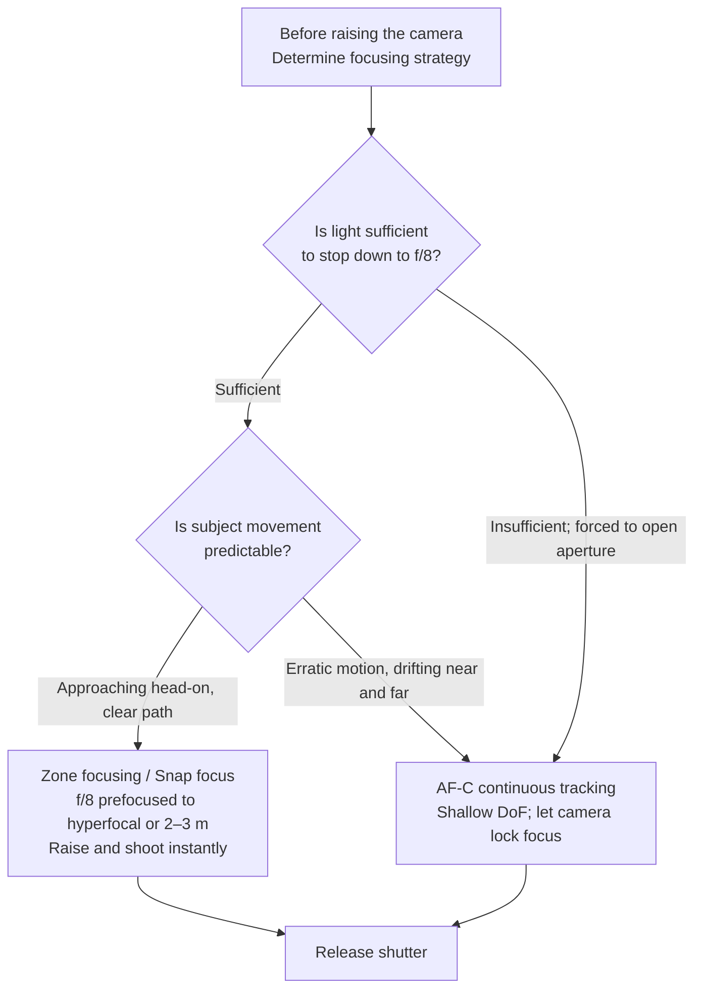
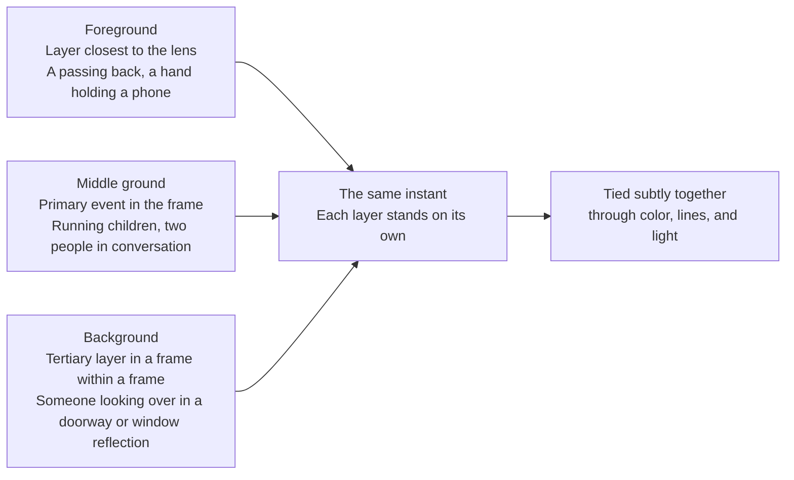

# Chapter 8 The Street

> The hit rate in street photography is exceptionally low. What it trains is not releasing the shutter on the street, but seeing the unfolding moment within public space.

---

## The Street Is More Than Pictures Taken on the Street

*Eugène Atget photographed in Paris for over thirty years. Rather than presenting himself as a salon artist, he sold his photographs as urban documents for painters, designers, and institutions. He often set out in the early morning, carrying a large wooden view camera and glass plates, photographing storefronts, display windows, street corners, and courtyards before the streets had fully come to life. In his later years, he caught the attention of a few modernists such as Man Ray and Berenice Abbott; after his death in 1927, Abbott, assisted by the art dealer Julien Levy, preserved, organized, and promoted his surviving archive. Much of what is now recognized as street photography began with precisely this kind of quiet, sustained, and patient seeing, free from any rush to publish. [Image Source and Reuse Notes](image-credits.md#atget-paris)*

---

## First, Determine What You Are Photographing

Many people understand street photography simply as taking pictures on the street, but that definition is far too broad; yet locking it down to "strangers, public space, and strictly unposed" would exclude Atget's empty streets, traces of human presence, and many works that hover between street and urban photography. This chapter adopts a practical working definition suited for practice: observing everyday life in public spaces beyond the photographer's complete control, allowing people, traces, light, or geometric relationships to coalesce at a specific moment. This is not an attempt to demarcate rigid boundaries for the entire history of photography, but simply to clarify what we will primarily be training.

Its core is not a location tag, but the relationships present on the scene. Tourist snapshots, portraits of friends on the street, and pure architectural documentation are not the main thread of this chapter; yet an empty street scene may well continue to speak of public life through display windows, discarded objects, light, and time. When people are present, a gesture, a posture, or a fleeting dynamic between individuals will never wait for you; when people are absent, you must still justify why this space deserves to be seen, rather than automatically counting it as street photography simply because "the street is empty."

---

### Several Traditions in Street Photography

Throughout the history of street photography, several distinctly different paths have branched out. Understanding them is not a matter of memorizing photographers' names, but of clarifying before you begin: which way of seeing do you actually want to learn? Different paths lead to different photographs and demand different temperaments and nerve; by recognizing their dividing lines first, you avoid forcing contradictory pursuits into a single frame.

The earliest and most familiar tradition is defined by black-and-white, a 50mm lens, quiet composition, and the so-called decisive moment. The photograph Henri Cartier-Bresson made behind the Gare Saint-Lazare in Paris—a man leaping over a puddle—became the most frequently cited exemplar of this tradition: everything aligns at the single, precise second, where a fraction more or less would cause the composition to collapse. Vivian Maier walked this same quiet path; working as a nanny in Chicago, she shot over a hundred thousand negatives across several decades while remaining completely unknown, until those negatives were purchased at a storage locker auction in 2007 and subsequently rediscovered. Saul Leiter was already photographing in color around East 10th Street in New York by that time, yet even then, his street work often unfolded within just half a block of his apartment building. In summary, this lineage prioritizes composition and timing, maintains emotional restraint, and believes that the finest moments are waited for, never forced.

From the 1950s onward, William Klein shattered this order entirely. New York through his lens was intimate, raw, and clamorous—the images blurred, the grain heavy, the distance so close you could see into the subject's nostrils. That book, titled *Life Is Good & Good for You in New York* (1956), departed so radically from what was then accepted as a "good photograph" that no American publisher would touch it at first; it was ultimately printed in Paris, won France's Prix Nadar photobook award the following year, and today stands as an inescapable landmark in postwar photographic history. In Japan, Daido Moriyama picked up this raw, gritty thread, transforming "grainy, blurry, and out-of-focus" from technical defects into a deliberate choice. He photographed Shinjuku, stray dogs, nighttime streets, and billboards; his images often convey an oppressive sensation of the city pressed directly against your face, leaving you scarcely room to breathe. Bruce Gilden went even further, firing a flash directly into the faces of strangers at point-blank range, turning the fleeting, unvarnished astonishment of his subjects into his signature. In stark contrast to the first lineage, this approach rejects prettiness entirely; what it seeks is precisely collision, friction, and discomfort.

Later still, color street photography gradually entered the broader mainstream discourse. William Eggleston's 1976 MoMA solo exhibition, discussed in Chapter 4, is often regarded as a pivotal watershed; yet it was a group of photographers working independently—Joel Meyerowitz, Stephen Shore, and Helen Levitt—who truly brought color into the vocabulary of the street: Meyerowitz was already loading color film to walk the streets of New York in the 1960s, deliberately swimming against the prevailing black-and-white orthodoxy. Martin Parr turned a glaring flash on British seaside holidaymakers, filling his frames with hot dogs, swimsuits, cheap consumer culture, and an unsettling awkwardness; rather than evading vulgarity, he aimed his lens squarely at it. His series *The Last Resort* (1983–1985) was made at New Brighton, a run-down seaside resort near Liverpool, where daylight flash combined with color saturated almost to distortion thrust the overcrowding, litter, and working-class holidays directly into view, stirring no small controversy at the time for its portrayal of ordinary vacationers. Alex Webb charted another course entirely, constructing complex, multilayered color frames in Mexico, Haiti, and Istanbul, where multiple occurrences unfold simultaneously within a single image: a figure on the phone in the foreground, children chasing a ball in the midground, and someone looking out from a distant doorway. Each plane functions independently, yet all are quietly tethered by color and composition, entirely inseparable from one another.

Today, when anyone can casually take pictures on the street, and smartphones and social platforms have flooded the world with street imagery, what is truly scarce is no longer photographs, but the act of seeing itself. You need not decide from the beginning which lineage you belong to, but you must at least recognize that street photography is not an empty label. It encompasses quiet paths and confrontational ones, traditions that lean on geometry, and those grounded in social observation. Rather than dabbling lightly in all of them, choosing a single path to study with dedication will make it far easier to genuinely find your way inside.

---

## What Are You Actually Waiting For?

Once you actually step out onto the street, it is worth clarifying one essential question first: what are you actually waiting for? The subject in a street photograph is not always a person walking head-on toward you; it can just as easily be a trace—something left behind after someone has departed—or the geometric interplay of lines and positions within public space. By understanding this from the outset, your gaze on the street will not fixate solely on pedestrians, allowing you to catch other images that hold together just as powerfully.

The most direct category of subject is people: a single individual, a small group, or a whole crowd. The essential question is not whether people are present in the frame, but whether their expressions, movements, and postures carry meaning. A passerby casually crossing the street does not automatically create a street photograph. The decisive moment that truly justifies an image makes the viewer feel that this person, this gesture, and this setting were genuinely seen by the lens in that fleeting second, rather than merely recorded by coincidence.

There are other compositions where the person has already departed, yet their presence lingers in the traces left behind. A pair of shoes placed at a doorway, a forgotten newspaper left on a bench, a fresh mark of graffiti on a wall, a light still glowing in a window, or a solitary line of footprints in the snow—all silently attest that someone was just here. Many of Saul Leiter's photographs inhabit this territory: an umbrella gliding slowly past a frosted window, a traffic light blooming into a haze of soft color through the rain, or a hand just retreating past the frame's edge.

Looking a layer deeper, the street resolves into pure geometry. Lines, shadows, architectural divisions, and the placement of people form relationships with one another; here, human figures can shrink to minuscule proportions, or even disappear entirely. In the 1950s and 1960s, when Hong Kong photographer Fan Ho documented Central and Sheung Wan, his frames were frequently built upon such terms: a diagonal beam of light strikes the pavement, a laborer carrying baskets on a shoulder pole steps into the glow, and his entire body turns into a graphic black silhouette; in *Approaching Shadow*, a heavy triangular shadow presses against a wall, forcing the subject to the very perimeter of the frame. To be entirely transparent about its origins: Fan Ho himself later clarified that this image was staged using his cousin as a model, and that famous diagonal shadow was burned in during darkroom printing rather than captured in situ; it was not, strictly speaking, a candid snapshot. It is included here simply because it demonstrates with unmatched clarity how "human figures are swallowed by geometric structure." In photographs of this kind, the person is no longer an isolated subject to be examined in isolation, but is cut into the overarching design alongside light, walls, and streets.

You can pursue all three categories, or choose to practice only one at first. In either case, deciding in your mind beforehand what you are actually searching for, and then taking that clear intention out onto the street, will always prove far more fruitful than raising the camera aimlessly.

---

## Gear Needs Only to Reduce Friction

The requirements for street gear are not especially complex; reduced to essentials, they come down to just four: quiet operation, fast response, an unobtrusive presence, and one that is frequently overlooked—being light enough that you are willing to carry it every day, with a level of risk within what you can comfortably bear.

When choosing a camera, rather than memorizing a catalog of model numbers that will quickly become obsolete, it is better to audit points of friction one by one: whether you can comfortably carry it all day once your regular lens is mounted; whether startup and wake-from-sleep are fast enough; whether the sound of the shutter will alter the scene; whether its autofocus or pre-focusing matches your shooting method; whether the battery can sustain a full walk; and whether the cost of loss or damage makes you hesitant to take it out in the first place. Pocket compacts, fixed-lens cameras, small interchangeable-lens systems, rangefinders, and smartphones can all be suitable; a name on a camera will never capture a photograph for you.

Naturally, one can still photograph the street with a large DSLR paired with a fast telephoto lens or a 24–70mm f/2.8 zoom. The problem is simply that gear of this scale is too conspicuous and loud; it easily prompts people on the scene to notice the machine first, so that they no longer move in their natural, uninhibited rhythm. When all is said and done, the street is not a stage for showing off equipment. The more a camera resembles an ordinary, unassuming object, the easier it is for you to remain quietly inside the scene.

Following this criterion to its logical conclusion inevitably leads to the smartphone in your pocket. People on every street are holding phones; it is quiet, ordinary, and requires no extra camera bag. Different phones have different shortcomings: their primary lenses are usually somewhat wide, forcing you to step closer; certain models have very fast shutter response, while others, due to multi-frame night-mode compositing, leave misalignments or ghosting around moving subjects. Yet none of these differences stands in the way of seeing. Everything discussed earlier—finding the light, scouting the background, waiting for elements to converge—applies just as fully to a phone. What truly demands caution is the convenience at the other end: only a few taps separate the shutter release from public broadcast, and the necessary discretion regarding portraiture, location, and publishing is all too easily bypassed.

Regarding focal length, 35mm is often a forgiving starting point: it provides environmental context without continually forcing the photographer into extreme proximity, as wider lenses tend to do. This is a practical compromise, not a physiological law equating to "the focal length of the human eye." A 28mm demands closer physical proximity and rigorous management of frame edges, while a 50mm tends to foster a slightly more distant, restrained relationship. Carrying weight should also be actively controlled: most of the time, one body, one lens, and a spare battery are plenty; if weather, an assignment, or security conditions call for a camera bag, carry one—there is no need to turn traveling light into a badge of orthodoxy.

The value of a compact body and a single prime lens lies primarily in anticipation and diminished presence. Once you have lived with a fixed angle of view for long enough, even before raising the camera, you already know roughly what will fall within the frame from where you stand; a leaf shutter, or a quiet electronic or mechanical shutter, rarely interrupts the scene with sound. Zooms can also be used on the street, provided one avoids delegating every compositional decision to the zoom ring: finding spatial relationships first through bodily movement, and only then using focal length to manage unbridgeable distances and boundaries, is usually a far more conscious way of working.

Proximity itself is a craft of delicate measure. Street photography places a premium on being close, but closeness does not mean barging into someone's face. A far more common and effective approach is to dissolve into the surroundings: slow your pace, avoid staring fixedly at your subject, and let the camera hang naturally by your side rather than keeping it perpetually before your eyes, allowing passersby to perceive you as nothing more than another strolling pedestrian. Once you have lingered in a place long enough for those around you to grow accustomed to your camera, truly natural moments will begin to flow before you once more. Rushing to snatch a shot often startles everything away the moment you raise your hands; keeping your composure and waiting is what actually brings the picture within reach.

---

## Presets Matter More than Fast Reflexes

Street photography prizes quick reflexes, yet much of that speed actually stems from advance presets rather than on-the-spot finger speed. Chapter 6 systematically covered camera settings; here, we revisit them within the context of the street, because the very same set of parameters takes on an intensely concrete meaning in the midst of an ever-shifting urban environment.

During daylight hours, whether under clear skies or heavy overcast, you can work in Aperture Priority mode with a minimum shutter speed configured, or in Manual mode paired with Auto ISO. Start with an aperture between f/5.6 and f/8, holding a baseline shutter speed of roughly 1/250 to 1/500 s for walking pedestrians; increase it whenever a subject crosses your frame laterally or passes close to you. Set the Auto ISO ceiling according to the acceptable image quality of your specific sensor and intended output size—there is no need to treat ISO 6400 as a universal threshold. Focus can follow one of two routes: modern camera bodies can use AF-C with zone or subject tracking; if you want the shutter to release with zero acquisition lag, use manual zone focusing. For metering, start with evaluative metering, then compensate based on highlight retention and creative intent. The value of this baseline setup is that it frees you from starting from scratch each time, not that it forces every street encounter into a single, rigid formula.

If you want to bypass on-the-spot focusing altogether, you can switch your lens to manual zone focusing, allowing a commonly encountered distance range to fall within acceptable depth of field in advance. The formulas and operational boundaries of hyperfocal distance were detailed in Chapter 5, and you can calculate them directly in the field using the [Field Toolkit](tools.md#hyperfocal-calculator); yet street photography rarely demands that sharpness extend all the way to infinity. If your subjects primarily appear between 1.5 and 5 meters away, setting your focus across this active zone is often far more practical than dogmatically clinging to the hyperfocal distance. What prefocusing spares you is the wait for focus acquisition, not the discipline of composition, and it should never become an excuse to stop looking at your frame.

This practice of prefocusing was later distilled into a crisp maxim widely attributed to Weegee. Born Arthur Fellig, Weegee spent the 1930s and 1940s in New York specializing in nighttime murders, fires, and street emergencies, hauling a cumbersome 4×5 press camera and making his living by beating his rivals to the scene. The dictum so widely quoted across street photography circles—"f/8 and be there"—may be impossible to verify as his own words, but no one ever embodied it better. The real weight of this phrase lies not in the specific aperture value of f/8, but in how thoroughly it subordinates technique: stop down to f/8 for ample depth of field, lock down in advance every variable that can be locked, and the only thing left that truly matters is whether you are present—whether you are standing right where the event is taking place. In street photography, the competition has never been about whose focus is sharper or whose exposure parameters are cleverer; it is about who actually made it to the scene, and raised the camera in that decisive second.

Beyond focus, shutter speed is the other baseline that must be established before you ever raise the camera. People on the street are almost constantly in motion; if the shutter is too slow, the subject smears into a blur, and however extraordinary the moment was, it is squandered. Shooting on the street in daylight, shutter speeds are typically kept between 1/250 and 1/500 s: on the one hand, this range is fast enough to freeze people walking, snapping swinging arms and forward strides into sharp relief; on the other hand, it leaves enough exposure latitude to stop the aperture down to f/8 or even f/11, securing the generous depth of field discussed in earlier chapters. The two are fundamentally intertwined: only when the shutter speed holds this defensive line can the aperture be stopped down, and only then does hyperfocal prefocusing become truly practical.

Once the light begins to fade, what truly needs defending is this lower shutter speed limit. Rather than dragging the shutter ever slower just to keep ISO low—only to turn a hard-won subject into a smeared ghost—it is far better to protect this baseline first, letting the ISO climb as high as necessary. Noise can always be mitigated in post-processing; blurred motion can never be salvaged.

By dusk and the blue hour, as ambient light drops rapidly, you can open the aperture to f/2.8 and raise the ISO ceiling to 12800, keeping a vigilant eye on the shutter: once it falls below 1/125 s, both camera shake and subject movement will begin to introduce softness. Moving into deep night, you can switch to Manual mode paired with Auto ISO, opening up to f/2 or wider, starting the shutter at 1/125 s, and pushing the ISO ceiling further to 12800 or even 25600. The logic throughout these adjustments remains entirely consistent: the less light there is, the more you must compensate with wider apertures and higher ISO values, all while defending the shutter speed baseline as stubbornly as possible.

If you want to experiment with close-range direct flash, f/8, a shutter speed near the camera's maximum sync speed, and a low ISO can serve as a daytime test baseline, but never as an inflexible formula. A focal-plane shutter pushed beyond its sync speed requires high-speed sync (HSS) or will suffer from curtain obstruction; a leaf shutter can sync at considerably higher speeds, but is still bound by the chosen aperture, the shutter mechanism, and the flash duration, and cannot simply be assumed to work at "any speed." Flash exposure compensation alters only the illumination on the subject reached by the flash; it will not blow out the distant background, whose brightness remains governed primarily by aperture, shutter speed, ISO, and ambient light. More crucially, this approach interrupts strangers with sudden, intense light at close quarters and is deeply intrusive. Without explicit cooperation from the subject, it should never be used recklessly merely to copy a particular aesthetic.

---

### Approaches to Prefocusing

Stopping the lens down to f/8 and setting the focus to the hyperfocal distance is the most classical form of prefocusing; yet prefocusing is hardly limited to this single method. Different cameras implement it in different ways, each with its own trade-offs that warrant clear distinction.

One approach is to assign the focus distance entirely to a manual preset, best exemplified by the Snap Focus system in the Ricoh GR series. You first configure the snap distance in the menu to a fixed value—such as two meters or two and a half meters—after which fully pressing the shutter button in a single stroke bypasses autofocus entirely, exposing the frame instantly at that preset distance with virtually zero lag. It also leaves an ingenious margin of flexibility: a half-press still activates standard autofocus, but if you cannot afford to wait and mash the shutter all the way down, the camera instantly defaults to the preset snap distance. It accommodates both needs—deliberate focus acquisition and instantaneous, reflexive capture—within the travel of a single shutter button. This logic is conceptually identical to hyperfocal focusing, yet Ricoh turned it into a seamless, on-the-fly function that eliminates the need to manually twist a focusing ring.

Another approach takes the opposite path, entrusting focus entirely to the camera's continuous tracking—AF-C (Continuous Autofocus). Contemporary mirrorless bodies equipped with subject recognition and eye-detection autofocus track a moving person across the frame with remarkable reliability; in theory, so long as you maintain a half-press, the focus will cling tenaciously to the subject. Its strength lies in handling subjects whose movements are erratic, weaving unpredictably near and far. Its weakness is that it must first "recognize" what it is supposed to track; when confronted with visual clutter in the background or several people overlapping one another, the focus point can waver between targets—and that momentary hesitation is often enough to miss the crucial instant.

There is, then, a straightforward dividing line: the more predictable the subject, the more you should rely on a locked preset focus to minimize uncertainty; the more chaotic and unpredictable the subject, the more worthwhile it is to surrender focusing to the camera's tracking system. A pedestrian walking toward you along a sidewalk follows a clear path, making zone focusing or snap focus the most dependable choice; a group of children darting erratically across a plaza, by contrast, is far easier to follow using AF-C continuous tracking. Neither method is inherently superior; they simply answer to two distinct realities in the field.

---

## The Shutter Can Also Describe Motion

Up to this point, the shutter has been treated primarily as a tool for freezing action, its purpose being to pin walking pedestrians firmly in place. Yet the shutter can also be put to the opposite use: deliberately introducing blur to infuse the frame with speed and momentum. This concept was already laid out during our discussion of the shutter in Chapter 3; here, we ground it in the concrete realities of the street.

The most straightforward approach is to slow the shutter down to between 1/15 and 1/60 of a second, letting moving figures trail a ghosted streak across the frame. The length of the blur trailed by the subject can be estimated roughly: it equals approximately the subject's velocity multiplied by the duration the shutter remains open:

\[ b = v \cdot t \]

where \(v\) is the subject's speed and \(t\) is the exposure time. A person walking at roughly 1.4 meters per second moves about four to five centimeters in 1/30 of a second (\(1.4 \times \tfrac{1}{30} \approx 0.047\ \text{m}\)). When translated onto the actual frame, this displacement is scaled down once more by the magnification of the lens; it is therefore not enough to render the person unrecognizable, but quite enough to dissolve the edges of swinging arms and stepping feet, making the figure appear genuinely in motion rather than frozen into a static instant. If you push the shutter further down to 1/15 of a second, the displacement approaches ten centimeters, the blur intensifies, and the figure begins to dissolve into the surroundings. This is precisely the origin of Daido Moriyama's signature "shake": he is not constantly chasing sharpness; blur itself is the expressive register he seeks.

Another, more controllable technique is panning. You set the shutter between 1/30 and 1/60 of a second, then swing the lens to track a laterally moving subject—a cyclist, a running child, a passing tram. So long as your panning speed roughly synchronizes with the subject, they will remain relatively sharp, while the static background is dragged into a sweep of horizontal streaks, evoking a vivid sensation of speed. Pivot smoothly from the waist, and continue following through with your body even after tripping the shutter; the troubleshooting for various failed attempts has already been covered in detail in Chapter 6. The added challenge on the street compared to a racetrack is that subjects move at wildly uneven speeds. Mastering one speed profile first—an electric scooter, for instance—before moving on to another will build skill far faster than simply chasing whatever happens to pass by.

It is worth noting that slow shutter speeds in bright daylight easily risk overexposure; you will often need to mount a neutral density filter (ND filter) to cut down incoming light before you can push the shutter that low. The exposure math follows the calculations in Chapter 9, but a practical example will suffice here: under bright sun at f/16 and ISO 100, the shutter sits around 1/125 of a second; attaching a 3-stop ND8 filter brings it down to 1/15 of a second, landing right in the zone for motion trailing. So if you plan to shoot slow shutter speeds by day, keep an ND filter on hand. At dawn, dusk, and night, when ambient light is naturally dim, the shutter drops effortlessly on its own—and those are the very hours when streetlights and streams of people layer together with the greatest atmosphere.

---

## Find the Stage First, Then Await the Actors

On the street, do not obsessively hunt for "things" to shoot. The more effective approach is quite the reverse: first find a pool of light that is already complete in itself. Let the light take its place first, and let the people arrive second, rather than running after passersby.

As you walk, pay attention to the direction of shadows. Look for a shaft of light striking a wall, a patch where sunlight falls across the sidewalk, or a corner ripe for backlit silhouettes. Once the position of the light is fixed, the frame already possesses a ready-made stage. All that remains is to wait quietly for someone to step into it. Many of Saul Leiter's photographs were born this way: the light, the glass, the rain, and the windows were all arranged beforehand; the figures merely passed through later, caught and cradled by the scene at the perfect moment.

Beyond looking for light, you can also start by finding a background. A red wall, an intriguing storefront sign, a reflective shop window, a patch of graffiti, or a solid geometric structure capable of anchoring a human figure can all serve as such a backdrop. Once the background is chosen, take your position at a suitable distance and wait for someone to pass. The principle is identical to finding light: you have already set up half the frame; the remaining half is entrusted to the passersby on the street and the passage of time. This approach of arranging half the composition in advance and waiting for the other half to step into it is fundamentally the same idea as "seeing beforehand" in Chapter 1 and "preparing in advance" in Chapter 6. Only now, it is transplanted into the uncontrolled theater of the street, where wind, light, and foot traffic refuse all direction. All you can do is secure the right vantage point in advance, and wait with patience.

Of course, there are also subjects compelling enough on their own: someone dressed in an extraordinary way, a person whose expression seems to harbor a story, or someone making an unusual gesture. When you encounter someone like this, you can follow along for a short distance, but your purpose is never to crowd or disturb them; it is to wait patiently until they pass a more suitable background or step into a better pocket of light. Maintain your distance throughout, leaving room for the other person. Street photography never needs to push people into discomfort.

There is another situation well worth practicing deliberately: two elements converging toward the same spot. A figure in red walking toward a red wall, a bird flying toward the spire of a building, a taxi gliding slowly into a shaft of light. The moment you see two lines about to intersect, frame your composition beforehand, rest your finger on the shutter release, and press it at the exact instant they converge. This is, in truth, an act of anticipation: you are not recording what has already occurred, but wagering on something about to happen. Cartier-Bresson's puddle photograph is the quintessential example of such anticipation: the man's leap, the silhouette of the dancing woman on the poster, the iron fence, and the reflection in the water all align with one another within the very same second.

Alex Webb's layered color street photography follows the very same logic, except that he must manage far more narrative threads at once. Foreground, middle ground, and background each have their own action unfolding; every layer can stand independently, yet resonates with the others. When looking at his work, it is well worth actually counting how many distinct events are happening simultaneously in a single photograph. From this, one understands: a street photograph does not have to rely on a single subject alone; sometimes it relies on multiple threads briefly aligning within the frame at one fleeting moment.

---

### How to Organize a Multi-Layered Frame

Behind Alex Webb's compositions—where several things unfold simultaneously within a single frame—lies a methodology that can be systematically dismantled and studied, and it is worth unpacking in detail on its own. Its core is layering: compressing distinct planes of depth—foreground, middle ground, and background—into a single frame, ensuring that each layer holds its own content while answering to the others.

Let us first consider why this is so difficult. Standing in a scene, human eyes automatically filter for focus: as you look at someone talking on the phone, you naturally blur and overlook everything behind them. A lens, however, does not; it lays out every plane, near and far, onto the photograph with complete impartiality. Consequently, a figure who stood out clearly in the real world is often drowned in the picture by chaotic signboards, passersby, and intersecting lines. Layering works by deliberately reversing this all-absorbing quality of the lens to your advantage: since the background is destined to enter the frame anyway, you might as well entrust it with content, turning it into a secondary or tertiary layer of action rather than leaving it as mere visual noise.

In practical terms, constructing such an image requires attending to several elements at once. First, the depth of field must be sufficiently deep: stop the aperture down to f/8 or f/11 so that layers both near and far fall within the zone of sharpness—which ties right back into the hyperfocal technique discussed earlier. Second, make skillful use of natural "frames within frames" in the scene: doorways, windows, archways, and reflections in shop windows can all carve out a smaller frame within the photograph, embedding a deeper layer of figures or action. Third, and most demanding of all, you must wait. The foreground, middle ground, and background must each produce something worth looking at, yet they will rarely fall into place simultaneously; you must hold your position and vantage point, waiting for multiple threads to lock together in the exact same second. Most of the time they fail to align, and you simply have to let the shot go; on the rare occasion when they all converge, the result is a photograph of immense visual density.

Among those who have traveled furthest along this path, alongside Alex Webb, is Magnum photographer Gueorgui Pinkhassov. Russian by origin, his compositions are even more fragmented than Webb's; he frequently uses glass, vapor, mirrors, and patches of light to fracture reality into shimmering shards, leaving the viewer momentarily uncertain of which layer is solid substance and which is mere reflection. Looking at his photographs, you can scarcely take them in at a single glance; your eyes must wander back and forth across the fragments. And this very density—demanding patient viewing, requiring a second and third look to untangle—is precisely what layering brings to a photograph.

A reminder for beginners: you do not need to aim for five or six complete layers like Webb right from the start. Begin by practicing with just two layers: first find an interesting foreground—a passing back turned to the camera, for example—and then wait patiently for a second layer of content to surface in the background. Once you can stack two layers solidly so that they hold together, gradually work your way toward adding a third. The consequence of reaching for too much at once is usually that none of the layers can hold its ground, leaving the final photograph as nothing more than a disorganized mess.

---

## Boundaries, Consent, and Publishing

The street is certainly a public space, yet the people who inhabit it still have their own boundaries. Here, two distinct matters must be separated: what the law permits and what is ethically comfortable are not always the same thing. Being able to take a shot does not mean you ought to take it.

Do not commit the rule of thumb that “you can generally shoot in public, and permission is only required for commercial use” to memory as a universal global standard. The law typically addresses three distinct questions: **whether you may photograph, whether you may publish publicly, and whether you may exploit the image commercially**; portrait rights, privacy, data protection, venue regulations, and exemptions for journalistic or artistic expression may also apply concurrently. In China, for example, Article 1019 of the Civil Code does not restrict non-consensual limitations solely to “for-profit purposes,” while Article 1020 enumerates specific, limited fair-use scenarios; in Germany, Section 22 of the Art Copyright Act (*Kunsturhebergesetz*) establishes that public dissemination and exhibition require consent as a general rule, with Section 23 outlining exceptions. Other jurisdictions maintain their own case law and legal boundaries. The most practical approach is to check local statutes and venue rules before traveling or publishing, researching “Can I take the shot?” and “Can I publish an identifiable person on a public platform?” as two separate queries. The [Fact-Checking and References](references.md#public-people-buildings) section of this book lists several official legal portals, though it does not substitute for formal legal advice.

The law, after all, is merely the baseline; meeting that baseline is a far cry from acting with decency. Do not treat the plight of the homeless, the intoxicated, the injured, or the vulnerability of people with disabilities as a spectacle; apply a higher standard of protection to children and others who cannot fully articulate consent; and never rely on derogatory captions to recast an ordinary moment into a mockery of a specific individual. Workers engaged in labor can make for powerful subjects, but the image must still allow them to retain their dignity.

In deciding whether a photograph should be taken or published, there is another simple yet dependable yardstick: imagine replacing the person in the frame with yourself or your own parents—would you still be willing to have that picture seen publicly? It cannot answer for every situation, of course, but in moments of hesitation, it makes the question concrete. Closely related is another distinction: are you laughing with the person in the frame, or laughing at them? In the former, even if the subject is entirely unaware, their dignity remains intact; in the latter, someone else’s embarrassment is turned into fodder for amusement. Street photography has ample room for humor and absurdity, but that wit should never come at the expense of belittling a specific human being.

If you shoot on the street long enough, being noticed is only a matter of time. It is virtually inevitable, and there is no need to be anxious about it. Once spotted, the best reaction is to smile, nod, and convey friendliness; if necessary, simply show them the playback screen so they know what you were photographing. If they ask you to delete the picture, delete it without argument—a single photograph is never worth an unpleasant confrontation. Turning and running away, by contrast, only makes you look guilty and turns what could have been a minor, defusable moment into a misunderstanding.

Before traveling to an unfamiliar city, it is best to research local laws, customs, and venue rules regarding street photography. An action deemed routine in one place may be deeply offensive in another. Military and restricted zones, security checkpoints, and locations explicitly marked with no-photography signs should be avoided; regulations governing public airport terminals, the perimeters of government buildings, and similar spaces are not uniform worldwide. Look for on-site signage and comply with staff instructions rather than guessing based on an imaginary universal list of prohibited spots.

A brief word on working closer to home: most of the names in this chapter hail from New York, Paris, and Tokyo, yet street photography has never been an imported luxury. When it comes to the act of seeing, the wet market downstairs and the streets trodden by these legendary names stand on entirely equal ground. Liu Tao in Hefei is a ready example: a meter reader for the municipal water company, he photographed along his daily inspection route for over a decade, transforming the absurd yet gentle coincidences of the street—such as the visual misalignment between a wall advertisement and a passerby, or the inverted world within a puddle—into a body of work celebrated by domestic and international media alike. His route never changed; what changed was his eye. Such photographers have multiplied across the Chinese internet in recent years, and this is a good thing; it proves that this discipline requires not a passport, but merely that half-hour spent stepping out the door each day.

---

## How You Choose to Approach Strangers

When facing strangers on the street, photographers generally adopt one of two stances. They represent almost opposite temperaments and yield two contrasting kinds of photographs.

One is non-intervention: framing the shot in advance, waiting for someone to enter, and releasing the shutter with as little disruption to their actions as possible. It preserves gestures untouched by the presence of a lens, demanding patience and restraint from the photographer. What must be distinguished, however, is that “not interrupting” is not the same as “having obtained consent,” nor is covert shooting inherently more ethical than raising the camera openly; the degree of identifiability, whether the situation is sensitive, and how the picture is published afterward must still be judged individually.

The other stance is head-on, stepping directly into friction. Its most extreme exemplar is Bruce Gilden, mentioned earlier. He simply walks right up to strangers, stepping within a few paces, and fires his camera with an off-camera flash directly into their faces; the subject’s caught-off-guard startle is precisely the expression he seeks. Such photographs carry an intensity that covert methods cannot deliver: caught completely unawares, cornered simultaneously by blinding light and a lens, the subject reveals a momentary reality that verges on brutal. Yet the cost is equally obvious: this approach is inherently aggressive, almost inevitably provoking shock, displeasure, or outright anger, and the controversy surrounding it has never abated. Gilden himself does not shy away from this; he knows exactly what he is doing and is willing to accept whatever follows.

Placing these two paths side by side is not about declaring one inherently righteous, but about seeing the trade-offs inherent in each. Non-intervention minimizes immediate disruption to the scene, yet it may leave the subject completely in the dark about how their image will be used; approaching openly affords the other person a chance to respond or decline, though it can instantly alter their behavior. Close-range direct flash turns disruption into a deliberate method, carrying far higher risks and responsibilities. Before you can truly articulate why you need such intensity—and before you are prepared to accept the on-site, ethical, and publication consequences—there is no need to mistake causing offense for courage.

---

## What to Do When Fear Sets In

Almost every beginner runs into the same hurdle at some point: being afraid to shoot.

The first time you aim a lens at a total stranger, your palms will almost certainly sweat. You will fear being glared at, shouted at, or branded a creep sneaking illicit photos. These reactions are entirely normal; almost no one is born without fear, and that ease is largely cultivated through practice. What truly sets photographers apart is not whether they feel fear, but the methods they use to gradually wear that layer of tension down.

The most dependable way to begin is by starting in places where people are least likely to be on guard, rather than immediately shoving a camera into someone's face. Markets and bazaars are well suited for this: they are already bustling and noisy, everyone is preoccupied with their own business, and an extra camera does not feel out of place. You can start by photographing vegetables on the stalls, hands exchanging money, or the gestures of a transaction, getting used to the physical act of raising a camera in a crowd. Once this step no longer makes your heart race, gradually raise the lens higher, bringing it up to eye level.

Another method is to practice framing from lower positions using zone focusing, a tilting screen, or a waist-level finder, without needing to bring the camera to your eye every single time; the focus remains on seeing the frame clearly, rather than measuring success by whether “the other person didn’t notice.” Being open and deliberate with your movements is generally far less likely to cause misunderstandings than slinking about furtively. If you are spotted, a simple nod will suffice; if the person appears uncomfortable, stop, communicate, or let the photograph go.

If you simply cannot overcome this hurdle, there is a more direct route: just ask for permission to shoot. This already leans closer to street portraiture and differs from candid snapshots taken without warning in the strictest sense, but it builds nerve quickly. You step up and say, “You look great today, may I take your picture?” If they decline, say thank you and move on; if they agree, take a few careful, deliberate frames. After interacting with dozens of strangers this way, you will see firsthand that very few people ever get genuinely angry. Once that layer of fear has worn thin, when you return to unobtrusive candid shooting, your hands will no longer shake the way they did at first.

---

## The Same Street at Different Hours

The window of opportunity for capturing a strong frame on the street is often far narrower than one might imagine. The same street, at different moments throughout the day, is virtually a different place: the light changes, the flow of people shifts, and the photographs that can hold together change along with them.

Before dawn, before the city has fully stirred, streetlights remain lit and foot traffic is sparse—an ideal time for blue-hour streetscapes and early-rising street cleaners. Come the morning commute, crowds begin pouring into the streets; with the sun still low in the sky, conditions are prime for long shadows, silhouettes, and bodies hurrying past. Mid-morning brings abundant light, but as the sun steadily climbs and the illumination hardens, it becomes better suited to exploiting shadows and geometry. At midday, overhead light is at its harshest, shadows are pinned beneath pedestrians' feet, and crowds thin out; unless you harbor a deliberate intention to harness harsh light, shooting during this period is seldom productive. In the afternoon, the light regains an angle, making it far easier for relationships to spark between figures, shop windows, and architectural facades. Later still, the golden hour favors warm tones and sweeping shadows, the blue hour flatters artificial lighting and window displays, and after dark, neon and nightlife take over. Rather than stepping outside under the vague promise of "good weather," it is far better to match the exact image you envision to the right hour of the day.

Furthermore, do not venture out only when the skies are clear and sunny. Rain and snow physically alter the surface of the street as well as the movements of the people upon it, frequently offering what fair weather cannot. Wet pavement reflects light, open umbrellas introduce repeating rhythms into the frame, soaked fabrics deepen in color, snow preserves trails of footprints and tire tracks, and glass panes mist over with condensation. Rain produces countless scenes entirely absent on clear days: a face glimpsed faintly beneath a clear umbrella, headlights stretching long reflections across glistening asphalt, or raindrops smearing neon signs behind a shop window into a shimmering blur.

As for location, city centers more easily generate density, but density is only one possible condition. Subway stations, train terminals, wet markets, public plazas, pedestrian malls, underground passageways, and riverbanks each possess their own flow of people, quality of light, and tempo; residential neighborhoods are by no means inherently excluded from the street, yet windows, courtyards, house numbers, and everyday routines brush much closer against private life, demanding greater care regarding physical distance, identifiable details, and publication. What is truly unsuitable is not a particular administrative zone, but any scene where you cannot justify your presence and reason for shooting without intruding upon someone's life.

---

## Using Constraints to Build a Long-Term Practice

If you wish to move beyond firing off occasional frames and truly settle into a sustained, long-term shooting practice, the best method is to assign yourself a modest project. Shooting haphazardly, no matter how much you produce, leaves you with nothing more than an accumulation of disconnected pictures; a project, however, gathers these scattered efforts into a coherent whole, allowing them to gradually grow into something substantial.

The project itself need not be grand in scale; quite the opposite, the more concrete it is, the better. It could be a year of commuting, photographing only the single subway entrance you pass every day; it could be the street where you live, restricted to within a five-hundred-meter radius of your door; it could be the city in the rain, compelling yourself to go out only during downpours; it could be figures in shadow, dedicated entirely to silhouettes; it could be Sunday mornings, locked strictly between six and nine o'clock; or it could be the color red across your city, seeking out crimson accents as a continuous thread running through the entire series. These subjects may appear small, yet each stakes out a distinctly defined boundary.

The true value of a project lies precisely in this constraint. With it in place, you are no longer aimlessly snapping disconnected frames day after day; instead, you return repeatedly to the same theme, the same location, or the same slice of time. The logic is simple: observing a place ten times will invariably yield a deeper understanding than looking at it once. At the same time, a body of work built around a specific constraint is far more likely to develop a cohesive character. Whether you eventually intend to share the work online, submit it to publications, or sequence it into a zine, a photographic body of work demands this kind of internal structure, not mere volume.

The concrete execution can be straightforward: choose a single constraint and commit to it for thirty days. During these thirty days, head out at least once a day, and select a single image from each day's shoot. When the thirty days are up, choose between five and twenty images from those thirty keepers and arrange them into a sequence. A word of caution: avoid launching multiple projects simultaneously, as each will inevitably end in superficial skimming. Focus intently on one at a time; only once it is finished should you begin thinking about the next.

"Selecting one frame a day" sounds deceptively simple, but how you select is the other half of the street photographer's craft. As noted at the chapter's opening, the keeper rate is remarkably low, which means the bulk of a street photographer's labor actually takes place back home in front of a screen. A few hard-earned rules are worth establishing. First, allow time to pass before culling. Freshly shot images are still coated in the adrenaline of the street; you remember how tense you felt, how long you waited, and you hesitate to hit delete. Winogrand's practice was extreme but sound: he deliberately let exposed rolls of film sit for a year before developing them, entirely to banish "the self who took the shot" from the room during editing, leaving only the photograph to speak for itself. You need not wait a year; even a single week produces a striking difference. Second, edit by elimination rather than selection: first delete the technically unviable frames, then purge the near-misses—those half-baked shots where "if only I had waited one more second." The almost-good photographs are the hardest to discard, yet they are precisely the ones that must go; keep them, and your standards will forever remain just short of the mark. Third, pose a question to every surviving frame: what can someone who was never on the scene see in this picture? You cannot stand beside the image for the rest of your life narrating what was happening off-camera. Over the course of thirty days, what truly instructs you is rarely the three thousand frames you captured, but the twenty-nine hundred and more you discarded.

An eye for editing can also be honed by studying the work of others. Buy any of the monographs mentioned in this chapter—whichever one you like—and single out the image that arrests you most. Do not rush to turn the page; dismantle it: where is the subject placed within the frame, where is the light coming from, how many spatial layers exist, and where was the photographer standing, waiting for what? Then take that photograph with you onto the street—not to replicate it, but to search for its underlying skeleton: the same lighting angle, the same layered relationships, populated by the living content of your own streets. Emulating a specific photograph accelerates your growth far more than vaguely "studying a master's style," because it provides an answer key against which you can verify your results.

!!! example "Case Study: Intersection After Rain"

    You first notice a puddle illuminated by neon, but there are no figures yet. Do not chase after passersby in search of an "event": first choose a camera position that can simultaneously accommodate the reflection, an exit point, and an uncluttered background; preset your minimum shutter speed and the highest acceptable ISO, and then wait for a pedestrian's stride to enter the illuminated zone.

    After firing a burst, do not simply pick the sharpest frame. Place adjacent frames side by side: check whether the stride is fully open, whether the face overlaps with the signage, and whether the reflection is clipped by the edge of the frame. In this scenario, stage, timing, and editing each contribute a third to the final photograph.

---

## Exercises

Head out for an hour and restrict yourself strictly to waiting at chosen camera positions: remain at each spot for at least ten minutes, rotating through four to six positions over the hour. Once home, select only one frame from each position.

For seven consecutive days, head out for half an hour each day with a 35mm lens. Select one frame each day. After a week, examine whether these seven images share common traits—that will reveal the kind of street scene that naturally draws your eye.

Select a single constraint: a street near your home, a single color, a specific weather condition, or a designated time of day. Carry this out for thirty days, choosing one frame a day. After thirty days, select twenty frames and sequence them into a cohesive set.

The next time it rains, make a dedicated one-hour outing with a 35mm lens and a clear umbrella. Return home, select five frames, and view them alongside street photographs taken on sunny days to compare what rain truly alters.

---

Next Chapter: [Chapter 9 Landscape](09-landscape.md)
