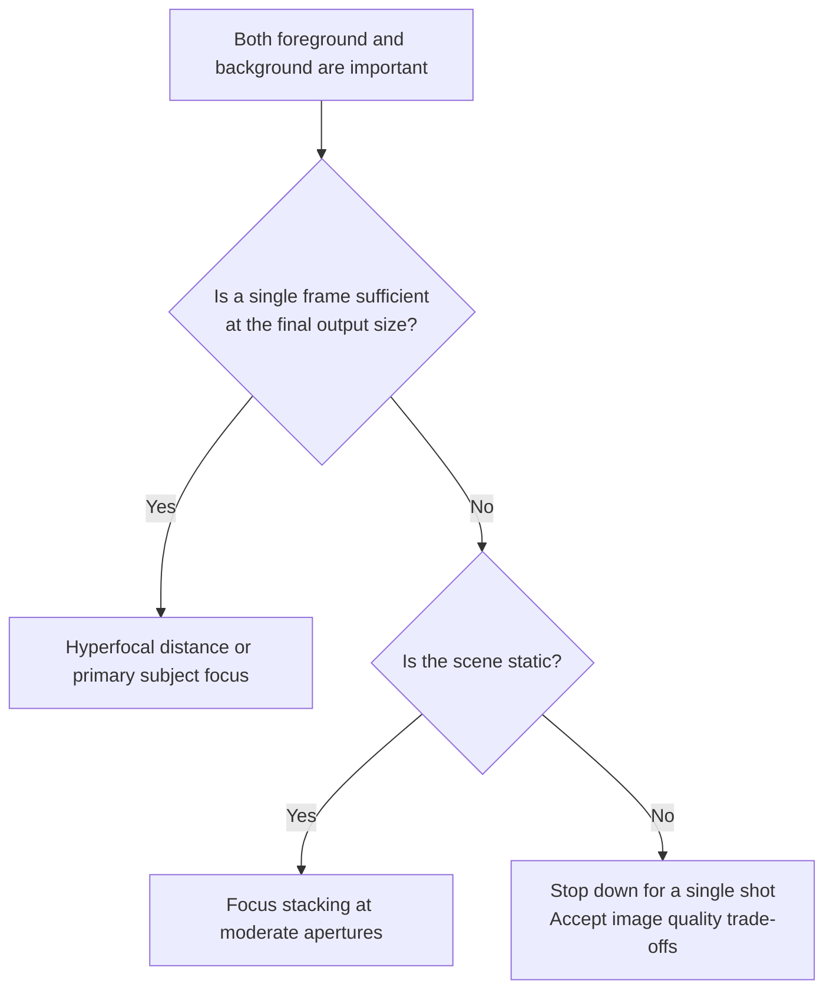

# Chapter 9 Landscape

> Landscape photography is slow. It trains not just how you release the shutter, but whether you are willing to return to the same place for a single frame, waiting for the light that is truly right.

---

## Landscape Is Selection, Not Mere Transcription

*Ansel Adams, "The Tetons and the Snake River," 1942. Commissioned by the U.S. Department of the Interior to photograph Western landscapes for its mural project, Adams spent long stretches of every year trekking through the mountains. This photograph was made in the Grand Tetons, south of Yellowstone. From the finished print, one can immediately read the choices he made in exposure: between the stark contrast of the distant snow-capped mountains and the nearby pine forest, he gave detail to the peaks, the clouds, and the gleaming Snake River, allowing the foreground pines to sink into a dark, anchoring weight. He did not record everything before him with equal measure; rather, before releasing the shutter, he had already decided what in the final photograph should retain detail and what should recede into weight. This negative was later included on the Voyager Golden Record, leaving the solar system aboard the spacecraft as one of the images humanity chose to represent the face of the Earth. [Image source and reuse details](image-credits.md#adams-tetons)*

---

## Grandeur Does Not Automatically Enter the Photograph

Many people take their first landscape photographs almost casually while traveling. The mountains are vast, the clouds are magnificent, the sea stretches out before them, and so they snap a few frames as keepsakes. Such photographs certainly have their value—they record that you visited a place, and they record how you felt standing there on that day. Strictly speaking, however, this is not yet the landscape photography this chapter aims to address. Landscape photography is more akin to slow, deliberate labor: you begin with an image in your mind's eye, and for its sake, you check the weather, study the seasons, scout vantage points, and calculate the angles of sunrise and sunset. Then you place yourself in that location and wait in quiet stillness for the light to truly fall into place. The image has already begun taking shape before you even step out the door; once on location, your task is merely to align that picture in your mind with the light before your eyes.

Releasing the shutter often occupies only a fleeting fraction of the entire process. Far more time is spent walking, waiting, reading the clouds, observing the wind, and deciding whether to hold your ground—unheralded efforts that show no immediate results. Sometimes, after an entire excursion, you come away with only one or two photographs truly worth keeping, or perhaps nothing at all. Visiting a vantage point only to find no usable light on the first attempt, being clouded out by fog on the second, contending with gale-force winds on the third, and only on the fourth catching those few brief minutes when the clouds part—none of this is the least bit unusual in landscape photography. The very same slowness means completely different things to different eyes: if you treat it as an incidental travel record, you will find it tedious at every turn; but if you treat it as work that demands returning to the scene again and again, this slowness becomes an integral part of the medium itself.

Historically, landscape photography has developed in at least two common directions. The first is the grand landscape, filled with mountains, rivers, clouds, canyons, and coastlines, often using wide-angle lenses to layer foreground, midground, and distant peaks and skies, requiring dramatic lighting to hold together a scale so immense. Ansel Adams spent years trekking through Yosemite and the Sierra Nevada, so his *Clearing Winter Storm* was no serendipitous snapshot: the winter snow had just ceased, storm clouds were parting, and the rock face of El Capitan on the left and Bridalveil Fall on the right emerged from the churning mist, as though a lid had just been lifted off the entire valley; he had waited continuously at an overlook commanding the whole valley, waiting for that exact moment. What appears to be a stroke of divine fortune was in truth the fruit of years of patient vigilance. The story of Galen Rowell, on the other hand, replaced "waiting" with "chasing." In Lhasa in 1981, seeing a rainbow suspended beneath rain clouds in the evening, he realized at once that if he moved to the right position, the arc of the rainbow would land squarely atop the golden roofs of the Potala Palace (a rainbow being no fixed entity, its visual position shifting with the observer). Carrying his gear across the plateau at an elevation of 3,700 meters, he sprinted over a mile, calculating the alignment between the rainbow and the palace on the fly, and upon reaching the spot, captured *Rainbow over the Potala Palace*. This story reveals an underlying truth of landscape work: anticipation and physical stamina are every bit as much a part of craft. Such photographs command immediate attention, and for that reason, they are the most readily reduced to formulas on social media, for grandeur requires almost no explanation to evoke awe.

By contrast, the other direction is far quieter, focusing on the intimate, the small, and the easily overlooked details close at hand. In Eliot Porter's *In Wildness Is the Preservation of the World*, the forest does not always appear in sweeping panoramas; at times it is merely a single leaf, a stretch of stream, or a layer of moss and a few water droplets on a stone. Michael Kenna spent years photographing snowscapes, solitary trees, wooden posts, and open water in Hokkaido; many of his frames are ultimately reduced to a few shades of gray and a touch of black, yet they prove all the more enduring to look at. Hiroshi Sugimoto's *Seascapes* even maintains the exact same composition over time—the upper half always sky, the lower half always sea; though the locations change time and again, that fundamental relationship between sea and sky remains unbroken. This approach is in no rush to elicit an immediate reaction of "how magnificent!"; rather, it invites the viewer to look slowly, sensing more and more with every glance that time itself is hidden within those details.

There is no hierarchy between these two directions, nor is there any need to force a choice between them. When starting out, most people are naturally drawn first to towering mountains and vast oceans. Yet after photographing for a long time, many gradually turn toward smaller subjects, for a reason that is easy to understand: grand scenes often depend on a rare alignment of weather and location—to be encountered, never commanded—whereas intimate scenes can be found almost anywhere, making them far better suited to training your vision day in and day out.

---

## Gear Must Solve Problems in the Field

The logic governing gear in landscape photography is quite different from that of street or portrait work. The tripod is a prime example—it is far more essential than many people realize. Carrying a tripod is not about looking professional; it is about providing a stable anchor across slow shutter speeds, low ISOs, meticulous framing, and long stretches of waiting. A truly serviceable tripod must support the actual weight of your camera and lens without slowly creeping once locked down, yet when collapsed, it cannot be so heavy that you end up leaving it at home every time. Carbon fiber is generally lighter than comparable aluminum, far less freezing to the touch, and often offers superior vibration damping; however, being "lighter" does not in itself make it more stable in strong winds. Wind resistance depends equally on leg diameter, the number of leg sections, extended height, the tripod head, the center of gravity, and the surface area catching the wind. In the field, you should keep the center column as retracted as possible, splay the legs wide, and cinch down or remove any camera strap that might flap in the breeze, using your body or a solid windbreak when necessary to reduce wind exposure rather than letting a dangling strap continually introduce vibrations into the system.

When it comes to lenses, there is no need to rush after the widest apertures right from the start. Landscape photography typically relies on apertures between f/8 and f/11, a range that provides ample depth of field while operating right in the optical sweet spot of the glass; consequently, an f/4 trinity—a 16–35mm, 24–70mm, and 70–200mm—is already sufficient to cover the vast majority of situations. Each of these three lenses serves its own distinct purpose. The 16–35mm is ideal for taking in both foreground and sky simultaneously; especially when there are rocks, flowers, wet sand, or a footpath at your feet, the wide angle can dramatically exaggerate these nearby elements, acting like an entryway that draws the viewer deep into the frame. The 24–70mm is the most versatile of the group; over the course of a long trip, a large proportion of your photographs will naturally fall within this range, as it can capture both a slightly wider lakeshore and a tighter slice of mountainside crowned with a cloud. The 70–200mm, meanwhile, excels at isolating distant ridgelines, cloud layers, and tree lines, rendering the composition tighter and more orderly. When choosing lenses, physical endurance must also be factored in: when you are hiking eight kilometers uphill with your gear, you will find that a lens half the weight is often far more practical than having an extra stop of aperture.

Telephoto lenses are particularly prone to being underestimated in landscape photography. Many people assume that landscape work inherently calls for a wide angle, believing a photograph only counts if it packs in everything before the eye. Yet what truly makes an image work is sometimes nothing more than one distant ridge layering against another, or the shadow of a cloud drifting slowly from one slope to the next—spatial relationships that a wide-angle lens simply cannot hold together, demanding a telephoto instead. The wide angle emphasizes that entryway right at your feet; the telephoto emphasizes the relationships among distant elements. Thus, neither lens is inherently "more" of a landscape lens than the other; rather, each reveals an order operating at a different distance.

Filters likewise serve an essential purpose. A circular polarizer (CPL) cuts through reflections on water, foliage, and glass, deepening the sky and stabilizing color; one must be mindful, however: when photographing reflections on water, take care not to eliminate the glare entirely, or the reflection will disappear right along with it. A neutral-density (ND) filter acts as a light brake, deliberately dragging daytime shutter speeds down so that you can record the temporal traces of running water, drifting clouds, or passing crowds. A graduated neutral-density (GND) filter is half-darkened and half-clear, designed specifically to hold back an excessively bright sky above and bring its luminance closer to that of the ground. In the digital era, exposure bracketing can certainly resolve many similar issues in post-production, yet optical filters retain an advantage that post-processing cannot replace: they allow you to see an image very close to the final result right through the viewfinder in the field, and that immediate feedback remains immensely valuable.

Since the purpose of an ND filter is to deliberately drag out daytime shutter speeds, just how slow it can go depends on how much light it blocks. Neutral-density (ND) filters are designed to attenuate light evenly across the spectrum without altering color; in practice, however—especially at high densities or when stacking filters—they can introduce color casts, vignetting, and infrared pollution, all of which should be verified both when purchasing and when shooting in the field. Its model designation roughly corresponds to the light reduction factor, represented as \(2^{\text{stops}}\): with each additional stop of reduction, the incoming light is halved, and the shutter speed must be slowed by one corresponding stop to compensate.

| ND Model | Light Reduction | Transmittance | Typical Applications |
|---|---|---|---|
| ND2 | 1 stop | 50% | Slight light reduction |
| ND8 | 3 stops | 12.5% | Softening running water |
| ND64 | 6 stops | 1.6% | Daytime long exposures |
| ND1000 | 10 stops | 0.1% | Seas of clouds, misting water surfaces |

What this table illustrates is quite straightforward: for every stop of light cut, the shutter speed can be lengthened by a corresponding stop. Whether you want to render a waterfall as hanging threads of silk or transform a churning sea into a veil of mist, this filter is what makes it possible, stretching exposure times from several hundredths of a second all the way out to several seconds, or even tens of seconds. Which filter to mount depends entirely on how much time you wish to retain: an ND8 is already sufficient to soften a rushing stream into directional trails of motion, whereas an ND1000 can drag drifting clouds and water into a smooth, ethereal mist in broad daylight. As we will see more clearly later in this chapter when discussing coastlines, the exact same sea yields two entirely different subjects depending on whether the shutter is slightly faster or slower.

Having noted earlier that a polarizing filter can eliminate glare from water and foliage, it is worth clarifying the underlying physics, because once you understand what it is actually doing, you will know exactly when it will work and when it will be ineffective. Natural sunlight originally oscillates in all directions, but when it strikes a non-metallic surface—such as water, glass, or damp leaves—at an oblique angle, the reflected portion of the light has its oscillations concentrated into a single plane; that is, it becomes "polarized." The role of a polarizer (in practice, most commonly a rotating circular polarizer, or CPL) is to transmit light vibrating in only one specific orientation; by rotating the filter, you can block out that layer of uniformly polarized glare, allowing the stones beneath the water and the true colors of the leaves to reemerge from beneath that milky white sheen.

This glare is eliminated most completely at a specific angle. When light strikes an interface at a particular angle, the reflected light becomes completely polarized; this angle is known as **Brewster's angle** (or the Brewster angle), and it is determined by the refractive indices of the media on either side of the interface:

\[ \theta_B = \arctan n \]

Where \(n\) is the refractive index of the medium on the reflecting side (assuming the light is incident from air, which is almost invariably the case in photography). The refractive index of water is approximately 1.33, giving a Brewster angle of roughly 53°; standard glass is around 1.5, corresponding to roughly 56°. When your line of sight forms an angle of roughly fifty-odd degrees with the normal to the water surface—that is, looking down at the water from a depression angle of about thirty-odd degrees—the polarizing filter cuts glare most effectively. Once the angle deviates substantially, the amount of glare that can be eliminated drops off accordingly, which explains why the effect of a polarizer on the very same lake can differ so markedly simply by shifting your vantage point or altering your downward shooting angle.

A second common application for the circular polarizer is darkening a blue sky, an effect governed by its own distinct geometry. The sky appears blue because sunlight is scattered by molecules in the air—a phenomenon known as Rayleigh scattering—and this scattered skylight is inherently polarized, with the strongest ring of polarization falling precisely at a 90° angle to the sun. Consequently, when you point your lens toward that swath of sky perpendicular to the sun and rotate the polarizer, the blue will deepen markedly, making white clouds stand out with greater brilliance and dimensional depth. Conversely, if you shoot facing directly toward or away from the sun, the 90° condition is not met, and the filter's sky-darkening effect becomes virtually imperceptible. When shooting with ultra-wide lenses, an additional caution is necessary: across an expanse of sky, only the zone nearest 90° is darkened to the maximum degree; because a wide-angle lens takes in such an enormous swath of sky at once, you may end up with an uneven blue that is dark on one side and light on the other, at which point you should back off the polarizer slightly rather than chasing its strongest polarizing effect.

Placed side by side, the three most common filters each address a distinct set of challenges:

| Filter | Physical Mechanism | Primary Applications | Field Considerations |
|---|---|---|---|
| **Circular Polarizer** (CPL) | Transmits light vibrating in a single orientation, filtering out polarized reflections | Cuts glare from water and foliage; darkens blue sky at 90° to the sun | Avoid maximum rotation when shooting reflections; ultra-wide lenses prone to uneven skies |
| **Neutral Density** (ND) | Designed for uniform, color-neutral light reduction | Daytime long exposures, extending shutter speeds to seconds or tens of seconds | Calculate exposure by stop rating; acquire focus before mounting dense filters; check for color casts and vignetting |
| **Graduated Neutral Density** (GND) | Half darkened, half clear | Holds back overexposed skies, narrowing the dynamic range between sky and ground | Choose soft-edge or hard-edge according to the horizon; can be replaced by exposure bracketing in post |

Beyond these optical tools, there are items that never appear on a spec sheet, yet truly determine whether you are willing to keep waiting. A headlamp, a rain cover, an insulated flask, a few rations of dry food, a pair of thin gloves, and a folding sit pad that lets you rest for a while are all, in truth, integral parts of landscape photography. Many photographs are not won through technical prowess, but because you were willing to linger just a little longer after everyone else had already packed up their cameras.

---

## Long Exposure as a Language of Time

We have touched upon long exposures several times earlier; here, it warrants dedicated discussion as a distinct technique in its own right. Rendering water into silky threads or clouds into sweeping trails is far more involved than simply screwing on an ND filter—it requires a coordinated sequence of deliberate actions working in concert. Let us begin with how slow the shutter speed needs to be. Different desired effects demand exposure times that vary by orders of magnitude; the table below can serve as a rough guide to developing an intuition for them:

| Desired Effect | Approximate Exposure Time |
|---|---|
| Waves trailing into silky textures while retaining their kinetic force | 0.5 - 2 seconds |
| Streams softened into flowing ribbons of silk | 2 - 5 seconds |
| The sea flattened into a calm mist, with reefs emerging | 10 - 30 seconds |
| Drifting clouds drawn into long streaks | 30 seconds to several minutes |

Once you know how slow the shutter needs to be, the next question is how to achieve such long exposures. Under bright daylight, stopping down the aperture and dropping the ISO to its base level are nowhere near enough. This is where neutral density (ND) filters come into play to cut down incoming light, and exactly how many stops to reduce can be calculated directly: each additional stop of ND halves the light reaching the sensor, requiring the shutter speed to be lengthened by one stop to compensate—multiplying the exposure time by \(2^{\text{stops}}\). For example, suppose metering on location reads 1/125 second at f/11 and ISO 100. If you mount a 10-stop ND1000 filter, the exposure time is multiplied by \(2^{10} = 1024\), turning 1/125 second into roughly 8 seconds; if you switch to a 6-stop ND64 filter instead, 1/125 second becomes approximately 0.5 seconds, falling squarely in the sweet spot for turning breaking surf into silky streaks. Selecting which ND filter to use ultimately comes down to deciding first how many seconds you need, and then calculating backward to see how many stops of light you must eliminate.

Once exposures stretch to several seconds or tens of seconds, another concern becomes critical: if the camera moves even the slightest fraction during those seconds, the entire image will be blurred—and the source of that minute vibration is often you yourself. Therefore, long-exposure photography is virtually impossible without a sturdy tripod. Yet a tripod alone is not enough; the physical act of pressing the shutter button depresses the camera body, which is why you should use a remote shutter release cable or, alternatively, the camera's self-timer (set to two or ten seconds), ensuring your hands have left the camera body before the shutter actually opens. If you are shooting with a DSLR, pay close attention to the reflex mirror as well: at the instant of exposure, the mirror flips up, introducing a noticeable shock. When shooting long exposures on a DSLR, it is best to enable **mirror lock-up**, allowing the mirror to swing up first and the vibrations to settle before the shutter curtains open. Mirrorless cameras lack this reflex mirror, but they demand a similar consideration: use the **electronic front-curtain shutter** (EFCS) whenever possible, substituting an electronic start for the mechanical front curtain and eliminating even the faint vibration caused by the shutter mechanism itself. Long exposures capture the passage of time, and throughout that duration, what you must do is keep the camera in absolute, dead stillness.

---

## Light Windows Vary by Location

The light most worth waiting for in landscape photography is usually concentrated within a few brief windows throughout the day. Golden hour refers to the periods shortly after sunrise and just before sunset when the sun sits low in the sky; the raking, oblique light casts elongated shadows and often takes on a warmer hue due to the longer path through the atmosphere. Before photographing mountains, coastlines, and canyons, you must first clarify **the compass direction your camera position faces, whether the surrounding terrain will obstruct the sun, and whether you ultimately want frontlight, sidelight, or backlight**. You cannot simply rely on the rule of thumb that "the east coast gets sunrise and the west coast gets sunset": coastlines curve, fjords and lake shores can face in any direction, and a given vantage point might be far better suited to backlight than shooting directly facing the sun. Plotting the sunrise and sunset azimuths on a map beforehand is far more reliable than relying on place names like "East Coast" or "West Shore."

The blue hour occurs after sunset and before sunrise, when the sun has slipped below the horizon but the sky has not yet faded to total blackness. The blue at this hour often carries a hint of violet, just as streetlamps, pier lights, and the warm glow from windows begin to illuminate; when cool and warm tones meet, the relationship feels remarkably natural. Many photographs of urban skylines, lighthouses, snow peaks, and harbors look like night scenes yet avoid collapsing into empty blackness; what they actually capture is this brief window of a few dozen minutes. Once the sky turns completely dark, the contrast between artificial lights and the background hardens abruptly, making the frame considerably more difficult to balance.

Looking at these two periods together makes it easier to understand where the real effort in landscape photography is spent. Golden hour is a window of warm light when the sun sits low; blue hour appears when the sun is below the horizon, where ambient sky light and city illumination can briefly draw close in luminance. They share a common trait: they evolve rapidly, yet there is no universally applicable rule of "twenty to thirty minutes each." Their duration shifts with latitude, season, topographical obstruction, atmospheric conditions, and artificial lighting; in high-latitude summers the window can stretch out for hours, whereas in the tropics it is fleetingly brief. The solar elevation angle in planning apps is far more reliable than a fixed number of minutes on a clock.

The light before and after a storm can indeed undergo dramatic transformations. Just as the rain stops, shafts of light piercing cloud gaps might illuminate only a single mountain, a patch of field, or a narrow stretch of river; the wet ground adds a layer of sheen and reflection, revealing graphic structure in places that otherwise appear unremarkable. But no photograph is worth trading for lightning strikes, flash floods, violent waves, or hypothermia: when you hear thunder, find yourself on an exposed ridge or near isolated high points, see water levels rising, watch incoming tides cut off your retreat, or receive local emergency warnings advising evacuation, pack up immediately rather than lingering by your tripod. Only when you have confirmed that the storm has moved away, that your retreat route is secure, and that you possess proper rain and thermal gear should you consider taking advantage of those few minutes of post-storm light.

!!! danger "Safety First"

    Always establish clear retreat conditions beforehand when shooting along coasts, in river valleys, on snow, at night, or in stormy weather: check lightning and flood warnings, tides, and swell heights; steer clear of slippery edges and isolated high points; ensure you have sufficient battery power and lighting for the trek back after dark; and let companions know your shooting location and estimated return time. When in doubt, withdrawing is the correct photographic decision.

---

## Starting with the Three-Tier Structure

Classic landscape composition is often built upon a three-tier structure: foreground, midground, and background. The foreground can be a boulder, a tuft of grass, a single flower, or a rippled pattern in wet sand; its purpose is to catch the viewer's eye up close first, providing a visual foothold. The midground—typically a lake, a river, the foot of a mountain, open fields, or a stand of trees—occupies the primary spatial body of the entire image. The background is given over to mountains, clouds, the sky, and distant tree lines, tasked with holding open the full depth of the frame. In landscapes shot by beginners, the composition often consists of only two planes—mountain and sky. While such a view can certainly be attractive, more often than not the shortcoming is that the viewer lacks an entry point into the image: the eyes lift only to collide immediately with the far distance, leaving them without a path along which to step inside.

Once you have found your subject, do not rush to raise the camera right where you stand. Instead, try crouching down, taking a step forward, and stepping back a little, observing the scene as you move to see whether an anchoring foreground can be positioned at the bottom of the frame. Rivers, footpaths, fences, field ridges, and the leading edges of breaking waves—all of these lines naturally draw the viewer's gaze into the frame, and three distinct types of lines each possess their own character and ideal setting. S-curves unfold with graceful unhurriedness: a river winding through a valley or a path skirting a sand dune slows the pace of the image, inviting the viewer's eye to wander inward bend by bend. Diagonal lines carry dynamic momentum: a line of surf slicing from bottom-left to top-right, or a ridge cutting diagonally across the frame, injects a slanted, kinetic tension into an otherwise static landscape. Converging perspective lines are the most direct: furrowed field ridges, a boardwalk, or a receding row of utility poles converging toward the distance pull the viewer irresistibly into the picture's depths. Yet there is a cautionary pitfall when working with lines: a line is a double-edged sword that dictates wherever the eye travels, and a path running off the edge of the frame into empty nothingness effectively ushers the viewer right out of the photograph. The terminus of a leading line must be caught by something—a mountain peak, a cottage, a solitary figure; otherwise, you are better off without it. If there is a body of water before you, you can experiment with symmetrical composition, though this requires waiting until the wind calms; the moment ripples crease the surface, the symmetry dissolves. At the same time, the horizon must be meticulously leveled—even the slightest tilt will be glaringly conspicuous.

The overarching principle of landscape exposure is to protect the highlights first. In areas such as the sky, clouds, snow, and water surfaces, once highlights are completely blown out, the lost details are essentially irrecoverable. The prudent approach, therefore, is to shoot in RAW and constantly monitor the histogram, keeping data near the right-hand boundary without allowing it to slam hard against the far-right wall. When confronted with scenes of extreme contrast, there is more than one remedy: you can use exposure bracketing to capture separate frames at different brightness levels and blend them in post-processing; you can use a graduated neutral density (GND) filter on location to hold back an overly bright sky directly; or you can simply accept that the ground will plunge into darkness, letting mountains and figures resolve into silhouettes. It is worth noting that a silhouette is by no means a reluctant fallback; in many instances, it carries far greater graphic power than forcibly pulling up the shadows, precisely because it distills the scene down to pure shape.

It is worth exploring the graduated neutral density (GND) filter in greater detail here, for it tackles the most common and stubborn dilemma in landscape photography. The sky is often several stops brighter than the ground; relying on a single exposure frequently means sacrificing one for the other—protecting the sky plunges the ground into darkness, while preserving ground detail blows out the sky. A graduated neutral density filter, half clear and half darkened, uses its darkened section to shade the overly bright sky, pulling the vast lighting ratio between earth and sky back within the dynamic range that a sensor can capture in a single frame. Which type to choose depends on the contour of the horizon: a soft-edge GND features a gentle, gradual transition between light and dark, making it suitable for irregular horizons such as rolling ridges or jagged treelines; a hard-edge GND has a crisper, more abrupt demarcation, suited to flat and straight horizons like the open sea or vast plains. Choosing the proper transition edge ensures that where the darkened half meets the sky, no jarring, unnatural boundary is left across the composition.

To return to the subject of contrast itself: the dynamic range that a sensor can simultaneously accommodate between its brightest and darkest limits in a single exposure is finite, and this usable span shifts according to ISO, camera model, output dimensions, and the standard applied for acceptable shadow noise. At sunrise and sunset, luminous clouds and deep ground shadows may easily exceed what a single capture can accommodate. The key to making this judgment is not memorizing an abstract figure like "thirteen to fifteen stops," but determining whether critical highlights are clipping and whether essential shadow areas maintain an acceptable signal-to-noise ratio at the target output size.

**Exposure bracketing** is designed precisely for such dilemmas. In practice, you keep the camera position and aperture locked, changing only the shutter speed to capture several frames around a baseline exposure: one metered normally, one underexposed by one to two stops to preserve the highlights, and one overexposed by one to two stops to draw out shadow detail. Back in post-processing, the optimal exposure from each frame is blended together. Compared to the on-location method of using a GND filter to knock down the sky, exposure bracketing offers the advantage of being indifferent to the shape of the horizon: jagged, irregular contours such as mountain ranges, forest canopies, and city skylines are handled cleanly. The cost is the absolute requirement of a firmly planted tripod to ensure pixel-perfect alignment across frames, along with an absence of fast-moving objects in the scene, which would otherwise introduce ghosting during blending.

Spot-metering both bright clouds and deep shadows helps you understand the contrast range of a scene, but this cannot be mechanically converted into a rigid formula like "a twelve-stop range calls for three frames spaced two stops apart." A three-frame sequence at -2, 0, and +2 EV merely shifts the center of exposure two stops toward each end; it does not automatically cover twelve stops of dynamic range. Furthermore, in-camera spot metering will evaluate every sampled area as middle gray, leaving you to first decide where those subjects ought to fall along the tonal scale.

A more dependable bracketing method in the field is to work backward from the histogram: first expose a dark frame where critical highlights are just shy of clipping, then lengthen the shutter speed stop by stop until the essential shadow areas pull away from the left wall and attain an acceptable signal-to-noise ratio in at least one frame. Fill in any intermediate frames spaced one to two stops apart as needed. This process may yield two frames, or perhaps three or five, dictated entirely by the scene and the sensor. Lock down aperture, white balance, and focus throughout the sequence, varying only the shutter speed. When wind-blown foliage, breaking surf, or moving figures are present, you will need to consider whether to rely on a single RAW file, use a GND filter, or accept the labor of de-ghosting during post-processing.

Focusing is another step where you cannot afford to cut corners. Focusing "one-third of the way into the frame's depth" is not an immutable law of depth of field, for one-third of a composition carries no fixed physical distance. First identify the nearest and farthest essential details, then make your calculations based on focal length, aperture, output size, and the circle of confusion; if both extremes cannot be satisfied simultaneously, turn to focus stacking for static scenes. When the foreground is extremely close and the mountains lie at infinity, blindly stopping down to f/16 or f/22 may still yield insufficient depth of field while exacerbating diffraction.

This technique has a dedicated name in landscape photography: focus stacking. It addresses the exact dilemma where both foreground and far background must be rendered tack-sharp, yet the depth of field of a single frame proves insufficient. Rather than mindlessly stopping down to f/16 or f/22 to stretch depth of field—only to drag the entire frame into the softening clutches of diffraction—it is far better to fix the camera's position and shoot a series of frames with varying focus points from nearest to farthest, subsequently merging the sharpest portions of each frame in post-processing to produce a composite crisp from front to back. Its greatest advantage lies in bypassing the sharpness penalty imposed by small-aperture diffraction, making it a standard tool for landscape work when pursuing ultimate clarity. This connects directly with the discussion of hyperfocal distance and diffraction in Chapter 5: hyperfocal distance is a compromise struck within a single exposure, trading an intermediate focus point for the widest possible depth of field; focus stacking, by contrast, uses multiple exposures to achieve a far more thorough and uncompromising depth of field.

When depth of field falls short, you can trade multiple exposures for it; when angle of view or output resolution is insufficient, you can turn to panoramic stitching. Adjacent frames usually require roughly 25%–40% overlap to provide stitching software with ample feature points for alignment. The final pixel count depends on the overlap, cropping, projection method, and individual source files, with no promise of effortlessly delivering hundred-megapixel files or a guaranteed print dimension. Nor does a stitched panorama inherently possess a perspective "more natural than an ultra-wide-angle lens of equivalent angle of view": identical camera positions yield identical spatial relationships. Whether the edges appear stretched depends on whether you select a rectilinear, cylindrical, or spherical projection, with each projection making its own trade-offs among straight lines, proportions, and field of view.

When shooting panoramas, lock down exposure, white balance, and focus to prevent visible steps in brightness and color along the seams; shooting in portrait orientation and panning horizontally leaves more vertical margin for cropping. When foreground elements are close at hand, rotate the camera around the lens's entrance pupil whenever possible; otherwise, parallax will cause near and distant elements to misalign relative to one another. In the absence of a panoramic head, avoiding close-up foregrounds is a pragmatic choice.

---

## Hyperfocal Distance Is an Approximation Tool

Chapter 5 has already set forth the hyperfocal distance formula, so here we retain only the most essential boundaries for field practice: the notion that everything from roughly \(H/2\) to infinity is "sharp" represents merely **acceptable sharpness** based on a given circle of confusion, output size, and viewing distance; it does not mean that distant mountains will be as sharp as the plane of critical focus. The common 0.03 mm benchmark for full-frame sensors is simply a traditional convention; large-format printing, close inspection, or high-resolution cropping may all demand far more rigorous standards.

You can use the [Field Toolkit](tools.md#hyperfocal-calculator) to find a starting point, but you must ultimately evaluate the results under your target output conditions. If distant mountains are the sole center of essential detail, focus directly on the mountains; if an extremely close foreground and infinity must both be tack-sharp in a static scene, perform focus stacking at moderate apertures; if foliage, crashing surf, or figures are in constant motion, stop down the aperture to complete a single exposure, accepting diffraction or localized motion blur.

To determine which path to take in the field, follow the decision tree below:

---

## Smaller Apertures Are Not Always Better

The physics of diffraction and the Airy disk formula were already covered in Chapter 5; in a chapter on landscape, what proves far more useful is a practical hierarchy of choices. Begin with a test shot at a moderate aperture where the lens performs most evenly across the frame, checking the essential details in both the nearest foreground and the furthest distance. When depth of field is insufficient, prioritize focus stacking in static scenes; only in scenes with movement, where frames cannot be reliably stacked, should you stop down further, trading a degree of overall detail for motion consistency within a single exposure.

Do not treat f/8, f/11, or f/16 as rigid dividing lines. Lens design, sensor format, pixel density, focus distance, and final output all shift these boundaries; the softening visible when viewing a file at 100% on a screen may well prove inconsequential once scaled down for the web or viewed on a print at a normal distance. The best aperture is not the setting that yields the highest laboratory test numbers, but the one that allows the critical areas of the photograph to hold up convincingly at the final output size.

---

## Planning Dictates Choices on Arrival

A large measure of success or failure in landscape photography is decided before you ever step out the door; the crux of it lies in planning. Typically, you begin by scouting a candidate vantage point on maps, photography websites, or places encountered in daily life; then use PhotoPills to ascertain the directions of sunrise, sunset, moonrise, and moonset for that day; consult Google Earth or Street View to anticipate roughly what will be visible upon arrival; check the weather and cloud cover; and finally factor in the travel route and required transit time. Putting this workflow into practice for an actual shoot looks roughly like this. Target: a west-facing coastline, shooting long exposures of waves breaking against rocky reefs at sunset. Check PhotoPills: sunset that day is at 18:42, azimuth 261°, placing the sun just behind and to the side of that line of rocks—a subtle side-backlight that confirms the location is viable; check tide tables: around 18:00 is mid-ebb tide, meaning the rocks will be exposed above water without stranding you on the tidal flat; check cloud cover: the forecast shows twenty percent low clouds and forty percent mid-to-high clouds to the west—a combination well worth heading out for, as explained directly below; the walk from the parking spot to the vantage point takes roughly twenty-five minutes, meaning you must depart by 17:30 working backward; when packing, run through the checklist: tripod, cable release, ND64 and ND1000 filters, GND, headlamp (for the trek back after dark), waterproof boots. With everything set down on paper this way, all that remains once on location is waiting for the light and pressing the shutter.

The step of checking cloud cover is well worth learning to interpret with greater precision, because the generic forecast "partly cloudy" carries virtually zero useful information for landscape photography; what truly matters is cloud altitude and distribution. For sunrise or sunset to ignite the sky with crimson clouds, the ideal configuration is mid- and high-level clouds overhead and at intermediate altitude (textured formations such as cirrus or altocumulus), accompanied by an open gap right along the horizon where the sun sets: once the sun sinks below the horizon, light shoots through this opening, illuminating the undersides of the clouds from below. Conversely, if thick low clouds pile up against the horizon, light cannot break through at all, and no matter how beautiful the clouds overhead might be, they will simply sink into dull gray—the most frequent reason for returning empty-handed. Crepuscular rays—shafts of light angling down through gaps in the cloud deck—demand broken cumulus formations with spaces between them, a phenomenon most readily found when the sun breaks through just after rain. As for fog, on clear, windless nights in autumn and winter, rapid terrestrial heat loss readily triggers radiation fog over river valleys and lake surfaces at dawn; verify those three conditions the night before—clear skies, high humidity, and calm winds—and trek up to an elevated vantage point in the predawn dark, and more often than not you will be met with a sea of mist. Only when clouds and fog are decoded into concrete conditions like these does the weather forecast become a meaningful part of a shooting plan.

Once you actually set out and reach the location, it is best to arrive thirty minutes to an hour early. This buffer is not idle waiting: it gives you time to set up the tripod, experiment calmly with several compositions, and verify that both exposure and focus are dialed in. That way, when the light genuinely begins to shift during those few fleeting minutes, you will not find yourself fumbling in a frantic rush, turning dials at random.

If you arrive on site only to find the weather uncooperative, there is no need to force a shot. A wiser approach is to record the day's conditions—the time, wind direction, cloud layers, and which areas caught the light—and save that knowledge for next time. Landscape photography is never as simple as having "been there once"; it is more like seeing the exact same place over and over again. Returning to the same vantage point five times is not the least bit excessive in landscape work; each return visit increases your odds of encountering exceptional light.

That said, different landscapes have their own distinct temperaments, and you cannot expect to approach every terrain with the same set of assumptions. Mountains, coastlines, forests, bodies of water, and deserts may all fall under the banner of landscape, but the demands they make on the photographer are entirely different, and each is best understood on its own terms.

To begin with mountains: what mountains need most is low-angle sidelight. At sunrise and sunset, as light sweeps across obliquely from one side, rock faces, snowlines, and descending ridges are carved out layer by layer in light and shadow, allowing the mountain's physical volume to truly emerge. Overcast skies do not make mountain photography impossible, but nondirectional diffused light easily flattens the terrain, leaving distant peaks looking like flat silhouettes pasted against the horizon, lacking depth and substance. When photographing mountains, you can begin with the three-tier composition introduced earlier: place a boulder, a grassy slope, or a tree at your feet as foreground; leave the foothills and valley floor as midground; and let the main peak in the distance anchor the visual weight of the entire frame. As for lens choice, a wide-angle lens works well to place human presence within the scale of the mountain to accentuate its sheer size; a telephoto lens, by contrast, is ideal for extracting the delicate relationships between ridgelines, snowfields, and cloud shadows from the vast terrain.

Next, coastlines. In coastal photography, the first step is likewise to assess orientation. East-facing coasts generally call for sunrise, and west-facing coasts for sunset, simply because low-angle light can simultaneously illuminate cresting waves, wet sand, sea rocks, and the sky. The slow shutter speeds so frequently employed at the water's edge yield more than a single effect, depending on just how long you extend the exposure: around half a second, the raw kinetic force of the surge is still legible, with spray drawn into distinct, silky threads; once exposure reaches ten or twenty seconds, the water dissolves entirely into a level sheet of mist, from which the dark rocks seem to slowly emerge. When composing along the shore, seek out foreground elements such as wave-washed boulders, sea caves, receding tide lines etched in the sand, or an unbroken reflection. What requires the greatest vigilance, however, is the tide itself: never become so fixated on the frame in the viewfinder that you forget where you are standing, only to look down and find yourself marooned by the rising water.

Forests present the exact opposite case: they thrive under overcast skies, in mist, and after rain. A woodland subjected to intense, direct sunlight is notoriously difficult to photograph: harsh light punching through the canopy plunges trunks into impenetrable darkness while rendering leaf tips blindingly white, littering the composition with chaotic hot spots. An overcast day places a massive softbox over the entire forest, allowing the rich, understated colors of tree bark, moss, fallen leaves, and damp soil to surface tone by tone. In a forest, you need not chase sweeping vistas; focal lengths between 35mm and 100mm are often far more versatile: framing the rhythmic intervals between trunks, capturing how moss creeps over a boulder, or tracing the subtle transition of foliage from pale green to deep emerald will yield an image far more enduring than forcing an entire forest into a single frame.

Water acts as an amplifier: it magnifies the colors of the sky, just as it magnifies the wind. During the golden hour, the water's surface preserves a gleaming sheen of gold; when the blue hour arrives, that very same expanse settles into deep indigo. When photographing streams or lakes under overcast skies, a polarizing filter can cut through surface glare to reveal the submerged stones and aquatic plants beneath; yet the perennial caveat remains: if your primary aim is to capture reflections, do not rotate the polarizer to its maximum effect, lest the water lose its mirror-like sheen and cause the reflection to vanish altogether. As for snow and ice, remember to intentionally increase exposure: reflective metering will drag a frame dominated by snow down toward middle gray, rendering it muddy and dull—a problem thoroughly dismantled in Chapter 3. Push back against the camera's meter by proactively adding one to two stops of exposure to restore the snow to its rightful white, while keeping a watchful eye on the histogram to ensure it does not slam against the far right edge and burn out delicate textural detail. Allowing snow to retain a faint hint of blue in the shadows conveys the crisp bite of cold air and spatial depth far more effectively than processing it into a dead, chalky white.

The essence of the desert lies entirely in shadows. When the sun hangs low, the sinuous ridges of the dunes are traced out by the shadows they cast upon themselves, cascading wave upon wave toward the horizon; only then does the rolling geometry of the sand stand revealed. Come noon, with the sun beating straight down from above, shadows contract beneath your feet to virtually nothing, and the scene easily collapses into a flat, monotonous expanse of yellow. As for auroras and the night sky, the craft is less about snapping pictures than conducting rigorous field operations outdoors. The arithmetic of exposure will not be repeated here; the 500 Rule and the NPF Rule in Chapter 11 will settle the shutter speed calculations for starscapes, and starting parameters for northern lights will be provided in that chapter as well. Here, the emphasis falls squarely on your body and gear: keep batteries warm inside your inner pockets next to your body; when taking a lens from a heated car, let it sit outside for a while to acclimate to the ambient temperature; and never touch a bare metal tripod with uncovered hands in sub-zero cold. The more meticulously you rehearse these procedures before stepping out the door, the less your hands will fumble when you finally lift your gaze and behold that light in the sky.

---

## Common Pitfalls and Corrections

The first and most common pitfall among landscape beginners is an unwillingness to wait for light. Shooting mountains under the harsh overhead glare of midday, plunging into forests under bright sun, rushing off to the coast to shoot again at noon, and returning home expecting post-processing to forcibly rescue the colors—the resulting images inevitably feel strained at every turn. Another frequent error is relying solely on the zoom ring to cobble together a composition: feeling 35mm is too cramped and twisting it to 28mm, deciding 28mm feels too empty and nudging it back to 32mm, all while remaining rooted to the exact same spot without taking a single step. It is vital to understand that focal length alters only the angle of view; perspective relationships and the distance to the foreground can only be changed by moving your feet. More often than not, walking five meters forward, stepping five meters back, crouching down, or simply climbing onto a boulder is far more useful than swapping focal lengths in place.

In post-processing, the two elements most easily pushed to excess are HDR and saturation. Understand that packing every highlight and shadow with visible detail does not make a photograph better: the natural world inherently possesses its brightness and its gloom. If you scrub the shadows entirely clean, leaving no darkness at all, the image feels as though its rightful gravity has been washed away. Saturation operates on the same principle: cranking greens into neon, rendering the sky like blue glass, and turning the sunset into the red of tomato juice—with every tick the slider is pushed upward, the image drifts one step further from the reality of the scene. Landscape photography does not become more beautiful the more garish it gets; what it truly must accomplish is to convince the viewer that this light once truly, tangibly fell upon that place.

Finally, there is a debt owed to the subject itself. From beginning to end, this chapter has urged you to return to the same vantage point; yet when tens of thousands of people are drawn by a single photograph to the very same rock or the exact same flower field, landscape photography becomes a consumer of its own subjects: meadows beside popular viewpoints are trampled into radial paths of bare earth, branches blocking the lens are snapped off for a cleaner frame, and drones scatter nesting colonies of birds in panic. A few fundamental duties must be upheld: stay on established trails, never forging new paths for the sake of a composition; in flower fields and tundra, do not step even into areas outside your frame—a pristine viewfinder does not mean you haven't trampled something behind your back; never bait animals with food, and never fly drones to pursue them; drones are subject to strict no-fly regulations in nature reserves, airport perimeters, and urban airspace—checking these rules before takeoff is an obligation, not a courtesy. An adage from the older generation of landscape photographers is well worth remembering: take nothing but pictures, leave nothing but footprints; and on a fragile, worn meadow, even footprints should be spared. You want this vantage point, when you return in ten years, to still be worth photographing once more.

!!! example "Case Study: Whether to Bracket on a Sunset Coast"

    Begin with a test exposure to protect the highlights near the sun, then check whether the shadows still meet your output standards. If a single RAW file already covers the required tonal gradations, do not generate superfluous files merely for "insurance"; if protecting the highlights pushes the coastal rocks entirely into unusable noise, then increase exposure stop by stop toward the brighter end until the shadow detail is sufficient. The number of bracketed frames should be determined by the histogram at both extremes, not by a rigid formula of "three frames, two stops apart."

    Waves and foliage can create ghosting artifacts. When they serve as the primary subject of the frame, it is preferable to select a single frame as the baseline for motion, or to use a graduated neutral density (GND) filter on location to compress the contrast.

---

## Exercises

For seven consecutive days, visit the same accessible location around sunrise or sunset to shoot landscapes. Select only one image per day. After seven days, lay them side by side to compare how the light, the weather, and your own positioning have evolved.

Find a landscape spot near where you live—a park, a riverbank, the foot of a mountain, or an open clearing. Photograph the exact same scene on three separate occasions, choosing a different time of day or weather condition each time. Place the three images side by side to see how the same place is rewritten by light.

Find a scene with water or clouds, and capture three frames: one at 1/100 second, one at 1 second, and one at 30 seconds. Look beyond which frame appears prettier; examine how time itself has been recorded.

Take a 50mm or 70–200mm lens into the woods, among rocks, or by the water's edge. Abandon grand vistas and focus exclusively on intimate vignettes, textures, geometry, and repeating patterns. Once home, select five images and see if they can form a quiet, cohesive series.

Use PhotoPills or a similar tool to plan your next shoot. Write down the vantage point, sunrise or sunset bearing, arrival time, and anticipated composition. After shooting, compare your original plan side by side with the actual photographs.

---

Next Chapter: [Chapter 10 Architecture and the City](10-architecture.md)
