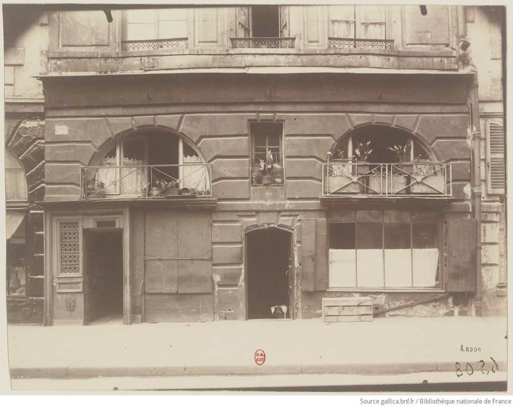
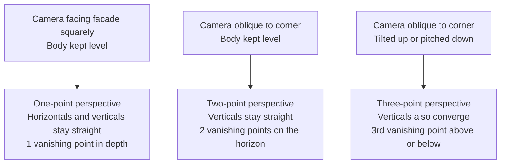

# Chapter 10 Architecture and the City

> On the surface, architectural photography is about buildings; in truth, it is about lines, planes, volumes, and space. Shift the camera ever so slightly, and the entire character of the building transforms with it.

---

## Architecture Begins with Abstraction

When the Hungarian-French photographer Lucien Hervé photographed the Unité d'Habitation in Marseille, he was in no hurry to fit the entire building neatly into the frame. Designed by Le Corbusier, the building is a landmark of modernist architecture; conventionally, the most straightforward approach would have been to step back far enough so that it stood square and complete inside the frame. Yet Hervé chose to do nothing of the kind. He was preoccupied with other matters: how light fell upon raw concrete, how a railing cast an oblique shadow across a wall, how a narrow slit of light fractured the space between walls, and how rooftop ventilation shafts dragged long shadows across the concrete floor. He photographed not the totality of the building, but its individual fragments as they were illuminated by light. After viewing that series of photographs, you might not instantly piece together the full silhouette of the architecture in your mind, but you will hold an indelible memory of its weight, its roughness, its order, and its light.

Upon seeing these photographs in 1949, Le Corbusier wrote to Hervé: "You have the soul of an architect." The two collaborated for more than a decade thereafter, until the architect's death. This compliment is worth pondering. It was not praise for how clearly Hervé had documented the building, but an acknowledgment that he understood it: he grasped the intention behind the structure, the temperament of the materials, and the place of light within the design, so that his choices of framing and omission resonated at every turn with the architect's own mind. The architect, of course, knows best how the building was constructed; he knows the history and purpose of every structural joint, every floor plan, and every material. Yet the photographer's gift is to reorganize the firsthand visual experience of inhabiting that space, and through a single photograph, allow someone who has never been there to step inside. The difficulty of architectural photography has never been limited to depicting a building sharply and fully; the far more demanding task is to first understand what the building aims to accomplish, and then enable others to see that understanding through your photographs.

---

### How Cities Hold Time

*Eugène Atget, "Boutique. Place Dauphine", 1924. When photographing Parisian storefronts and streets, Atget often positioned himself directly head-on, keeping his camera level to maintain stable vertical lines; his longer exposure times also caused passersby to dissolve into faint shadows. Illuminated by light, this shop stands like a frontal elevation print—free of dramatic angles and without manufactured theater, simply presenting a quiet facet of urban daily life to the viewer. Many subsequent architectural photographers continue to study this restraint, because it allows the architecture to speak for itself. [Image Source and Reuse Notes](image-credits.md#atget-shop)*

---

## Architecture Is Photography's Earliest Subject

To provide a layer of historical depth: architecture is photography's oldest subject—bar none. The earliest surviving photograph, taken by Nicéphore Niépce around 1826 from his window, captures nothing other than rooftops and walls. Early photosensitive emulsions routinely demanded exposures lasting several minutes, making human subjects impossible to record; motionless buildings thus became the medium's natural sitters. In 1851, the French government initiated the *Mission Héliographique*, dispatching five photographers across the nation to record historic monuments in urgent need of restoration. This marked the first time a state employed photography as an architectural archive, and it was essentially the first formal answer to the question of whom architectural photography serves. Over the century and more that followed, this discipline has continually evolved along several parallel paths.

In architectural photography, one must first consider whom the photograph is meant to serve, for the criteria of evaluation shift with the audience. When a photograph is made for architects, architectural journals, project archives, or commercial developments, it aligns closely with an architectural document: vertical lines must remain strictly plumb, horizontal lines level, the relationships between contiguous spaces clearly articulated, and the light kept disciplined rather than stealing the scene. Mid-twentieth-century American modernist architecture was to a great extent "fixed" in the cultural consciousness by two names: Julius Shulman and Ezra Stoller. The Case Study Houses of California became the defining imagery of an era in Shulman's hands, while many East Coast masterworks were disseminated through Stoller's photographs—spawning an industry aphorism that a building was never truly complete until it had been "Stollerized." A contemporary exemplar of this lineage is Hélène Binet: she has photographed for Peter Zumthor, Daniel Libeskind, and Zaha Hadid over many years, remaining devoted to film, returning repeatedly to the same structure to wait patiently for the light of different hours to fall across its surfaces. Her final delivery for a project often amounts to single digits, yet every frame is impeccably precise; her methodology is itself an artistic position: architecture deserves to be looked at slowly. By contrast, Iwan Baan prefers to return architecture to its surrounding urban context: he regularly charters helicopters to circle above buildings, examining from the air how they are physically entangled with roads, neighborhoods, and the flow of people. Following the 2012 hurricane that plunged half of Manhattan into darkness, he photographed the nocturnal city from a helicopter—half illuminated, half blacked out—which became an iconic cover for *New York* magazine; in that frame, no single building is the protagonist; the protagonist is the city in its entirety.

Then there are photographs that treat architecture simply as an artistic object, unconcerned with capturing the entire edifice or enforcing rigidly corrected perspective. What truly matters in this category is geometry, chiaroscuro, material texture, reflection, and abstraction. Candida Höfer photographs deserted libraries and museums where, despite the total absence of human figures, one acutely senses that the space has been inhabited and utilized by countless people over immense spans of time. Many works by Andreas Gursky share a similar coolness, flattening the repetitive structures of architecture and urbanity into monumental patterns.

Move into urban photography, and the dynamic shifts once again: architecture recedes into a stage, allowing people and daily life to step into the center of the frame. Stephen Shore photographed American gas stations, motels, and crossroads; while many of his images appear quiet and unassuming at first glance, a closer examination reveals an underlying composition that is exceptionally rigorous. Fan Ho, documenting Hong Kong in the 1950s and 1960s, caught slanting beams of light pouring from high warehouse windows just as a passerby stepped through them; geometry laid down the foundational ground, while the human figure emerged softly at the precise location, like a mark of punctuation. Urban photography possesses an extra layer of time compared to pure architectural photography: what you wait for on site is not merely the hour when the light is finest, but the exact moment when someone happens to pass by.

---

## Perspective and Vertical Lines

The first fundamental problem architectural photography must confront is perspective. It is virtually impossible to evade, for architecture itself is built of straight lines: the contours of walls, the edges of columns, window frames, horizons—every line silently betrays to the viewer whether your camera was held level and true. The underlying principle is straightforward: the moment the lens departs from the horizontal, lines that ought to be parallel begin to converge within the frame. Tilt the camera upward even slightly, and vertical lines that should stand plumb gather toward the top of the frame, making tall buildings appear as if they are falling backward; pitch the camera downward, and the wall lines taper toward the base, as though the entire structure were being crushed into the ground. To be sure, certain deliberately stylized architectural photographs exaggerate this convergence as an expressive device; the trouble arises when it is unintentional, in which case the convergence merely leaves the image looking precarious and unstable on its feet.

This upward narrowing phenomenon is commonly known in architectural photography as keystone convergence or keystoning. It occurs because, when tilting the camera up, real-world vertical lines are no longer parallel to the sensor plane; their vanishing point retreats from infinity into the upper reaches of the frame, drawing them together as they rise. For vertical lines to remain parallel, the universal requirement is simply to keep the sensor plumb and eliminate any pitch (tilt up or down); it does not demand that the sensor be parallel to any particular facade. When shooting obliquely at the corner of a building, neither wall is parallel to the sensor, yet the verticals remain perfectly upright. In practice, one can keep the camera body level and adjust elevation or distance, reframe using a tilt-shift lens, or defer the correction to post-processing.

Keystoning is merely a special case of a broader set of perspective laws; once these principles are clear, the behavior of all those troublesome lines falls neatly into place. To understand why lines converge, one must first examine how a camera forms an image. The camera operates on central projection: every point in the scene travels along a straight line passing through the lens's optical center to land upon the sensor plane. Within this geometry lies a fundamental law: a set of lines parallel to one another in physical space, once projected onto the image plane, will converge toward a single point—the vanishing point. Train tracks converging into the distance to meet at a single point on the horizon are the most intuitive manifestation of this rule. Crucially, where a vanishing point falls is determined solely by the spatial orientation of that set of parallel lines, entirely independent of their specific positions in space: lines sharing the same direction, no matter how far apart, will converge toward the very same vanishing point.

One special case is worth committing firmly to memory. When the orientation of a set of parallel lines is parallel to the sensor plane, their vanishing point recedes to infinity, so they remain parallel within the image. Whether architectural verticals remain parallel depends solely on whether the real-world vertical direction is parallel to the sensor plane—that is, whether the camera body is pitched up or down; the camera may face a facade head-on, or view a corner obliquely. Only when photographing a facade head-on and wishing to prevent horizontal lines from converging as well is it necessary to align the sensor plane parallel to that wall.

Following this thread, perspective in architectural photographs can be classified into three types, differing solely in camera position and orientation.

One-point perspective occurs when you stand squarely facing a facade, keep the camera level, and align the sensor plane parallel to the wall. Under these conditions, both the horizontal and vertical lines on the wall run parallel to the sensor, their vanishing points cast to infinity. The image is thus strictly plumb and square; only lines receding into depth along the line of sight—such as a long street viewed straight down its axis or the flanking walls of a corridor—converge toward a single vanishing point in the center of the frame. Symmetrical church naves shot head-on or straight, historic streets stretching into the distance typically yield this one-point perspective, stately and composed.

Two-point perspective arises when you no longer face a facade head-on, but instead angle toward the corner of a building, taking in two adjacent walls within the frame. If the camera remains level, the vertical lines remain parallel to the sensor and perfectly upright; however, the horizontal lines of the two walls converge toward two separate vanishing points on the horizon to the left and right. Classic architectural views of street corners showing two facades simultaneously are almost always two-point perspectives, possessing greater depth and a more pronounced sense of volume than one-point perspective.

Three-point perspective builds upon two-point perspective by tilting the camera up or pitching it down. The moment the camera departs from level, vertical lines cease to be parallel to the sensor, and they too begin to converge, meeting at a third vanishing point located above or below the frame. The phenomenon described earlier—looking up at a skyscraper as its verticals taper upward—is, at its root, the introduction of this third vanishing point. Keeping the high-rise straight is equivalent to banishing this third vanishing point back to infinity; leveling the camera, using a tilt-shift lens, or correcting the image in post-processing all accomplish precisely the same thing.

The most direct remedy for this convergence is the tilt-shift lens. Its principle is to keep the camera body strictly level while independently shifting the framing upward, preserving perfectly upright vertical lines. Tilt-shift lenses are expensive and demand a steep learning curve, but anyone truly serious about architectural photography will eventually come to understand why they exist. If a tilt-shift lens is not at hand, other strategies remain: keep the camera as level as possible while shooting, leave ample breathing room at the top of the frame, and subsequently straighten the converging lines in post-processing using perspective correction—at the cost of cropping away a perimeter of edge pixels. Alternatively, one can simply stand farther back and switch to a longer focal length, such as 50mm or 85mm, which likewise tempers excessive perspective distortion; yet in crowded urban environments, the luxury of stepping back is not always available.

The tilt-shift lens warrants a discussion of its own because it encompasses two mutually independent movements. The first is shift: moving the lens parallel to the sensor, either vertically or horizontally. Its utility lies in keeping the camera level and the vertical lines distortion-free while still capturing the upper stories of a building that would otherwise fall outside the frame. The second is tilt, which alters the orientation of the lens plane, using the Scheimpflug principle and the hinge rule to reorient the plane of focus; depth of field still possesses thickness, rather than being confined to an infinitely thin plane of sharpness. Shifting does not, strictly speaking, "correct perspective": what keeps the verticals parallel is the fact that the sensor is not tilted upward; shift simply allows this leveled camera to include the top of the building. Tilting, on the other hand, is suited for shooting obliquely across a wall, a colonnade, or the ground, using the orientation of the focal plane to minimize the need for extreme stopping down. Distinguishing between the two clarifies whether your task is reframing while preserving camera orientation, or reorienting the plane of sharp focus.

Why shift movements can alter framing becomes clear when considering the image cast by a lens. Every lens projects a circular image inside the camera body, known as the image circle, and the rectangular sensor merely crops a portion from within this circle. A tilt-shift lens is engineered with an oversized usable image circle; when the lens shifts relative to the sensor, the sensor captures an upper portion of the image circle instead. The rooftop is thus brought into the frame while the camera body remains level and the verticals parallel. The trade-off is that when shift is pushed to its mechanical limit, the sensor approaches the edge of the image circle, where the corners may vignette or soften.

The enlarged image circle also makes tilt-shift lenses well-suited for stitching panoramas, though here lies a frequently misunderstood detail: **fixing the camera body and merely shifting the lens left and right does not inherently eliminate parallax.** When the lens shifts, the entrance pupil generally shifts with it, which can cause relative displacement between foreground and background elements; it is only because buildings are typically far away that this error goes unnoticed, leading to the mistaken impression that the viewpoint has remained stationary. If the scene includes foreground columns, furniture, or door frames, the rigorous approach is to mount the lens or entrance pupil directly to the tripod using a specialized collar, allowing the camera body and sensor to move behind the image circle—or alternatively, to use a panoramic head rotating around the entrance pupil. For distant facades without foreground objects, standard left-center-right shift shots remain a convenient method for high-resolution stitching, so long as one does not mistake "usually stitchable" for "physically parallax-free."

The capabilities of tilt-shift lenses are by no means a modern invention; they merely transpose movements used by large-format view cameras for over a century onto small-format systems. In a classic view camera, the front lens standard and the rear film back are mounted on separate, adjustable standards connected by a flexible bellows, allowing the lens to rise, fall, shift laterally, tilt forward or backward, and swing side to side relative to the film plane. Early architectural photographers relied precisely on the rise movement: raising the front standard lifted the field of view to capture the top of a building while keeping the film plane plumb, thereby preserving straight verticals. Today's tilt-shift lenses on 35mm systems accomplish the exact same feat, condensed within the body of a single lens.

When set side by side, the strengths and weaknesses of these methods for keeping vertical lines true become immediately clear. They either intervene at the moment of capture or defer the problem to post-processing, and each exacts its own small price.

| Correction Method | How It Achieves True Verticals | Trade-offs |
|---|---|---|
| Leveling the camera (keeping the sensor strictly vertical) | Avoid tilting or pitching the camera body, pushing the vanishing point of vertical lines back to infinity; when photographing a direct elevation, align the sensor parallel to the wall surface as well. | In urban environments, you may lack the space to back up or find a high enough vantage point; once leveled, the frame may cut off the top of the building. |
| Shifting with a tilt-shift lens (shift) | Keep the camera body level while moving the lens relative to the sensor, capturing an upper portion of the expanded image circle. | The lenses are expensive and have a steep learning curve; shifting to extreme physical limits can cause darkened or softened corners. |
| Post-processing perspective correction | Re-stretch the trapezoid—narrow at the top and wide at the base—back into a true rectangle in software. | Stretching the top reduces effective resolution and requires cropping away a perimeter border; whether to further adjust the aspect ratio should be decided based on the building's true proportions and visual judgment, rather than any universal "ten-percent" compensation rule. |

There is, of course, the exact opposite scenario: you intend from the very beginning for the building to appear oppressive, leaning, monumental, or unstable. In that case, such convergence is not only acceptable, but even worth deliberately exaggerating. The crucial point here is simply never to let the viewer mistake it for a technical oversight. In architectural photography, skewed lines are entirely legitimate, provided that viewers can tell at a single glance that this was an intentional choice, not the unintended result of failing to level the camera.

!!! example "Case Study Walkthrough: A High-Rise on a Narrow Street"

    The facade stands directly across the street, and the sidewalk allows you to step back only a dozen meters or so; the moment you tilt upward, the vertical lines converge toward the sky. First determine clearly what you want from this photograph, and only then choose your path of correction.

    - When you need a formal, upright facade record: Level the camera body. If you cannot fit the roofline, seek a higher vantage point (such as a stairwell or pedestrian bridge in an opposing building) and keep the sensor parallel to the facade; the verticals will be true right in camera.
    - When the roofline must be included and the verticals must stay straight: If you have a tilt-shift lens, keep the camera body level and shift upward; if not, keep the camera level, leave generous breathing room at the top, correct vertical perspective in post-processing, and accept cropping away a border around the edges.
    - When even the extra margin fails to contain the building: Keep the body level and shoot two or three vertical frames to stitch together from top to bottom; alternatively, acknowledge that this vantage point cannot capture the full structure, and pivot instead to capturing details of light, shadow, and texture.
    - When a sense of looming oppression was what you wanted all along: Move right up to the base of the building, shoot upward with an ultra-wide-angle lens, and push the convergence to dramatic extremes, making it instantly clear to any viewer that this was a deliberate choice, not a blunder.

    None of these four paths is inherently right or wrong; the only mistake is tilting up for the shot, only to realize afterward that what you truly wanted was a clean, upright facade.

---

### Distortion and Lens Correction

The convergence of lines discussed earlier obeys the intrinsic laws of perspective: the lines in the frame are faithfully projected, even if their trajectories feel disconcerting to our perception. Yet there is another way lines can bend, arising from an entirely different origin: this is not perspective, but an optical aberration known as distortion. The key to understanding it lies in magnification. In an ideal lens, magnification would remain uniform across every point in the image plane. Real-world lenses, however, fall short of such perfection: the closer one gets to the edge of the frame, the more magnification tends to diverge from its value at the center. Consequently, lines that ought to be straight begin to bend as they reach the corners.

Distortion manifests primarily in two opposing forms. The first is barrel distortion: because magnification at the periphery is smaller than at the center, straight lines bow outward toward the frame's edges, bulging in the middle and tapering at the ends like the staves of a wooden barrel. It occurs most frequently with wide-angle lenses, especially when a zoom is turned to its widest focal length. The second is pincushion distortion: here, magnification at the edges is conversely greater than at the center, pulling straight lines inward toward the middle of the frame like the surface of a cushion pulled taut at its four corners. This is seen more often with telephoto lenses, or when a zoom lens is extended to its longest reach. Some zoom lenses even exhibit both traits at once: barrel distortion in the central region gives way to pincushion distortion at the extreme edges, conjoining into what is known as mustache distortion. This variety is the most troublesome to correct, precisely because the lines do not simply curve in a single, uniform direction.

In other photographic genres, distortion is often masked by organic subject matter and goes largely unnoticed; in architectural photography, however, it is exposed immediately, for architecture fills the entire frame with straight reference lines. There is a simple method to identify it: place an edge you know with certainty to be straight—such as a building's silhouette, an eave, or the horizon—near the edge of the frame, and check whether it bulges outward or caves inward. Correction is typically entrusted to lens profiles in post-processing software: manufacturers and software developers meticulously measure the optical distortion of each lens, allowing the software to bend the image back into shape based on these measured parameters. A common point of confusion must be clarified here: distortion correction and keystone correction are two fundamentally different operations, each addressing a distinct ailment. Keystone distortion is caused by geometric perspective and requires vertical perspective correction to right tilted vertical lines; barrel and pincushion distortions, on the other hand, stem from lens optics and require lens profiles to straighten bowed curves at the edges. The two often need to be performed in sequence: standard practice is to first apply the lens profile to straighten the optical curvature at the edges, and then perform vertical correction to square up the overall perspective.

---

## First Decide on Focal Length and Light

When photographing the exterior of a building, two choices are best settled before you even get to work: what focal length to use, and what kind of light to harness. A full-frame equivalent of 24mm to 35mm often serves as a convenient starting point, but it is by no means the standard answer for architecture. A wider lens offers a broader field of view; so long as the lens yields an ideal rectilinear projection, straight lines will remain straight. The stretching of objects along the frame's edges is an inherent result of rectilinear projection and close-range perspective, whereas barrel distortion is a distinct form of optical aberration—the two should not be conflated.

Yet the choice of focal length is far more nuanced than simply being wide enough. Pushing toward the wide end, an ultra-wide lens can take in a cramped interior in a single breath, or manage to fit an entire facade from across a narrow street where there is no room to back up—the price being the edge distortion mentioned earlier, along with that exaggerated near-large, far-small dynamic that thrusts depth right into the viewer's face. Pushing toward the long end, a medium-to-long telephoto of 70mm equivalent or more does precisely the opposite: it compresses layered clusters of distant buildings into a dense, flattened pattern, or isolates from an entire building a single window, an eave, or a section of wall washed in light. Many of Andreas Gursky's works that flatten the city into massive graphic patterns were achieved through precisely this kind of telephoto compression.

This brings us to a continuation of a point made in Chapter 5: what truly determines whether depth in an image appears compressed or exaggerated is never the focal length itself, but the distance between you and the building. A telephoto lens appears to compress space because it forces you to step far back, and that distance naturally renders near and distant objects at comparable visual scales; a wide-angle lens appears to exaggerate space because it allows you to stand exceptionally close, drastically enlarging the foreground while shrinking the background away. Whenever you change focal lengths, you are almost always changing your shooting distance as well, and the spatial relationship perceived by the viewer is fundamentally the work of that distance. Once you grasp this, when standing before a building you will no longer merely ask yourself what focal length in millimeters to use, but will first ask: how far away do I want to stand, and how much depth do I want this building to convey?

Light is a subtler matter. Side lighting is often adept at conveying architectural volume and material texture, but determining precisely when a given facade catches the light requires factoring in orientation, latitude, season, solar elevation, and surrounding obstructions all at once; the rule of thumb that "east faces morning, west faces afternoon" serves only as the crudest starting point, and rules for north and south facades do not hold across different hemispheres and latitudes. Before shooting, you can confirm the facade's orientation on a map, use a sun-tracking tool to check the solar azimuth and elevation, and scout the location in person to verify physical obstructions. Nor does the blue hour last for a fixed duration: it shifts with latitude, season, weather conditions, and the ambient brightness of city lights.

There is no single answer to architecture's exacting demands on light; different qualities of light transform the very same building into entirely different entities. Direct sunlight can accentuate the textures of concrete, masonry, staircases, and eaves, but it also generates intense contrast. Decide first whether you want a complete facade or an isolated detail sculpted by light and shadow; static architecture is well suited to exposure bracketing, but avoid locking yourself into a rigid "base exposure plus or minus one stop." Following the method outlined in Chapter 9, first secure a frame where essential highlights do not clip, and then increase the exposure stop by stop until the shadows reach a usable signal-to-noise ratio in at least one frame.

In contrast, overcast days are far better suited to documentation in the architectural sense. The light is evenly distributed, rendering every detail crisp and clear, while glass, walls, and ground surfaces are less prone to being suddenly disrupted by harsh, stray reflections. The drawback is that the image can easily fall flat and lack three-dimensional depth, leaving it up to composition and material texture to support the frame. When photographing brick walls, wooden doors, old industrial plants, or the facades of historic streets, an overcast sky is by no means bad weather; on the contrary, it is precisely this impartial light that allows the inherent texture of the materials to surface. You can comfortably shift your attention elsewhere: to the weathered traces of erosion on a wall, the rhythm of repeating window frames, or the delicate dialogue between eaves and the street, rather than fretting endlessly over why the sky is not pretty enough.

What the German photography duo Bernd and Hilla Becher pursued over several decades was precisely this: taking such uniform light to its absolute limit. They ventured out exclusively on overcast days, systematically photographing industrial structures—water towers, blast furnaces, headframes, and coal bunkers—one after another, composing every frame frontally, at eye level, and centered, pressing the skylight entirely flat without a single dramatic shadow. This approach had a deliberate purpose: to allow different structures to be placed side by side and compared one by one. With light held constant and the angle held constant, whatever differences remained were solely those of the structures themselves. Treating these industrial facilities—which no one had previously looked at with serious regard—as "anonymous sculptures," they arranged the photographs into orderly grids by category, juxtaposing frame against frame in what they termed typology: water towers with water towers, blast furnaces with blast furnaces. Within the same category, comparison focused on subtle nuances of form; across different categories, comparison turned on function. Individual distinctiveness emerged naturally from this dispassionate arrangement. This near-surveying methodology went on to influence an entire generation. Bernd taught for many years at the Kunstakademie Düsseldorf, mentoring a group of students that included the previously mentioned Höfer and Gursky, later collectively known as the Düsseldorf School; their objective, detached gaze that flattened cities and structures into grand patterns descended directly from this lineage.

The golden hour warms architecture, and its low-angle shadows can strongly reinforce the texture of facades. The blue hour is often well suited to modern cities, as the deep indigo sky establishes a warm-cool dialogue with freshly illuminated interiors and streetlights. Yet this is not an appointment fixed at "twenty to thirty minutes after sunset": latitude, season, weather, topography, and municipal lighting schedules all shift the window, which near polar regions can linger for an extended period. Planning software provides an astronomical starting point, but only on-site histogram readings can tell you whether the relationship between artificial lights and the sky has reached the luminance balance you need.

The effectiveness of the blue hour comes half from color contrast and half from luminance balance. Tungsten or warm-white lighting typically has a correlated color temperature lower than that of daylight, making the twilight sky appear distinctly bluer; yet modern cities are also filled with LEDs, illuminated advertising displays, and disparate spectral distributions that cannot be explained by two simple Kelvin values alone. Nor does the ideal moment demand that interior and exterior brightness "fall within the exact same stop"; it requires only that their contrast range falls within what your camera and final output can accommodate, while serving your creative intent.

American architectural photographer Julius Shulman's 1960 photograph of Case Study House No. 22 (the Stahl House), designed by Pierre Koenig, is frequently cited as a textbook example of this balance. In the image, a glass-enclosed living room cantilevers out into midair, two women sit inside the brightly lit interior, and sprawling beneath them is the vast carpet of Los Angeles night lights. Shulman's method is well worth deconstructing: he used a long exposure to accumulate the faint light of the distant city, allowing the nocturnal panorama to slowly materialize on the negative; yet during an exposure lasting several minutes, living subjects cannot sit completely still, so he introduced a flash during the exposure to freeze the interior and the two women—the high-intensity burst of the flash locked down the figures, while the extended exposure built up the city night, pressing two different registers of time into a single negative. This is precisely the architectural application of slow-sync flash discussed in Chapter 6. That photograph eventually became virtually synonymous with the house itself, yet what it truly captured was that fleeting moment of light where warmth and coolness were perfectly reconciled, combined with the mastery of planning two distinct light sources independently.

After rain and in fog are also conditions well worth a dedicated outing. When fog or snow fills the frame, reflective metering can underexpose a bright scene; positive compensation is often the starting point, but you should still rely on the histogram rather than routinely dialing in plus a half or full stop. Condensation on gear most commonly occurs when **cold camera equipment is brought into a warm, humid environment**: before stepping back into a vehicle or returning indoors, place your gear inside a sealed plastic bag so that moisture condenses on the outside of the bag, and wait until the equipment has slowly warmed up before opening it. Taking warm gear out into cold air does not typically cause immediate condensation from that step alone, though fog droplets, rain, and the cooling of the lens barrel itself can still wet exterior surfaces, requiring protection with a lens hood and proper lens cloths.

---

## Handling Unavoidable Crowds

When photographing celebrated architecture, the biggest headache is often not the light, but the people. There are always people lingering by the entrances, people milling about the plazas; tourists will pause to take photos, and they will invariably plant themselves squarely on the exact patch of empty space you need. To deal with this situation, the method Eugène Atget used to photograph deserted streets in his day remains just as effective today: long exposure. Mount the camera securely on a tripod, stop down the aperture to f/8 or f/11, add a neutral-density (ND) filter if daylight is too bright, and drag out the shutter speed to several seconds or even tens of seconds. The logic is simple: the architecture remains utterly stationary, while the moving stream of pedestrians is gradually averaged out over that prolonged span of time, leaving behind only a faint, ghostly blur or vanishing without a trace. It is worth noting that anyone standing completely still will leave a residual ghost image; thus, this technique is best suited for steadily moving crowds.

Urban night photography utilizes this very same principle. Photographing bridges, plazas, waterfronts, and skylines during the blue hour already requires exposures of several seconds, so passing pedestrians and cars are quietly wiped by time into thin light streaks. That the frame looks so pristine does not necessarily mean the location was truly deserted; it merely means the photographer allowed the camera to gaze far longer than human eyes can, long enough to wash all that is fleeting out of the frame.

---

## Approaching Composition Through Geometry

When composing architecture, it pays to begin with geometry. Standing before a building, the first step is to seek out the strongest line within the frame: is it vertical, horizontal, diagonal, or an expansive curve? Once that dominant line is found, the second step is to look for repetition: do the windows, columns, staircases, tiles, beams, and railings arrange themselves into a discernible rhythm? Only in the third step do you examine the relationships and echoes between shapes—a circle answering a square, an expansive blank wall set against a dense grid of windowpanes, an illuminated plane offset by deep, receding shadow. The crux of composition lies not in cramming everything your eyes take in into the frame, but in retaining only those few relationships that truly articulate the building, while decisively paring away everything else.

Among these geometric relationships, one category of line warrants special attention: leading lines. This refers to any line in the frame capable of guiding the viewer's eye along: the handrail of a staircase, a colonnade of pillars, a street receding into the distance, the seams between paving tiles, or even the oblique shadow cast across the ground by a railing. The function of a leading line is to chart an entryway into the frame, allowing the eye to glide smoothly along it toward the exact place you intend for them to see. Those most effortless to wield are often lines that converge toward a vanishing point: by-products of perspective in nature, once consciously orchestrated, they deliver the viewer's gaze securely into the depths of the image. Conversely, if the lines in a frame pull in conflicting directions and war with one another, the viewer's eye finds nowhere to anchor, and the photograph falls apart. When scouting a camera position, beyond noting the direction of the dominant line, it is well worth paying attention to the unassuming lines at your feet and by your side—they are often the very threads that stitch the entire composition together.

Symmetry lends architecture an air of solemnity and stability, making it exceptionally well suited to churches, palaces, civic buildings, and monumental public spaces. Yet photographing symmetry comes with a strict prerequisite: the camera must be centered as precisely as possible, strictly level and plumb; even the slightest misalignment is immediately noticeable. Asymmetry is more frequently employed in modern architecture, where the primary subject can be offset to one side while the opposite side is deliberately left open, creating a contrast in visual weight across the frame. Beyond these, scale is equally vital. The logic is simple: without any point of reference in the frame, viewers find it remarkably difficult to gauge how large a building actually is. A person, a vehicle, or a chair can all act as markers of scale, translating the true physical volume of the architecture for the viewer; yet a single cue is usually enough. Introduce too many, and the composition inevitably descends into clutter once more.

Abstraction serves architectural photography exceptionally well. Move close to a glass curtain wall, and its reflections fracture into mosaic-like blocks of color; tilt your head upward at a staircase, and the flight of steps resolves into pure rhythm; isolate a single patch of wall and the shadow cast across it, and though the full building disappears, what remains is form and material texture in their purest state. Many structures do not require you to rush into capturing an overall panorama right from the start; by approaching them through fragments first, you will often find it far easier to uncover their true character.

---

## Glass Is Both Surface and Mirror

In the modern city, glass is inescapable. A glass curtain wall possesses a dual identity: it is the building's skin, yet simultaneously a mirror. It draws everything into the frame at once—the weathered buildings across the street, the clouds in the sky, the evening afterglow, passing pedestrians, and even the photographer. Beginners often treat these reflections as interference and obsess over how to avoid them; yet the truth is quite the opposite: reflections are often among the most captivating facets of urban architecture. An old church mirrored in the glazing of an adjacent office tower compresses past and present onto a single plane; blue sky and drifting clouds, sliced into grids by panes of glass, turn an entire facade into an ever-shifting abstract painting; and a curved curtain wall warps rigid skyscrapers into undulating waves, lending an otherwise orderly cityscape a subtle, wondrous distortion.

To control the intensity of reflections, you can turn to a circular polarizing filter (CPL). As you rotate the polarizer, the same pane of glass will appear more like a mirror at one moment and turn transparent at another, leaving the choice entirely in your hands.

The physics of how polarizers suppress such glare and the principles behind Brewster's angle—where reflections are cut most cleanly—were already derived in Chapter 9 in our discussion of water surfaces. Here, we only need to provide a practical figure useful for architectural work on location: for light passing from air to standard glass, this angle is approximately 56°. This value shifts for water, specialized coatings, or other media, and real-world surfaces offer no guarantee that reflections can be eliminated entirely. When photographing curtain walls, you must adjust your physical position alongside the rotation of the filter, while checking whether the suppression remains uniform across the entire frame. In addition, polarizers generally incur a light loss of about one to two stops, depending on the transmission rate of the specific filter.

Furthermore, reflections are exceptionally sensitive to shooting position: taking a single step to the left might swap the building reflected in the glass for an entirely different one. When photographing glass, avoid the temptation to remain rooted in place merely cycling through focal lengths; only by walking around and shifting vantage points will you truly discover the image.

---

## The City Adds People and Time

Compared to photographing pure architecture, urban photography introduces two additional dimensions: people and time. The skyline is the most accessible of these subjects, and consequently the easiest to render cliché. Vantage point determines more than half the outcome: a bridge allows you to use a waterway as a foreground; a hilltop or observation deck provides the elevation needed to compress the entire metropolis into a graphic pattern; and high-rise windows often require battling glass reflections—pressing the lens directly against the glass and using clothing or a lens hood to block interior lights behind you is an unglamorous yet dependable trick. There is no need to scout vantage points from scratch; a quick search on map services and image databases will reveal what angles others have already captured. The true craft lies in choosing weather conditions and hours of the day that no one else has waited for. At the scale of the neighborhood block, your vision must broaden from individual buildings to systems of organization: how the covered arcades along a street merge into a continuous cornice line; how shop signs crowd against facades layer upon layer; how overhead cables slice the sky into fragments. These elements, so frequently dismissed as clutter, are precisely the fingerprints that distinguish one city from another. Rather than dodging them in pursuit of a "clean" frame, it is far better to treat this very density as your subject, documenting it street by street as a dedicated series. As for the street corner, it borders directly on street photography; a single uncalculated gesture by a passerby can determine the success or failure of the entire photograph. One piece of practical wisdom is worth remembering: letting architecture dominate the majority of the frame while human figures appear only as sparse accents is often far more enduring than crowding the scene with people. The architecture provides the order; the human presence provides the fleeting, decisive moment.

Commercial interiors demand an entirely different, highly meticulous craft. The first challenge to tackle here is mixed lighting. A workable approach is to shoot in separate passes: during the day, switch off every artificial light and shoot a set relying purely on daylight from the windows; when night falls, turn on the interior lights and shoot another set, leaving the two exposures to be blended in post-production if necessary. One thing demands special caution: never turn on window light, warm white fixtures, halogen bulbs, and colored decorative lights all at the same time. Once light sources of conflicting color temperatures mingle in a single space, walls, floors, and even human skin will inevitably look muddy. Many hotels and restaurants appear welcoming and warm in person, yet look sickly yellow or muddy green in photographs; the root cause is precisely this clash between discordant fixtures. A sound working sequence is as follows: first, turn off all the lights and observe how natural light enters the room; then, turn the fixtures back on one by one, discerning which ones are genuinely helping and which are merely introducing muddy color casts. This step may seem tedious, but it is far more critical than wrestling with white balance sliders on a computer screen after the fact.

Another unavoidable difficulty in interior photography is the extreme dynamic range between the interior and the exterior visible through the windows. During broad daylight, the exterior scene is often seven, eight, or even more stops brighter than the room inside. In a single exposure, exposing for the interior leaves the windows blown out into pure white; exposing for the exterior plunges the room into pitch darkness. The strategy for resolving this is essentially the same as managing sky-to-ground contrast in landscape photography: lock down your tripod, keep your camera position and aperture fixed, adjust only the shutter speed, and bracket your exposures around a baseline. Take one exposure for the ambient brightness of the room, and another stopped down enough to preserve detail in the view outside; in post-production, blend the well-exposed portions of each image together. If the view outside is inconsequential, you can simply let it blow out into a clean, intentional white—so long as it does not flare so intensely that it eats away the window frames. There is also a far simpler alternative: choose a time to shoot when the brightness outside naturally matches the interior, namely that brief window during early morning or dusk when the ambient skylight softens. With the lighting ratio narrowed, a single frame can often comfortably accommodate both inside and out.

When shooting interiors, do not blindly reach for a 16mm lens. An excessively wide focal length distorts wall corners, sofas, and tables into unnatural, stretched-out shapes. A 24mm lens is almost always far more dependable: it articulates the space clearly without making the room look as though it has been violently pulled apart. This is especially true for small rooms: many photographers instinctively stand at the doorway, determined to cram everything in the room into the frame, only to end up with an image that looks like a real estate agent's inventory record. A better approach is to first clarify what the most vital spatial relationship in the room actually is: is it between the window and the bed, the dining table and the pendant lamp, the sofa and the painting on the wall, or the kitchen and the flow of movement through it? Only when you establish this primary relationship does your camera placement gain genuine purpose. As for the tripod, f/8, ISO 100, slow shutter speeds, RAW capture, and perspective correction—these are merely the baseline fundamentals of commercial interior photography. Beyond these technical foundations, what truly determines whether an image feels balanced and visually comfortable is whether you have resolved that underlying spatial dialogue.

Camera placement similarly requires patient exploration. The doorway is rarely the best vantage point; it is chosen repeatedly for no other reason than convenience. By contrast, moving to the diagonal corner of the room, hugging a wall, or crouching slightly lower to bring the relationship between the windows and furniture into the frame will often reveal far more about how the space is actually inhabited and used day to day.

---

## Subject Strategies and Legal Boundaries

Different architectural forms call for different photographic strategies. Skyscraper towers can be approached closely and shot from a low angle looking up to emphasize soaring height and monumental scale, or photographed from afar with a telephoto lens to organize the urban silhouette into a more restrained composition. In old quarters dense with stonework, low-angle raking sidelight often separates the hues and surface textures of sandstone, limestone, and granite, whereas harsh midday light tends to flatten these subtle nuances. What matters here are material qualities, orientation, and street scale—not the generic label of "Europe."

Timber structures, courtyards, and architecture that emphasizes negative space often yield exquisite gradations in wood grain, water surfaces, eaves, and atmospheric depth under mist, snow, overcast skies, or softly diffused ambient light. Yet that same building, if its emphasis rests on sculptural massing, deep eave shadows, or rugged textures, may demand hard direct light instead. Choosing your light according to materials, structural form, and design intent is far more dependable than assigning specific weather conditions to the architecture of a particular country.

Modern minimalist architecture offers sparse elements by design; a single wall and a shaft of light are often sufficient to construct an entire composition. In confronting such spaces, there is no need to fear negative space, nor should you constantly attempt to crowd more elements into the frame. That empty expanse is itself an integral part of the building's spatial order; filling it is equivalent to erasing what the architect cared about most. Industrial ruins represent the opposite extreme: their power lies in sheer scale, rust, flaking patinas, endless rows of repeating beams and columns, and vanishing corridors that seem to have no end. The rougher the materials, the more essential it is to let light rake across them from the side, allowing every pit, weld seam, and trace etched by time to stand out inch by inch in the glancing light.

Religious architecture warrants a dedicated note. Before stepping inside, verify whether photography and tripods are permitted, for in such sanctuaries, respect far outweighs securing a photograph. Some venues permit exterior photography but strictly forbid capturing active services; others have no explicit prohibition, yet the click of your shutter and the footprint of your tripod can itself disturb those worshiping or meditating within. The very first thing to do, therefore, is to slow down, stand quietly aside, and observe how others inhabit the space. Only when you have become part of that stillness should you decide whether to raise your camera. Technically, religious interiors assemble nearly every challenge known to interior photography: the dynamic range between stained-glass windows and deep interior shadows easily spans more than ten stops—far more extreme than any residential window. When tripods are permitted, bracket your exposures as outlined earlier; when forbidden, you must rely on high ISO handheld shooting (these specific trade-offs are explored in depth in Chapter 11 on museums and churches). Furthermore, candlelight carries a color temperature dipping around 2000K, creating a massive warm-cool disparity against the ambient daylight filtering through stained glass. There is no need to force a uniform white balance; allowing the candlelight to retain its golden warmth often captures the true atmosphere of the space far better than neutralizing it.

Beyond etiquette lies the realm of law. Never assume that "standing on a public thoroughfare gives you free rein to shoot, publish, and commercialize" is a universal rule: the act of photographing, copyright in architectural works, private property rules, trademark and security restrictions, public exhibition, and commercial use may each be governed by separate legal frameworks. The scope of "freedom of panorama" varies widely across jurisdictions; for example, Article L122-5(11) of the French Intellectual Property Code provides an explicit exception for the reproduction and representation of architectural works and sculptures permanently located on public thoroughfares only for natural persons, strictly excluding commercial use. Rather than relying on internet anecdotes like the nighttime copyright of the Eiffel Tower to navigate the law, consult the applicable legal statutes and licensing requirements of your shooting location before publishing work or accepting commercial commissions.

When entering privately managed or operator-controlled spaces—such as shopping malls, hotels, office towers, and airports—you must also comply with on-site property regulations; drones are subject to additional layers of regulation governing airspace, registration, pilot certification, privacy, and protected zones. For commercial assignments, it is best practice to formally specify access permits, shooting windows, drone usage, permitted zones, and final image usage rights within the contract. The [Fact-Checking and References](references.md#public-people-buildings) section of this book provides official entry points, but these do not constitute legal advice.

---

## Exercises

Find a building and take four distinct photographs: straight-on, looking up, looking down, and from a three-quarter side angle. Back at your desk, apply perspective correction, then place the uncorrected and corrected versions side by side to observe how camera angle fundamentally alters the building's character.

Locate an elevated vantage point in the city and shoot across a 30-minute window during the blue hour, capturing one frame every 5 minutes. Back home, compare the sequence to determine the exact moment when the brightness of the sky and the building illuminations reach optimal balance.

Shoot 10 completely abstract architectural photographs where the identity of the building is unidentifiable, leaving only geometry, texture, reflections, and shadows visible.

Choose a building you pass regularly and photograph it in a new way every day for ten consecutive days. Resist the urge to switch locations; force yourself to discover fresh visual relationships within the exact same structure.

---

Next Chapter: [Chapter 11 Low Light and Night Photography](11-lowlight.md)
