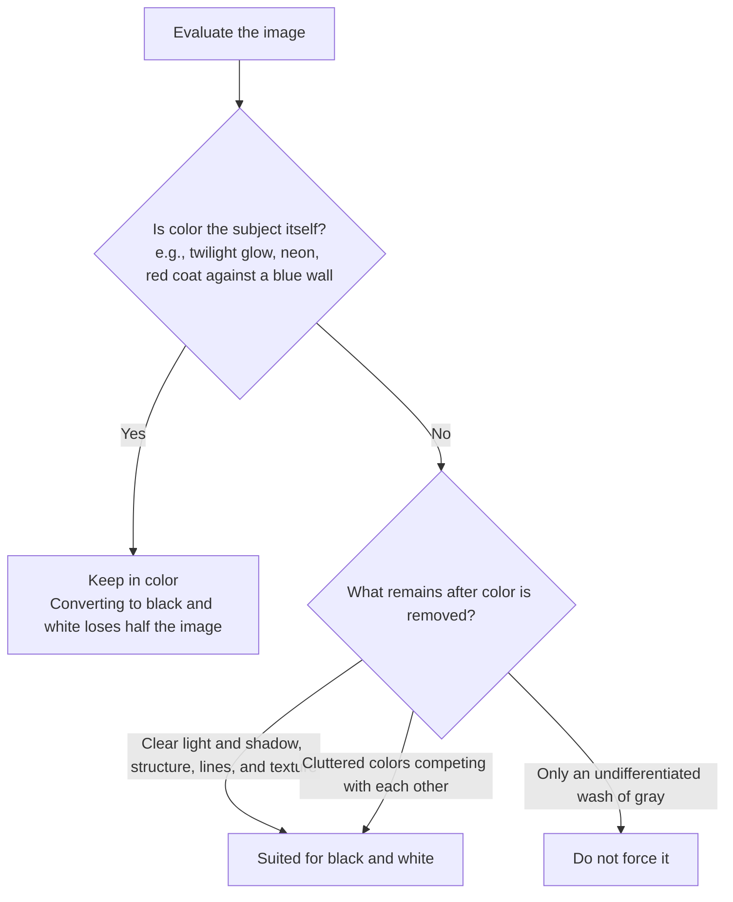

# Chapter 12 Black and White

> Black and white is not simply a matter of stripping away color. It adopts an entirely different way of seeing the world, bringing light and shadow, structure, texture, and a sense of time to the foreground.

---

## Black and White Is Not the Removal of Color

*Walker Evans, "Coney Island Boardwalk," 1929. Evans would later photograph small towns, farms, storefronts, and billboards across the American South for the FSA during the Great Depression. Many of his seminal photographs are in black and white—not merely due to the historical constraints of the era, but because he deliberately banished color from the frame, focusing his gaze instead on wood, corrugated iron, typography, doors and windows, and the postures of people. Long before pressing the shutter, he had already eliminated color in his mind's eye, attending solely to light, shadow, and structure. [Image Source and Reuse Notes](image-credits.md#evans-boardwalk)*

---

## Black and White Rearranges Attention

First, we must dispel a common misconception: black and white is not simply what remains after color is drained from a color photograph. Many assume that black and white is nothing more than an austere version of a color image—that dragging the saturation slider all the way to zero yields black and white. Yet follow that procedure in practice, and you will find that what results is almost invariably a flat, murky photograph devoid of any focal point. The reason is not difficult to grasp: each patch of gray produced this way merely corresponds mechanically to the luminance of its original hue; what ought to carry deep weight in the frame fails to settle down, what ought to be luminous fails to shine, and the entire photograph collapses into an undifferentiated mid-tone gray where everywhere looks virtually identical. That is not black and white; it is merely color stripped of its hue. Authentic black and white relies from the very outset on an entirely different standard for observing the world—looking at how light and shadow are distributed, how structure is assembled, and whether texture is coarse or delicate, rather than noting a patch of red here and a splash of blue there. Once color steps aside, another set of visual forces must rise up to anchor the frame—and those forces are precisely what you must perceive before releasing the shutter.

Not every photograph is suited for conversion to black and white. Before taking action, ask yourself a straightforward question: In this photograph, is color helping, or is it merely getting in the way? Deceptively simple, this question governs virtually every subsequent decision, for it compels you to discern, before touching a single control, what the image before you truly relies upon.

If the colors in a frame are chaotic from the start—background signage, pedestrians' clothing, disparate lighting, and painted walls all clamoring for dominance with none yielding to another—converting to black and white will likely bring an immediate stillness to the entire image; elements that once vied for attention through sheer vibrancy retreat into a shared stratum of gray, allowing the viewer's focus to return squarely to the subjects and the light. If what a photograph truly depends on is already lines, geometry, wrinkles, stone walls, tree bark, dramatic light and shadow, or human expressions, eliminating color will only make these qualities more concentrated and potent, since there are no chromatic distractions to scatter the eye. Black and white carries yet another advantage: it strips away temporal markers. In a color photograph, a fashionable palette, a season's wardrobe, or the idiosyncratic texture of a particular display will quietly date the image; black and white filters this layer of information away, ensuring the viewer is not immediately led astray by contemporary cues, and allowing the photograph to take on a timeless resonance.

Conversely, if color itself is the very substance of the photograph, black and white is an outright disaster. The fiery orange of a sunset, the kaleidoscopic blaze of neon, a single flower, an autumn leaf, a red garment set against a blue wall—these images cohere precisely because of their color; converting them to black and white discards half their essence on the spot. Another category of image is even more fragile: a mist-shrouded forest, an overcast harbor, those gentle grayish greens and slate blues that cohere only through exquisitely subtle chromatic relationships. In terms of luminance, they barely differ; forcing them into black and white simply turns them into a muddy, formless wash of gray. A frequent mistake among novices is converting images they cannot properly color grade into black and white; while it may look like an aesthetic choice, it is actually an evasion of an unresolved technical problem. Black and white should always be the product of deliberate intent, never a retreat from difficult color.

On a more fundamental level, what makes black and white so enduringly compelling is that it performs an act of abstraction. Color photography always strives to deliver the world exactly as it is—red as red, blue as blue—separated from visible reality by only the thinnest veil. Black and white, by contrast, strips away the entire dimension of color, leaving only tonal gradations, contours of form, nuances of texture, and trajectories of line. With one fewer variable in the frame, there is one fewer shortcut: the image can no longer rely on a seductive flash of color to hold the viewer, but must sustain itself through these foundational elements alone. A black-and-white photograph thus always carries a certain detachment from raw reality; it is less a replication of the moment before the lens than a distillation of it.

This layer of abstraction is both the challenge of black and white and its distinct strength. The difficulty lies in the fact that without color, the visual vocabulary of the image is suddenly stripped of a major device; anything that previously depended on color to stay afloat is now thoroughly exposed. Yet its strength lies in the very same circumstance: when reds, blues, oranges, and greens withdraw from the stage, the remaining tones, forms, textures, and lines are thrust to the fore, with nowhere to hide behind chromatic dazzle. A photograph whose weaknesses were masked by vivid hues will, upon conversion to monochrome, instantly reveal whether its architecture is sturdy or frail. Black and white is uncompromising; it lays bare the photograph's true skeleton.

Synthesizing these principles yields a decision path you can quietly trace in your mind before releasing the shutter or opening post-processing software:

---

## Pre-visualizing Tonal Values in the Field

The first step in learning black and white is training yourself to set color aside right there in the field. When walking down the street and catching sight of a frame, do not rush to admire its colors; look at it instead by way of subtraction: Where are the brightest highlights? Where are the deepest shadows? Is the transition between the two a hard edge or a gentle, soft-toned gradation? Next, examine whether there is texture in the frame—weathered walls, wrinkles, fabric, tree bark, old doors, ground soaked by rain. In color, these elements may be unremarkable because color steps in front and covers them; but in black and white, the moment color falls away, they all gain sudden weight. Finally, ask yourself the decisive question: If color were stripped away right now, what would be left of this photograph? If what remains is a clear articulation of light and shadow and a sturdy structural framework, black and white has a chance; if what remains is merely an undifferentiated scatter of near-identical grays, do not force the issue.

Herein lies one of the most underestimated difficulties of black-and-white photography. Many take it for granted that removing color will make things simpler—after all, there is one less element to worry about in the frame. The reality is quite the opposite: once color disappears, the image loses a vital means of separation. Imagine a red apple resting against a cluster of green leaves. In color, the red and green create a stark contrast, and the subject leaps out at once; you hardly even need to labor over composition, as color itself divides the apple from the foliage. Yet while red and green are two entirely distinct hues, their luminance values may be nearly identical. Once converted to gray, both collapse into virtually the same tonal level, and the clear boundary that existed just moments ago vanishes into thin air—the apple simply sinks into the leaves and disappears. The free shortcut afforded by color is revoked in black and white. This is the fundamental reason black and white depends far more heavily on light and shadow than color does: stripped of color as a shortcut, isolating a subject from its background can be accomplished only through highlight and shadow, through gradients of luminance, and by no other means.

If the passage above leaves only an intuitive impression that "red and green may have nearly identical luminance," it has not yet reached the bottom of the matter; calculating it rigorously reveals what is truly hidden within this translation. Converting color to gray is not a matter of simply averaging the red, green, and blue channels; it is weighted according to the human eye's varying sensitivity to different spectral wavelengths. Rec.709 commonly employs the following set of coefficients to define the relative luminance \(Y\) of **linear-light RGB**:

\[ Y = 0.2126\,R + 0.7152\,G + 0.0722\,B \]

Green carries the highest weight, blue the lowest, and red sits in the middle; this expresses human visual sensitivity under standard viewing conditions. Note, however, that \(R\), \(G\), and \(B\) in the formula represent linear values after the removal of sRGB gamma; one cannot simply plug in 0–255 encoded values directly. In practice, software may also perform color management before applying its own black-and-white mixing algorithms. As such, this formula serves to explain principles and directions rather than function as a pixel-by-pixel calculator across every application. Even so, it demonstrates the critical reality: two hues may appear starkly different to the eye yet possess nearly identical luminance; once hue is removed, their boundaries vanish.

Once you grasp this principle, you also understand where the truly potent dial in black-and-white post-processing is located. Many people instinctively crank up the tonal contrast, assuming that boosting contrast will automatically make the subject pop. Yet contrast only amplifies existing differences in luminance; when the apple and the foliage already sit on virtually the same level of gray, even the steepest contrast curve will merely brighten or darken both in tandem. Where there is no difference, there is nothing to amplify. The genuinely effective approach is to adjust the luminance corresponding to each individual color separately: darken the reds by a stop, push the blues deeper, leave the greens where they are—and that apple floats right back to the surface of the foliage. This is precisely why later discussions will repeatedly return to color channels: in black and white, though what you adjust appears as gray, what is actually moving is color. The weighting formula above is the foundational lookup table upon which this entire translation from color to gray originally rests.

There is another crucial point embedded here: the Rec.709 weights are merely defaults, not commandments. In digital post-processing, there is a specialized tool known as the **channel mixer** (which recombines the red, green, and blue channels into a grayscale image based on adjustable weights). What it does is allow you to rewrite these three coefficients with your own hands, deciding afresh how deep a gray each color should become. The default formula allocates seventy percent of the weight to green, twenty percent to red, and less than ten percent to blue, ensuring that the converted gray tones closely match the eye's perception of overall brightness. But the moment you raise the weight of red, every reddish element in the frame brightens together—brick walls, rooftops, and skin tones are all lifted, while the blue sky, inherently dark in the red channel, recedes into deep shadow. Given the same color original, applying different weights can yield several black-and-white renditions of radically different tonal distributions—and they do not, in truth, speak the same language.

In a channel mixer, keeping the sum of the weights roughly constant generally prevents major shifts in overall brightness, though this is not a law of physics. Some software normalizes the values automatically, while other programs permit negative weights to produce sharper visual separation. The ultimate standard of judgment remains the image itself: check whether highlights are clipping, whether shadow noise is being amplified, and whether unnatural banding or posterization is appearing in skin tones and skies.

Placing a few common scene elements into this framework makes the translation from color into gray concrete:

| Scene Element | Dominant Channel | Default Grayscale Tone | With Increased Red Weight | With Increased Green Weight |
|---|---|---|---|---|
| Blue sky | Blue | Moderately bright | Noticeably darkened | Slightly darkened |
| White clouds | High across all three channels | Bright | Remains bright, separating from sky | Remains bright |
| Brick walls, rooftops | Red | Medium | Brightened | Darkened |
| Skin tones | Red, orange | Moderately bright | Brightened, luminous | Darkened, muddy |
| Green foliage, grass | Green | Medium | Darkened | Brightened, richer tonal gradation |

This table and the color filter reference chart later in the chapter are describing the very same phenomenon, simply from different vantage points: here, we look backward from post-processing channels; later, we look forward from the colored glass once screwed onto the front of the lens. Whichever way you approach it, the conclusion is identical: no single conversion method is inherently more "correct"; there is only which color in the frame you wish to lift, and which you choose to subdue.

!!! example "Case Analysis: A Red-Brick Clock Tower Under a Blue Sky"

    In color, this photograph succeeds on the contrast between red brick and blue sky; converted to black and white using default weights, however, both collapse into similar mid-grays, and the clock tower is swallowed entirely by the sky.

    - To make the clock tower stand out: Increase the red channel and pull down the blue channel. The brickwork lifts forward, the blue sky sinks toward an inky darkness, and the white clouds stand out like bas-relief—the exact equivalent of mounting a red filter in the film era.
    - To let shape speak: Invert the approach by suppressing red and boosting blue. The clock tower drops into a silhouette, leaving the frame defined solely by its outline against the geometry of the sky.
    - Whichever version you choose, always assess the cost: A deeply darkened sky falls squarely on the portion of the red channel with the poorest signal-to-noise ratio. Zoom in to check whether noise and banding have emerged, and apply dedicated noise reduction to the sky if necessary.

    Both renditions are valid. Channel mixing is never simply a choice of parameters; it is a deliberate decision about whether this photograph is speaking of the texture of brick, or of the relationship between graphic shape and the sky.

There is an unpretentious yet remarkably effective practice: squinting at the world. When you squint, colors and trivial details recede first, allowing masses of highlight, patches of shadow, and broad forms to float to the surface—an experience already very close to the black-and-white way of seeing. Your camera can help as well if you set the viewfinder to monochrome: Fujifilm's Acros simulation, or the respective black-and-white picture profiles in Sony, Canon, and Leica systems, will display a colorless world directly in the viewfinder, showing you on the spot an approximation of what the finished image will look like. The most dependable method is to record RAW and monochrome JPEG simultaneously: let the JPEG guide your evaluation in the field, allowing you to see clearly while still standing before the scene whether the composition holds up once color is stripped away; let the RAW file preserve the full color information until you return home, giving you the freedom to fine-tune it deliberately at your computer.

Precisely because it lacks the fallback of color, black and white depends far more heavily on light. In color, hue can sometimes compensate for flat, lackluster lighting—a red wall or a blue coat is inherently enough to draw the eye, even when the light is completely devoid of modulation. Black and white shuts that door entirely, leaving only light and shadow, shape, and texture at your command. When the light is flat, none of these elements can establish themselves, and a black-and-white photograph easily collapses into an undifferentiated plane of gray. Interestingly, harsh and aggressive qualities of light that might seem unyielding in color often prove ideal in black and white: the direct glare of midday sun, an unsparing slash of sidelight beside a window, or a crisp rim of backlight tracing a silhouette may look glaring in color, but in black and white, they chisel out wrinkles, stone walls, and the skeletal structure of a figure with unmistakable clarity. Therefore, when shooting in black and white, do not look only for soft, agreeable light; actively seek out stark tonal differences. Sidelight, backlight, a blade of light squeezing through a door crack, or the taut boundary where deep shadow presses directly against highlight—all of these will erect a sturdy structural spine for black-and-white photography.

---

## Organizing Tone with the Zone System

Back in Chapter 3 on exposure, the act of metering was already framed through the logic of the Zone System; in black-and-white photography, however, it ceases to be a mere aid to exposure and becomes virtually the very backbone of the photograph itself. Formulated jointly by Ansel Adams and Fred Archer, the Zone System divides the tonal continuum from pure black to pure white into a series of distinct gradations. You do not necessarily need to commit the entire system to memory, but it is well worth grasping the underlying principle: a black-and-white photograph is never simply a crude matter of "a bit brighter" or "a bit darker." It demands that you assign an intentional place to every part of the frame—determining which areas should fall into total blackness without a trace of detail, which should preserve the tactile texture of deep shadows, which belong in middle gray, and which should climb toward near pure white. This is, at heart, a discipline of allocation: given the same assortment of grays, if orchestrated thoughtfully, the image gains order, weight, and cadence; if mismanaged, tones collapse into a crowded heap where nothing holds its ground. Mastery of this tonal allocation is, in essence, the dividing line between mediocre and exceptional black-and-white work.

Since we have brought up the Zone System, let us lay out its vocabulary in full; it is not, after all, particularly esoteric. Adams's Zone System divides the entire tonal span from pure black to pure white into eleven zones, numbered 0 through X. Adjacent zones differ by exactly one stop of exposure, and right at the center lies Zone V—that 18% reflectance neutral gray, which is precisely the benchmark light meters calibrate toward by default (strictly speaking, a light meter's calibration point is slightly below 18%, differing by about half a stop, as noted in the footnotes to Chapter 3; here we follow convention and refer to it as 18%).

| Zone | Meaning |
|---|---|
| 0 | Pure black, devoid of detail |
| III | Textured shadows |
| V | Neutral gray (18% reflectance) |
| VII | Textured highlights (e.g., the folds of a white shirt) |
| X | Pure white, devoid of detail |

Deceptively simple though this table may appear, its true power lies in providing an entirely new syntax for the concept of "exposure." Without the Zone System, exposure is merely a number on the camera—a vague notion of being somewhat brighter or darker. With the Zone System, exposure becomes an articulate statement: *I want this sun-bleached rock to fall on Zone VII, making it brilliantly luminous while still preserving the tactile texture of its surface; I want that tree in the shadow to fall on Zone III, allowing it to sink deep while keeping the branches and foliage legible.* Once you have thought through which zone every element in the scene should occupy, you can work backward to determine the required exposure and the degree of expansion or contraction needed during development; metering and chemical development are thereby bound into a single, cohesive thread. What truly matters about the Zone System was never the eleven boxes themselves, but the fact that it forces you, before tripping the shutter, to use this language to deliberately place every patch of light and shadow across the entire frame.

*Original diagram: From pure black in Zone 0 to pure white in Zone X, adjacent zones differ by one stop of exposure; Zone V represents the middle gray to which light meters calibrate by default. [Image Credits & Reuse](image-credits.md#zone-system)*

Putting this language into practice usually begins with a counterintuitive little experiment: aim your light meter at a blanket of fresh snow and expose strictly according to its reading; the developed snow will not be white, but a dull, muddy gray. A light meter cannot distinguish white from black; it is programmed to render whatever it measures as middle gray—Zone V, with its 18% reflectance. Metering against snow, it treats the snow as middle gray; metering against a pile of coal, it faithfully lifts the coal to that same middle gray. The first step of the Zone System is to refuse to be led around by the meter and instead practice active **placement** (intentionally positioning a specific tonal value into your chosen zone): you select a critical shadow in the scene and decide that it belongs in Zone III as "detailed shadow," and you consequently reduce exposure by two stops from the meter reading to lock it there. Once this anchor point is nailed down, all other tonal values across the frame will **fall** (fall into place) according to their inherent contrast relative to that chosen anchor, each settling into its corresponding zone.

Placement is governed by exposure; yet after the remaining tones have fallen into place, the brightest values at the highlight end may not land precisely where you want them. That is where development enters the picture. The classic, endlessly quoted maxim of the Zone System addresses precisely this: **Expose for the shadows, develop for the highlights.** Negative film has a distinct temperament: shadow density responds almost exclusively to exposure—if you underexposed by two stops at the moment of capture, the shadows remain stubbornly buried there, and no amount of over-development in the darkroom will reliably bring them back. Highlight density, on the other hand, expands and contracts with development time: develop a little longer, and the highlights grow denser and overall contrast widens. Consequently, when shooting on a dreary, flat, overcast day, you place the shadows as usual and then deliberately extend development to push the highlights upward, forcefully expanding the contrast—a process known as expansion, designated as N+1. Conversely, beneath the harsh, blinding contrast of midday sun, you shorten development time to pull the highlights back, preventing them from blowing out into featureless white—known as contraction, designated as N-1. Pairing a single exposure with a tailored development time amounts to custom-crafting a unique grayscale response for that specific negative.

This methodology is most at home in large-format photography, where each sheet of film is an independent unit capable of receiving its own bespoke development; once you move to a roll of 35mm film where thirty-six frames share a single chemical bath, individual sheet-by-sheet calibration becomes impossible. Digital photography has inherited this exact logic intact, merely swapping out the tools: during exposure, you guard both extremes against clipping (which is precisely what the digital histogram monitors for you); once back at the computer, you use curves and tonal sliders to reallocate the highlight values that were once expanded or compressed through altered development times. The physical operation in practice was already outlined in Chapter 3: spot-meter the specific area you wish to anchor, and adjust exposure compensation according to the zone you want it to occupy—one stop per zone. But there is a fundamental reversal in direction that must be committed to memory: negative film tolerates overexposure far better than underexposure, and shadows rely strictly on exposure, so the film maxim is to place the shadows and err on the side of generous exposure; digital sensors behave in precisely the opposite manner—once highlights blow out, they are gone forever, whereas shadows can still be lifted in post. Thus, "placement" in digital practice is largely about placing the brightest key highlight: first nail down the zone where the highlights must land, allow the shadows to fall where they may, and recover them later in software if necessary. Within the same conceptual framework of the Zone System, film begins with the shadows while digital begins with the highlights; the direction has inverted, but the sequence—deciding the fate of one extreme first before turning to reign in the other—remains utterly unchanged.

A common and robust approach to black-and-white image making is to anchor the frame with a distinct black point, a clean white point, and a continuous progression of intermediate grays; when beginners simply desaturate an image mechanically, all values tend to crowd into a narrow band of middle gray, resulting in a muddy, indistinct appearance. Yet this does not dictate that every single photograph must contain both pure black and pure white simultaneously: high-key, low-key, foggy scenes, minimalism, and works with deliberately compressed tonal ranges may all consciously sacrifice one end of the spectrum. The real test is whether your tonal span is the product of a deliberate creative choice, or whether the image merely turned out drab and muddy through a failure to establish intentional tonal relationships.

How you distribute values along this grayscale spectrum defines different aesthetics of contrast. High-contrast black-and-white strikes like a heavy hammer: deep blacks and stark whites collide head-on with scarce intermediate gray, rendering the image unyielding, direct, and uncompromising. William Klein photographing New York and Daido Moriyama shooting Shinjuku both pushed the street to this visceral pitch—grain, blur, signage, faces, and shadows crowded together into a tight frame, confronting the viewer head-on. It is exceptionally well suited to dramatic street scenes, stark portraits, and conceptual work, where raw, visceral impact is its greatest strength; yet precisely because its intensity is dialed to the maximum, an entire series rendered in this aggressive manner quickly induces visual fatigue, and even the sharpest impact dulls with relentless repetition. Moderate contrast is the most widely traveled and enduring path: both black and white anchors are firmly present, while intermediate grays remain richly nuanced, endowing the image with both structural solidity and breathing room. The street photography of Henri Cartier-Bresson, the landscapes of Ansel Adams, and the still lifes and nudes of Edward Weston all placed immense value on these subtle middle gradations; such images may not deliver an instant visual shock, but they reward sustained, repeated contemplation as their visual wealth unfolds gradually over time. Low contrast, by contrast, is gentler: neither black nor white is pushed to extremes, and the entire composition transitions quietly through subtle permutations of gray. Hiroshi Sugimoto's seascapes and Michael Kenna's snow-covered plains and still lakes both rely on these hushed, understated grays to make time itself feel as though it has slowed to a crawl. To be clear, low contrast by no means signifies a failed exposure; it is simply a deliberate restraint of force. Yet precisely because of this restraint, it imposes far stricter demands on the underlying compositional structure of the frame: if the structure is weak, lacking the dramatic crutch of stark light and shadow to anchor it, the entire image falls apart.

While contrast describes the distance between the brightest and darkest values, there exists another concept often confused with it but entirely distinct in nature: **high-key** and **low-key** (referring to whether the overall tonal weight of an image tilts predominantly light or dark). Contrast governs the span between the two poles of black and white, whereas key governs where the collective visual weight of the frame settles—leaning toward the bright side or the dark side. These two dimensions operate independently: a photograph can be simultaneously high-key and low-contrast, or low-key and high-contrast; there is no inherent contradiction between them.

In a high-key photograph, the majority of tonal values sit well above middle gray, rendering the image bright, luminous, and pristine; dark accents, if present at all, appear only as delicate touches. It carries an innate mood of airy lightness, softness, and openness, and is frequently employed in fashion, beauty, maternity, and infant photography where an atmosphere of purity and radiant clarity is desired; high-key portraiture against white backdrops is especially common, where skin is evenly illuminated until even subtle imperfections seem washed away. The difficulty with high-key imagery lies in the razor-thin margin separating it from blown-out overexposure: a moment of carelessness, and the brightest regions dissolve into dead, featureless white devoid of all texture. Its true test, therefore, is whether you can hold the highest values securely poised just a fraction below pure white.

Low key is precisely the opposite: most tonal values sink below middle gray, the frame is dominated by dark tones, and light enters only through a narrow pocket, lifting the subject out of the darkness. This key naturally feels deep, mysterious, solemn, and even carries a hint of danger. In cinema, **film noir** (that cycle of crime films from around the 1940s characterized by shadowy lighting and an oppressive atmosphere) relied on low-key lighting to press suspense and unease into every frame; tracing further back, it connects to the chiaroscuro tradition of Rembrandt and Caravaggio, where a single shaft of light sculpts a face out of an expanse of darkness. The difficulty of low key lies at the opposite extreme: the shadows cannot simply collapse into crushed, featureless black. You must let the shadows sink deep, yet still preserve within them details that hover on the edge of visibility.

---

## Three Paths to Black and White

Technically, there are roughly three paths to black and white, each serving its own purpose and suited to different photographers and different ends. One pins you to the scene, forcing you to see through black-and-white eyes on the spot; another reserves the greatest leeway for after you return home, allowing you to sit before the computer and deliberately assign each individual color its corresponding gray; and a third alters the very rhythm of your shutter release, making every press deliberate and weighty. They are not mutually exclusive; many photographers walk them simultaneously, drawing from each at different stages as needed.

The first path is in-camera black and white, which is particularly suited for training your vision, because what you see through the viewfinder is monochrome right then and there, without a fraction of a second's delay. The virtue of this approach lies not in saving time in post-production, but in making you understand on the scene what truly remains of an image once color recedes. A pedestrian in red walking down the street stands out strikingly in a color viewfinder, seizing your attention at a glance; but switch to black and white, and the viewfinder immediately confronts you with a brutal truth: once red turns to gray, is the person still bright enough, can they separate from the background, or will they sink into it just like that apple? This kind of immediate feedback cannot be learned from theory alone, because it collapses the time lag between judgment and result to zero.

At the terminus of this path stands an extreme breed of machine: dedicated black-and-white digital cameras, such as the Leica M Monochrom and the Pentax K-3 Mark III Monochrome. They forgo the sensor's RGB color filter array entirely, allowing each pixel to record luminance directly without the guesswork of demosaicing algorithms, reaping tangible gains in both sharpness and high-ISO performance. Yet this surgical cut lands squarely on the most powerful dial discussed in this chapter: the moment the frame is captured, it is already gray. Color information was never recorded in the first place, rendering channel mixing permanently defunct: you can no longer return home to darken the blue sky or brighten skin tones in isolation. To control how color translates into gray, only one old road remains: screwing physical color filters back onto the front of your lens. These cameras are the ultimate counterproof to the principle that "what you adjust is gray, but what you move is color": once color is genuinely gone, that dial vanishes along with it. Those who buy them are chasing precisely this burn-the-boats resolve, but you must first be clear with yourself about whether you are willing to surrender that freedom.

The second path is shooting color RAW and converting to black and white after returning home. This is the most flexible route, because it gives you granular control over how bright each original color becomes in monochrome. A blue sky can be darkened in isolation while white clouds remain bright, cleanly restoring the boundary between sky and cloud; in portraits, gently lifting the red and orange channels renders the skin cleaner; green leaves, red walls, and yellow lamplight can all be translated into distinct gray values through their respective channels—you effectively hold a complete console of switches for translating color into gray. This essentially takes the color filters screwed onto the front of lenses in the film era and migrates them into post-production: back then, a red filter darkened the blue sky and made white clouds pop by blocking or transmitting specific wavelengths of light; today, a single channel slider accomplishes the exact same thing, and the decision can be reversed at any time after the fact. This is precisely why, even if your sole intention is to shoot black and white, it is still best to keep the RAW file: in-camera JPEG black-and-white gives you immediate judgment on location, while RAW allows you to return home and calmly fine-tune the corresponding gray for every single color.

### Technical Deep Dive: Film Filters, the Darkroom, and Grain

!!! note "Reading Path"

    The following section preserves the technical lineage of film emulsions, filter compensation, development, printing, and grain to explain where digital black-and-white tools originate. Readers who work exclusively in digital workflows may skip ahead to "Which Subjects Suit Black and White."

How the craft of optical filters originated is worth a brief historical detour, for it explains an enduring mystery of nineteenth-century black-and-white photography: why are the skies in those early photographs almost uniformly a stark, washed-out white? The answer lies not in the weather, but in the photosensitive materials themselves. Early photographic emulsions were sensitive only to blue and ultraviolet light; red and orange light left them virtually untouched. This stock would later be known as "blind" (or non-color-sensitized) emulsion; the slightly later, improved orthochromatic emulsion added sensitivity to green light, though it remained completely blind to red. The consequences were visible everywhere in the resulting photographs: blue skies were severely overexposed on the negative and thus printed out as blank expanses of white, obliterating any trace of clouds; red lips and red brick walls registered as nearly black; and those early portraits featuring darkened lips and somber, brooding faces owe half their grim demeanor to the emulsion's color blindness. It was not until the early twentieth century that panchromatic film finally made emulsions responsive across the entire visible spectrum, granting each hue its rightful value of grey. And the entire operational logic of filters was only possible once built on the foundation of panchromatic film: only when the emulsion responds to all colors can you use a piece of tinted glass to be selective, choosing which wavelengths to let through and which to hold back. Incidentally, orthochromatic film possessed a distinct advantage that panchromatic film could never match: because it was blind to red light, darkrooms could be illuminated with a red safelight, allowing photographers to watch the image emerge with their own eyes in the developing tray; once panchromatic film arrived, darkroom work had to be conducted entirely in pitch darkness.

Now that we have touched on carrying film-era filters over into post-processing, it is worth looking at several of the most common filters alongside their respective effects in one place. A film photographer would screw a colored filter onto the front of the lens; it transmits light of its own color and blocks its complementary color, thereby brightening matching hues and darkening complementary ones. In the digital realm, the equivalent technique is brightening or darkening the corresponding color channel in post-processing. The underlying principle is identical, as is the directional effect; the table below places the two side by side.

| Filter / Weighted Channel | Brightened | Darkened | Common Uses |
|---|---|---|---|
| Red | Red, orange (skin tones, brick) | Blue (sky turns very dark), green | Darkening blue skies; creating dramatic clouds |
| Orange | Skin tones | Blue, some greens | Luminous portrait skin tones |
| Yellow | Warm tones slightly brightened | Blue sky gently darkened | Most natural sky darkening |
| Green | Foliage, greens | Red, skin tones | Landscape foliage; note skin tones will appear dark |

When studying this table, two points are particularly worth keeping in mind. The first is the sky: from yellow to orange and on to red, the intensity with which blue sky is darkened increases steadily. A yellow filter delivers the gentlest darkening—the closest to the perception of the human eye and the most unobtrusive—while a red filter can drive clear skies down to near inky-black, making white clouds stand out from the background like high-relief carvings. Most dramatic skies in landscape photography are born this way. The second is skin tone: red and orange make skin appear luminous and clean, because human skin inherently leans toward red and orange tones; brightening these two color channels is akin to draping the face in a flattering soft light. A green filter does the exact opposite: it suppresses red and lifts green, rendering foliage in landscapes all the more lush and rich, but when turned toward human subjects, it inevitably drags skin tones down into darkness and muddiness. Therefore, whether choosing optical filters or adjusting digital channels, no single option is inherently superior; it is purely a question of which colors in the frame you wish to lift into brightness, and which you wish to sink into shadow.

There is another reality that digital color channels will never warn you about, yet anyone screwing on a physical filter back in the day had to keep firmly in mind: filters eat light. Since a filter functions by blocking light of certain colors to darken the corresponding skies or foliage, the blocked light no longer reaches the film; the entire exposure is darkened accordingly, requiring compensation by either slowing the shutter speed or opening up the aperture. This exposure compensation is by no means trivial: a pale yellow filter requires about one stop of additional exposure; a standard red filter (such as a Wratten #25) requires roughly three stops; and a deep red filter (#29), truly capable of turning clear skies to near-black, often demands around four stops. Thus, in the film era, choosing a filter was never simply a matter of selecting an aesthetic effect; it was an active trade-off against shutter speed, depth of field, and handheld stability: if you wanted to darken a blue sky, you had to accept a three-stop penalty on shutter speed, or else claw back exposure via ISO or aperture. Digital post-processing wipes this debt clean: darkening a blue sky in the color channels forfeits not a single photon of incoming light—a gratis luxury inherited when the craft migrated to software.

The third path is black-and-white film: Tri-X, HP5, T-Max—each has its own grain character, response curve, and processing ecosystem. Tri-X 400 is a classic staple of street and documentary photography; HP5 Plus 400 boasts extensive documentation for push processing; and the T-Max and Delta series excel in fine grain. In practice, contrast and usable exposure latitude are shaped collectively by exposure, developer choice, dilution ratio, temperature, development time, and whether one scans or makes darkroom prints. Although XP2 Super yields black-and-white images, it relies on the chromogenic C-41 process; this allows it to be handled by standard C-41 processing labs, though that does not mean every lab will accept it or scan it as true monochrome, so verifying with the lab beforehand remains essential. Developing at home requires developing tanks, measuring graduates, and a suitable changing bag or pitch-black space, along with strict adherence to chemical safety instructions regarding ventilation, protective gloves, proper storage, and chemical waste disposal.

The "characteristic curve" mentioned here is practically a film emulsion's identity card. Plotting the logarithm of exposure on the horizontal axis against developed density on the vertical axis typically reveals a toe, an approximately straight-line section, and a shoulder; together, they dictate shadow threshold, overall contrast, and highlight roll-off. Traditional cubic-grain emulsions and tabular-grain (T-grain) emulsions like T-Max and Delta differ in grain appearance, resolving power, and development response, yet one cannot assert that one has superior exposure latitude simply based on whether it is "traditional" or "T-grain." So-called push processing means shooting at a higher exposure index (EI) paired with extended or intensified development; while it generally raises midtone and highlight density along with contrast, it cannot magically conjure back shadow details that were never captured during exposure in the first place.

Film is slow, expensive, and demanding, yet it tangibly alters the cadence with which you release the shutter. Because every single frame incurs a real cost, you cannot fire away without restraint as you might with digital. With no instant playback screen, you are forced to think everything through before pressing down: Is the light sufficient? Where does the focus fall? Is this frame truly worth taking? Film is certainly no shortcut to great photographs—an entire roll may finish without yielding a single keeper; yet it possesses a genuine power to compel one to slow down, gathering squandered attention and returning it squarely behind the viewfinder.

Whichever path you choose, the core of black-and-white post-processing always hinges on a single task: distributing blacks, whites, and midtone greys. Any preset offers at best a starting point; it can never make the definitive judgments on your behalf. First establish the black point, allowing the deepest shadows to sink firmly to the bottom; then set the white point, giving the brightest highlights a definitive anchor. Do not fear surrendering a minute amount of detail: pure black and pure white are intrinsic components of the black-and-white vocabulary, not technical mistakes—it is precisely these extremes that pin down both ends of the tonal range. Next, use color channels to control tonal values; this is where true craftsmanship shows. Black and white appears devoid of color, yet the colors in the original image dictate the brightness and darkness of every tone in the conversion. Though what you adjust appears as grey, what you are manipulating is color itself; commanding color channels is the watershed between superficial and nuanced black-and-white editing. Grain can also be introduced in moderation: digital monochrome is by default excessively smooth—so smooth it feels unnatural—and adding a touch of grain lends the image texture, density, and physical presence, qualities that street, portrait, and low-light work especially favor. Black and white can likewise lean warm or cool: cool tones feel austere and crisp, while warm tones evoke aged paper or silver gelatin prints. In the darkroom era, this tonal inclination had a formal name: toning. It involved immersing a developed print into a chemical bath to trigger a secondary chemical reaction with the metallic silver in the emulsion. Selenium toning was among the most sophisticated methods: a light application merely deepens the blacks while substantially extending the archival permanence of the print, whereas stronger toning imparts a cool, purplish-brown hue to the deep shadows; sepia toning (sulfide toning) pushes the entire photograph toward warm browns, giving vintage photographs that characteristic aged-paper coloration. The split-toning tools in digital software essentially emulate these chemical baths, tinting highlights and shadows with complementary warm or cool tones—a technique we will revisit in Chapter 13 on color grading. However, whether leaning warm or cool, strive for consistency across a body of work: avoid having one image cool and the next warm, or one print grained like sandpaper while another looks as sterile as plastic; otherwise, the series will appear as though it were made by several different pairs of hands.

Viewed as a unified sequence, digital black and white is something that the mere word "desaturation" can never encompass: first anchor both ends with black and white points, then use color channels to determine the depth of each hue, modulate the overall hardness or softness of the image through contrast, and finally perform the most painstaking craft of all: **dodging and burning** (dodge & burn—selectively brightening or darkening isolated areas of the frame). This technique originated in the darkroom: during enlarger printing, holding a small piece of cardboard to shade a corner of the projected image reduced the light reaching that area, making it develop out lighter—this was dodging; conversely, exposing an isolated patch for extra time made that area darker—this was burning. Digital editing has adopted this ritual in full: you can lift a subject's face by half a stop, pull down an overly distracting bright wall in the corner, and incrementally guide the viewer's eye precisely where you want it to go.

Most masters of black-and-white are adept hands at dodging and burning. The reason the sky in Ansel Adams's famous *Moonrise, Hernandez, New Mexico* appears so dense, deep, and tranquil in the final print is precisely because he repeatedly burned in the sky during printing; placed in different hands, that very same negative could yield prints of vastly different tonal depth. W. Eugene Smith was even more notorious for spending an entire day in the darkroom over a single image, painstakingly recalibrating every nuance of light and shadow again and again. The underlying principle is quite simple: a black-and-white photograph does not emerge fully formed straight from the camera; it is orchestrated piece by piece between the shadows and the highlights, and its ultimate persuasiveness is often concealed within these quiet, understated local adjustments.

Speaking of the darkroom, we must supply the third phase of the Zone System, which this chapter has deferred until now. Earlier we discussed the adage "expose for the shadows, develop for the highlights," but Adams's workflow was actually a three-part process: after exposure and development comes printing, where contrast can be controlled once more upon the paper. Traditional black-and-white photographic papers come in numbered grades: Grade 0 is soft, with low contrast, while Grades 4 and 5 are hard, with high contrast; switching to a different grade with the same negative yields an entirely different photograph. The multigrade paper that later became standard relies on changing color filters on the enlarger, allowing a single sheet of paper to span the full spectrum of contrast from soft to hard—or even allowing different areas within a single print to be exposed at different contrast grades. Paper bases also divide into two distinct camps: resin-coated (RC) paper washes and dries quickly, lies flat, and is ideal for practice; fiber-based (Fiber) paper demands laborious time and effort, but yields deeper blacks, richer tonal gradations, and greater archival permanence, making it the near-universal choice for serious exhibition- and collector-grade prints. This stage has its exact digital counterpart: printing black-and-white on an ordinary color inkjet printer relies on blending colored inks to simulate gray, easily resulting in unwanted color casts; the refined approach uses photo printers equipped with multiple shades of monochrome gray inks, so that black-and-white is rendered in genuine gray pigments. Moreover, anyone who has printed knows another truth: a glowing black-and-white image on a screen and a reflective black-and-white print on paper are fundamentally not the same photograph (on a screen, black can be as dark as an extinguished emitter; on paper, black can never be deeper than the ink itself). Thus, serious black-and-white work must always face its final reckoning on paper. We will return to this when discussing printing in Chapters 13 and 14.

Let us turn specifically to grain. As mentioned earlier, introducing a touch of grain to digital black-and-white can restore density to an overly smooth image; yet grain and digital noise are frequently conflated, even though their origins are fundamentally different and well worth distinguishing. Film grain consists of the physical clumps of silver halide crystals left behind in the emulsion after development; because the crystals vary inherently in size and scatter randomly across the frame, the grain exhibits a soft, organic texture. The higher the sensitivity of a black-and-white film, the larger its crystals and the more pronounced its grain. In classic high-speed stocks like Tri-X and HP5, that slightly gritty grain has become virtually their signature—and for many photographers, it is precisely what they are after.

Digital noise is another matter entirely. It stems from the statistical fluctuations of arriving photons, the sensor and its readout circuitry, and the effects of dark current and temperature that become pronounced during long exposures. It is broadly divided into luminance fluctuations and chrominance artifacts, manifesting most readily in areas where exposure was insufficient at capture and subsequently lifted in post-processing. High ISO cannot be cited in isolation as the root cause of noise: in RAW shooting with identical aperture and shutter speed, raising the analog gain neither increases nor decreases the light collected by the sensor, and on some camera bodies it actually reduces downstream readout noise; the true culprit is typically restricting light intake for the sake of shutter speed or depth of field, only to amplify that weak signal afterward. Once converted to black-and-white, the chrominance speckles lose their color, yet the luminance fluctuations remain. Furthermore, using a channel mixer can easily elevate a channel with a low signal-to-noise ratio along with all its noise; therefore, when making aggressive channel adjustments to expansive, smooth expanses like skies, one should inspect the noise and banding separately at the final output dimensions.

| | Film Grain | Digital Noise |
|---|---|---|
| Origin | Physical entities left behind by developed silver halide crystals, naturally varied in size | Errors and statistical fluctuations during sensor signal readout |
| Distribution | Randomly distributed; size and morphology determined by film stock and development | Most conspicuous in underexposed, boosted shadows and long-exposure thermal noise; the effect of ISO depends on the camera body and shooting conditions |
| Appearance | Soft-edged, organic, resembling a tactile texture | Rigid and mechanical; chrominance speckles are especially jarring |
| Attitude | Frequently embraced as a stylistic choice or deliberately added | Typically suppressed, though desaturated luminance noise is sometimes retained as faux grain |

Grain, then, is not necessarily a defect. It is sometimes the indelible imprint left by film, sometimes a deliberate layer of texture laid down to allow a sterile digital image to breathe again. Only by grasping the distinction between grain and noise can you avoid the folly of struggling to suppress usable grain while inadvertently leaving genuine noise behind in the name of style.

---

## Which Subjects Suit Black-and-White

Certain subjects seem almost innately suited to black-and-white, and street photography is the quintessential example. Color on the street is often chaotic—clothing, advertisements, signage, and headlights jostle relentlessly for attention, none yielding to another. Convert to black-and-white, and these distractions recede, instantly clarifying gesture, light, shadow, and composition. Henri Cartier-Bresson worked in black-and-white on the street for decades precisely because color was a distraction, pulling him away from the essential matters of structure and timing; William Klein and Daido Moriyama pushed black-and-white street photography in an even grittier direction, turning heavy grain and camera shake into a language in their own right. When practicing black-and-white on the street, you would do well to start with light and shape: look for a sharp shadow cast by harsh light, a solitary figure passing before a white wall, a reflection caught in glass, or a shaft of light surging out from a subway entrance, rather than expecting dramatic events from the outset. Black-and-white street photography often happens like this: light and shape wait there first, already erecting the skeleton of the frame, until someone happens to step inside and complete it.

Portraiture is equally suited to black-and-white. Once skin tones, clothing colors, and extraneous background hues recede from the stage, the underlying structure of a face—the gaze, the wrinkles, the bone structure, and the play of light—is truly revealed. The viewer's gaze has nowhere else to wander and can only settle squarely back upon the face. In *In the American West*, Richard Avedon used a seamless white backdrop and large-format black-and-white film to photograph miners, cowboys, and laborers; his subjects were placed in a space with nowhere to hide, the background stripped so bare that not a single furrow on their faces could escape. Irving Penn's portraits of tradespeople and Peter Lindbergh's fashion portraiture followed the very same path: stripping away color so that the person emerges unencumbered. Yet a black-and-white portrait never succeeds simply by "subtracting color." Lighting placement must still be exacting—indeed, even more critical than in color: sidelight carves out the bone structure of the face; soft frontal light flattens the skin; rim light leaves behind only an outline. Whatever kind of presence you wish to evoke in a person, you must first cast upon them the corresponding light.

Converting landscape photography to black-and-white demands an extraordinary sensitivity to the architecture of light and dark. In Ansel Adams's lens, mountains, clouds, and snow rely entirely on the deliberate distribution of grayscale values—each ridge assigned its own distinct tone, cleanly demarcated from the next. Michael Kenna, photographing snowfields and calm lakes, presses black-and-white to the opposite extreme of delicacy, so ethereal as to evoke traditional ink wash, through an understated restraint. In digital post-processing, manipulating the red and orange channels can darken a blue sky and brighten white clouds, achieving an effect remarkably close to threading a red filter onto a lens in the film era. When shooting landscapes for black-and-white, you must be mentally prepared: beautiful color can no longer save an image, and a dazzling sunset may amount to nothing in monochrome. The foreground, middle ground, and background must establish their own separation through luminance alone. Snowcapped peaks, white clouds, deep pine forests, and shadowy river valleys—if their tonal relationships are not clearly articulated and their relative depths cannot be distinguished, they will blur into an indistinguishable, muddy mass the moment they are converted to black-and-white.

There are other subjects for which history and materiality made the choice of black-and-white for them. Documentary photography has long leaned heavily on black-and-white because it tempers the seduction of color, preventing vivid hues from diverting attention elsewhere and allowing events, individuals, and human conditions to confront the viewer with unmediated directness. The Lewis Hine child labor series discussed in Chapter 7 is among the earliest illustrations of this; W. Eugene Smith's 1948 photo essay *Country Doctor*, which followed a general practitioner in a small Colorado town for twenty-three days, captured weary faces, late-night house calls, and limp hands dangling beside the operating table, relying entirely on the somber weight of black-and-white tones to ground this gravity. Sebastião Salgado, photographing gold miners and refugees, has likewise remained steadfast in his devotion to black-and-white, noting that color tempts the eye to linger on the reds and blues of clothing when what he wants viewers to confront is the human condition. Yet to be thorough, this equation of "black-and-white equals seriousness" has long since loosened: after William Eggleston, color firmly entered art museums, and contemporary documentary and photojournalism predominantly favor color because color itself constitutes part of the factual record. Choosing black-and-white for documentary work today is no longer an institutional convention, but an act of personal judgment: does removing color actually bring clarity to the subject, or does it merely make the picture look like an "old photograph"? Architectural black-and-white, meanwhile, hinges on geometry: stone, wood, rust, concrete, and deep shadows possess extraordinary force in monochrome, amplifying both the roughness of material textures and the substantiality of architectural volumes. One must be vigilant when shooting, however: vertical lines that lean even slightly out of plumb have nowhere to hide without color to camouflage them, and the placement of shadows becomes far more consequential than in color. Where a color architectural photograph can rely on the palette of materials to seduce the eye, a black-and-white architectural image must stand purely on line and mass—every surplus or deficit exposed without reserve.

---

## Consistency Matters More Than Presets

When viewed together, a body of black-and-white photographs should feel as though it was crafted by a single person guided by a consistent judgment, rather than cobbled together from disparate, scattered frames. This unity can arise from similar contrast, shared tonality, and matching grain, or from related subject matter—so long as a common thread ties them together. When twenty to fifty photographs cohere into a series, the dazzle of any single frame becomes far less critical; the viewer will no longer fixate on an isolated image, but will look instead at the relationships among them, sensing whether you have observed through the same pair of eyes from beginning to end. This coherence cannot be achieved through mere intuition; there are several concrete, practical steps to take: begin the entire series from the same baseline preset or film simulation, locking in a uniform set of parameters for the black point, grain amount, and warm or cool tonal bias before making fine adjustments frame by frame (Chapter 13 discusses baseline presets, which apply directly here); before exporting, scale the whole series down to thumbnails and lay them out side by side on a single screen for review—which frame's blacks lack depth, or which frame's grays feel muddy and muffled, is far more readily apparent in thumbnails than at full screen; and whenever you spot an inconsistency, go back and align the black and white points rather than compromising and letting it slide. The reason Michael Kenna's snowscapes spanning several decades read like chapters in the very same book is precisely this near-obsessive consistency.

In working with black and white, several principles are worth keeping constantly in mind. Color is by no means easier than black and white; indeed, black and white's demands on structure and light—lacking color to serve as a safety net—are sometimes even more exacting. High ISO noise, frequently treated as a flaw in color photography, can transform in black and white into an evocative grain texture; the very same element assumes a new identity once its context changes. Black and white can certainly lend an ordinary scene a heightened sense of form, but it cannot rescue a photograph that was devoid of substance to begin with. Form is built upon content, never a substitute for it; do not expect to rely on it as a lasting disguise for emptiness. There are no shortcuts to cultivating this judgment; it can only be earned by setting color aside in the field time and again, and looking back afterward to verify your instincts. What you are training is not merely the mechanical act of clicking the "Convert to Black and White" button, but the gradual cultivation of an immediate, on-the-spot discernment: once color is stripped away, does this photograph still possess structure, light, and substance? Once this judgment becomes second nature in your hands, you will often know in your mind whether a scene belongs in black and white before you have even raised the camera to your eye.

---

## Exercises

Switch your viewfinder to black-and-white mode for a week. Select 3 photographs each day, and when reviewing them in the evening, write down a single sentence: why this frame is suited for black and white.

Find the 10 color photographs you were most pleased with over the past year, and convert each of them carefully to black and white. Compare which ones improved, which ones worsened, and which remained virtually unchanged.

Shoot a portrait and a scene of blue sky with white clouds. When converting them to black and white in post-processing, adjust each color channel individually, observing how skin tones, sky, clouds, and clothing shift in their grayscale values.

Go out for a day with a 35mm lens, setting the camera to a black-and-white viewfinder, and search exclusively for bold light and shadow, geometry, silhouettes, and textures. Upon returning home, select 5 frames and strive to make them cohere as a unified series.

Photograph a friend using only light from a single window or a single light source, maintaining a black-and-white mindset throughout. When finished, select 5 frames and write down why each of them has no need for color.

---

Next Chapter: [Chapter 13 Post-Processing](13-postprocess.md)
