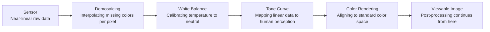
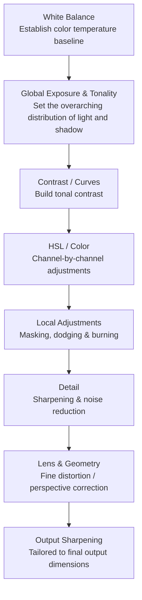

# Chapter 13 Post-Processing

> Post-processing is not about retouching a photograph to make it prettier. It follows through on the judgment made at the moment of capture, deciding how a photograph will ultimately appear before others in its luminance, color, and tactile presence on paper.

---

## Post-Processing Is Not an Invention of the Digital Age

Ansel Adams spent the better part of his life steeped in the darkroom—first in San Francisco and Yosemite, and for more than twenty years in Carmel, California. A telling comparison is often cited: exposing a negative might have taken him only half an hour, but printing that same image in the darkroom frequently consumed hours on end. The truly protracted labor was never at the scene where the shutter was pressed, but in the repeated reprinting that followed. He himself frequently returned to a favored metaphor: the negative is like a musical score, and the print is like a performance. Once written down, the score is fixed, yet when played by different musicians or under different frames of mind, its tempo, weight, and phrasing differ entirely. So it is with photographs: from a single negative, he would make one version in the 1940s, another some years later, and yet another in his old age, each iteration distinct in its tonal gradation, contrast, and atmosphere. For his famous *Moonrise, Hernandez, New Mexico*, which he printed for more than forty years and produced over a thousand prints of, the older he grew, the deeper and darker he printed the sky. The negative recorded merely the light that fell into the lens at that fleeting instant, whereas in the darkroom decades later, he decided anew what face that moment should present to the world.

In the digital age, post-processing has adopted a new set of tools, yet the essence of the endeavor has not changed. Sliders have replaced chemicals and dodging wands, screens have taken over part of the darkroom's role, and the work is clean, fast, and infinitely reversible, yet the question confronting you remains precisely the same: What do you ultimately want this photograph to become? Are you following the innate trajectory already present in the raw capture, articulating it step by step, or do you intend to force it into something else entirely? The most critical judgment in post-processing never lies in the software, nor in how far a particular slider is pushed, but squarely in this very question.

---

### From Darkroom to Software

*Carleton Watkins, "Yosemite Valley from Inspiration Point," ca. 1865. Watkins had established Yosemite as an enduring part of the American landscape imagination long before Adams. He ventured into the wilderness with 18×22-inch collodion wet-plate glass negatives—each plate immensely heavy—and after shooting, returned to the darkroom to print them onto albumen paper. Today we divide all this into shooting and post-processing, but for him it was a single, unified enterprise: travelling to the site, bearing the physical burden, exposing, developing, printing, and finally bringing the images into the public view. In 1864, Watkins's photographs helped spur the passage of the Yosemite Grant; the landscape was thus not merely seen, but preserved. [Image credits and reuse notice](image-credits.md#watkins-yosemite)*

---

## Post-Processing Belongs to the Photographic Workflow

In the broader arc of photographic work, post-processing is not an isolated phase that can be treated on its own. You first observe, then capture, then select; only then does post-processing arrive, before the image is finally output to a screen, onto paper, into a book, or onto an exhibition wall. Within this unbroken chain, the step most readily glossed over is selection itself. After shooting, many photographers habitually import an entire batch into their software and begin tweaking them one by one from the very first frame; by the time they reach the end, they have often forgotten why they made the series in the first place. A far sounder sequence is to conduct an initial rough cull, setting aside what clearly does not work, and then picking from the remainder the few images truly worthy of painstaking effort. Post-processing should serve images that have already justified their selection, rather than the reverse—inventing excuses one by one for photographs that never worked in the first place.

Before touching your first slider, there is one prerequisite to verify: whether the screen in front of you is reasonably dependable. The reason is not difficult to grasp: if the monitor leans blue, you will unconsciously compensate toward yellow, turning out a batch of photographs that look excessively warm on everyone else's displays; if brightness is set too high, you will darken your images to accommodate the screen's glare, causing them to appear murky on other devices. The most reliable approach is to calibrate periodically with a colorimeter. Failing that, at the very least fix the monitor's brightness at a moderate, comfortable level, and edit as much as possible under consistent ambient light, lest your judgment shift between daytime and night. Photographs intended for print require the additional step of soft proofing, as paper is inherently dimmer and lower in contrast than a display; an image that looks calibrated and balanced on screen will often appear choked and muted when printed. Every decision in post-processing hinges on the assumption that what you see is fundamentally accurate; if that premise is skewed from the start, then the more earnest and forceful your efforts, the further astray you will go.

When it comes to color management, two steps that are often conflated must be clearly distinguished. **Calibration** first adjusts the monitor to a chosen white point, luminance, and tone response curve, accomplished via the monitor hardware, graphics card LUTs, or a combination of both; **profiling** then uses a colorimeter to measure the display's actual performance post-calibration, generating an ICC profile that color-managed applications use for color transformation. A profile is not a blanket "correction filter" slapped across every image, and non-color-managed applications will not automatically display correct results. The values below should serve only as starting points for standard indoor work, and must ultimately be harmonized with ambient light, viewing booths, and delivery standards: the [ICC guidance on monitor calibration](references.md#color-management) likewise explicitly separates calibration from profiling.

| Parameter | Target Value | Purpose |
|---|---|---|
| White point | D65 is commonly used for standard display work; print workflows may require D50 | Aligns with the viewing environment and delivery specifications, rather than chasing an abstract "absolute white" |
| Tone response | Gamma 2.2 is a standard starting point | Specific targets are determined by the operating system, video, or print workflow |
| Luminance (standard indoor) | Approximately 100 to 120 cd/m² serves as a starting point | The dimmer the ambient environment, the less bright the screen should generally be set |
| Print matching | No fixed universal value | Compare soft proofs against physical prints under standardized viewing light, then adjust according to observed discrepancies |

Of these parameters, luminance is especially critical, and it accounts for half of the answer to that perennial question: "Why did it look right on screen, but turn out so dark in print?" A screen is emissive, whereas paper depends on reflecting the ambient light of the room. Whenever monitor brightness is set too high, you will unconsciously pull down the tones during editing to compensate for that glare; once committed to reflective paper, the photograph inevitably looks lifeless and choked.

As for software, finding a single application suited to your workflow is entirely sufficient; there is no need to master every program on the market. Lightroom Classic is the most versatile all-around tool for digital asset management and color grading, and will more than satisfy the vast majority of photographers. Capture One stands out for its color science and tethered capture, making it a staple in studio, portrait, and commercial work. Photoshop's real strengths lie in compositing, complex retouching, and meticulous local adjustments—which is precisely why it is unnecessary for everyday photographs. Beyond these, DxO offers distinct advantages in lens correction and noise reduction, Affinity Photo suits those who prefer to avoid subscription models, and Apple Photos or Snapseed are well up to lighter duties. Software prices and version numbers will perpetually fluctuate, but the rationale for selecting them does not: stable asset management, rapid culling, and dependable RAW processing matter far more than appearing "professional." Opening the most complex software merely for the sake of ceremony usually succeeds only in bogging down your day-to-day workflow.

---

## Technical Deep Dive: RAW, Bit Depth, and the Developing Pipeline

!!! note "Reading Path"

    The main arc of post-processing begins with culling, moves to establishing a direction, proceeds through edits in a repeatable sequence, and concludes with output-specific checks. The section below explains RAW, bit depth, demosaicing, catalogs, and sidecar files; if you only want to establish a processing workflow, you may jump ahead to "Two Directions in Post-Processing."

### RAW, JPEG, and Bit Depth

After choosing your tools, an even more fundamental matter must first be clarified: precisely what kind of raw material do you hold in your hands? How much latitude a photograph offers in post-processing is largely determined the very instant the file is generated, rather than unfolding only when you open your editing software. The most crucial dividing line here is the distinction between RAW and JPEG.

A RAW file preserves the near-linear raw data captured by the sensor at high bit depth. White balance and tone can be reinterpreted in post-processing, and luminance mapping can be readjusted, though the actual physical exposure is still determined on location. A JPEG, by contrast, is a finished product in which the camera has already made all these decisions on the spot, squeezing the data down to 8 bits with lossy compression: white balance, contrast, and sharpening are already baked into the image, leaving vastly less room for maneuver in post. RAW delivers the raw ingredients; JPEG delivers the plated dish.

The bit depth mentioned repeatedly above deserves a clear explanation of its own. Bit depth determines how many discrete values each channel can encode; the higher the bit count, the denser the quantization steps, and the less likely posterization or banding is to accumulate across multiple rounds of curve adjustments, compositing, and color transformations. It is not synonymous with dynamic range: if the shadow values of a 14-bit RAW file are already drowned in noise, those extra encoding levels will not conjure usable detail out of thin air; conversely, an 8-bit JPEG that has undergone tone mapping can still render a tonal range of scene luminance far exceeding "eight stops."

| Bit Depth | Levels per Channel | Notes |
|---|---|---|
| 8-bit | 256 | JPEG output; minimal latitude for stretching in post |
| 12-bit | 4096 | Select RAW formats |
| 14-bit | 16384 | Mainstream RAW; generous post-processing latitude |
| 16-bit | 65536 | Intermediate working spaces and compositing |

Placing these tiers side by side: 8-bit provides 256 encoded values per channel, 12-bit provides 4096, and 14-bit provides 16384. Higher bit depths are generally far more resilient under aggressive adjustments and multi-stage calculations, but the true strength of RAW stems not merely from its bit count, but from preserving near-raw sensor data, unfixed white balance, and tone mapping that has not yet been baked in. Conversely, an 8-bit JPEG that has been properly mastered and is intended solely for display will not inevitably exhibit visible posterization simply because it has only 256 levels.

---

### How RAW Development Generates Color

Since a RAW file stores only the raw data captured by the sensor, several distinct stages lie between that raw data and a viewable photograph on your screen. Normally, when you open a RAW file in software, the image appears almost instantaneously, giving no hint of what transpired in between; behind the scenes, however, the RAW converter has quietly executed an entire pipeline on your behalf. Only by understanding this pipeline can you grasp which specific stage of the process each post-processing slider is actually manipulating.

The first stage of this pipeline is **demosaicing** (demosaic interpolation). On the sensors of the vast majority of cameras, each individual photosite measures only a single color. Engineers place a color filter array over the photosensitive surface, the most common being the **Bayer array** (a color filter array pattern), devised by Bryce Bayer at Kodak in the mid-1970s: arranged in a grid of red, green, green, and blue, green accounts for half the photosites while red and blue each account for a quarter, reflecting the human eye's peak sensitivity to luminance in the green spectrum. What the sensor directly reads is not a full-color photograph, but a mosaic in which each point knows only one color. Demosaicing refers to interpolating the two missing colors for every pixel based on the readings of its neighbors, ultimately reconstructing full red, green, and blue channels.

Once the colors are interpolated, the pipeline turns to the familiar steps of post-processing: first establishing **white balance** to neutralize the overall color temperature; then applying a **tone curve** to map the sensor's near-linear data into a luminance distribution pleasing to the human eye; and finally performing **color rendering** to map the sensor's proprietary raw responses into a standardized color space, ensuring reds are true red and blues are true blue. Here, special mention must be made of the "linearity" of sensor data: when the number of photons hitting the sensor doubles, its output signal roughly doubles as well—a directly proportional relationship. The human eye's perception of lightness, however, is compressed and nearly logarithmic. For this reason, the tone curve is no superfluous embellishment; it is an indispensable step that translates linear physical measurements into something consistent with human visual perception. The reason JPEGs offer so little post-processing latitude is precisely because the camera has already run through this entire pipeline in a single pass and baked it in permanently; RAW, on the other hand, keeps every link of the chain in your hands, allowing you to discard and rebuild it at any moment. This echoes the principles of exposure and color discussed earlier in Chapters 3 and 4.

A caveat is in order: this diagram presents a conceptual order for explanatory purposes. In actual software implementations, the sequence of stages can vary; for instance, channel gains for white balance are applied in most pipelines prior to demosaicing, which yields cleaner interpolation. This nuance does not impair understanding; it merely spares meticulous readers any confusion should they compare this breakdown point-by-point against documentation from a specific software vendor.

This ability to "discard and rebuild at any moment" introduces another foundational pillar of digital post-processing: **non-destructive editing** (also known as parametric editing). When you adjust sliders in Lightroom or Capture One, the software does not overwrite the original RAW file; instead, it records your adjustments in a catalog or sidecar file and renders previews in real time. We need not frame digital processing and the darkroom as total opposites: while chemical film development is indeed irreversible, a developed negative can still be printed repeatedly into different interpretations—precisely how Ansel Adams worked. What digital processing truly expands is the negligible cost of copying, undoing, comparing, and batch-recalculating the same set of adjustments—provided the RAW files, catalogs, sidecar files, and software versions are all properly preserved.

The statement above that software records your operations "in an accompanying catalog or a small attached file" actually conceals two distinct storage approaches worth distinguishing, as it determines whether your string of editing instructions travels with your photos when you switch computers, create backups, or send files to others. One approach relies on **sidecar files** (accompanying files): the software writes all your adjustments for a RAW file into a small companion text file sharing the same base name with an `.xmp` extension, resting alongside the original file in the same folder and traveling wherever it goes. The other is a **catalog** (a centralized catalog database): Lightroom Classic consolidates edits across thousands of images into a single central database, leaving the folders containing the raw files untouched. Its strength lies in rapid searching and batch management; its downfall is that if you copy only the raw image files and forget the database, an entire body of hard work remains behind on your old machine. A middle ground between the two is encapsulating both raw data and editing instructions together inside Adobe's DNG (Digital Negative) format, effectively tucking the sidecar file right back into the belly of the digital negative itself.

Precisely because adjustments are, from start to finish, merely a reversible set of instructions, several feats that were unthinkable in the darkroom era now come at virtually no extra cost. You can generate multiple **virtual copies** from a single RAW file, allowing one negative to exist simultaneously as both color and black-and-white iterations without interfering with one another. You can take a spontaneous **snapshot** midway through processing to freeze the current state, saving it for later side-by-side comparison with other variations. Furthermore, software preserves a comprehensive edit **history** by default, allowing you to step back to any point twenty steps earlier at will. These are all pure dividends of parametric editing: since you never manipulate the underlying pixels themselves, keeping several versions or logging a few more sets of instructions amounts to nothing more than writing a few extra lines of text.

---

## Two Directions in Post-Processing

Broadly speaking, there are two common directions in post-processing. The first is to follow the inherent character of the original capture and lean into it. For instance, if the light during shooting was inherently hard, post-processing can lean into this by letting the shadows sink deeper and the highlights stay cleaner, articulating that crisp hardness to its fullest; if the color palette was already restrained, avoid suddenly turning around and cranking up the saturation, shattering that very restraint; if the composition was already clean, techniques such as vignetting, grain, and local dodging should be applied with utmost caution, lest you gild the lily. Such an approach may appear conservative, but in truth it is anything but: under the premise of respecting the photograph's innate character, it patiently refines an image that is merely "passable" until it speaks with complete clarity.

The second direction is to apply a more pronounced, unified treatment across an entire body of work—such as emulating a specific film stock, casting an entire series in cool urban night tones, giving every portrait a soft, low-contrast look, or rendering street photographs with uniform coarse grain and deep, heavy blacks. This approach is equally viable, but it rests on two prerequisites: first, the series as a whole must maintain consistency; second, the photographs themselves must already have sufficient substance to support it. The reason is that when a fixed preset is applied across thirty photographs, the audience naturally interprets that uniformity as the cohesive voice of the body of work; but if every image takes on a different tone and goes its own way, it only reveals that you have not yet decided what you want to say. Post-processing cannot salvage an image whose composition, lighting, and content all fail to hold up; at best, it merely wraps existing flaws in a layer of decoration.

This brings us to the question of measure and restraint. Adjusting brightness and darkness, color, local luminance, and cropping—these are processing methods that have long existed throughout photographic tradition. Holding back an overly bright sky, brightening a face, correcting white balance, or adjusting the contrast of an image to a more fitting degree—these practices bear no fundamental difference from the dodging and burning of traditional darkrooms; they merely carry out the same work on a digital screen. However, the moment you proceed to adding or removing elements within the frame, you must slow down and tread carefully. Cloning out an obtrusive bystander, pasting a flying bird into the sky, or stitching two photographs into a moment that never actually existed—such alterations do not merely change what the image looks like; they fundamentally alter what actually transpired on the scene.

Consequently, the closer a genre edges toward photojournalism, documentary, and public record, the tighter this line must be drawn. Modifying a single element carries vastly different weight depending on context: retouching out an unsightly power line in a travel photograph is largely a matter of personal taste; but removing an object in reportage photography will call both the image itself and the photographer's credibility into question. When starting out, it helps to keep a simple self-check in mind: does your current step bring the photograph closer to what you actually saw and felt at that moment, or is it fabricating out of whole cloth a scene that never existed? If the former, there is generally no issue; if the latter, you must be unequivocally clear with yourself that you have crossed the boundary of darkroom refinement and entered the realm of creative manipulation and compositing.

Extending this self-check allows us to address exposure bracketing, panoramas, focus stacking, and multi-frame noise reduction all at once. While these serve as technical means to overcome the limitations of a single exposure, they do not automatically preserve factual truth simply by virtue of being taken at "the same location and around the same time": pedestrians moving over a ten-minute span may be eliminated, crashing waves and drifting clouds averaged out, and focus stacks may combine different instants in time. Personal artistic work is free to decide; commercial architecture and travel content should follow the terms of the commission; while journalism and documentary photography must answer to far stricter industry standards. Whenever a viewer would reasonably take an image to be a single authentic moment, yet compositing has in fact altered time or content, openly disclosing your methods is far more honest than searching for an all-purpose exemption.

---

## A Reusable Processing Order

A sound post-processing sequence runs roughly as follows: begin by selecting a camera profile and enabling any necessary lens corrections, as distortion correction alters the edges of the frame; next, make an initial crop and straighten the image to establish the final composition; then set the white balance, global tonality, and color, followed by local adjustments using masks; finally, apply noise reduction and sharpening tailored to your output dimensions. For photographs requiring substantial perspective correction—such as architectural shots—you can roughly adjust geometry before cropping to avoid missing corners cut off after correction. Non-destructive software allows you to iterate back and forth freely, so this sequence exists to minimize rework rather than serve as an inviolable assembly line.

Broken down in detail, the sequence is: Profile & Lens Corrections → Initial Geometry & Crop → White Balance → Global Exposure & Tonality → Curves & Color → Local Dodging & Burning → Noise Reduction & Capture Sharpening → Output Sharpening tailored separately for screen or print. If your noise-reduction tool generates a new RAW/DNG file, or if perspective correction introduces noticeable resampling, these steps can also be shifted earlier according to your software's characteristics; what truly matters is that composition and the overall global direction are stabilized before embarking on delicate local work.

The reason white balance almost always comes first is that it forms the foundation for every subsequent color judgment. If you bury your head in the HSL panel, tweaking reds, oranges, yellows, and greens one by one until you are satisfied, only to look back and discover that the entire image's color temperature was skewed from the start, every judgment you made about individual hues was built upon a crooked foundation—leaving you no choice but to tear it down and start afresh. By the same token, global exposure and tonality must precede local adjustments: only when the overarching distribution of light and dark across the frame has been established can you meaningfully judge which specific area needs brightening and which needs burning down. As for automatic lens distortion and vignette corrections, many photographers enable them right at the outset as a matter of course, whereas finer perspective and geometric adjustments are often held until composition and tone have stabilized, sparing you the frustration of backtracking and wasted effort.

Since white balance is the bedrock of all color judgments, it is worth clarifying precisely how it is adjusted. Software typically splits it into two sliders, corresponding to two mutually perpendicular axes. One is Temperature (the blue–yellow axis), moving back and forth along the spectrum between blue and yellow, calibrated on the Kelvin (K) scale: pushing the slider toward higher Kelvin values warms the image toward yellow, while pulling it lower cools it toward blue. This uses the exact same scale discussed in Chapter 4 regarding the color temperature of light, except here it is applied in reverse to counteract the color cast of ambient light. The other is Tint (the green–magenta axis), which travels along the spectrum between green and magenta; it exists specifically to clean up the green or magenta cast frequently introduced by light sources such as fluorescent tubes or overcast skies—a bias that the temperature axis cannot touch. Intersecting horizontally and vertically, the two sliders work in tandem to pull any color cast back to neutral. Beyond nudging them manually, a faster method is to use the white balance eyedropper to click on an area in the frame that ought to be neutral gray—such as a gray wall, the shadowed fold of a white shirt, or a portable gray card. The software uses this sampled point as a reference to calculate in which direction and by how much to compensate, setting both sliders for you in a single click. Yet precisely because it relies strictly on neutrality, the sampled spot had better be genuinely devoid of color; if you accidentally sample an object that carries an inherent tint, the entire photograph will be skewed right along with it.

Sharpening—especially output sharpening—is kept firmly anchored at the very end of the pipeline because it is bound inextricably to the final dimensions of the photograph. A file downscaled for web display and an image enlarged for a physical print require fundamentally different amounts and types of sharpening. If you apply full sharpening to the full-resolution original and then scale it down on export, that painstakingly crafted edge contrast will be jumbled and ruined during the resampling process. For this reason, the prudent approach is to hold the final pass of sharpening until your output dimensions are locked in and the photograph is ready to be delivered.

In global adjustments, the first step is to evaluate exposure. The goal here is not to brighten the entire photograph uniformly across the board, but to ensure that the brightness of the primary subject settles in the right place. Thus in portraiture, look first at the face; in landscape, look at the most significant mountain, cloud, or expanse of water; and in street photography, look to the spot where the decisive action unfolds. Highlights are usually addressed first, because overexposed skies, bright windows, and harsh reflections on skin are often the first elements that jump out as jarring and distracting. Once highlights have been pulled back, look to see whether the shadows need to be opened up. Do not lift shadows excessively in a single stroke, for two very tangible reasons: first, as discussed in Chapter 3, the shadows represent the weakest signal and sit closest to the read noise floor; yanking them up aggressively amplifies that dirtiest slice of the signal for everyone to see, causing swaths of noise and chroma blotches to surge forward; second, once shadows are flattened across the board, the tonal gradations cascading from highlight to shadow are compressed, leaving the photograph looking washed out—stripped of its original depth and weight. Darkness, after all, is an integral part of the image.

The Whites and Blacks sliders govern the two anchor points at the absolute brightest and darkest ends of the image. If a photograph lacks a true black anywhere within the frame, it often appears limp, lacking punch and structure; if the white point also lacks a definite anchor, the image easily turns flat and muddy. Many beginners in post-processing focus only on exposure, contrast, highlights, and shadows while overlooking the white and black points; as a result, while the overall brightness may appear roughly correct, the image perpetually lacks strength and conviction. To be clear on this point: setting a black point means establishing a floor for the tonal range, not crushing all shadow detail into dead black; setting a white point means defining where the brightest highlight peaks, not blowing highlights out recklessly.

Judging clipping purely by eye on a monitor is unreliable; the histogram and clipping warnings provide far more objective evidence. A histogram charts the distribution of pixels across luminance ranges, but one cannot declare an exposure incorrect simply because the graph leans heavily to the left or right; a night scene is naturally biased toward the left, just as a snowscape is naturally biased toward the right. A heavy buildup of pixels banked hard against either edge indicates that values have hit the minimum or maximum limits of the current rendered output, but a luminance histogram can mask clipping in individual color channels, and what the software displays may reflect a rendered state rather than the underlying RAW data. You should examine the individual RGB channels alongside their physical locations in the frame before deciding whether that patch of pure black or pure white represents an unrecoverable loss of detail or an intentional tonal anchor.

When dragging the Whites or Blacks sliders in applications like Lightroom, holding down Alt (Option on macOS) displays the regions where clipping first occurs in the current rendered output. This is a diagnostic tool, not an absolute rule dictating that you must halt the moment the very first clipped speck appears: a lightbulb filament, a specular glint of the sun, or a highlight at the frame's edge can be intentionally rendered pure white, just as deep recesses and silhouettes can be deliberately solid black. Colored clipping warnings typically indicate that a single color channel has clipped first; you should inspect the photograph itself to assess color fidelity and texture, rather than assuming from the warning color alone that the RAW data can definitely be recovered.

A RAW preview that appears blown out to pure white does not necessarily mean the raw sensor data has clipped, because the preview has already had white balance, camera profiles, and tone curves applied; yet there is no universal rule that "an extra stop is always hidden away." If all corresponding photosite channels have reached full saturation, real textural detail is permanently lost. Only when a subset of channels is saturated can software estimate luminance or color based on the remaining unclipped channels and neighboring pixels—a process closer to synthetic reconstruction than retrieving genuine original detail. Accurate assessment requires utilizing per-channel clipping warnings in dedicated RAW software alongside empirical tests on the actual files, rather than mistaking a JPEG preview for the physical ceiling of the sensor.

In truth, many everyday photographs can be carried most of the way to completion using the Basic panel alone. In landscape work, you might rein in the highlights, gently open up the shadows, and dial in a touch of white and black points so that clouds, terrain, and mountains each find their rightful footing across the tonal spectrum; portraits generally demand a far gentler touch, where skin must never be made harsh through aggressive contrast that stiffens the face; street and monochrome work, on the other hand, can afford deeper black points to establish a sturdy tonal backbone. Remember, however, that these rules of thumb serve merely as starting points; every photograph must ultimately return to its own subject, light, and visual content, to be evaluated and adjusted on its own terms.

Beyond the sliders of the Basic panel, one tool deserves dedicated attention: Curves, the most fundamental instrument in post-processing. The reason it stands at the core is that its function is a direct continuation of the "tone curve" stage in the RAW pipeline described earlier: the horizontal axis represents input luminance, while the vertical axis represents output luminance, remapping input brightness to output brightness. Every point along the horizontal axis represents a specific tonal value in the original image; lift that section upward and it renders brighter in the finished image; pull it downward and it renders darker. The classic S-curve does nothing more than raise the upper portion of the curve and pull down the lower portion, making highlights brighter and shadows darker, thereby widening contrast; an inverted S-curve does the reverse, compressing contrast and retrieving detail at both extremes. And all of this is achieved solely by redistributing where various tonal values land, without conjuring anything out of thin air.

The practical manipulation of curves can be described quite concretely. Place three anchor points along the curve: one in the lower third to control the shadows, one in the center for the midtones, and one in the upper third for the highlights. If you want to give the image clarity and transparency, nudge the highlight point slightly upward and pull the shadow point slightly downward; an S-curve takes shape naturally. When you adjust a specific segment, the adjacent anchor points also act as locks: when you want only to brighten the midtones, lifting the center point while the upper and lower points remain pinned in place ensures that neither the highlights nor the shadows are dragged along with it. Most ruined curve adjustments fail because of a single point—a gentle tug upward, and the entire frame floats upward into an unmoored, washed-out haze.

Curves also have a frequently used yet easily overlooked application: **lifting the blacks**. If you raise the endpoint in the bottom-left corner slightly above the baseline, the darkest areas of the frame cease to be pure black, settling instead into a soft, shallow wash of gray. Such a modest adjustment instantly imbues the photograph with a faded, aged, matte quality reminiscent of vintage film. The so-called "cinematic" and "filmic" looks popularized in recent years often hinge, in tonal terms, on this very maneuver: lifting the blacks, paired with a gentle rolloff at the highlight end. Conversely, if you drag that bottom-left endpoint to the right along the baseline, you achieve the exact opposite: forcing more dark pixels into pure black, rendering the shadow floor heavier, deeper, and more solid. Simply shifting the two endpoints of the curve is enough to determine whether an image feels crystalline and clear, dense and weighted, or veiled in a nostalgic haze.

Everything discussed so far applies to global curves, which adjust the brightness of the entire image with the red, green, and blue channels lifted or pulled down in unison. Yet curves can also be split apart to manipulate individual color channels. The moment you decouple them, the curve transforms from a tool for sculpting tone into an instrument for shaping color. The underlying principle is that each channel possesses its own dedicated curve: lifting the red channel curve shifts the overall frame toward red, while pulling it down brings out red’s complementary color, cyan; the green channel balances green against magenta, and the blue channel balances blue against yellow. Adding to a channel injects that specific color into the image; subtracting from it injects its complement. With this mechanism, you can raise the blue channel strictly in the shadows to impart a subtle cool cast to the darks, and lift red while lowering blue in the highlights to warm up the brights. Splitting warm and cool tones across opposite ends of the tonal spectrum is precisely how curve adjustments achieve much of the so-called "cinematic" color grade—and before the digital era, it was how photographers coaxed distinct color casts out of the color darkroom or through cross-processing (the deliberate processing of film in chemical solutions formulated for a different emulsion). Once you understand channel curves, looking ahead to color grading makes it clear that the discipline is nothing more than this very practice—splitting highlights from shadows and tinting each channel independently—repackaged into a set of more intuitive color wheels.

Standing in contrast to global curves are local adjustments, which act exclusively upon selected regions. Their purpose is to guide the viewer’s eye gently toward where it belongs within the frame. There are several concrete methods: radial masks can subtly illuminate the area around the subject or allow the edges to fall off smoothly into darkness; linear gradients are ideal for pulling down an overly bright sky or lifting a shadowed foreground; brushes and AI-driven masks allow you to isolate and treat faces, eyes, skies, backgrounds, and clothing individually. Local adjustments are best applied with restraint, creating the impression that the scene naturally existed that way, rather than making it obvious at a glance that a section was cordoned off and manipulated. Global adjustments establish the photograph’s fundamental tone, whereas local adjustments merely organize and direct the viewer's attention; each has a distinct role, and neither should overstep its bounds.

This practice of selectively lightening and darkening areas is hardly new; it bears a venerable darkroom name: **dodging and burning**. In the era of wet chemicals and enlargers, when making a photographic print, if you wanted to lighten a shadow area, you placed a piece of cardboard or your hand into the light path during exposure to hold back light from that spot—this was dodging; if you wanted to deepen a highlight, you gave that specific area additional exposure time—this was burning. Much of what Ansel Adams labored over in the darkroom boiled down to precisely this craft: which mountain ridge to burn down, which cloud to hold back. Bringing a negative to life as he envisioned it in his mind required relentless cycles of dodging and burning. Agencies like Magnum Photos even employed dedicated master darkroom printers like Pablo Inirio, who made enlargements for many of history's most celebrated photographs; his surviving work prints are densely covered with handwritten notations specifying how many seconds to add or subtract in every precise zone. What you do today with masks and layers is, in essence, translating that same discipline of dodging and burning onto a digital display—only far more refined, and entirely reversible at any moment.

Returning to masking itself: the radial, linear, and brush tools mentioned earlier all isolate regions based on geometric shape—drawing an ellipse, dragging a gradient, or painting stroke by stroke. Yet in practice, the areas requiring adjustment are often wildly irregular: a patch of sky tangled with crisscrossing branches, or a face framed by flyaway hair. Tracing these by hand is slow and rarely clean. Consequently, a new generation of masking tools moved beyond purely geometric boundaries, selecting regions based on tonal luminance and color content instead. One approach is the luminance range mask, which restricts the mask to act "only within a specific range of brightness"—allowing you, for example, to darken only the brightest portion of the sky while automatically excluding the darker textures of the ground beneath. Another is the color range mask, which operates by sampling color: click on a patch of blue in the sky, and the mask isolates all matching blues across the frame. In recent years, post-processing software has taken this further still, recognizing semantic elements such as "Subject," "Sky," "People," "Hair," "Skin," and "Eyes," generating dedicated masks for each with a single click. The true strength of these masks lies in combining them: select the entire sky and intersect it with a blue color range to darken only the blue sky while sparing the white clouds; select a portrait subject and subtract the skin, leaving only the hair and clothing. Masking has evolved over the years from "drawing an approximate area" to "precisely describing, through combined conditions, exactly which part of the image you want to alter."

Beyond masks lies another family of tools designed for a fundamentally different task: not adjusting the tone or color of a region, but removing an element from the frame entirely. Having established ethical boundaries earlier, it is time to place the brush itself into your hands. At the gentlest tier is spot removal, suited for sensor dust and skin blemishes, where the software automatically samples from surrounding pixels to patch the defect with virtually no effort on your part. A step up is the clone stamp, where you manually designate the source and target—ideal for repairing areas with directional textures, such as brick mortar, wood grain, or strands of hair. The third tier comprises algorithms like content-aware fill: you lasso an unsightly power line or a pedestrian wandering into the frame, and the software analyzes the surrounding context to weave a plausible patch on its own. And in recent years, generative remove and fill tools have gone a step further, allowing AI models to synthesize out of whole cloth whatever "ought" to exist behind the erased object—rendering borders so seamless and textures so convincing that they become indistinguishable to the naked eye. The more effortless these tools become, the more critical the earlier ethical self-check becomes: using spot removal to wipe away a speck of dust will never be judged as falsifying the scene, but using generative fill to fabricate a meadow where none existed crosses the line into creating an entirely different photograph. As technology grinds that boundary ever finer and more covert, the burden of holding the line rests all the more squarely upon you.

---

## Making Color Serve the Subject

When working with color, the very first step is to ask yourself: what is truly the most important color in this photograph? In portraiture, that color is almost invariably skin tone. Nudging the luminance of the orange channel up slightly and dialing back its saturation a touch will lend the skin a clean, luminous quality—though moderation is essential, lest you drain it so far that the subject appears utterly bloodless. The greatest hazard for skin tones is being dragged along by global saturation adjustments: the moment the background becomes vivid, the face takes on an unnatural orange flush; the moment the background cools down, the face turns ashen and gray. For this reason, color work in portraiture should begin by anchoring the skin tones, ensuring they sit squarely in the right place before turning your attention back to the clothing and the background.

The same logic applies to other genres, and here we can establish some rough orders of magnitude so that vague advice like "adjust slightly" actually translates into concrete practice. For a blue sky, pulling the luminance of the blue channel down by ten to twenty points in the HSL panel will immediately bring out the structure of the clouds; push it any further, however, and the sky begins to look unnaturally dark and synthetic. For autumn foliage, boosting the saturation of red and orange by about ten points each imparts a rich, satisfying warmth. Green is notoriously the easiest color to push too far. Grass and leaves typically call for a two-pronged approach: drop the saturation by roughly ten points, then nudge the hue a few clicks toward yellow. This tempers that jarring, fluorescent cast, settling the greens into a grounded, enduring tone that wears well on the eye. None of these figures are hard-and-fast rules; they simply provide a sense of scale for your adjustments. In the HSL panel, most adjustments should stop somewhere between plus or minus ten to twenty points; drag a slider past the halfway mark, and the hand of post-processing becomes almost unmistakably evident. Urban nightscapes present yet another scenario: neon lights are already intensely saturated at capture. If you attempt to boost global saturation in post, the various colors will bleed into one another, creating a muddy, chaotic mess. A far better approach is to designate a single dominant color to lead the frame, while slightly dimming or desaturating the rest, relegating them to subordinate roles.

Color Grading, on the other hand, allows you to introduce subtle color casts into the highlights, midtones, and shadows independently. The most common approach is to warm the highlights and cool the shadows: skin tones and practical lights retain their warmth, while deep tones and background areas recede gracefully into blues and cyans. Photographs with a vintage aesthetic often favor yellow highlights paired with purple or cool shadows, whereas a gritty, austere city scene might lean entirely into blue tones with deeply suppressed blacks. Whichever path you choose, keep the intensity light. The rationale is straightforward: once color is applied with too heavy a hand, a photograph slips from having "atmosphere" into looking "like a filter"—the former creates mood, while the latter is merely a cheap artifact of processing.

The term Color Grading is itself borrowed from cinema. Once principal photography wraps on a film, it undergoes a stage known as color grading (historically termed color timing), in which a dedicated colorist sits before a system like DaVinci Resolve, using color wheels to establish a unified tonal look for the entire motion picture. The Color Grading panel in photographic post-processing is, in fact, a direct translation of that cinematic three-way color wheel system. It divides the image into three tonal ranges—shadows, midtones, and highlights—each assigned its own color wheel. Dragging a point in any direction on the wheel tints that specific tonal range with the corresponding hue; the further you drag it from the center, the richer the tint becomes—that is, the higher the saturation. Beside each wheel is typically a luminance slider, allowing you to fine-tune the brightness of that tonal range while tinting it. At the bottom of the panel, blending and balance sliders govern how smoothly the three ranges transition into one another and roughly where the dividing lines between them fall.

Of all color combinations, the most ubiquitous—and the one that best withstands repeated viewing—is shifting the shadows toward cyan and the highlights toward orange. Behind this lies a remarkably simple principle of color theory: human skin naturally falls within the orange range of the spectrum, and cyan is orange's exact complementary color (the color sitting directly opposite it on the color wheel). By pushing the shadows of the background toward cyan while keeping the highlights on the subject in warm orange, you place warm and cool tones at opposite poles of the color wheel, naturally separating the subject from the background. The pervasive teal-and-orange palette in Hollywood blockbusters over recent decades is, ultimately, nothing more than the repeated application of this complementary relationship. Nor did this practice emerge out of thin air. Its predecessor was color timing—the shot-by-shot optical balancing of film prints in the photochemical era—which digital color grading later inherited and vastly expanded. In earlier raw processing software, this took the form of split toning, which offered hue controls for only highlights and shadows alongside a balance slider—a simpler precursor to today's three-wheel layout. And tracing split toning even further back leads directly to chemical toning in the black-and-white darkroom: immersing photographic paper in baths of selenium or sulfide toners to infuse what was neutral gray with cool purples or warm sepias. The touch of cyan you dial into the shadows today and the sepia tone a darkroom master coaxed from a chemical bath years ago pursue the very same end: imparting a distinct character and flavor to the tonal scale itself. Of course, no matter how you turn the color wheels, the earlier caveat remains paramount: keep the intensity light. It is far better to err on the side of subtlety than to let color call attention to itself before the photograph can speak.

Even more than a single image, a series of photographs demands visual unity. To that end, you can build baseline presets of your own for street, portraiture, and landscape photography. Such a preset does not need to be overly elaborate, nor does it require an enigmatic name; at its core, it is simply your customary combination of black point, contrast, color palette, and grain. Starting every photograph from this shared baseline before fine-tuning it to the specific conditions of the scene offers a two-fold benefit: first, it saves a significant amount of time; second, it ensures that the entire body of work feels as though it emerges from a singular way of seeing.

---

## Sharpening, Noise Reduction, and Output

There is no single, rigid sequence where sharpening and noise reduction are invariably saved for last. Capture sharpening is typically carried out early in the raw conversion phase; machine-learning noise reduction—which generates a new RAW or DNG file—is likewise best placed before geometry corrections, local masking, and heavy cropping or enlargement; the only step that truly must wait until final dimensions and physical media are decided is output sharpening. In portraiture, one must take care not to sharpen skin texture into sandpaper, nor should a smooth sky have its latent noise boosted along with the atmosphere; noise reduction, meanwhile, should be judged at the final output size, as an overzealous hand will buff deep shadows and fabric textures into a waxy smear.

The masking slider mentioned above is, in truth, only one of several sharpening parameters. To command sharpening with clarity and precision, it helps to dissect the process into three core elements. Sharpening in post-processing is, at its root, an optical illusion that creates tonal contrast along edges, generally governed by three controls. **Amount** dictates how heavily that contrast is applied; **Radius** determines the pixel width over which this contrast band is spread, which must be scaled to the details in the image—a small radius for the fine, intricate textures of a landscape, and a larger radius for the broader features of a portrait; and **Threshold** or **Masking** determines how substantial a tonal break must be to qualify as an "edge" worthy of sharpening, effectively gating out smooth skies and skin tones so that noise is not sharpened along with the subject. In Lightroom, an additional "Detail" slider governs the extent to which high-frequency micro-textures are brought forward.

Viewed through these distinct parameters, it becomes easy to see why landscape work can tolerate a firmer hand while portraiture demands restraint: what truly deserves enhancement is the underlying edge structure, not those expanses of sky and skin that were meant to remain unblemished and smooth.

This sharpening method bears an ostensibly paradoxical name: **unsharp mask** (USM, or unsharp masking). It carries the word "unsharp" because the technique originated in the darkroom: lithographers and plate-makers would sandwich a deliberately blurred positive copy of the original photograph with the sharp negative, relying on this blurred "mask" to coax out edge contrast. The digital era translated this physical process into an algorithm, yet the core mechanics remain identical: the software computes a blurred version of the image and compares it against the original; wherever significant discrepancies appear, it identifies an edge, brightening a sliver along the light side and darkening a sliver along the dark side. This paired bright-and-dark **overshoot** hugging the contour—where luminance is intentionally pushed past its natural boundary—is the sole source of the visual illusion that makes the photograph "appear" clearer. Crucially, it does not actually recover any lost detail; it merely magnifies contrast across existing edges. For this very reason, the moment sharpening is applied with too heavy a hand, a harsh, telltale white halo crawls along every boundary.

With this foundation understood, sharpening should be approached through three distinct functional stages—a methodology first articulated by the color-management authority Bruce Fraser, author of *Real World Image Sharpening*. The first is **capture sharpening**, designed to compensate for the slight inherent softness present in virtually every digital image, caused by the optical low-pass filter sitting in front of the sensor and the demosaicing algorithm; applied evenly and in modest measure, it lays down a baseline foundation across the entire frame. The second is **creative sharpening**, applied selectively only to those specific regions you wish to emphasize—such as the catchlights in a portrait's eyes or the weathered fissures of rock in a landscape. The third is the aforementioned **output sharpening**, which is tethered directly to the final scale and physical destination: the very same photograph demands markedly different degrees of sharpening when scaled down for a web thumbnail, printed on matte fine-art paper, or pressed onto high-gloss stock. Consequently, it must be reserved for the final step and calculated independently for each use case. By separating sharpening into these three distinct passes, you avoid relying on a single, global setting from start to finish—a blunt approach that inevitably turns areas meant to be handled with restraint brittle and hard.

On the noise reduction front, the underlying logic echoes what we explored in Chapter 11 regarding high ISO: noise and detail are twins, bound tightly together. The signal read off a sensor in dim light and at elevated sensitivities is inevitably mingled with a layer of random noise. Software suppresses this noise by smoothing adjacent pixels into uniformity; yet in that very smoothing, genuine fine detail is inevitably eroded. Noise reduction is therefore never a game of scouring the image spotless, but rather a calculated trade-off: striking the exact balance between subduing noise and preserving detail. In recent years, machine-learning-driven noise reduction tools have grown far more sophisticated, decoupling noise from fine texture with uncanny precision; nevertheless, the ultimate sense of restraint remains entirely in your hands. Retaining a tasteful amount of grain gives the photograph room to breathe and imparts a palpable texture; over-apply the reduction, and the faint shadow detail that was once discernible will be erased forever.

Software generally divides noise into two categories: luminance and chrominance (color). Chrominance noise manifests as spurious red, green, and blue speckles; because it is far more jarring than monochrome luminance grain, it should be addressed first. However, it is a mistake to assume that heavy color noise reduction carries no side effects: overdoing it will smear subtle color gradations, causing chromatic bleeding across fabrics, skin tones, and the edges of neon signs. Luminance noise reduction, on the other hand, competes head-on with fine detail; pushed too far, it buffs shadow areas into lifeless wax. A reliable working method is to zoom in to 100% view to clear away color splotches, and then step back to evaluate the image at its final output size: eliminate only what genuinely distracts the eye, rather than sacrificing the tactile richness of the finished photograph on the altar of pixel-level smoothness.

When you arrive at the output stage, files must likewise be tailored to their ultimate destination. For web delivery, always research the target platform first: while 2048 pixels on the long edge serves as a workable starting point for lightweight previews, it is hardly a universal standard for high-density displays, portfolio sites, and various social media platforms. Nor are JPEG quality values like "75" or "85" standardized across different software engines; you should perform test exports based on the photograph's grain structure, target file size, and the platform's aggressive recompression algorithms. For the broadest possible compatibility, convert the image to sRGB and embed the ICC color profile; an image lacking an embedded profile is typically assumed by default to be sRGB, and if the file is actually encoded in Adobe RGB or Display P3, its colors will inevitably distort. Finally, determine the fate of your metadata before exporting: copyright notices and creator attribution can be retained, while GPS coordinates and sensitive personal details should be scrubbed according to the publishing scenario.

Preparing photographs for print demands several deeper layers of consideration. Resolution must be calculated against the print's physical dimensions, with 240 to 300 ppi being the standard operational benchmark. The choice of paper is practically an act of secondary authorship: glossy and lustre papers deliver deep, inky blacks and vibrant saturation, making them natural vehicles for crisp landscapes and night scenes; matte and 100% cotton rag fine-art papers feature a shallower black point and softer contrast, where portraits, still lifes, and quiet photographic sequences often gain an evocative resonance from that subtle veil of gray. The very same photograph printed on these two categories of paper becomes two entirely different objects in temperament. For soft proofing to have genuine utility, it must be fed the proper paper profile: when using a commercial print lab, request the ICC profile corresponding to their specific printer-and-paper combination; when printing in-house, paper manufacturers' websites typically offer ready-made profile downloads cataloged by printer model. The final step is all too frequently neglected: a print should be inspected under the precise illumination in which it will ultimately be viewed—warm tungsten light in a living room and cool daylight by a window will render the exact same print in fundamentally divergent ways. As to why printing photographs is well worth the trouble (a discussion reserved for Chapter 14), our task here is simply to ensure it is printed accurately. And when images are bound into a portfolio or a monograph, you must take additional pains to maintain sequence-wide consistency, harmonizing exposure and chromatic balance across the series so the images do not contradict one another—one blazing bright, the next somber and dark, one intensely saturated, another washed out and gray.

Regarding sRGB, it is equally essential to clarify the distinction between a "default color space" and "color management." sRGB serves as the standard fallback interpretation for untagged web elements and generic image files; modern browsers and operating systems are universally capable of reading embedded ICC profiles and mapping images encoded in Adobe RGB or Display P3 accurately to the physical monitor. Failures in color rendering typically arise because the file was exported without an embedded profile, because the hosting platform stripped the color tag upon upload, because an application bypasses color management entirely, or because the display itself lacks a calibrated profile—not because "browsers only understand sRGB."

Therefore, when publishing for unknown devices and platforms, exporting in sRGB with an embedded ICC profile remains the safest delivery standard. If your output is explicitly destined for websites or applications known to support Display P3, you may additionally export a wide-gamut master and test it in that native environment. For printing, one must never blindly default to Adobe RGB or ProPhoto RGB in a vacuum: always confirm the lab's accepted color space, bit depth, and specific paper ICC profiles, and perform your soft proofing under those exact conditions. A color space is not a metric where "wider equals more professional"; what matters is that the sender and the receiver speak the exact same language.

As noted earlier, translating an image from a wider color gamut to a narrower one requires a method for handling colors that cannot physically fit—a transition dictated jointly by the rendering intent and the specific ICC profile. **Relative Colorimetric** intent typically preserves all in-gamut colors intact, clipping out-of-gamut colors to the nearest reproducible edge of the destination gamut while adapting to the target white point; in doing so, several distinct out-of-gamut hues may collapse into a single flat value, sacrificing local separation. **Perceptual** intent, by contrast, applies a holistic remapping devised by the profile's author, aiming to preserve the visual relationships between colors across the entire image; it does not, however, guarantee an exact proportional compression of the entire space, and different profiles can produce markedly divergent results. When a photograph contains few out-of-gamut colors, Relative Colorimetric is usually the cleanest starting point; for scenes filled with highly saturated flora, twilight glows, or neon lights, it is wise to compare the Perceptual rendering as well. In the end, decisions should rest on soft proofing with a validated output profile, not on abstract guesswork derived from the name of a rendering intent.

Most raw processors operate internally within an ultra-wide, high-precision working color space, mapping pixels into the destination profile only at the final export stage. If an image is to be passed along to a collaborator or retoucher for further finishing, a 16-bit TIFF paired with a mutually agreed wide-gamut space will preserve ample dynamic and chromatic headroom; once ready for public release, it can then be exported to match the exact requirements of each platform. The essential discipline lies in embedding the color profile into the file and actively confirming specifications with the next link in the production chain, rather than clinging to dogmas like "print always requires Adobe RGB" or "the web accepts only a single standard size."

---

## Case Study: Blue-Hour City RAW

Having laid out the workflow this far, let us walk through a blue-hour cityscape RAW file. Begin by enabling lens corrections, then crop out the stray guardrail intruding along the bottom edge; use a patch of wet concrete unstained by artificial light as a neutral white-balance reference, preserving both the azure of the sky and the warm glow of the streetlamps; then adjust overall exposure, highlights, shadows, whites, and blacks just enough so that the night scene still feels like night. Use tone curves to refine the midtones, HSL strictly to rein in overbearing blues and oranges, and local masks to guide the eye gently toward the intersection. Finally, evaluate noise reduction and sharpening at the intended output size. Specific slider values are deliberately not prescribed as rigid recipes like −60 or +20, because switching to another camera, another profile, or different software renders such numbers entirely incomparable. Web versions should be exported to the target platform's dimensions in sRGB with an embedded ICC profile; print versions should follow the print lab's specifications, delivered as a 16-bit TIFF in the agreed color space. The entire workflow addresses only one question: what was this photograph trying to say in the first place, and how can we make it speak more clearly?

There are several treatments that easily tempt us to go too far without realizing it; when processing images, it pays to remain mindful. The first is overcooked HDR: while this certainly preserves detail across the sky, ground, and deep shadows, the image consequently loses its natural cadence of light and shade. There is a concrete mechanism behind why it looks fake: once wide-ranging tonal differences are flattened, software compensates by boosting local contrast to maintain the impression of "clarity." Consequently, every detail strains for attention, making the image feel as though it were uniformly wound up like clockwork. Along boundaries of light and shadow, bright or dark halos also begin to bleed out—the telltale white fringe between a mountain ridge and the sky is precisely this artifact. On a deeper level, the human eye expects an innate hierarchy of light in the physical world (the sky is brighter than the ground; a light source is brighter than the object it illuminates). Heavy HDR flattens this very hierarchy, and once that order is violated, our eyes instantly sound an alarm. In reality, light never renders every single corner equally distinct; darkness is meant to keep secrets, leaving parts unseen and inscrutable. The second pitfall is over-saturation: skin tones become muddy first, while greens and blues are the quickest to distort. Such photographs may look dazzling at first glance, but a second look leaves the viewer exhausted.

Further down the list is excessive skin smoothing: once a face is smoothed too aggressively, it loses its bone structure and pores, and the expression turns plastic and synthetic. Refined portrait retouching seeks the exact opposite: allowing distracting blemishes to recede quietly while faithfully preserving the subject's authentic underlying structure. With excessive sharpening, white halos sprout along edges, making the photograph appear as if it had been traced over with a hard pencil; heavy-handed vignetting darkens the periphery so crudely that viewers instantly see through the artificial device; and pushing white balance to extremes often smothers a photograph that originally possessed genuine ambient atmosphere under a monochromatic color cast.

Having enumerated all these forms of excess, an essential question still demands an answer: how do you know when to stop? This is perhaps the hardest and most rarely taught aspect of post-processing, yet there are several concrete criteria to rely upon. The first is the thumbnail test: shrink the image down to thumbnail size and look at it again. A good photograph still holds together when small, whereas an image propped up by heavy-handed adjustments immediately unravels; if your very first impression is "this has clearly been overworked," that is your cue to pull back. The second is returning to square one: virtually all software allows you to toggle between before and after with a single keystroke (or you can save an intermediate milestone using snapshots, as mentioned earlier). After editing for half an hour, hold down the toggle to inspect the original raw capture, and ask yourself whether the current version is truly closer to what you saw and felt at the time, or whether you have merely drifted further from your point of origin. The third is letting it rest overnight: color grading that seemed breathtaking the night before often looks embarrassing the next morning. Letting an important photograph sit overnight before exporting is the simplest and lowest-cost sanity check. The fourth is the most elemental: for every slider you move, you should be able to state clearly what purpose it serves in the frame; the adjustment you cannot articulate is almost certainly the superfluous one. Finally, there is a practical rule of thumb: when you notice your adjustments growing increasingly minute—toggling back and forth within a margin of plus or minus five—the photograph is already finished; you simply find it hard to let go.

An aesthetic sensibility for post-processing must be nurtured slowly by taking in good work. Looking only at social media feeds on a phone is far from adequate, where compression, over-sharpening, and aggressive brightening are all heavily applied, and images swipe past so rapidly that the eye never has time to linger. A far better way is to spend time with photography monographs and gallery exhibitions: observe how ink actually settles into paper, how shadows transition through subtle gradations from gray down to deep black, and how a cohesive series maintains a unified palette and contrast from first frame to last. You can also gather the ten photographs you are most proud of side by side and look for their shared traits: does the white balance lean cool or warm, is the contrast high or low, are the blacks deep or lifted, is the saturation restrained or rich? These recurring threads are often where your authentic, intuitive preferences truly lie.

Beyond this, you can also engage in exercises of deliberate extremes. Take a single photograph and develop several distinct variations: very cool, very warm, high contrast, low contrast, highly saturated, and desaturated, then lay them out side by side. You may never use these exaggerated renditions in practice, but the value lies in deliberately widening the gap: through comparison, you learn precisely how much latitude the photograph possesses and how much manipulation it can withstand. In addition, setting aside a week to work strictly within the Basic panel—without touching HSL, without touching Color Grading, and without relying on any presets—is immensely valuable. After practicing this way, you will realize that many images require nothing more than an accurate exposure, an anchored black point, and a touch of local refinement; flashy treatments, on the contrary, more often serve only to mask the photograph's underlying flaws.

---

## Exercises

Take a RAW file and adjust it until you are satisfied using only the Basic panel: Exposure, Contrast, Highlights, Shadows, Whites, and Blacks. Do not touch local adjustments, HSL, or presets. Do this every day for seven consecutive days.

Create five versions of the same photograph: cool, warm, high contrast, low contrast, and faithful to the original. View them side by side, and write down which one comes closest to what you felt at the time.

Select five of your favorite photographs and identify their shared post-processing characteristics. Save these settings as your personal starting preset, use it as your baseline for the next month, and fine-tune each frame individually from there.

Find a photograph from five years ago that you were unhappy with, and reprocess it today. The next day, reprocess it again without looking at the previous day's version. After ten consecutive days, compare all versions side by side to determine which aesthetic you truly desire.

---

Next Chapter: [Chapter 14 Editing and Sustaining](14-edit-and-sustain.md)
