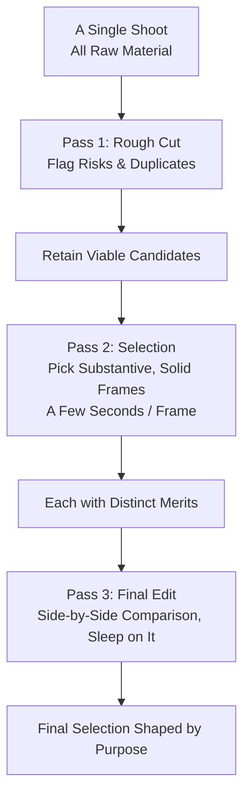

# Chapter 14 Editing and Sustaining

> Shooting is the accumulation of raw material; editing is the act of judgment. If you are never willing to sit down and edit your work, it is difficult to ever truly know how well you are photographing.

---

## Discovered Photographs Still Require Editing

In 2007, at a Chicago auction liquidating the contents of delinquent storage lockers, John Maloof paid $380 for a box of negatives. He had no intention of making a discovery at the time: he was writing a history of his neighborhood, needed vintage Chicago street scenes for illustrations, and this box of negatives seemed like it might serve the purpose. The box had belonged to an elderly woman who had fallen behind on her storage rent; packed inside were vast quantities of negatives along with roll after roll of undeveloped film. Maloof developed them bit by bit, scanned them into digital files, and gradually organized them. The deeper he went, the clearer it became that these photographs were in no way casual snapshots taken merely to paste into a family album.

Contained in these photographs was the street life of Chicago spanning from the 1950s all the way into the 1990s: children, laborers, shop windows, passersby, and the unassuming corners of the city. The compositions were mature, and the handling of light was remarkably assured. Yet here was the strange thing: the person who made these images had never appeared in any exhibition, nor in a single publication. As Maloof investigated step by step, he finally tracked down the name: Vivian Maier. She had spent her life working as a nanny, never married, and had few living relatives, having taken an astonishing volume of photographs across her lifetime while showing them to almost no one. Only after her death in 2009 were those works, long locked away in storage boxes, finally brought before the world.

Maier's archive contained not only undeveloped rolls of film but also prints she made during her lifetime; thus, one cannot claim that she never viewed, printed, or culled her own photographs. What is genuinely absent is a definitive body of work selected, sequenced, and publicly articulated by her own hand: posterity cannot know how she would have defined her masterworks from more than a hundred thousand negatives, nor how she would have balanced the relationships between self-portraits, street scenes, color work, and distinct decades. As the archive was subsequently organized, exhibited, and published by others, the "Vivian Maier" the public encounters inevitably reflects the judgment of collectors, editors, and curators. [Notes on Archive Volume and Lifetime Prints](references.md#photography-history) makes this matter far more nuanced than the simplistic claim that "she never saw her own photographs."

The final chapter of this book is about precisely this. Making an exposure is only half the work; the photographs still need to be culled, viewed together, and sequenced into an order. And it is precisely through this continuous series of choices and eliminations that photographers gradually come to understand who they are—and, carrying that newfound awareness, continue to photograph.

---

### How an Archive Transforms a Photographer

*Edward S. Curtis, "Wishham girl, profile", 1911, included in The North American Indian project. Curtis spent years photographing Native North American communities, leaving behind a vast body of photographs, texts, and sound recordings, ultimately organized into twenty volumes of text and twenty large-format portfolios. This project remains the subject of complex controversy today, yet it also illustrates one essential truth: shooting is only the beginning; the long process of organizing, sequencing, publishing, and preserving determines how a work enters history. [Image Source and Reuse Notes](image-credits.md#curtis-portrait)*

---

## Shoot a Thousand, Keep a Few

There is no universal ratio between the number of frames shot and the final delivery across different genres of photography. Long-term street projects, studio portraiture, wedding coverage, sports assignments, and landscape surveys operate under entirely distinct demands and responsibilities, and even the same photographer will fluctuate dramatically from one day to the next. The essential principle to embrace here is not some rigid formula like "out of a thousand frames you must keep only a handful," but rather that shooting volume in itself proves nothing about achievement: you still have to place similar images side by side for comparison and, based on the intended purpose of the shoot, determine what earns a place in the finished selection and what is retained merely as working material.

The real loss for many photographers lies neither in their gear nor in their camera settings, but precisely in their reluctance to edit. Once the shoot is done, files are imported to a hard drive, a quick backup is made, and the images are never looked at a second time. By the end of the year, fifty thousand files sit piled on the drive, yet not a single one has ever been carefully brought out and compared alongside others. Under such circumstances, no matter how much you shoot, true photographic judgment can scarcely take root. Progress in photography does not occur only in the field when you release the shutter; it unfolds equally during another, quieter moment: when you sit before a screen late at night, calmly acknowledging that a certain shot simply does not work, while recognizing that another turned out far better than you had originally thought. It is precisely through this repeated act of reckoning that the eye is gradually sharpened.

---

## Shooting and Editing Demand Two Different Mindsets

Knowing how to take a photograph and knowing how to edit are, in truth, two entirely different matters—demanding, perhaps, two completely different casts of mind. Pressing the shutter relies on an immediate reflex on the scene, coordinating body, eye, and hand in a split-second flash; sitting down to edit, by contrast, relies on a delayed, dispassionate judgment, confronting the results on paper only after the initial surge of excitement has cooled. It is entirely possible, therefore, for someone to be remarkably sharp on the street yet utterly at a loss before a computer screen; conversely, someone may shoot rather averagely yet possess an unerring eye for selection. The most celebrated figure among this second group is about to make his entrance: John Szarkowski was himself a photographer by training, having published monographs and won a Guggenheim Fellowship, yet what secured his place in the history of photography was not the photographs he made, but the choices he made on behalf of others. And precisely because these two acts can be separated, throughout a long stretch of history, editing was not the photographer's affair alone.

During the heyday of magazine photography, the rolls of film brought back by photographers would almost always pass first through the hands of a picture editor—the person at the publication specifically tasked with selecting and arranging images from vast quantities of negatives. The photographer was responsible for seizing the frame on location, while the picture editor was tasked with sifting coolly through hundreds or thousands of exposures to pluck out the handful worthy of the page, and then deciding how they should be laid out, which should run large or small, and which should come first or last. This division of labor did not arise because photographers could not edit, but because it had long been understood that someone freshly returned from the field, still buzzing with excitement, was not necessarily the best person to exercise judgment at that moment. Later, a comparable role emerged on the museum side. As head of the Department of Photography at the Museum of Modern Art in New York for nearly thirty years, John Szarkowski shaped an entire generation's understanding of what constitutes a "good photograph" through whose work he chose, how he hung it on the wall, and which exhibitions he placed it in. This is no hollow claim: in 1967, he mounted an exhibition at MoMA that would be referenced time and again—*New Documents*—bringing together Diane Arbus, Lee Friedlander, and Garry Winogrand, none of whom were household names at the time. In doing so, he effectively placed an official seal of approval on a new mode of documentary photography: cooler, closer to the everyday, and no longer eager to plead social causes. All three names would go on to become defining landmarks of an era, and Winogrand among them is the very photographer we are about to discuss. Whom Szarkowski chose and whom he passed over nudged the course of photographic history forward, piece by piece. Selection itself is an act of expression.

The sheer difficulty of this craft is seen most clearly in the case of one universally acknowledged master of street photography. Garry Winogrand spent most of his life firing the shutter incessantly on the streets of New York, relocating to Texas and Los Angeles from the 1970s onward, and in his final years frequently continuing to shoot through car windows. His eye was as quick and as unerring as almost anyone's in the history of the medium; yet the older he grew, the more he shot and the less he looked. When he died in 1984, he left behind more than two thousand rolls of completely undeveloped film, along with an enormous volume of processed rolls that had never been properly edited—adding up to hundreds of thousands of frames that virtually no one had ever seen. He poured the finest energy of his life into shooting, yet never managed—or rather, never brought himself—to sit down and edit them out.

What happened next pushed this story one layer deeper. After Winogrand's death, it was Szarkowski who led a team into the hundreds of thousands of negatives left behind, performing on his behalf the editing that the photographer had avoided his entire life. The selected images were mounted as an exhibition and published in the monograph *Figments from the Real World*. Controversy followed in short order: the photographs were undeniably made by Winogrand, yet the judgment embodied in that book and exhibition belonged to Szarkowski. Was the "late Winogrand" that viewers encountered truly the artist himself, or merely the artist through the editor's eyes? This debate offers no definitive resolution, but it lays down a central thesis for this chapter: if you do not edit your own work, someone else will eventually edit it for you—using their own vision to finish what you left unsaid. So it was with Maier; so it was with Winogrand.

By contrast, Robert Frank exposed nearly twenty-eight thousand frames for *The Americans*, winnowing them down to just 83 images for the book. Behind that number lay nearly two years of editing: he pinned work prints across his walls, grouping, culling, and rearranging them, paring the twenty-odd thousand frames down to several hundred, and finally to 83. In 1958, the book was first published in Paris by Robert Delpire; the following year, the American edition appeared with Jack Kerouac's introduction. Through the collaboration among photographer, editor, and publisher, a heap of negatives was ultimately forged into a coherent book. Frank and Winogrand form a stark counterpoint: the talent for shooting does not automatically confer the talent for editing, and whether a body of work can truly hold its ground depends to a large degree on whether this final step is genuinely carried through.

There is another, more insidious reason why editing is so challenging: when you look at photographs you took yourself, you never see merely the image itself. You simultaneously recall everything that surrounded the moment you pressed the shutter: how cold it was that day, how long you waited, what was said to the person in the frame, and how steep a climb you endured for the sake of that single shot. All these memories silently cling to the photograph, beguiling you into seeing it as far better than it actually is. But when someone else turns to that image, all they see is a flat rectangle; not the slightest shred of what you experienced carries across.

A systematic bias inevitably takes hold: you can never quite bring yourself to let go of the images that cost you sweat or stirred your emotions, while the quiet, unassuming frames—which may in fact be far superior—are easily undervalued. To counteract this bias, there are essentially two remedies. One is to let the photographs cool off: set them aside for days or even weeks until the visceral memory of having been there has faded, then look at them anew; what you see then will be far closer to what anyone else sees. The other is to surrender them to an eye that was not there—someone who was nowhere near you that day and carries no baggage of memory regarding the image. Such a viewer will often see in a single glance that the frame you could not bear to discard is, in truth, nothing special.

---

### Contact Sheets and Picture Editing

Before the dawn of the digital age, editing possessed a concrete, tangible arena: the contact sheet—a proof print made by exposing an entire roll of negatives in direct contact with a single sheet of photographic paper, each frame no larger than a fingernail. Once the film was developed, the photographer would first produce one of these sheets, then lean over a lightbox with a red or yellow grease pencil to examine the exposures frame by frame: circling those that caught the eye or making a mark in the margin, while decisively striking out the rejects. A contact sheet covered in circles and crosses was, in essence, a forensic record of the editing process, preserving in physical ink all of the photographer's hesitation, elimination, and ultimate resolution. When volumes like *Magnum Contact Sheets* later made public the contact sheets of Cartier-Bresson and many other masters, readers could see clearly for the very first time that many celebrated photographs were not isolated, single shots; they were flanked before and after by several neighboring attempts, with usually only one solitary frame circled in the end. There were exceptions, of course—the photograph behind the Gare Saint-Lazare leaping over the puddle appears on the contact sheet as an isolated frame, with no second chance before or after—but it is precisely such exceptions that prove the rule: the vast majority of great photographs are winnowed from the meticulous, repeated scrutiny of an entire roll.

The contact sheet illustrates another crucial point in passing: for a very long time, editing was not an undertaking carried out by the photographer alone. A magazine's picture editor would receive the exact same contact sheet and, with their own pencil, circle choices that did not necessarily match the photographer's. The disagreements between them would at times erupt into fierce battles. W. Eugene Smith's photo essays for *Life* magazine—such as "Country Doctor" and "Spanish Village"—are revered as definitive paradigms even today; yet his relationship with the editorial staff was perpetually fraught, because he cared with fierce intensity about how his photographs were ultimately chosen, cropped, and laid out across the spreads. In his view, which pictures were paired together, which ran large or small, and which appeared on the verso or recto page mattered just as much as pressing the shutter in the field—if not more so. He eventually severed ties with the magazine entirely rather than relinquish complete control over the editing of his work. Smith was an extreme case, but he brought an inescapable reality into plain view: the final form any body of photographs assumes is decided by the craft of editing—and that craft is something well worth fighting for.

---

## Culling in Passes: Resist the Rush to Condemn

Culling is best conducted in passes; do not attempt to pass a life-or-death verdict on every frame right from the start. In the first pass, simply flag obvious technical liabilities and redundant frames: unintended misfocus, irrecoverable clipping, accidental shutter trips, and duplicate bursts. Isolate them first with a Reject flag or color label rather than rushing to delete them permanently from the disk—closed eyes, severed edges, motion blur, and unconventional framing can sometimes prove to be deliberate forms of expression, legible only when set against adjacent frames or viewed within the complete series. In event and commissioned photography, you must also distinguish between what is “technically imperfect” and what remains “a record the client still needs.” This pass can move relatively quickly, but pace is dictated by subject matter and stakes; there is no need to treat a rate of one frame per second as a performance benchmark.

The second pass is where genuine selection truly begins. From the survivors of the rough cut, you must now search out those images that possess substance, where the light is right, the composition holds its ground, and the subject is clearly articulated. In this round, give each frame a few extra seconds, asking yourself: What is this photograph actually saying, and compared to the similar shots flanking it, where does its strength lie? What makes it hardest to pull the trigger is almost never the outright bad photographs, but rather that vast expanse of the “merely passable.” They suffer from no obvious defects; the problem is simply that there are far too many of them. If you keep them all, the few photographs truly worth the labor of finishing and exhibiting will only be swallowed up and lost beneath this flood of “good enough.”

The third pass is the fine edit, and the round that most tests your editorial judgment. Here, you whittle twenty or thirty images down to five or ten, deciding which frames will ultimately represent the body of work. At this stage, evaluating whether a photograph is good in isolation is no longer enough; you must weigh whether it creates redundancy with the others, and whether it can shoulder a specific role—an opening statement, a transition, or a conclusion. There is no need to hurry this round. Sleep on it and look again the next day with rested eyes; or simply make proof prints and lay them out, one by one, across a table. Once an image transitions from screen to paper, many flaws previously masked by the glow of a backlit monitor suddenly become glaringly apparent.

Spending as much time—or even more—on culling as on shooting is by no means abnormal, but there is no universal benchmark like “twenty minutes per thousand frames.” Give yourself an uninterrupted block of time and establish the filtering criteria for this pass. If you find that rushing causes you to overlook gestures, frame edges, or relationships between neighboring frames, slow down rather than chasing an impressive hourly frame count.

Seen together, these passes reveal culling to be a steadily narrowing funnel: with each pass, another batch is discarded, leaving fewer and fewer images behind while holding them to ever-higher standards.

To make this funnel operate smoothly, a deliberate setup in your software tools is immensely helpful. Most photo management applications provide three mutually independent marking systems: flags (a binary distinction between pick and reject), star ratings (one to five stars), and color labels (categorized by color). A sound approach is to assign one system to each pass: use only flags in the first pass to swiftly eliminate rejects; assign star ratings to the surviving frames in the second pass, considering anything three stars and above as a candidate; and apply color labels in the third pass to isolate the final selections. In this way, the judgment of each round is recorded independently; you will never conflate the rough cut with the final edit, and looking back, you can see clearly at which stage a particular photograph was set aside.

As culling progresses into its latter stages, the single most effective technique is side-by-side comparison. When viewing two seemingly similar photographs one by one in isolation, it is difficult to say which deserves to stay; but place them side by side, and the difference in quality often reveals itself immediately: here a gesture is more relaxed, there a glance is more focused, while in another, an obtrusive element has crept across the edge of the frame. The human eye is far more adept at discerning relative differences than evaluating absolute quality. Rather than agonizing over whether a single photograph is good enough, pull similar frames together and let them compete to reveal the stronger work.

There is another method—one that may sound a little strange, yet proves surprisingly effective: speak your reason for keeping a photograph aloud. When forced to articulate in a complete sentence, “I am keeping this because...”, specious rationalizations immediately reveal their cracks. If after talking in circles all you can offer is “because this shot was hard to get” or “because the light was beautiful at that moment,” you are almost certainly preserving the memory rather than the photograph itself. If, on the other hand, you can say plainly, “because the angle of her backward glance opens up the depth of the entire street in an instant,” then the photograph almost certainly holds its ground.

---

## Interrogating a Photograph with Five Questions

Before any photograph enters a final selection, it is always worth subjecting it to five questions. First, what does it actually say? An assertion like “I was in Paris” is far too broad—so broad that it fails to anchor itself in any concrete visual frame. But if you can articulate it as “the moment she glanced back at me in the morning light,” or “the first roadside stone illuminated anew by the sun after the rain stopped,” the content carried within the photograph immediately becomes far more concrete. What a photograph demands is specificity; once it can only be reduced to an empty generalization, the image itself is almost certainly hollow.

Second, is it genuinely distinct from the rest of your photographs? If your hard drive is home to a hundred dining tables shot from the exact same angle, a hundred selfies in the exact same pose, or a hundred frames of the same pet sleeping, you now have the opportunity to compare them patiently and see which one truly possesses an expression uniquely its own, rather than being yet another mechanical repetition. Third, does it suffer from technical flaws you cannot accept? Missed focus, camera shake, blown-out highlights, or focus landing where it never belonged—all of these must be confronted honestly; you cannot turn a blind eye simply out of attachment, unless that blur or that camera shake was itself your deliberate expressive choice. Fourth, are there glaring distractions in the composition? A utility pole sprouting out of nowhere from someone's head, a background clamoring for more attention than the subject, a tilted horizon line, or a body awkwardly and unflatteringly cropped by the frame—all of these will tangibly weaken an image. Fifth, does it truly belong in your own portfolio or photobook? This requires clear-headed thinking, because the instantaneous, casual feedback tapped out on social media is entirely different from the enduring, stable standards demanded by a cohesive body of work—and the latter is incomparably more exacting.

---

### Group First, Then Sequence

Between “selecting five to ten images” and “arranging them in order,” there lies an intermediate step—one practiced every day in editorial work yet rarely written about in textbooks: grouping. It addresses a specific predicament: you hold dozens of candidate photographs that have each cleared the bar individually, but do not naturally belong to the same whole. The method is utterly straightforward and remarkably effective: print out work prints of everything, spread them across a large table or tape them to a wall, and then take two steps back to look. Do not rush to establish a sequence; begin by sorting them into piles: which pictures speak to the same motif, which share a common palette or mood, which depict similar types of scenes—let them gather into their respective clusters. Once the piles are sorted, several realities will surface on their own: some stacks will be thick, their images resonating with one another, already taking the distinct shape of an embryonic series; other stacks will contain only two or three lonely prints, indicating a direction you have barely begun, something you need to take back out into the field and keep shooting; and there will inevitably remain a few orphan singles that fit into none of the piles (which is the most agonizing part of the grouping stage). Every one of these solitary pictures might be exceptional, but no matter how magnificent an individual photograph is, if it clashes with the rest of the group, inserting it will only throw the other pictures into disarray. Having the discipline to leave great photographs out of the edit is the most counterintuitive and mastery-revealing cut in the craft of editing. The wall pinned with work prints in a professional photographer's studio serves precisely this purpose: a wall is larger than a screen, and standing back allows you to see the relationships between photograph and photograph, rather than any single image on its own.

For a group of photographs, simply making a good selection is not enough; they also require a sequence. Twenty photographs placed side by side are never merely the simple sum of twenty isolated instances of “this one looks good”; between them already exist the rise and fall of light and shadow, the push and pull of distance and proximity, the echoes of color, the alternation of figures and scenes, and the undulating tides of emotion. How you arrange their progression is itself a form of expression. Robert Frank’s *The Americans* did not simply place its most famous photographs right up front to make an impression; instead, between flags, cars, lunch counters, funerals, passersby, and families, it gradually wove an elusive yet palpable atmosphere that was unmistakably American. Alec Soth’s *Sleeping by the Mississippi* likewise avoided sequencing its pictures as a mere travelogue diary, choosing instead to let people, rooms, rivers, roadside signs, and empty lots call out to one another and carry the thread forward from spread to spread.

When you actually set to work sequencing, you can begin with tone and luminosity. If ten consecutive pictures share roughly the same brightness, or if an entire set remains submerged in shadow from start to finish, the viewer turning the pages will quickly lose a sense of rhythm. Next, consider scale and distance: wide shots, medium shots, and close-ups must leave room to breathe, rather than crowding continuously into the same framing distance. Behind a densely populated, tightly packed photograph, you might place an expansive, vacant scene; that open space will gain weight precisely because of the crowding that preceded it. The same logic applies to color: in a sequence of low-saturation photographs, a sudden pop of red is often far more potent than making every single image vivid, for power comes from contrast, not accumulation. The opening photograph has the task of drawing the viewer firmly inside; the closing photograph should make them linger and reflect long after the book has been closed. The opening and closing of *The Americans* offer a textbook demonstration: the opening is a parade in Hoboken, New Jersey, where two women stand in windows, the face of one completely obscured by a draped American flag—the national banner and the unseen face, delivering the weight of what the entire book has to say right on the first page; the closing is Frank’s own car in the morning light along the roadside, his wife and child sitting inside with heavy, sleepy eyes—after viewing a whole book of other people’s America, the final image hands you back to the weary traveler himself. As for the middle, transitional passages are entirely permissible; there is no need to demand that every single picture dazzle like a signature masterpiece, but even in a transition, each photograph must have an indispensable reason for occupying that exact position.

Whenever circumstances permit, make every effort to print your photographs out. They need not be large—A5-sized work prints are plenty; lay them out across the table one by one, and use your hands to move them, swap them, pull one out, and slide it back in. Dragging files across a screen carries too little friction, whereas paper on a tabletop carries physical weight; it forces you to slow down and treat every shift with deliberation. Attaching a single sentence to each photograph is also immensely useful; if you stare at an image and find yourself utterly unable to formulate that sentence, that in itself is often a clear signal that you have not yet truly thought through its place within the sequence.

---

## A Photo Essay Needs Rise and Fall

When a group of photographs goes beyond mere juxtaposition to narrate a story and guide the viewer through a journey, it enters the realm of the photo essay (photo essay, a form that uses a series of photographs to tell a story about a theme or an unfolding event). The photo essay possesses its own grammar, a visual syntax forged during the golden age of magazine photojournalism that remains just as effective today. A fully realized photo essay typically opens with an establishing shot that situates the viewer in a specific place and context; followed by several developmental photographs—medium shots, details, human faces—that unpack the narrative step by step; near the center, there are usually one or two anchor images bearing the greatest weight, powerful enough to hold the entire essay together; and finally, a closing photograph that brings closure and gently ushers the viewer out. Almost all the legendary photo essays W. Eugene Smith created for *Life* magazine can be dismantled into this exact structural skeleton—and it was precisely this underlying armature that transformed a collection of “many good photographs” into a cohesive “work of art.”

The table below outlines this general structure. It is not an ironclad formula to follow rigidly, but rather a checklist to consult whenever your sequencing stalls:

| Position | Function | Typical Visuals |
| --- | --- | --- |
| Opening | Establish the environment and draw the viewer in | Wide scenes; photographs clearly showing location and context |
| Progression | Unfold the narrative and establish rhythm | Medium shots, action, interactions between subjects |
| Detail | Slow the pace and provide concrete specifics | Hands, objects, close-up fragments, a quiet close shot |
| Climax | Anchor the weight of the entire series | The strongest one or two frames; emotional or narrative peaks |
| Closing | Usher the viewer out and leave a lingering resonance | Empty spaces, figures from behind, receding perspective, or a backward glance |

It must be emphasized that this structure should never be treated as a fill-in-the-blank exercise. Truly great photo essays frequently break with it by design somewhere along the way—bringing the strongest image right to the forefront, or dispensing with exposition entirely and hurling the viewer straight into the scene. Yet even if you choose to break the rules, you must first understand what rules you are breaking, just as one must master conventional syntax before daring to write beautiful, purposeful irregularities.

Between photographs, connections are also frequently woven through invisible threads. In one photograph, an open hand rests on a surface; turn the page, and another photograph happens to feature a hand as well—similar in gesture, yet situated in an entirely different context. This kind of resonance across spreads functions like rhyme in poetry: the viewer might not be able to articulate it, but they register it unmistakably. An experienced editor will consciously plant such threads: a circle echoing another circle, a shaft of light calling to another shaft of light, a figure seen from behind facing left followed by a frontal portrait facing right. Take *The Americans* as evidence once more: the motif of the Stars and Stripes returns again and again throughout the book under shifting guises (a flag obscuring a face, a flag translucent against the light, a flag in a parade, a flag pinned behind a bar). It is through subtle undercurrents like these that eighty-three photographs are stitched into a unified book, rather than relying on the brute force of individual brilliance in every single frame. This is why photobook makers almost always begin by constructing a “dummy” (a rough prototype produced on inexpensive paper to test the sequence, physical dimensions, and pacing of the page turns), turning its pages one by one by hand to gauge the actual rhythm of the physical experience before adjusting it over and over again. Behind many of the greatest enduring photobooks lie ten, twenty, or even dozens of discarded dummies.

---

## Printing Is Another Way of Seeing

Earlier mentions of printing photographs treated it merely as an auxiliary tool for sequencing; yet the act of printing itself deserves to be discussed in its own right, because it turns around and teaches you how to look at photographs. The screen and paper are two fundamentally different mediums. A screen emits its own light, illuminating the image from behind. It possesses a wide dynamic range and carries a digital translucence that quietly runs cover for the flaws in an image: shadows may be completely blocked up and crushed into a muddy clump, yet on a luminous screen you still vaguely imagine there is detail there. Paper, however, emits no light of its own; it can only reflect whatever light falls upon it, and the tonal range it can sustain is far narrower. Consequently, the very same photograph that looks richly layered on screen will, once printed on paper, lay all its problems bare with nowhere to hide: crushed shadows, blown highlights, and flat, muddy colors.

Color operates on the exact same principle. The color gamut a monitor can display is typically wider than what printing can reproduce; a patch of red or blue that looks vivid and arresting on screen is very likely to turn dull and muted on paper, drained of its vitality. Professional workflows include a step known as soft proofing (using ICC color profiles to simulate on-screen how a photo will look when printed on a particular paper stock), precisely to reveal this discrepancy in advance and prevent the shock of discovering that the colors have completely shifted after the print is made. Yet for most people, such meticulousness is unnecessary. Simply going through the physical act of printing—even on the most ordinary printer with the most ordinary paper—will instantly confront you with numerous problems that you would never have spotted on a screen. This is precisely the greatest value of printing: it forces you to be honest.

Another disparity comes from scale. On a screen, you can casually zoom in to fill the display to admire the sharpness of a single corner, or shrink the image down to a thumbnail to mask the looseness of the overall composition. A physical print, however, has a fixed size; it forces you to stand at a single distance, look at a single dimension, and take in the whole image all at once. Whether the composition holds together, whether the subject carries enough weight, whether extraneous elements get in the way—none of this can be evaded in front of a sheet of paper of fixed size.

| | Screen | Paper (Print) |
| --- | --- | --- |
| Image Formation | Self-luminous (transmissive) | Reflects ambient light |
| Dynamic Range | Wide; shadows easily appear detailed | Narrow; crushed shadows and blown highlights are immediately apparent |
| Color Gamut | Typically wider; colors are more vivid | Narrower; vibrant colors easily turn dull |
| Size | Freely scalable | Fixed; forces you to take in the whole at once |

Even if you never plan to mount an exhibition or publish a photo book, it is still worthwhile every now and then to print a few photos you are satisfied with and leave them on your desk to look at for several days. Looking at an image a hundred times on a screen cannot match looking at it attentively once on paper. If you want to take things a step further, you can try making a zine. A zine is a self-made booklet—small in print run, low in cost, and casual in binding; it can come together simply by running a few sheets through an ordinary printer, folding them down the middle, and stapling them. Its value lies not in exquisite craftsmanship, but in forcing you to carry something through from start to finish: you have to select the photographs, work out the sequence, decide on the opening and the close, and give it a cover and a title. Once you have gone through this entire process, you hold in your hands something genuinely finished—and completion itself brings a grounded sense of certainty that browsing files on a hard drive will never give you. In Japan during the 1960s and 1970s, there was a wave of self-published photography magazines; Daido Moriyama and his generation produced their work volume by volume through these rough, inexpensive, limited-run booklets. Gear can wait, and subjects can be discovered at your own pace, but the experience of bringing a piece of work to total completion is something you should taste as early as possible.

A step beyond the zine is the exhibition (as mentioned at the beginning of this chapter, it was precisely through this format that Szarkowski altered the course of photography history), yet amateur photographers often treat it as something out of reach. In truth, it is not. An exhibition does not have to start in an art museum: a wall in a community center, the café you frequent, or a hallway in a library can easily accommodate a dozen framed prints, and securing the space often takes nothing more than asking. Once you actually commit to hanging photographs on a wall, an entirely new set of editorial challenges will present itself: size dictates viewing distance—a photograph well-suited to being held in the hands and examined closely might fall apart when enlarged to a meter wide, while other images demand large scale to work at all; matting and negative space define the breathing room of each photograph; the spacing, height, and sequence of prints along the wall constitute an editing sequence in physical space, and as viewers walk from left to right, they are effectively turning the pages of your book. Even if you put on a small show of only ten photographs, standing before the wall and watching strangers pause before one image while walking straight past another will give you a kind of feedback that red hearts on a screen can never provide.

---

## Establishing the Rhythm of a Photo a Day

Selecting a single photo every day is the most effective micro-habit you can build. The method is simple: in the evening, review everything you shot that day from start to finish, choose the single best frame, and write down a single sentence explaining precisely why it had to be that one. If you happened not to take any pictures that day, make up for it by digging into the past week and pulling out a frame you never looked at closely before. After persisting like this for 365 days, you may not truly hold 365 photographs worthy of being called finished works, but you will have genuinely exercised your judgment 365 times. Such deliberate practice is far more valuable than blindly firing off ten thousand more shots.

I recommend using a physical notebook for this practice. Paste small 4×6-inch prints into it one by one, noting the date and location beside each, along with a sentence capturing your judgment at that moment. After a year of this, when you reopen the notebook, you will see with absolute clarity what consistently draws your eye, what subjects recur without your conscious realization, what kinds of light elude you no matter how hard you try, and which photographs you initially felt lukewarm about but somehow ended up lingering in your mind ever since. Digital files on a hard drive slip away all too easily into the layered depths of nested folders; paper is different—paper holds onto time in a tangible, lasting way.

Having mentioned hard drives, the subject of backups becomes inescapable. Digital photographs are, in fact, far more fragile than film negatives. A hard drive in use for three to five years can fail without warning; water damage, theft, accidental deletion, or a system crash—any one of these can wipe out years of your photography in an instant. The bare minimum insurance, therefore, is to keep three copies: one on your computer, one on an external drive, and one in the cloud or at an offsite location. When returning from an important shoot, make an extra backup copy that very day; never postpone it to that mythical moment when you "get around to organizing later." Archiving can likewise begin the moment you import: organize your photos methodically by year, month, project, and location, and tag the ones you are genuinely pleased with using star ratings or keywords. In the end, a photograph you can never find when you need it is functionally no different from one that has been lost forever.

This "rule of three copies" has a more formal designation in photographic circles: the 3-2-1 backup rule. Originally formulated in discussions of digital asset management (DAM—the systematic organization, naming, storage, and long-term preservation of large volumes of digital files), it has become the universally recognized baseline. It dictates three fundamental requirements: maintain at least three copies of any important file; distribute these three copies across two different types of storage media; and keep at least one copy in an offsite location.

| Number | Meaning | Rationale |
| --- | --- | --- |
| 3 | At least three copies (one primary original, two backups) | A single copy can fail; the probability of three copies failing simultaneously is vanishingly small |
| 2 | Stored across two media types or systems with distinct failure modes | Prevents a single hardware, software, account, or sync error from compromising all copies at once |
| 1 | At least one copy kept offsite | Fire, theft, or flooding can destroy everything in a single location at once |

Each of these three rules hedges against a specific class of failure. Keeping three copies ensures that a single point of failure does not seal the fate of everything. Using different media or systems spreads the risk across mechanical drive failure, file system corruption, account lockouts, erroneous syncing, and ransomware. The offsite copy guards against fire, theft, and flooding. Cloud storage qualifies as a reliable backup only when it preserves version history, allows recovery from accidental deletions and ransomware attacks, and you have actually tested the recovery procedure; a cloud drive that instantly mirrors local deletions is not, in itself, a backup. Important archives should also undergo periodic checksum verification and sample restorations, while maintaining one copy that is kept offline or configured so that everyday user accounts cannot overwrite it.

A common misconception must be clarified here: a redundant array of independent disks (RAID—a technology that combines multiple hard drives so that data remains accessible even if one drive fails) is not equivalent to a backup. RAID protects against the abrupt failure of an individual physical drive, ensuring you avoid downtime while replacing the failed unit. But it cannot protect against accidental deletion, overwritten files, or ransomware, because any deletion or modification you make in one place is instantly propagated across every disk in the array. RAID guarantees continuity of operation, not the prevention of data loss; treating it as your sole insurance policy will, sooner or later, lead to irrecoverable loss.

Backups ensure that your photographs still exist; naming and archiving determine whether you will be able to find them years from now. You can begin at the import stage by establishing a consistent hierarchy based on date, project, or location, and formatting file names with the date and a unique sequential number. Once you use catalog-based software such as Lightroom, it is best to move and rename files from within the application so the catalog updates in lockstep. If you move files externally in the operating system, the links may temporarily break, but star ratings, keywords, and adjustments typically remain intact within the catalog or sidecar files; they can be reconnected by locating the new file path and do not simply vanish. The true danger lies in backing up only the raw originals while omitting the catalog, sidecar files, presets, and project files—which is why all of these must be included in the very same backup and recovery tests.

---

## What Sustains You Once the Passion Fades

The initial sense of novelty is bound to fade sooner or later, whether after a few months, two years, or a decade; there is no fixed threshold. The typical plateau is usually tied to three things: a lack of goals, a lack of feedback, and the absence of an ongoing project. Without a goal, once you step out the door you have no idea what you are trying to test or verify; without feedback, it is difficult to judge whether you are making progress; without a project, photographs remain isolated individual frames, never coalescing into a unified body of work. Neither knowledge of gear nor sheer volume of shooting can substitute for these three pillars; what truly needs to be established is a sustainable mechanism for reviewing and moving the work forward.

The solution is to find yourself a theme or subject that you can sustain for at least six months—and the more concrete it is, the better. "The city" is far too vast a theme, so broad that you have no idea where to begin; you can narrow it all the way down to "the three subway stops along my daily commute." "Family" is likewise too broad, but it can be anchored in something far more tangible, such as "a year of my mother moving between the kitchen and the balcony." "The street" inherently tends to scatter into fragmented snapshots, so start by framing it as "Sunday mornings from six to nine, on the exact same block." Even an elusive subject like "the weather" can be narrowed down to "windows, umbrellas, and reflections on the pavement on rainy days." The crucial thing is to understand that limitation is not a shackle; on the contrary, it is precisely these constraints that will force you back to the very same place time and time again, until one day you finally see what you walked past countless times before without ever noticing.

When Stephen Shore drove across America, he photographed nothing more extraordinary than roadside convenience stores, motels, and parking lots; yet these utterly ordinary things ultimately came together to form *Uncommon Places*. Daido Moriyama photographed Shinjuku over and over again for decades, yet remarkably never exhausted the subject. Sally Mann spent extended periods photographing her own children, her own family, and the land of Virginia. What all these examples demonstrate is fundamentally the same truth: a project transforms your mindset from "let me casually shoot whatever today" into "today I will push this specific work one step further." At the same time, when you look back a year later, what you see is a relatively cohesive outcome rather than a scattered heap of disparate photographs.

When undertaking a long-term project, there is another crucial nuance of sequence worth stating plainly: do not wait until all the shooting is done to start editing; edit as you shoot. In practice, this means dedicating a wall to the project (whether a physical wall or a corkboard). Every month or two, pin up newly made work prints and view them alongside the older ones. Once you look at them this way, the gaps will speak for themselves: the entire wall is filled with close-up portraits, lacking only an establishing wide shot of the environment; the emotional tension has been taut throughout, missing a quiet, empty frame that allows the viewer to breathe; or a recurring motif is still waiting for that one decisive image to bring it into the light. Jot these gaps down as a checklist, and the next time you head out the door, you will no longer be wandering aimlessly, but shooting with a deliberate mission to fill the missing pieces. The structural chart for photo stories discussed earlier can be applied in reverse here: rather than using it as a template to fit your work into after the fact, use it as a diagnostic checklist to see which key positions are still missing from your sequence. Editing thus ceases to be merely a final procedural step at the end of a project; it becomes the very engine propelling the shooting forward all along the way. During the two years Robert Frank spent on the road shooting *The Americans*, he too pinned his work prints to the wall as he went, using them to decide where to drive next.

Why constraints are fuel rather than shackles becomes even clearer when looking at two extreme examples. The German couple Bernd and Hilla Becher did only one thing for several decades: photograph industrial architecture. Water towers, blast furnaces, coal bunkers, gas tanks—they photographed them one after another, employing a methodology so rigorous it bordered on rigid: always straight-on, with flat light, under overcast skies, from an identical height and distance, centering each structure squarely in the frame and recording it methodically like a taxonomic specimen. They then hung photographs of the same structural type side by side in grids; viewed in mutual comparison, these otherwise mundane industrial components suddenly revealed their distinct individual characters and unveiled a hidden typology of forms. This methodology later became known as typology (the practice of photographing a class of subjects in a strictly uniform manner and juxtaposing them for comparison). It pushed constraint almost to its absolute limit, yet it was precisely this near-obsessive constraint that unlocked a depth few others could ever attain.

At the opposite pole, Nan Goldin's approach was almost the complete reverse, yet grounded in the exact same principle. She aimed her lens at her intimate circle of friends, lovers, and her own life, capturing parties, intimacy, arguments, illness, and loss year after year, which culminated in *The Ballad of Sexual Dependency*. Her constraint was not a visual uniformity of method, but an extreme narrowing of subject matter: photographing only this tight-knit circle and this lived experience in which she was genuinely immersed. One narrowed method to the absolute minimum; the other narrowed subject matter to the absolute minimum. Yet both point to the same truth: once you stake out a territory that is sufficiently narrow and genuinely authentic, and remain willing to dwell within it over and over, depth will organically take root and grow on its own. Conversely, those who want to photograph everything almost invariably fail to photograph anything deeply.

Putting your work out into the public sphere is equally essential. Social media platforms have a very low barrier to entry and deliver immediate feedback—that is their advantage; but their algorithms will quietly nudge you in a particular direction without you realizing it, coaxing you to shoot things that generate likes more easily. As a result, you gradually gravitate toward images that are brighter, more saturated, and instantly legible in a single second. This kind of feedback is not entirely useless, but it cannot be taken as gospel. By contrast, newsletters and long-form essays are far slower, and slowness possesses virtues of its own: they compel you to write accompanying text for your photographs. And once you begin writing that text, your editorial judgment sharpens in tandem: you are forced to articulate clearly why this photograph is placed here, and what exact relationship it holds with the image before it and the one that follows. The sheer act of writing is enough to bring many previously vague, instinctive choices out into the open light.

A personal website affords you the greatest degree of freedom. You must personally decide how to group images, how to sequence them, how to use negative space, and which typeface to choose—and each of these seemingly trivial decisions quietly trains your editorial eye. If you take it a step further—printing your work as a small booklet or simply hanging it on the walls of your home—the feedback it yields will be the most profound of all. Looking at an image a hundred times on a backlit screen is an entirely different relationship from setting an A4-sized print on your desk and living with it for a whole week. Once a photograph leaves the glowing screen, many flaws become mercilessly honest: whether the shadows are blocked up into murky mud, whether the colors lack grounding, whether the composition truly holds up, and which photographs you initially loved but grow utterly tired of after seeing them for three days.

If you happen to have someone around you who is willing to look at your photographs with genuine seriousness, that is a tremendous asset. This person need not be more famous than you, nor do they need to understand camera gear better than you; but they must possess aesthetic discernment, able to point out within a few short minutes which image in a sequence is the weak link, and precisely where its weakness lies. Friends who offer unreserved praise may certainly be comforting to listen to, but such comfort rarely translates into genuine growth.

You do not need to rely on luck to stumble upon such people; you can actively seek them out. A few people can form a critique group, meeting once a month, with each member bringing a set of proof prints to lay out on the table in turn. Keep the rules simple: let others speak first, and allow the photographer to explain only at the very end—because when your photographs are hung on a wall in the future, you will not be standing beside them to plead their case. A more formal avenue is the portfolio review, a fixture at many photography festivals: you bring twenty prints, sit across the table from an editor, curator, or photographer, and listen to twenty minutes of unsparing critique. Paying a single registration fee often accelerates your progress more than a year of stumbling along on your own. As for how to receive critique, there is also an essential maxim: listen carefully to the description of the problem, but stay wary of the immediate solutions offered. When a viewer says, "I can't seem to get into this picture," or "Putting these two together confuses me," that is a reliable signal, because genuine visceral reactions do not lie. But when they follow up with "You should crop this square" or "You ought to shoot this in black and white," that is merely their personal preference—take it with a grain of salt. There is also a rule of thumb born of experience: if three different people pause and frown before the exact same photograph, no matter how varied their stated reasons may be, that image almost certainly harbors a real problem.

---

## Gear Upgrades Must Answer Specific Questions

When it comes to gear, do not be in a rush to upgrade. At various stages, many photographers attribute a sense of stagnation to sensor format, lenses, or camera systems; such impulses are entirely natural, and new tools can indeed solve specific, well-defined problems. Yet every time you switch gear, you must reacquaint yourself with its operation and physical limits, while your ability to see and edit will not magically improve alongside the machine. Before upgrading, it is best to formulate the problem into a single verifiable sentence—for example, "The current autofocus cannot reliably track this type of motion," or "This assignment demands a higher sync speed"—rather than merely writing "I want to take better pictures."

Progress in photography is never a straight, upward line. When you first begin learning exposure parameters and camera operations, feedback is immediate and progress is easy to see; once technique stabilizes, however, the criteria for evaluation grow more complex, and having looked at more great work, you may paradoxically become far more conscious of the gulf between yourself and mastery. Some photographers find their long-term subject matter quickly; others alter their direction only after many years. Professional assignments, life stages, accumulated visual literacy, and hours invested explain these shifts far better than a simple tally of "how many years you have been shooting." Any notion that it takes three to five years to form a preference, or five to ten years to produce a mature body of work, can only be considered personal observation—it can never be used to prescribe a rigid timeline for anyone's growth.

To sustain your shooting across scales of three, five, or ten years, you cannot rely on fleeting enthusiasm; you must turn photography into a habit. Enthusiasm inevitably ebbs: hit a stretch of busy days or a few disappointing shoots, and it cools off without much resistance. A habit, by contrast, does not depend on mood; it relies solely on a fixed threshold so low that you can scarcely refuse it. Rather than burdening yourself with an ambitious, easily thwarted task like "I must produce a great photo series this month," you are far better off reducing it to a modest action: "Slip a camera into my pocket before walking out the door every day," or "Take a walk to the same spot every weekend." Tasks are defined by success or failure: failing to complete them breeds frustration, and accumulated frustration quickly becomes an excuse to give up. Habits, however, know no success or failure; there is only whether you did it or did not. If you missed today, you simply pick it back up tomorrow. Those who truly photograph for decades are rarely endowed with more willpower than others; rather, they grasped this truth early on: reserve your exacting standards for the finished work, lower the threshold for taking action, and make the act of photographing effortless enough that it can happen every single day.

At the end of every year, set aside time for a retrospective. Select your twenty best photographs from the past twelve months and examine them closely: what subjects, what qualities of light, and what locations do they gravitate toward? As you look, do not merely ask which single image is the prettiest. Ask instead: which subjects have you actually been avoiding? Which scenes have you returned to repeatedly yet never managed to capture well? And which photographs seemed utterly unremarkable when you took them, only to endure and hold their ground months later? At the same time, write down the photobooks and exhibitions you engaged with over the year, record your single biggest lesson, and outline the projects you hope to pursue in the year ahead. Over time, these scattered notes will coalesce into a personal photographic journal—one that records far more than just images, documenting how your way of seeing the world has subtly, year by year, shifted and evolved.

---

## Photography, in the End, Is Still Subtraction

Let us return to what we discussed in the first chapter: releasing the shutter is, in essence, an act of subtraction. From beginning to end, photographing is a continuous series of decisions about what to discard.

The moment you press the shutter, you choose to cast aside everything outside the frame; when editing, you choose to discard redundant and weak frames; when developing a project, you choose to leave certain subjects untouched for now, conserving your finite time for the single pursuit that truly calls to you. With time, you will notice that many photographers narrow their range of subjects and rely on fewer lenses. This does not necessarily mean their path has grown narrower; on the contrary, it more likely indicates that they have finally clarified what they are willing to return to and look at, again and again.

Shoot consistently, edit rigorously, and look at yourself honestly. None of these three practices requires lavish equipment, yet all three demand the very same currency: time. Shooting consistently keeps your eyes in constant contact with the world so your instincts never grow rusty; editing rigorously prevents you from mistaking every release of the shutter for a finished work of art; looking at yourself honestly forces you to confront what you truly love, what you are perpetually evading, and where your work still falls far short. There is no need to hurry this; you do not have to rush to hand down a definitive verdict on yourself within a single year. Give yourself a wider horizon—even a decade. Ten years from now, you will see with crystal clarity how these seemingly insignificant choices, starting today, have quietly and steadily transformed the way you see.

!!! example "Case Walkthrough: Culling Twelve Similar Frames Down to One"

    In the first round, flag technical flaws and duplicate frames without rushing to delete anything permanently. In the second round, arrange the candidate thumbnails side by side to evaluate whether gestures are complete and whether subjects are cleanly separated from the background. In the third round, zoom in to inspect eye contact, subtle gestures, and unintentional technical blemishes. Finally, place the surviving candidate into the sequence of the full series to determine whether it merely repeats information already conveyed by the preceding image.

    If two frames remain in a dead heat, keep both for the moment, group them as shared candidates, and return to them after a day's rest. The goal of editing is not to prove that one frame is "objectively superior," but rather to ensure that every selected photograph performs an indispensable role within the sequence as a whole.

---

## Exercises

For thirty consecutive days, select one photograph each day and write a single sentence explaining the reason for your choice. On the thirtieth day, review all these images and notes together to discover what consistently draws your attention.

Open your photo archive from the past twelve months and carry out a complete editing pass—first culling, narrowing down, and fine-tuning—until only twenty images remain. Set aside at least an entire afternoon; do not rush.

From those twenty photographs, select ten, print small proofs, and sequence them across a table. Experiment with at least three distinct arrangements, comparing how the opening, the conclusion, and the internal pacing differ across each variation.

Establish a compact 30- to 90-day project and summarize it in a single sentence defining what you will photograph, where you will shoot, and when. Tape this statement in front of your desk, and review your progress at regular intervals.

Write a 500-word annual photography retrospective: what you primarily photographed this year, which image brought you the greatest satisfaction, what your single biggest lesson was, and what you wish to pursue in the coming year. Archive it carefully, and write another next year.

---

The book ends here.

You must truly see before you can speak of capturing anything; once the shoot is done, you must still cull your photographs frame by frame and set them side by side to compare; and having weighed them against one another, you return to the world with this newly cultivated judgment to keep photographing. Tomorrow, when you walk out the door, take your camera with you; when you return in the evening, select a single frame with care, and write down why you chose to keep it.
