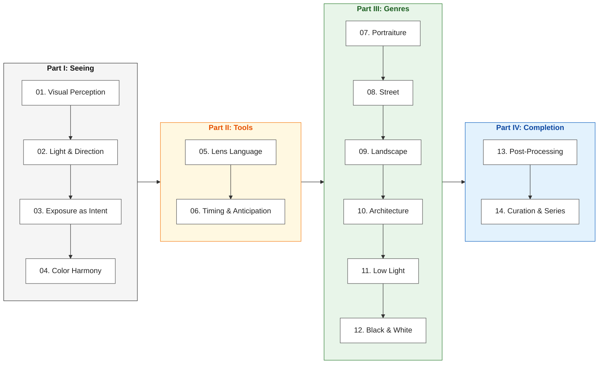

# Photography: From Shutter to Final Print

> A comprehensive, first-principles guide to visual judgment, on-scene decision-making, and intentional image curation for dedicated photographers.

**Languages**: [English](README.md) | [中文](../index.md)  
**Read Online**: [yingwang.github.io/photography-book](https://yingwang.github.io/photography-book/)  
**Interactive Toolkit**: [Field Calculators](../tools.md) | [Quick Reference Cards](../quick-cards.md)

---

## Who This Book Is For

This book is written for photographers who have already crossed the beginner threshold. You know the mechanics of your camera, comfortably understand the exposure triangle, and can readily read EXIF metadata.

Yet after a long day of shooting on the street or in the wild, when you sit down before your display, the real dilemmas are rarely about parameters. They are deep, silent questions of visual judgment:
- *Why did that breathtaking light fail to translate into a compelling frame?*
- *Why do hundreds of exposures yield only a couple of mediocre snapshots?*
- *When looking at masterworks, you instinctively feel their power, but cannot pinpoint what separates your own work from that level of visual resonance.*

This book aims to deconstruct the hidden chain of decisions behind the shutter:
- What quality of light is truly worth waiting for;
- What compositions are destined to fall apart before the shutter is even pressed;
- When to step back to establish environmental order, and when to step in close to isolate raw texture;
- Why switching between 35mm and 50mm is fundamentally about spatial tension, not just field of view;
- Why black and white is never a lazy fallback for failed color grading.

Photography has never been just the mechanical instant of pressing a button. It is rooted in deep prior observation, rigorous on-scene elimination, ruthless post-shoot curation, and the mental discipline to recognize which frames should have been left unshot.

---

## What This Book Skips

- **No mechanical parameter definitions**: We do not waste pages re-explaining what shutter speed or f-stop numbers mean in the abstract.
- **No brand worship or gear reviews**: While camera systems from Sony, Fujifilm, Leica, and medium-format GFX are referenced, they serve strictly as concrete examples of optical geometry and handling ergonomics, not buyer guides.
- **No cookie-cutter preset recipes**: Post-processing chapters focus on tonal hierarchy, dynamic range allocation, and color harmony rather than slider copy-pasting.
- **No vacuous art jargon**: On-scene questions are concrete and actionable—*Where does the subject stand? Where does the light fall? How do you suppress background clutter? Are your shadows solidly anchored? In a burst sequence, which micro-gesture holds authentic tension?*

---

## The Four-Part Architecture

---

## Table of Contents

### Part I: Seeing (The Foundation)
| Chapter | Title | Core Focus |
|:---:|---|---|
| 00 | [Preface: Beyond Parameters](../00-preface.md) | Why technical perfection is not enough; bridging the gap between "correct" and "compelling". |
| 01 | [Seeing: The First Filter](../01-seeing.md) | Deconstructing visual clutter, isolating focal hierarchy, and training deliberate observation. |
| 02 | [Light: Geometry and Quality](../02-light.md) | Hard vs soft light, directional angles, edge highlights, and reading the subtle decay of illumination. |
| 03 | [Exposure as Creative Intent](../03-exposure.md) | Moving past mid-gray; Zone System principles in digital sensors; high-key and low-key grounding. |
| 04 | [Color: Temperature and Emotion](../04-color.md) | Color palettes, complementary contrast, color separation vs monochromatic dominance. |

### Part II: Tools & Timing (The Execution)
| Chapter | Title | Core Focus |
|:---:|---|---|
| 05 | [Lens Language: Perspective and Space](../05-lens.md) | 28mm intimacy, 35mm environmental context, 50mm human gaze, 85mm+ compression geometry. |
| 06 | [Timing: The Decisive Stance](../06-timing.md) | Anticipating micro-gestures, predictive framing, burst discipline, and the rhythm of the street. |

### Part III: Genres & Applications (The Field)
| Chapter | Title | Core Focus |
|:---:|---|---|
| 07 | [Portraiture: Presence and Truth](../07-portrait.md) | Rapport building, environmental portraits, natural light sculpting, authentic expression over posed stiffness. |
| 08 | [Street: Reading the Flow](../08-street.md) | Ethical spatial engagement, multi-layered framing, hunting vs fishing methods, zone focusing. |
| 09 | [Landscape: Silence and Structure](../09-landscape.md) | Foreground grounding, atmospheric depth, dynamic weather scouting, avoiding generic postcard tropes. |
| 10 | [Architecture: Geometry and Light](../10-architecture.md) | Converging lines, perspective control, tectonic materiality, human scale against monolithic forms. |
| 11 | [Low Light: Embracing the Shadows](../11-lowlight.md) | Handheld stabilization thresholds, blue hour transitions, mixed-temperature ambient sources. |
| 12 | [Black & White: Tonal Architecture](../12-bw.md) | Stripping chromatic distraction; evaluating contrast ratios, texture gradients, and silver-halide aesthetics. |

### Part IV: Completion & Legacy (The Workflow)
| Chapter | Title | Core Focus |
|:---:|---|---|
| 13 | [Post-Processing: Refining Tonal Values](../13-postprocess.md) | RAW histogram evaluation, tone curves, local dodging and burning, sharpening thresholds without artifacts. |
| 14 | [Curation & Long-term Practice](../14-edit-and-sustain.md) | Ruthless sequencing, contact-sheet culling, building cohesive photo essays, sustaining visual curiosity. |

---

## Interactive Field Toolkit

- **[Field Calculators](../tools.md)**: 5 interactive JavaScript tools for hyperfocal distance, depth of field, ND filter long exposure, motion freeze shutter speeds, and astrophotography NPF rule.
- **[Field Quick Reference Cards](../quick-cards.md)**: Printable 2-page pocket cheatsheets for essential field numbers and mental checklists.
- **[Fact-checking & References](../references.md)**: Scientific references on sensor dynamic range, optical formulas, and legal boundaries.
- **[Image Credits & Rights](../image-credits.md)**: Full attribution, museum metadata, CC licenses, and checksums for all historical reference plates.

---

## Author & License

**Author**: Ying Wang ([@yingwang](https://github.com/yingwang))  
**License**: [CC BY-NC-SA 4.0](https://creativecommons.org/licenses/by-nc-sa/4.0/)
