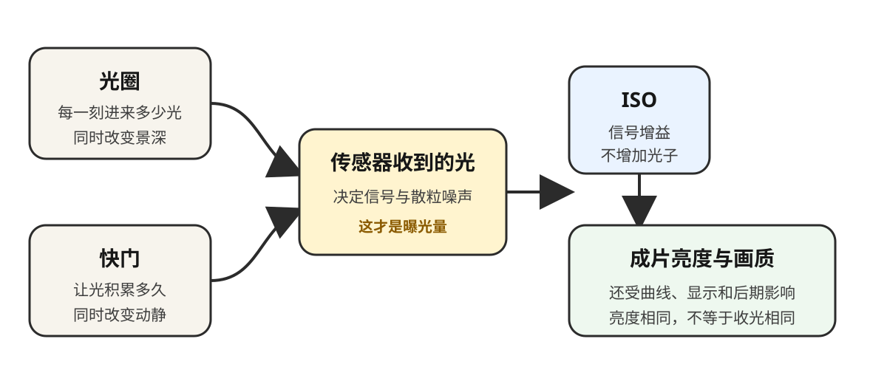

# 摄影现场工具箱

> 这些工具给的是可靠起点，不是替你拍板的答案。算完以后，仍要看直方图、放大回放，并根据主体速度、输出尺寸和个人稳定性微调。

## ND 长曝光换算 {#nd-calculator}

先在不装 ND 的情况下完成测光，再输入基准快门和滤镜档数。计算结果假设光圈、ISO 与现场亮度不变。

  <label>基准快门（秒）
    <input type="number" data-field="base-shutter" value="0.008" min="0.000001" step="any">
  </label>
  <label>ND 减光档数
    <input type="range" data-field="nd-stops" value="10" min="0" max="16" step="1">
    <output data-output="nd-stops">10 档</output>
  </label>
  
新快门：<strong data-output="nd-result">约 8.2 秒</strong>

计算关系是：

\[
t_{\mathrm{new}} = t_{\mathrm{base}}\times 2^{\mathrm{stops}}
\]

例如，不装滤镜时是 1/125 秒，十档 ND 会把快门延长到约 8 秒，而不是 30 秒。若要 30 秒，需要约十二档减光，或再改变光圈、ISO。

## 超焦距估算 {#hyperfocal-calculator}

选择画幅、焦距与光圈，工具会给出超焦距以及把焦点放在那里时的近端清晰界限。这里的“清晰”采用传统弥散圆标准；高像素、大幅打印或近距离观看时，应留出余量，不要把边界当作绝对锐利。

  <label>画幅
    <select data-field="format">
      <option value="0.03">全画幅</option>
      <option value="0.02">APS-C（约 1.5×）</option>
      <option value="0.015">M4/3</option>
    </select>
  </label>
  <label>实际焦距（mm）
    <input type="number" data-field="focal" value="35" min="4" max="1200" step="1">
  </label>
  <label>光圈 f/
    <input type="number" data-field="aperture" value="8" min="0.7" max="64" step="0.1">
  </label>
  
<strong data-output="hyperfocal-result">超焦距约 5.14 m；近端约 2.57 m</strong>

## 运动快门起点

下面的数值只负责主体运动，不负责景深、噪点或防抖。主体横穿画面、离你较近、最终需要大幅输出时，通常要比建议再快一档；迎面而来、距离较远时，可能可以稍慢。

  <label>主体状态
    <select data-field="motion">
      <option value="按手持稳定性决定|静物本身不限制快门；请按焦距、防抖、支撑和输出检查相机抖动">静物 / 建筑</option>
      <option value="1/125 秒起|适合较安静的人像；说话和手势可提高到 1/250 秒">静态人像</option>
      <option value="1/250 秒起|横向行走或近距离拍摄可提高到 1/500 秒">行走的人</option>
      <option value="1/500 秒起|孩子、骑行和跳跃常需要 1/1000 秒">跑动 / 跳跃</option>
      <option value="1/1000 秒起|飞鸟、球类和高速动作常需 1/2000 秒或更快">体育 / 飞鸟</option>
      <option value="1/30–1/60 秒起|相机随主体匀速转动，连续拍摄并检查成功率">追随拍摄</option>
    </select>
  </label>
  
<strong data-output="motion-result">按手持稳定性决定</strong> 静物本身不限制快门；请按焦距、防抖、支撑和输出检查相机抖动

## 到现场先走这四步

1. **先定画面**：最重要的是谁？哪些高光或暗部可以放弃？
2. **再定运动**：先用快门守住主体，再决定是否需要防抖或三脚架。
3. **再定景深**：背景是信息还是干扰？据此选择光圈和站位。
4. **最后让 ISO 补足显示亮度**：ISO 不会让传感器收到更多光；它是光圈和快门定下之后的增益选择。

*原创示意图：光圈和快门决定传感器收到多少光；ISO 主要改变信号增益与成片亮度。*
